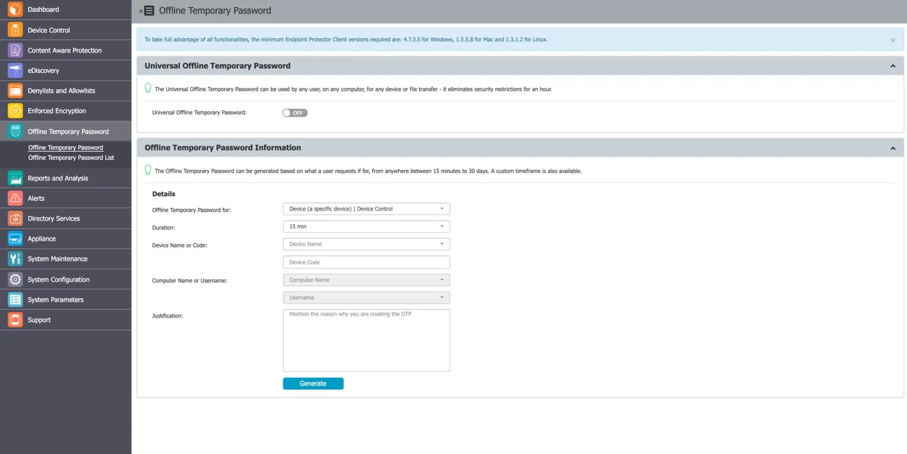

# Offline Temporary Password

In this section, you can generate Offline Temporary Passwords (or OTPs) and grant temporary access
rights. In addition to situations when only temporary access is needed, it can also be used when
there is no network connection between the protected computers and the Endpoint Protector Server.

The Offline Temporary Password can be generated for the below entities:

- Device (a specific device)
- Computer and User (all devices)
- Computer and User (all file transfers)

A password is linked to a time period and is unique for a certain device and computer. This means
the same password cannot be used for a different device or computer. It also cannot be used twice
(except for Universal Offline Temporary Password).

The time intervals available are 15 minutes, 30 minutes, 1 hour, 2 hours, 4 hours, 8 hours, 1 day, 2
days, 5 days, 14 days, and 30 days or Custom.

The Offline Temporary Password Duration offers a customized option, allowing the generation of
time-based Offline Temporary Password Codes, with a Start Date/Time and an End Date/Time.

For large companies or multinationals that have the Endpoint Protector Server and the protected
endpoints in different time zones, taking into consideration how the Server Time and Client Time
work is essential.

Example: The Endpoint Protector Server is located in Germany, making the Server Time UTC+01:00.

The protected endpoints are located in Romania, making the Client Time UTC+02:00.

When generating an Offline Temporary Password Code that should take effect tomorrow, from 16:00 on
the endpoint time, it should actually be generated for tomorrow, from 15:00 (to adjust for the 1h
difference in the time zone).

For the predefined duration, the above adjustment is not necessary. The Offline Temporary Password
Code will be valid for that specific amount of time, starting with the moment it was redeemed. The
only thing to consider is that the Offline Temporary Password Code needs to be redeemed the same day
it was generated.

:::note
The Universal Offline Temporary Password feature can also be turned on. If enabled, it can
be used by any user, on any computer, for any device or file transfers – it eliminates security
restrictions for one hour. It can be used multiple times, by any user that knows it.
:::

The Universal Offline Temporary Password can be made visible only for Super Administrators. If this
setting is enabled, Normal and Offline Temporary Password Administrators will not be able to see and
use it. Enable this setting from System Configuration, System Settings, and Custom settings.

You have the option to add a justification, mentioning the reason why the password was created. This
can later be used for a better overview or various audit purposes.

Once an Offline Temporary Password has been authorized, any other rights and settings saved afterwards
on the Endpoint Protector Server will not take immediate effect. The Offline Temporary Password has to
expire and the connection with the Server re-established.

:::note
The Transfer Limit Reset Offline Temporary Password is only available if the feature is
enabled. The main purpose of this type of Offline Temporary Password is to re-establish the
Server-Client communication before the Transfer Limit Reset Time Interval has expired.
:::

## Generating the Offline Temporary Password

Depending on the options selected from the drop-down menus, the Offline Temporary Password (or OTP)
can be generated for an exact device, all devices, or all file transfers.

When generating an Offline Temporary Password for a Device, you can either introduce the Device Code
communicated by the user or search the Endpoint Protector database for an existing device.
Alternatively, you can generate an Offline Temporary Password directly from the Device Control,
Computers section, by selecting the Offline Temporary Password option from the Actions column.

When generating an OTP Code for a device, either the Device Code or the Device Name has to be
entered (one of them will automatically fill in the other field).

The Computer Name and the Username fields do not need to be both filled in. The OTP Code is perfectly
valid if only one of them is provided. However, if the OTP Code needs to be valid for an exact
device, on an exact computer, for an exact user, all of the relevant fields need to be filled in.

Once the OTP Code has been generated, it will be displayed on the right side of the image above.

As it needs to be provided to the person that made the request, Endpoint Protector offers two quick
ways of doing this, either by sending a direct e-mail or by printing it out.

:::note
You can edit the Administrator contact information that is displayed to a user from System
Configuration, System Settings, as the Main Administrator Contact Details.
:::

Similar to generating an Offline Temporary Password for a specific device, when generating one for all
devices or all file transfers, the Computer Name and the Username fields are not both mandatory. The
OTP Code is perfectly valid if only one of them is provided. However, if the OTP Code needs to be
valid for an exact computer and an exact user, all of the relevant fields need to be filled in.
