# Reports and Analysis

This section provides an overview of the system logs, Device Control logs and shadows, Content Aware
logs and shadows, eDiscovery logs, admin actions, statistics, and other helpful information.

eDiscovery scan results are accessible both from this section and from the dedicated
**eDiscovery** > **Scan Results and Actions** section. You can view Enforced Encryption details in
the Enforced Encryption section.

As an additional security measure, the Super Administrator can protect this section with an
additional password from **System Configuration** > **System Security**.

## Device Control logs

Device Control logs display events related to device connections, file transfers, and policy enforcement. When the scalability architecture is active, Endpoint Protector stores Device Control logs in CrateDB and displays them in an updated log view with improved filtering and sorting.

The log view supports:

- Column selection through the **Show/Hide Columns** control
- Filtering by date range, computer, user, device, event type, and other attributes
- Sorting by any visible column
- Export to Excel, PDF, or CSV

## Logs report

From this section, you can view, sort, and export the main logs in the system. This section includes
several event types, such as User Login, User Logout, AD Import, AD Synchronization, Uninstall
Attempt, and others. You can also view the main Device Control logs in this section.

:::note
Use the Filters option to view and sort different log types, then export the result
list.
:::

## File tracing

This section provides an overview of trace files transferred from a protected computer
to a portable device or another computer on the network, and vice versa.

Endpoint Protector computes an MD5 hash for most files to which the File Tracing feature applies. This approach helps mitigate threats from changing file content.

You can export the search results (as Excel, PDF, or CSV) or create an export containing the
entire log report as a CSV file.

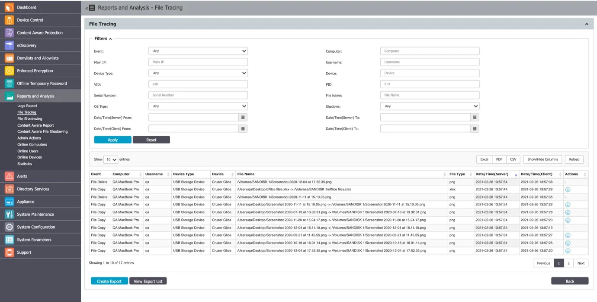

### File tracing events by direction

This table shows how Endpoint Protector categorizes file tracing events based on data transfer directions.

:::note
This matrix refers to clients from the 5.9.0.0 release and later.
:::

**File Tracing Events Matrix by Direction**

| Direction                            | Windows    | macOS      | Linux      |
| ------------------------------------ | ---------- | ---------- | ---------- |
| Local -> Local (Partition 0)         | N/A        | N/A        | N/A        |
| Local -> Removable                   | Src & Dest | Src & Dest | Src & Dest |
| Local -> Network share               | Src & Dest | Src & Dest | N/A        |
| Local -> Partition 1                 | Src & Dest | N/A        | N/A        |
| Removable -> Local (Partition 0)     | Src & Dest | Src & Dest | Src & Dest |
| Removable -> Removable               | Src & Dest | Dest       | Src & Dest |
| Removable -> Network share           | Src & Dest | Dest       | N/A        |
| Removable -> Partition 1             | Src & Dest | Src & Dest | Src & Dest |
| Network share -> Local (Partition 0) | Src & Dest | Src & Dest | N/A        |
| Network share -> Removable           | Src & Dest | Dest       | N/A        |
| Network share -> Network share       | Src & Dest | Dest       | N/A        |
| Network share -> Partition 1         | Src & Dest | Src & Dest | N/A        |
| Partition 1 -> Local (Partition 0)   | N/A        | N/A        | N/A        |
| Partition 1 -> Removable             | Src & Dest | Src & Dest | Src & Dest |
| Partition 1 -> Network share         | Src & Dest | Src & Dest | N/A        |
| Partition 1 -> Partition 0           | N/A        | N/A        | N/A        |

Legend:

- Partition 0 -> Boot Partition (OS)
- Partition 1 -> 2nd Partition (second OS or Data Partition)

## Content Aware report

From this section, you can view Content Aware logs and detect data incidents
corresponding to the Content Aware policies applied. When the scalability architecture is active, Content Aware logs are stored in CrateDB.

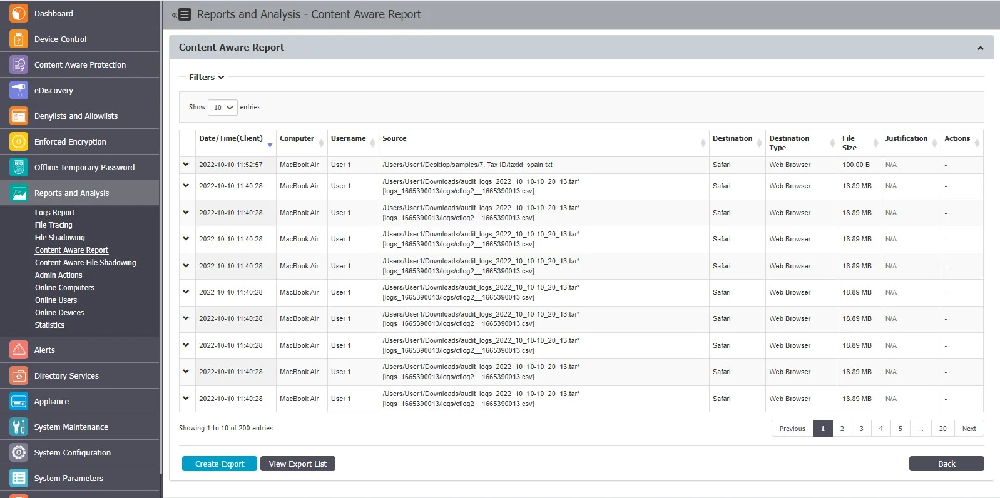

When using the latest Endpoint Protector client, you can view log details structured per file scanned.

Expand each entry to view detailed log information:

- Policy—select an active policy from the dropdown list
- Policy name—the name of the selected policy
- Policy type—the type of the selected policy
- Items type—the Policy Denylist category selected
- Matched type—the Policy Denylist type selected
- Matched items—click the link to view a pop-up window with the list of matched items

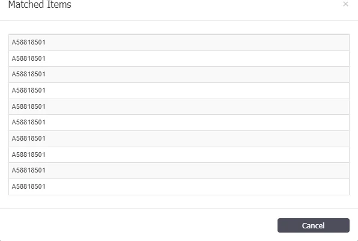

- Count—the number of matched items

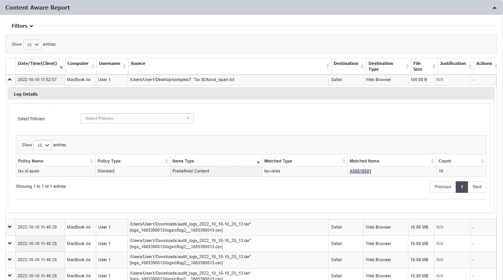

Use the **Show/Hide Columns** dropdown to customize which columns are visible in the report. The **Date/Time(Client UTC)** column is available in this dropdown but is hidden by default.

From the Filters section, select the **Include old logs before 5.7** upgrade option to include all
logs in your searches. If you don't select the option, the filters apply
only to the new structure of logs. The **Date/Time(Client UTC)** field is also available as a filter option.

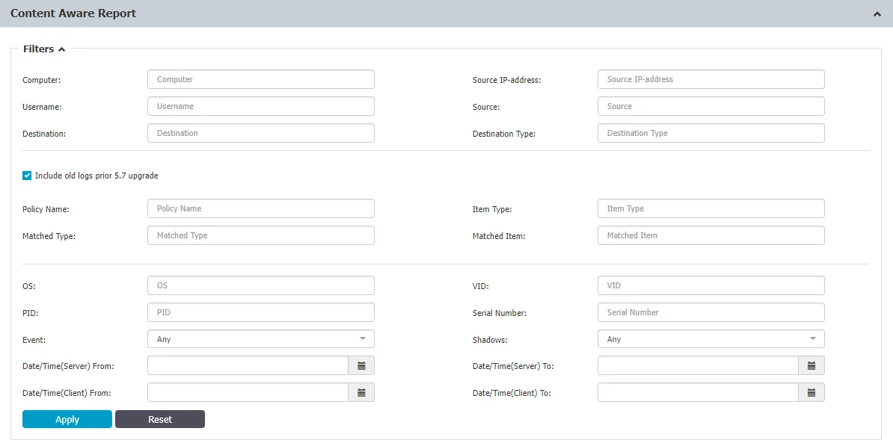

For macOS users, when the Deep Packet Inspection feature is enabled on the Endpoint Protector agent
for macOS, the agent might not provide full destination details for files transferred from a network
share through monitored applications, such as browsers. In such cases, the destination information
might not be complete.

For Linux users, the Endpoint Protector agent doesn't support network share visibility, except for
files transferred from a network share through Deep Packet Inspection monitored applications,
such as browsers.

### Export Content Aware reports

You can export Content Aware logs as Excel, PDF, or CSV, or create an export containing the entire log
report as a CSV or XLSX file.

Excel/PDF/CSV—located above the Content Aware Reports list, this exports only the default
columns. The **Date/Time(Client UTC)** column is included in exports when selected through Show/Hide Columns.

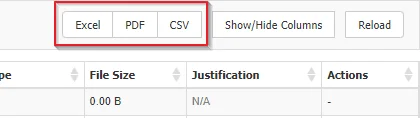

Create Export—located below the Content Aware Reports list, this creates an export containing
all data, including the expanded Logs Details section with columns for Policy Type, Policy Name, Item
type, Matched type, Matched items, and Count.

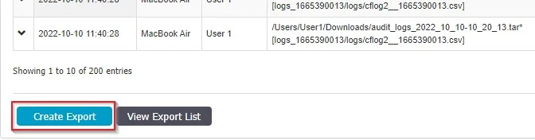

After the message displays that a new export is available on the Export List,
click **View Export List** to open the list of Reports, where you can download or delete a report.

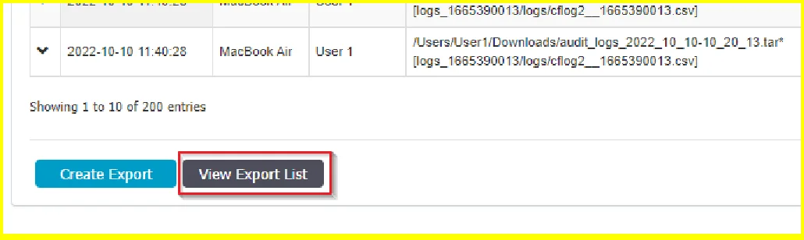

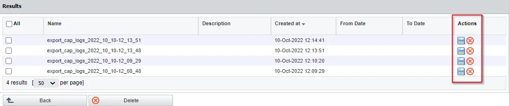

## eDiscovery logs

eDiscovery scan results are accessible from the Reports and Analysis section. The eDiscovery log view displays discovered files with their detection details, remediation status, and associated policies.

Endpoint Protector stores eDiscovery logs in CrateDB, and they support the same filtering, sorting, and export capabilities as Device Control and Content Aware logs.

For detailed information on viewing and managing eDiscovery scan results, see [Scan results and actions](/docs/endpointprotector/admin/ed_module/edscanresults.md).

## Export list

The Export List shows all exports held on the server, regardless of log type. Access it at any time by clicking **View Export List** in any log report section. The Export List includes exports for Device Control, Content Aware Protection, and eDiscovery logs.

From the Export List you can download completed exports or delete entries you no longer need. Deleting an entry removes both the record and the archive file from the server.

### Scheduled exports

The Export List contains two types of export: exports you create manually, and exports Endpoint Protector generates automatically.

Endpoint Protector generates a scheduled export once per day for each module: Device Control, Content Aware Protection, and eDiscovery. Endpoint Protector creates these scheduled exports during the upgrade to 2608, and they run without any configuration.

Identify the two types by the file name prefix:

- `Scheduled_Export_...` — Endpoint Protector generates these automatically. For example, `Scheduled_Export_Device_Control_Logs_2026-09-09 06:00:00`.
- `Generated_Export ...` — an administrator creates these manually. For example, `Generated_Export 2026-09-09_14-22-05`.

Scheduled exports belong to the system rather than to an administrator, so no user name appears against them in the Export List. This is expected and doesn't indicate a configuration problem.

:::note
You can't view, change, or disable the daily schedule for automatic exports from the interface.
:::

### Background processing

When you click **Create Export**, Endpoint Protector queues the request and processes it in the background. The server processes one export at a time. This means:

- You don't need to stay on the page while the export runs.
- If an export is already running, your new request waits in the queue.
- You can't create additional exports while the banner is showing.

When an export is in progress, a banner appears at the top of the page:

<!-- vale Netwrix.TemporalHedges = NO -->
> *A log Report Export is currently running and will be ready soon. Until then, no additional Exports can be created and the displaying Log Report Results may be slower.*
<!-- vale Netwrix.TemporalHedges = YES -->

Wait for the current export to finish before starting a new one. The banner disappears when processing is complete. Large exports might take several minutes depending on the number of records and the load on the server.

:::note
If a system backup is running at the same time as an export, Endpoint Protector cancels queued exports automatically. Create the export again after the backup completes.
:::

### Export retention

Endpoint Protector deletes completed exports automatically after a configurable retention period. The default is 29 days. It removes both the entry in the Export List and the archive file on disk.

This cleanup applies to manual and scheduled exports alike, so exports don't accumulate on the server over time.

:::note
Export retention controls how long Endpoint Protector keeps the generated export files. It doesn't affect how long Endpoint Protector stores the log data itself. To control log data retention, use the **Enable Log Rotate After** setting described in [Log Settings](/docs/endpointprotector/admin/systemconfiguration/systemsettings.md).
:::

## Admin actions

This section provides an overview of every important action performed in the interface. From the
Action column, you can view additional information.

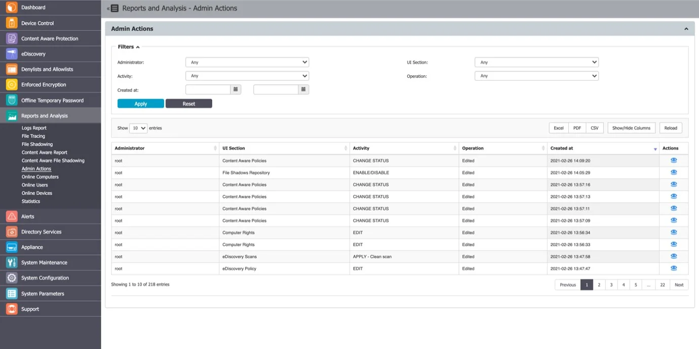

## SCIM provisioning logs

The logs display detailed information for each System for Cross-domain Identity Management (SCIM)
request, including:

- Request ID
- Timestamp
- HTTP Method
- Endpoint
- Status Code
- Operation type (POST, PATCH, DELETE, BULK)
- Resource type (User, Group)
- Actor
- Request and response bodies

These logs help administrators:

- Verify successful provisioning
- Troubleshoot synchronization issues
- Support audit and compliance requirements

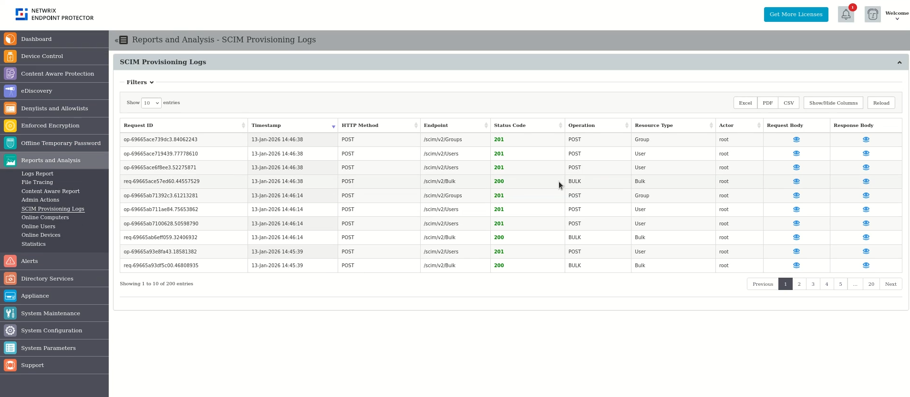

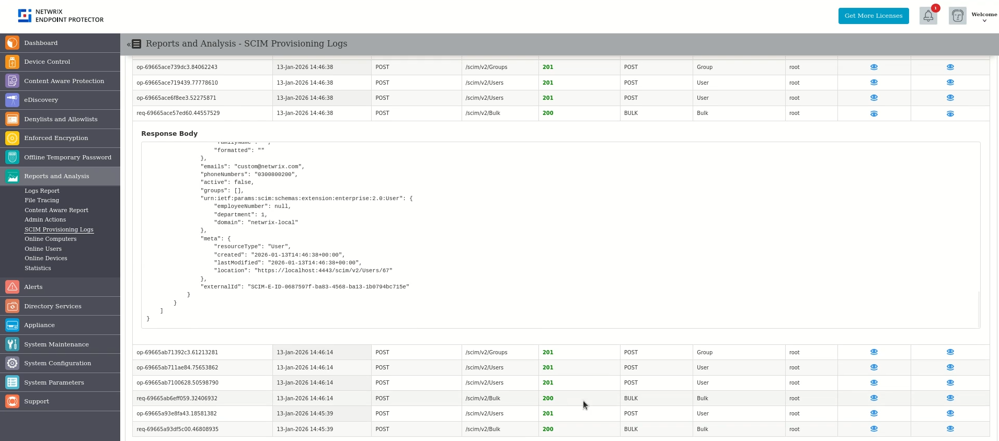

## Online computers

This section provides an overview of computers registered on the system that have an established
connection with the server. If the Refresh Interval for computer X is one minute, then computer X was
communicating with the server in the last minute.

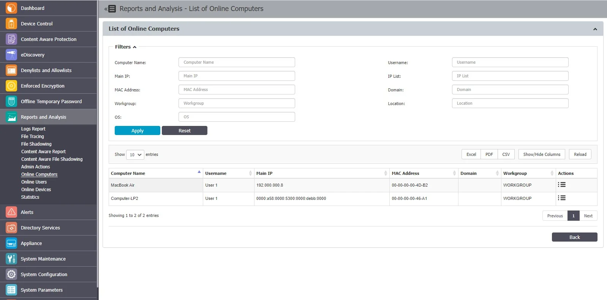

## Online users

This section provides an overview of users registered on the system that have an established
connection with the server.

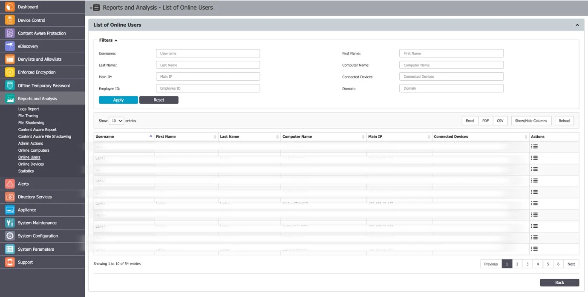

## Online devices

This section provides an overview of devices registered on the system that have an established
connection with the server.

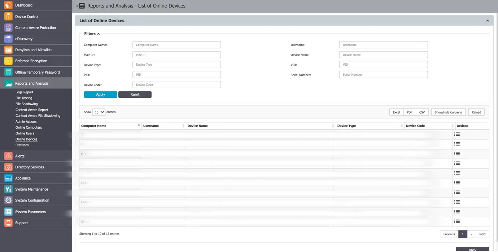

## Statistics

The Statistics module lets you view system activity related to data traffic and device connections. Use the integrated filter to generate reports—select the field of interest and click **Apply Filter**.

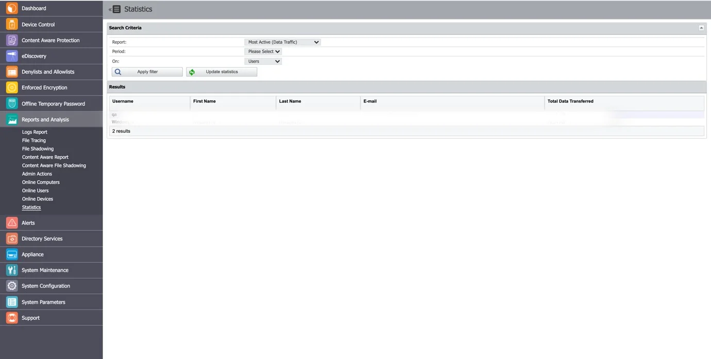

## Persistent filters

With persistent filters, you can save filter configurations and column visibility preferences to quickly return to a frequently used view. Saved filters are private to your administrator account.

Persistent filters are available on the following pages:

- **Reports and Analysis** — File Tracing, Content Aware Protection, eDiscovery, and Admin Actions
  reports
- **Device Control** — Computers, Users, and Groups lists

### Save a filter

1. On a supported page, configure the filters and column visibility to match the view you want to
   save.
2. Click **Save**.
3. In the **Save as** dialog, choose one of the following:
   - **New filter** — enter a **Filter name** and optional **Description**, then click **Create**.
   - **Existing filter** — select a previously saved filter from the list to overwrite it with the
     current configuration, then click **Save**.
4. On reporting pages, select a **Date range** option:
 - **Use selected** — saves the selected date range as part of the filter.
   - **Predefined range** — saves a relative date range that updates automatically each time the
     filter is loaded. Options: Last day, Last 3 days, Last 7 days, Last 30 days, This Week, This
     Month, Last Week, Last Month.

   :::note
   Date range options are available on reporting pages only. On entity pages (Computers, Users,
   Groups), filters don't include a date range component.
   :::

The filter saves all current filter settings, filter values, and the column visibility configuration
for the active view.

### Load a filter

1. Click **Load** to display the list of saved filters.
2. Select a filter from the list to apply it.

The page updates to reflect the saved filter settings and column visibility.

:::note
When you return to a page where you previously used a saved filter, Endpoint Protector loads the
last used filter and column view automatically.
:::

### Reset filters

Click **Reset** to clear all applied filters and column visibility settings, returning the page to
its default (unfiltered) state.

### Delete a filter

1. Click **Save** to open the filter management dialog.
2. Select the filter you want to remove.
3. Click **Delete**.

### Column visibility

Endpoint Protector saves column visibility preferences automatically per view. When you show or hide
columns using the **Show/Hide Columns** control, the change persists for your administrator account
on that specific page.
