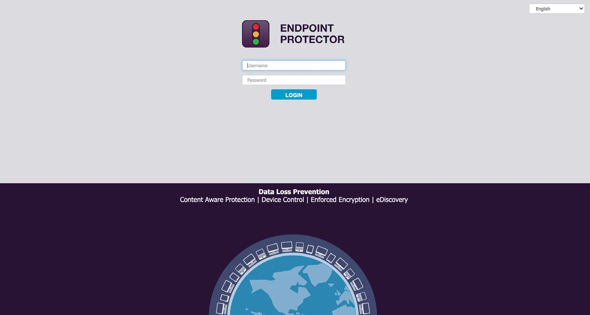
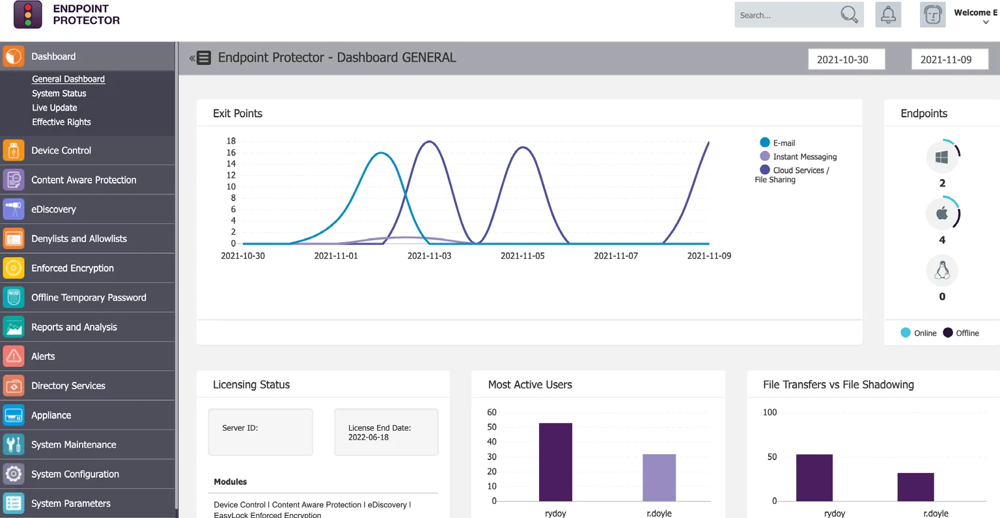

# Logging in to the Server

After provisioning the Endpoint Protector Server, you can configure the feature modules. To manage
policies in preparation for agent deployment, follow these steps to access the web user interface
set up during the server installation:

**Step 1 –** Access the Web Interface: Enter the server's address in your web browser's address bar.
This address may be a static IP or a namespace.

**Step 2 –** Log In: You will be prompted to enter your credentials. Use your assigned username and
password. If you are logging in for the first time, use the default credentials:

- Username: root
- Password: epp2011

:::note
Please ensure to update your login credentials after the first login to enhance security.
:::

Upon successful log in, the **Dashboard** > **General Dashboard** window will be displayed (see
below image). This window is intended to provide a high-level overview of endpoints under management
as well as activity, licensing status, and modules licensed.

Your available modules are displayed in the left-side navigation pane. These can be selected to
further manage module-specific policies. Ultimately, policies define the actions allowed /
disallowed on the endpoint.

Before deploying any agents, each module’s policy should be reviewed. If agents have already been
delivered to systems, a review of the configuration(s) can be accomplished by verifying active
policy mappings. To clarify, once a policy is built or edited, it would be ‘mapped’ to a defined
target or group of targets. This will be discussed later in the sections for each module.
