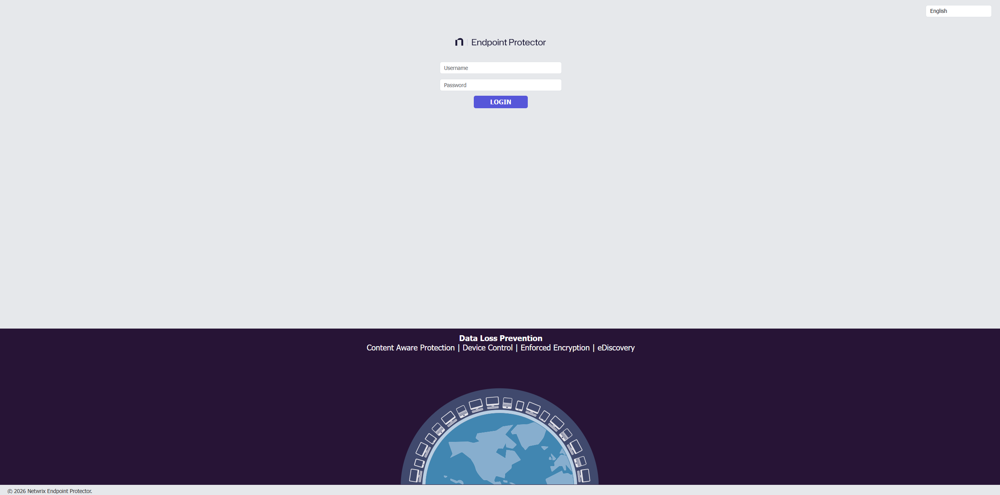
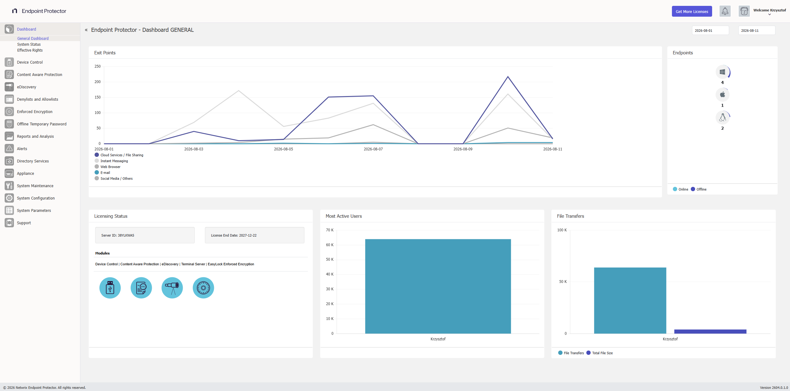

# Logging in to the Server

After provisioning the Endpoint Protector Server, you can configure the feature modules. To manage
policies in preparation for agent deployment, access the web user interface set up during the server installation by following these steps:

**Step 1 –** Access the Web Interface: Enter the server's address in your web browser's address bar.
This address may be a static IP or a namespace.

**Step 2 –** Log In: Enter your credentials. Use your assigned username and password. If you are
logging in for the first time, use the default credentials:

- Username: root
- Password: epp2011

:::note
ensure to update your login credentials after the first log in to enhance security.
:::

Upon successful log in, Endpoint Protector displays the **Dashboard** > **General Dashboard** window (see
the following image). This window is intended to provide a high-level overview of endpoints under management
as well as activity, licensing status, and modules licensed.

Your available modules are displayed in the left-side navigation pane. These can be selected to
further manage module-specific policies. Ultimately, policies define the actions allowed /
disallowed on the endpoint.

Before deploying any agents, review each module’s policy. If agents have already been deployed to
systems, verify the configuration by checking active policy mappings. To clarify, after you build or
edit a policy, you map it to a defined target or group of targets. Later sections for each module
discuss this process.
