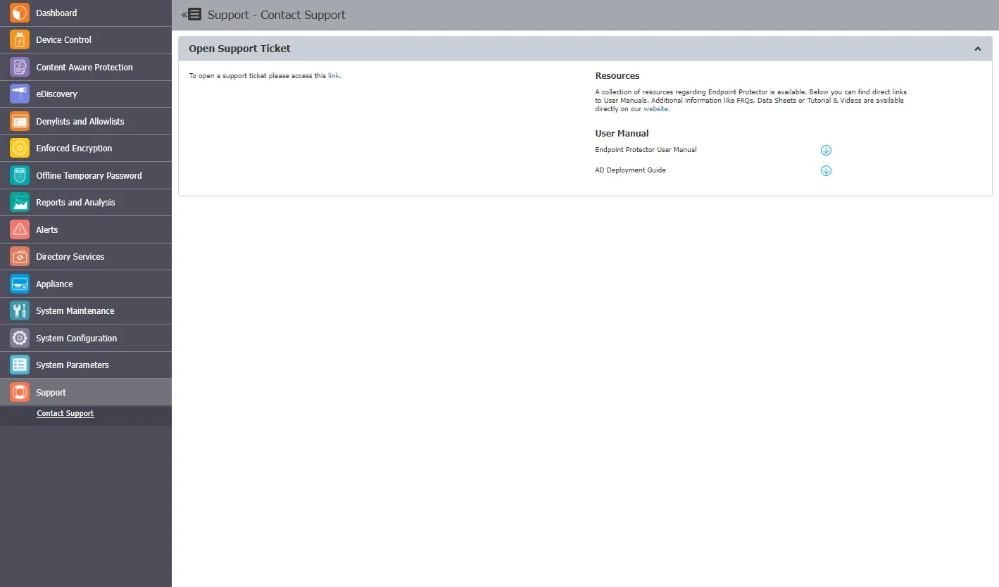

# Support

For additional support resources, visit our [website](https://www.netwrix.com/support.html)
where you can read manuals, view FAQs, watch videos and tutorials, access direct e-mail support, and
much more.

We also recommend tracking the [Netwrix Community Portal](https://community.netwrix.com/c/products/endpoint-protector/22), a section dedicated to Endpoint Protector. It includes knowledge-sharing posts, Release Notes, bug lists, known limitations, and upcoming deprecations.

You can contact our technical support team by submitting a ticket through the
[Netwrix Customer Portal](https://www.netwrix.com/sign_in.html?rf=my_products.html). A team member
will respond to your inquiry as soon as possible.

