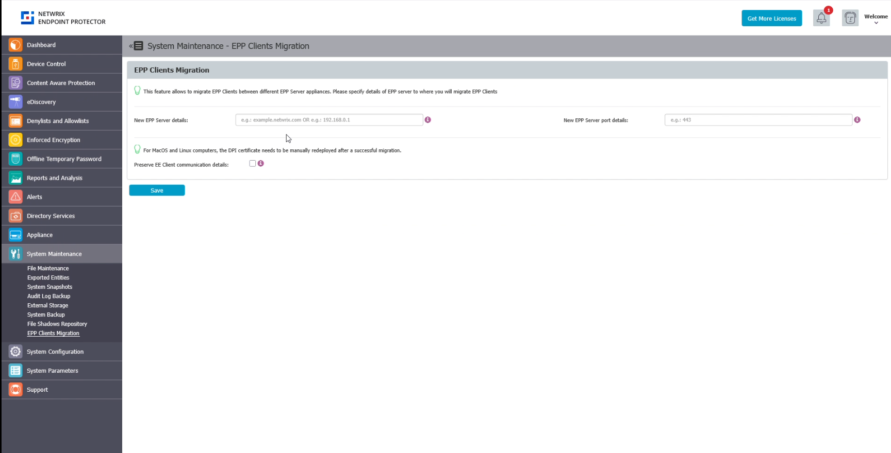
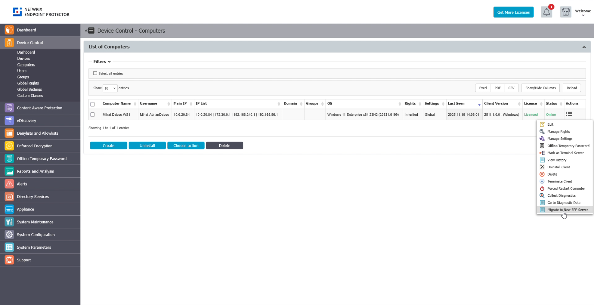

# EPP Clients Migration

This section provides a complete overview of the EPP Clients Migration settings. From this page you will be able to set new global migration settings by specifying the details of the new EPP Server FQDN/IP and port. Migration can then be triggered for individual computers from the computer management page, where individual computers or groups of computers can be assigned to the new server. Once initiated, EPP Clients will initiate the migration process to the target server. If the migration attempt fails, the existing failover procedure will be activated. All transactions will be logged for tracking and auditing purposes.

:::note
!IMPORTANT
Currently only the EPP Client is available for the migration operation, the feature will accomomdate migration for the Enforced Encryption Client in a future release soon.
:::

## Configuring the **EPP Clients Migration** page

1.  Go to **System Maintenance -\>EPP Clients migration** page
2.  Add **New EPP Server** details. Here, you can specify the domain (eg. example.netwrix.com) or IP address (eg. 192.168.0.2) of the new target EPP server
3.  Add the **New EPP Port** details. Here you can specify Server - Client communication port (eg. 443) of new target EPP server

Optional, you can choose to Preserve EE Client communication details. When enabled, this checkbox will preserve existing EE communication details and will not migrate the EE client to the new EPP server. This can be useful for complex migration plans and edge case scenarios.

:::note
For MacOS and Linux computers, the DPI certificate needs to be manually redeployed after a successful migration.
:::

4.  **Save** the configuration

## Migrating Computers to the New EPP Server

1.  Go to **Device Control -\> Computers**
2.  For the desired computers to be migrated, go to **Actions/Migrate to New EPP Server.** When clicked, marked computer should receive instruction to re-register in new EPP Server
3.  After the EPP Client will receive instructions with the next server communication cycle, the migration will begin

:::note
On the EPP Client side, when new EPP Server details will be received, the registration procedure will start.

If the migration process is successful, the previous EPP Server connection will be dropped, a successful log entry will be created on the client side as well as a server admin action log report. Migration for the EE client can also begin as a second step, if the settings indicate that operation.

If the migration process ends in failure, the previous EPP Server connection will be kept, a failure log entry will be created on the client side as well as a server admin action log report. Migration for the EE client will not begin and the process will stop.
:::
