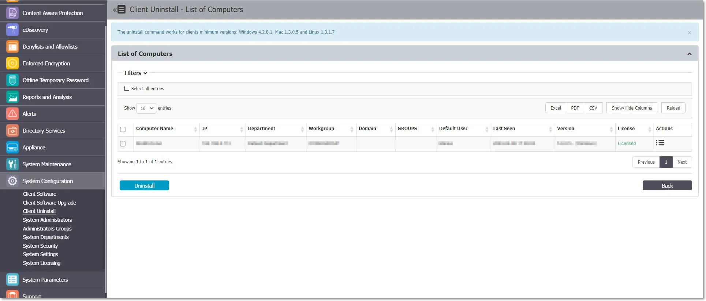
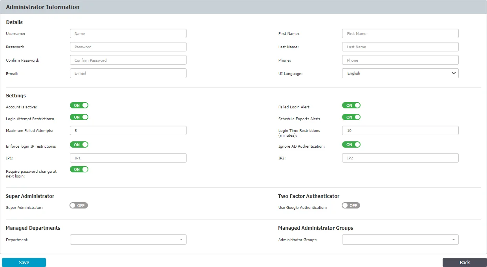
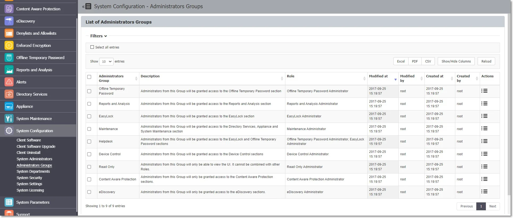
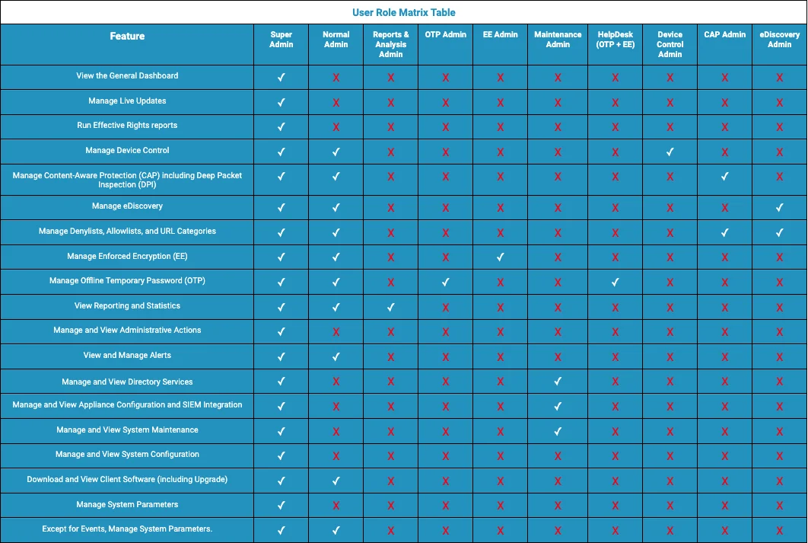
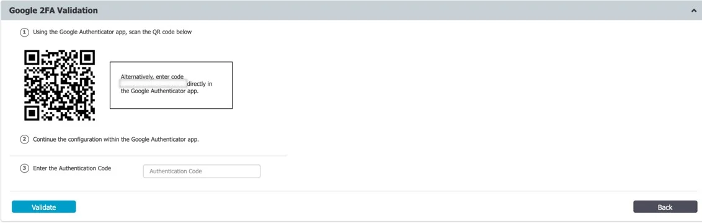
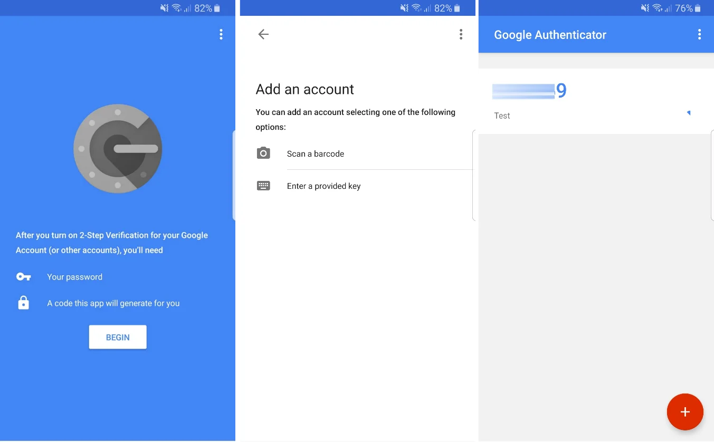
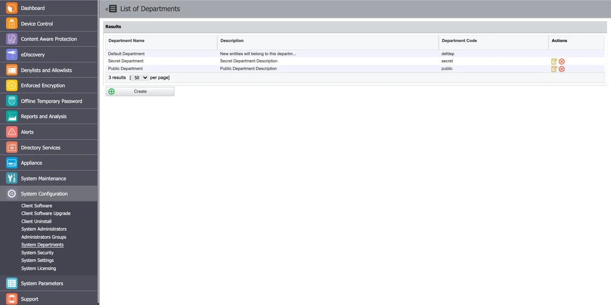
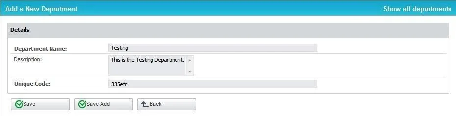

# Administration and Access Control

This section allows you to manage system administrators, their roles, and access permissions. It
includes features for setting up account details, applying security measures such as Two-Factor
Authentication (2FA), and overseeing administrator groups and system departments to ensure effective
access control and system security.

## System Administrators

From this section you can view, create, manage and delete administrators.

To create a new Administrator, under the table with existing administrators, click Create and then
provide the following information:

**Administrator Details**

- Add the username and password, email, first and last name, phone number and then select the UI
  language

**Account Settings**

- Account is active – manage the account status
- Login Attempt Restrictions – enforce a 5 to 10 minutes timeout for 5 to 10 unsuccessful login
  attempts before a new login attempt can be made
- Enforce login IP restrictions – restrict login attempts from specific IP addresses
- Require password change at next login – request the administrator to change password at first
  login; once the password is changed, this setting is automatically disabled.

:::warning
The Require password change at next login setting is ignored in the following
situations:
:::

1. When the Enforce all administrator password security at next login setting is also enabled from
   System Configuration, System Security, then Require password change at next login is ignored and
   disabled once the password is changed.
2. For Active Directory imported users
3. For SSO users (Azure and OKTA) the setting is hidden

- Failed Login Alert – receive alerts for any failed login
- Schedule Exports Alert – receive alerts on any scheduled exports
- Ignore AD Authentication – allow using AD credentials to login Endpoint Protector

**Super Administrator Details**

- Super Administrator – enable this section to grant the Administrator access to all Departments and
  Endpoint Protector sections
- Two Factor Authentication – enforce 2FA (Two-Factor Authentication) by using the Google
  Authenticator previously installed on your device
- Managed Departments – assign the Administrator to one or more departments
- Managed Administrators Groups – assign the Administrator to one or more Administrators Group

## Administrator Types

The Super Administrator has complete control over the entire system. By enabling the Import users as
super administrators settings in the Administration and Access Control section, you can grant Super
Administrator privilege to all Azure Single Sign On imported users.

Super Administrators have access to the General Dashboard, can run
Effective Rights reports, can manage Device Control, can manage Content Aware Protection including
Deep Packet Inspection, can manage eDiscovery, can manage Denylists, Allowlists, and URL Categories,
can manage Enforced Encryption, can manage Offline Temporary Password, can view Reporting and
Statistics, manage and view Administrative Actions, manage and view Alerts, manage and view
Directory Services, manage and view Appliance Configuration and SIEM Integration, manage and view
System Maintenance, manage and view Systems Configuration, download and view Client Software
(including Upgrade), manage system parameters , and download and view Client Software (including
Upgrade).

The Normal Administrator is a system user with normal privileges but some limitations. They can only
manage entities belonging to the system departments for which they are responsible for. Normal
Administrators can be allocated to certain responsibilities inside Administrators Groups to further
restrict access. They can, for example, be assigned to a Helpdesk group with specific duties such as
Offline Temporary Password and Enforced Encryption, or their permissions restricted to specific modules
such as Content Aware and Device Control.

Despite these restrictions, Normal Administrators have access to a variety of system management
tools, such as Manage Device Control, Manage Content Aware Protection (including Deep Packet
Inspection), Manage eDiscovery, Manage Denylists, Manage Allowlists, Manage Offline Temporary
Password, Manage Enforced Encryption, View Reporting and Statistics, View and Manage Alerts, and
Download and View Client Software (including Upgrade). They can also control system parameters.

By assigning Normal Administrators specific roles and groups, an organization can ensure that
sensitive data and tools are only accessible to those who need them, while still providing their
team members with the tools they need to efficiently manage the system.

## Administrators Groups

From this section you can create and manage Administrators Groups, granting Normal Administrators
with access to specific Endpoint Protector sections.

The Administrators added to these groups will only be able to view and manage the sections assigned
by the selected roles.

By default, the following Administrators Groups are created:

- Offline Temporary Password Administrators – grants access only to the Offline Temporary Password
  section
- Reports and Analysis Administrators – grants access to the Reports and Analysis section
- Enforced Encryption Administrators – grants access only to the Enforced Encryption section
- Maintenance Administrators – grants access only to the Directory Services, as well as Appliance
  Configuration, SIEM Integration and System Maintenance.
- Helpdesk - grants access only to the Enforced Encryption and Offline Temporary Password sections
- Device Control Administrators – grants access only to the Device Control section
- Read Only Administrators – grants read only access to all Endpoint Protector sections
- Content Aware Protection Administrators – grants access to Content Aware Protection (including
  Deep Packet Inspection) as well as Denylists, Allowlists, and URL Categories.
- eDiscovery Administrators – grants access only to the eDiscovery section

To create a new Administrators Group, click Create and then provide the following information:

- Name – add a name for the new Administrators Group
- Roles – select one or more roles from the list

:::warning
The Read Only role cannot be combined with any other roles!
:::

- Description – add a description of the new Administrators Group
- Select Administrators – add one or more Administrators to this group

You can also add Administrators to an Administrator Group when creating an Administrator from System
Configuration, Systems Administrators section, on the Managed Administrators Groups field.

:::note
The Support section will always be available in Endpoint Protector regardless of the role
you assign to the Administrator Group.
:::

### User Role Matrix

The Endpoint Protector User Role Matrix defines the many capabilities and permissions that
Administrators have based on their role. This matrix ensures that users only have access to the
features they need to fulfill their duties, boosting security and lowering the chance of
unintentional changes or data breaches.

Within the Endpoint Protector, there are several different user roles, each with their own set of
permissions. The Super Administrator role is the most powerful and has access to all features,
whilst other roles have more restricted access based on their job tasks.

:::note
Each of the aforementioned roles can be assigned to a department. When in read-only mode,
users are only given viewing options. This guarantees that they can obtain essential information but
are unable to alter the system.
:::

## Two Factor Authentication

The Two Factor Authentication (2FA) allows the login process to include an extra step requesting a
temporary code generated via the Google Authenticator app. With the Two Factor Authentication on,
once the user creation or edit is saved, the administrator will be redirected to a verification
screen.

The Google Authenticator app will ask you to register using a unique code or QR Code. Following the
registration process, your account will be added to the list with a validity timer for the unique
code that will be used for the second authentication factor.

## System Departments

This section allows you to create and manage System Departments.

Using System Departments is optional. Endpoint Protector works perfectly well with just the Default
Department (defdep). Moreover, most scenarios are best covered by simply using Devices, Computers,
Users, and Groups (the entities also available in AD).

The functionality becomes useful mainly in large installations, with a high number of Administrators
and, where strict regulatory compliance rules are in place. Under these circumstances, departments
can be created, allowing each Normal Administrators to only manage their own entities.

:::warning
This functionality should not be confused with Groups of computers and users, nor with
administrators’ roles.
:::

To create a new department click Create and then provide a name, description and unique code.

:::note
If you provide a wrong department code or none at all, the department code is considered
invalid and that computer will be assigned to the default department (defdep).
:::

In terms of terminology, a similarity between Endpoint Protector and Active Directory (or any other
Director Service software) would make the Department equivalent to an Organization Unit. Of course,
the Organization Unit is not identical to the Department, and again Endpoint Protector leaves the
power to the actual Super Administrator to virtually link one or more Organization Units to an
Endpoint Protector Department.

Each entity (e.g.: computer) must belong to a department. When deploying the Endpoint Protector
Client, if a department having the given code is found, then the computer will register, and it will
belong to that department.

Example: Computer Test-PC is registered to the department “developers”. In this case, the user Test
logged on that computer will be assigned to the same department together with the devices connected
on the computer Test-PC.

Super Administrators (e.g.: root) (see Administrator Types) will have access to all the main
entities regardless of their departments. They will also be able to create departments, as well as
Normal Administrators or Administrators with other roles. Super Administrators will also be
responsible for assigning administrators to manage departments.

A regular administrator can only manage the departments it was assigned to. It cannot see entities
relating to other departments.
