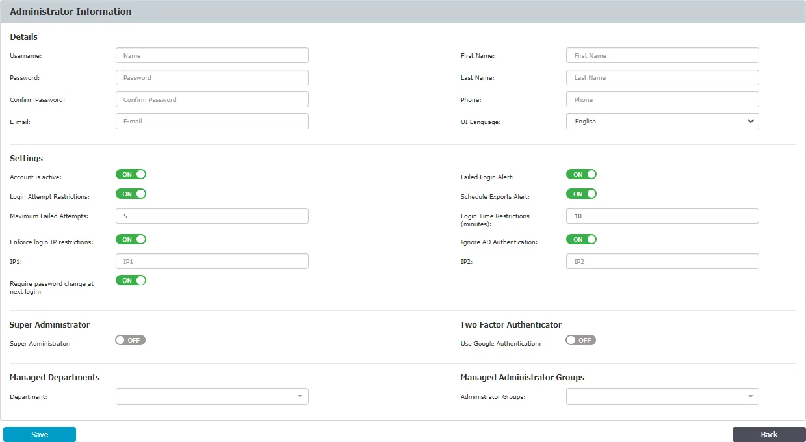
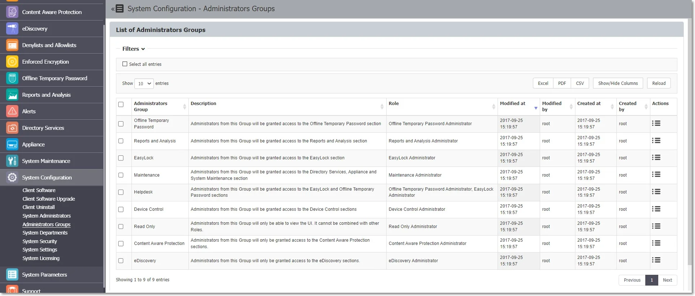
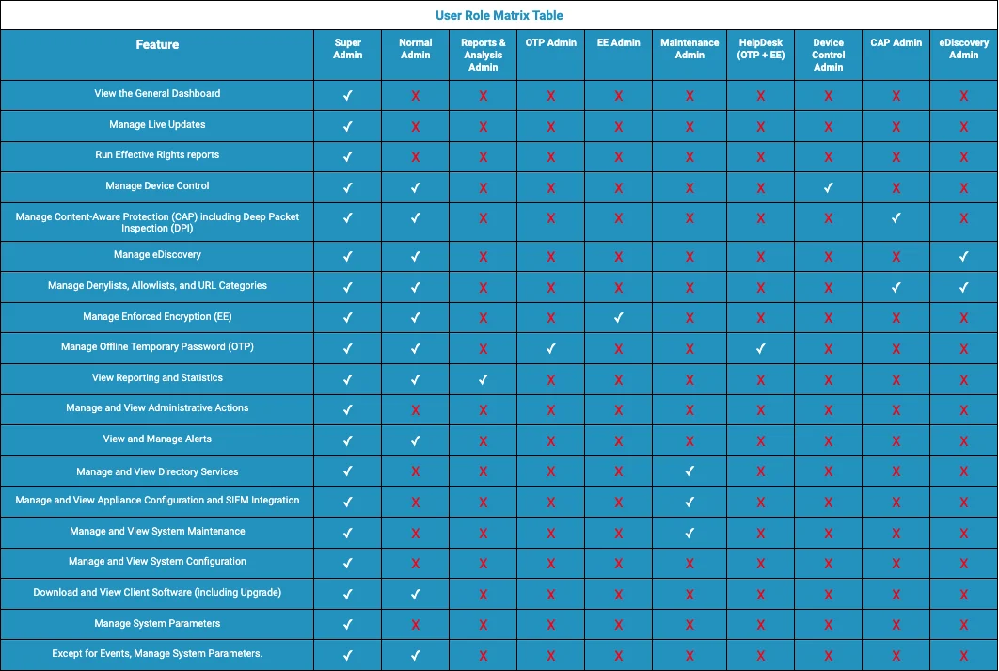
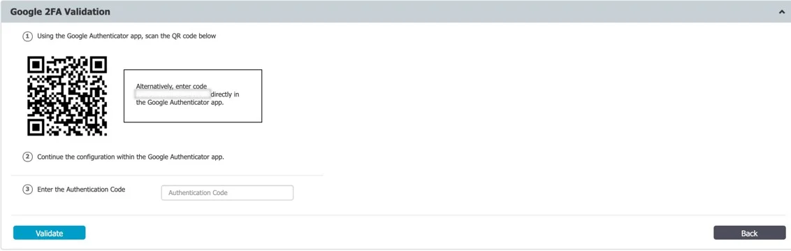
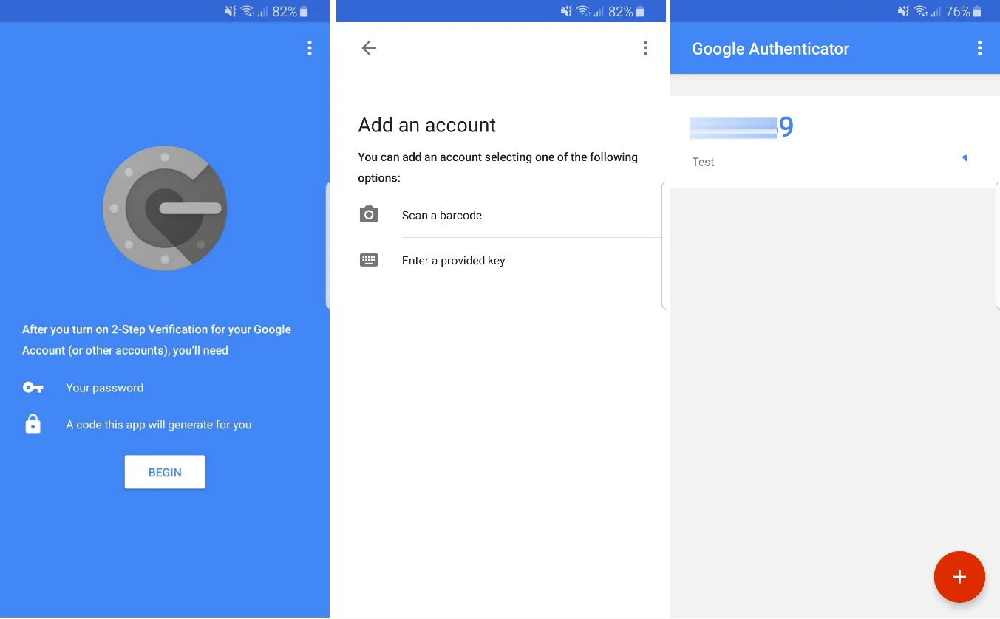
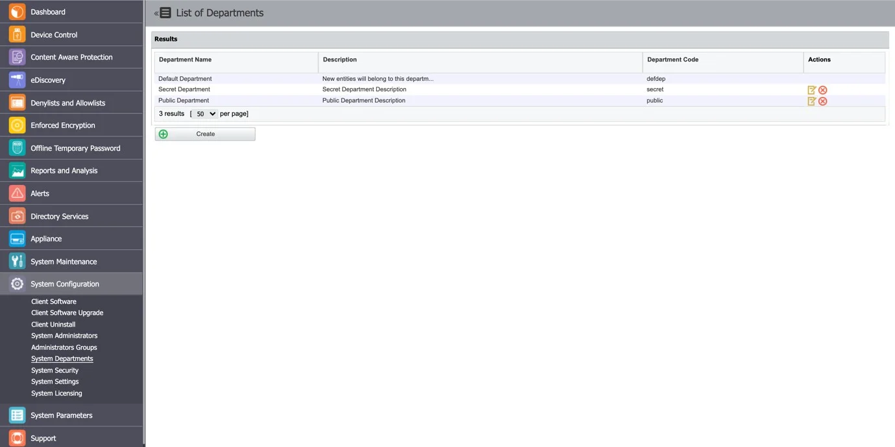
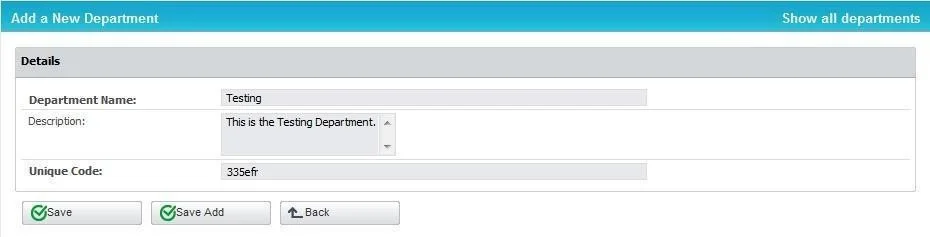

# Administration and Access Control

Use this section to manage system administrators, their roles, and access permissions. It
includes features for setting up account details, applying security measures such as Two-Factor
Authentication (2FA), and overseeing administrator groups and system departments to ensure effective
access control and system security. Administrator Groups and System Departments let you delegate
administration by role, business unit, or region, so large, multi-location deployments can scope
each administrator's access to only the entities they manage.

## System Administrators

From this section you can view, create, manage, and delete administrators.

To create a new Administrator, under the table with existing administrators, click Create and then
provide the following information:

**Administrator Details**

- Add the username, password, email, first name, last name, and phone number, and then select the
  UI language

**Account Settings**

- Account is active – manage the account status
- Login Attempt Restrictions – enforce a 5 to 10 minutes timeout for 5 to 10 unsuccessful login
  attempts before allowing another login attempt
- Enforce login IP restrictions – restrict login attempts from specific IP addresses
- Require password change at next login – request the administrator to change password at first
  login. After the administrator changes the password, Endpoint Protector automatically disables
  this setting.

:::warning
Endpoint Protector ignores the Require password change at next login setting in the
following situations:
:::

1. When you also enable the Enforce all administrator password security at next login setting from
   System Configuration, System Security, Endpoint Protector ignores and disables Require password
   change at next login after the administrator changes the password.
2. For Active Directory imported users
3. For SSO users (Azure and OKTA), the system hides the setting

- Failed Login Alert – receive alerts for any failed login
- Schedule Exports Alert – receive alerts on any scheduled exports
- Ignore AD Authentication – allow using AD credentials to login Endpoint Protector

**Super Administrator Details**

- Super Administrator – enable this section to grant the Administrator access to all Departments and
  Endpoint Protector sections
- Two Factor Authentication – enforce 2FA (Two-Factor Authentication) by using the Google
  Authenticator previously installed on your device
- Managed Departments – assign the Administrator to one or more departments
- Managed Administrators Groups – assign the Administrator to one or more Administrators Group

## Administrator Types

The Super Administrator has complete control over the entire system. By enabling the Import users as
super administrators settings in the Administration and Access Control section, you can grant Super
Administrator privilege to all Azure Single Sign On imported users.

Super Administrators have access to:

- General Dashboard
- Effective Rights reports
- Device Control (manage)
- Content Aware Protection, including Deep Packet Inspection (manage)
- eDiscovery (manage)
- Denylists, Allowlists, and URL Categories (manage)
- Enforced Encryption (manage)
- Offline Temporary Password (manage)
- Reporting and Statistics (view)
- Administrative Actions (manage and view)
- Alerts (manage and view)
- Directory Services (manage and view)
- Appliance Configuration and SIEM Integration (manage and view)
- System Maintenance (manage and view)
- Systems Configuration (manage and view)
- Client Software, including Upgrade (download and view)
- System parameters (manage)

The Normal Administrator is a system user with normal privileges but some limitations. They can only
manage entities belonging to the system departments for which they are responsible. You can allocate
Normal Administrators to certain responsibilities inside Administrators Groups to further
restrict access. For example, you can assign them to a Helpdesk group with specific duties such as
Offline Temporary Password and Enforced Encryption, or restrict their permissions to specific modules
such as Content Aware and Device Control.

Despite these restrictions, Normal Administrators have access to:

- Device Control (manage)
- Content Aware Protection, including Deep Packet Inspection (manage)
- eDiscovery (manage)
- Denylists (manage)
- Allowlists (manage)
- Offline Temporary Password (manage)
- Enforced Encryption (manage)
- Reporting and Statistics (view)
- Alerts (view and manage)
- Client Software, including Upgrade (download and view)

They can also control system parameters.

By assigning Normal Administrators specific roles and groups, an organization ensures that only those
who need them can access sensitive data and tools, while still providing team members with the tools
they need to manage the system efficiently.

## Administrators Groups

From this section you can create and manage Administrators Groups, granting Normal Administrators
with access to specific Endpoint Protector sections.

Administrators added to these groups can only view and manage the sections the selected roles
assign.

Endpoint Protector creates the following Administrators Groups by default:

- Offline Temporary Password Administrators – grants access only to the Offline Temporary Password
  section
- Reports and Analysis Administrators – grants access to the Reports and Analysis section
- Enforced Encryption Administrators – grants access only to the Enforced Encryption section
- Maintenance Administrators – grants access only to the Directory Services, as well as Appliance
  Configuration, SIEM Integration and System Maintenance.
- Helpdesk - grants access only to the Enforced Encryption and Offline Temporary Password sections
- Device Control Administrators – grants access only to the Device Control section
- Read Only Administrators – grants read only access to all Endpoint Protector sections
- Content Aware Protection Administrators – grants access to Content Aware Protection (including
  Deep Packet Inspection) as well as Denylists, Allowlists, and URL Categories.
- eDiscovery Administrators – grants access only to the eDiscovery section

To create a new Administrators Group, click Create and then provide the following information:

- Name – add a name for the new Administrators Group
- Roles – select one or more roles from the list

:::warning
You can't combine the Read Only role with any other roles.
:::

- Description – add a description of the new Administrators Group
- Select Administrators – add one or more Administrators to this group

You can also add Administrators to an Administrator Group when creating an Administrator from System
Configuration, Systems Administrators section, on the Managed Administrators Groups field.

:::note
The Support section will always be available in Endpoint Protector regardless of the role
you assign to the Administrator Group.
:::

### User Role Matrix

The Endpoint Protector User Role Matrix defines the many capabilities and permissions that
Administrators have based on their role. This matrix ensures that users only have access to the
features they need to fulfill their duties, boosting security and lowering the chance of
unintentional changes or data breaches.

Endpoint Protector has several user roles, each with its own set of
permissions. The Super Administrator role is the most powerful and has access to all features,
whilst other roles have more restricted access based on their job tasks.

:::note
You can assign each role to a department. In read-only mode,
users have viewing options only. This guarantees that they can obtain essential information but
can't alter the system.
:::

## Two Factor Authentication

The Two Factor Authentication (2FA) allows the login process to include an extra step requesting a
temporary code generated via the Google Authenticator app. With Two-Factor Authentication on, after you save the user creation or edit, Endpoint Protector
redirects you to a verification screen.

The Google Authenticator app will ask you to register using a unique code or QR Code. Following the
registration process, Endpoint Protector adds your account to the list with a validity timer for the
unique code it uses as the second authentication factor.

## System Departments

Use this section to create and manage System Departments.

Using System Departments is optional. Endpoint Protector works well with only the Default
Department (defdep). Moreover, using Devices, Computers, Users, and Groups (the entities also available in AD) covers
most scenarios.

The functionality becomes useful mainly in large installations, with a high number of Administrators
and, where strict regulatory compliance rules are in place. Under these circumstances, you can create departments, allowing each Normal Administrator to manage
only their own entities.

:::warning
Don't confuse this functionality with Groups of computers and users, or with
administrators’ roles.
:::

To create a new department click Create and then provide a name, description, and unique code.

:::note
If you provide a wrong department code or none at all, Endpoint Protector considers the
department code invalid and assigns that computer to the default department (defdep).
:::

In Endpoint Protector terminology, a Department is similar to an Organization Unit in Active
Directory (or any other directory service software). The Organization Unit isn't identical to the
Department, and Endpoint Protector leaves the power to the Super Administrator to virtually link
one or more Organization Units to an Endpoint Protector Department.

Each entity (e.g.: computer) must belong to a department. When deploying the Endpoint Protector
Client, if Endpoint Protector finds a department with the given code, the computer registers and
belongs to that department.

Example: Computer Test-PC registers to the department “developers”. In this case, the user Test
logged on that computer belongs to the same department, together with the devices connected
on the computer Test-PC.

Super Administrators (e.g.: root) (see Administrator Types) will have access to all the main
entities regardless of their departments. They will also be able to create departments, as well as
Normal Administrators or Administrators with other roles. Super Administrators will also be
responsible for assigning administrators to manage departments.

A regular administrator can only manage the departments a Super Administrator assigned to it. It
can't see entities
relating to other departments.
