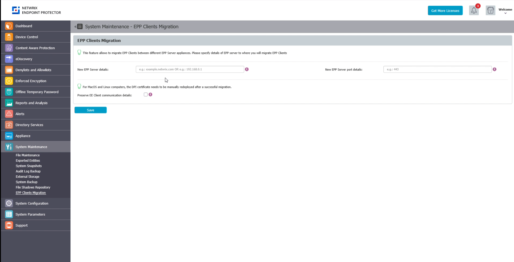
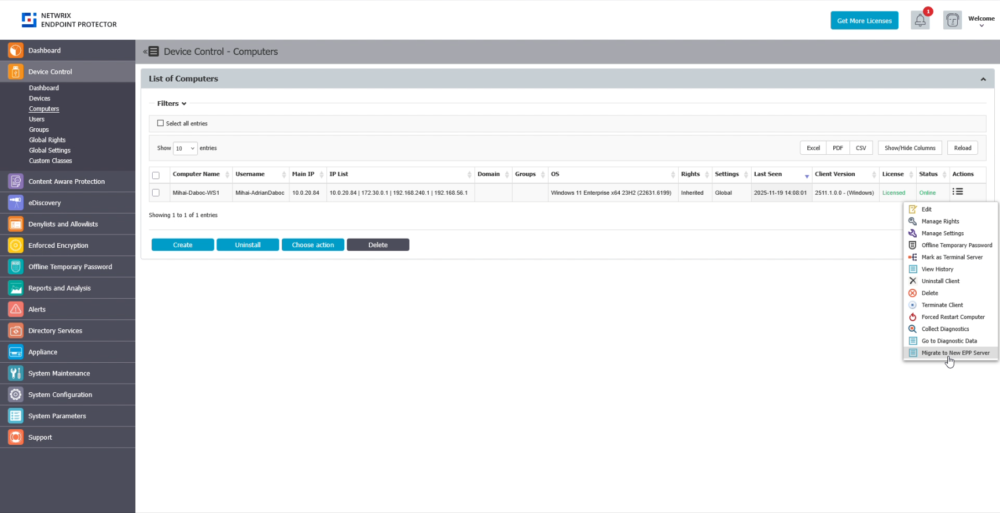

# EPP Clients Migration

This section provides a complete overview of the EPP Clients Migration settings. From this page, you can set new global migration settings by specifying the details of the new EPP Server FQDN/IP and port. You can then trigger migration for individual computers from the computer management page, where you can assign individual computers or groups of computers to the new server. Once triggered, EPP Clients begin the migration process to the target server. If the migration attempt fails, EPP activates the existing failover procedure. EPP logs all transactions for tracking and auditing.

:::note
Only EPP Client 2511.x.x.x and higher are available for the migration operation. Support for the Enforced Encryption (EE) Client will be added in a future release.
:::

:::note
This feature requires EPP Server 2601 or later. It can't be used to migrate clients between EPP Server 5.9.4.2 and image-based releases earlier than 2601, such as 2510.
:::

## Configuring the **EPP Clients Migration** page

1.  Go to **System Maintenance -\>EPP Clients migration** page
2.  Add **New EPP Server** details. Here, you can specify the domain (eg. example.netwrix.com) or IP address (eg. 192.168.0.2) of the new target EPP server
3.  Add the **New EPP Port** details. Here you can specify Server - Client communication port (eg. 443) of new target EPP server

Optionally, preserve EE Client communication details. When enabled, this option preserves existing EE communication details and doesn't migrate the EE client to the new EPP server. This is useful for complex migration plans and edge cases.

:::note
For MacOS and Linux computers, you must manually redeploy the DPI certificate after a successful migration.
:::

4.  **Save** the configuration

## Migrating Computers to the New EPP Server

1.  Go to **Device Control -\> Computers**
2.  For the computers you want to migrate, go to **Actions/Migrate to New EPP Server**. This sends the selected computers instructions to re-register with the new EPP Server.
3.  After the EPP Client receives instructions in the next server communication cycle, migration begins.

:::note
On the EPP Client side, when the EPP Client receives new EPP Server details, the registration procedure starts.

If the migration process is successful, EPP drops the previous server connection and creates a successful log entry on the client side and a server admin action log report. Migration for the EE client can also begin as a second step, if the settings indicate that operation.

If the migration process fails, EPP keeps the previous server connection and creates a failure log entry on the client side and a server admin action log report. Migration for the EE client will not begin and the process stops.
:::
