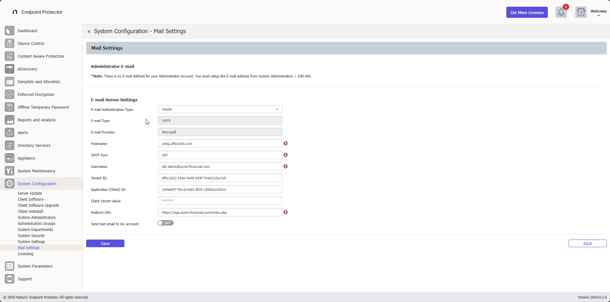

# Mail Settings

From this section, you can configure the email server settings that Endpoint Protector uses to send notifications, alerts, and test emails.

## E-mail Authorization Required

When **OAuth** is selected as the E-mail Authentication Type, authorization is required to complete the email setup. Click **Sign In** to grant Endpoint Protector access to send emails on your behalf.

## Administrator E-mail

The test email is sent to the address configured for your administrator account. If no email address is set, the message *"There is no e-mail defined for your Administrator Account. You must setup the e-mail address from System Administrators > Edit info"* is displayed.

To set an email address, go to **System Configuration** > **System Administrators** and select **Edit info**.

## E-mail Server Settings

Configure the email server that Endpoint Protector uses to send notifications and alerts.

:::note
An active Internet connection is required to use this feature.
:::

### E-mail Authentication Type

Use the **E-mail Authentication Type** dropdown to select how Endpoint Protector authenticates with the email server:

- **Basic** — standard username and password authentication. Supports native and SMTP email types, with TLS 1.3.
- **OAuth** — OAuth 2.0 authentication for Microsoft Exchange Online. Use this option to comply with Microsoft's deprecation of Basic Auth for SMTP AUTH.

### Basic authentication

When **Basic** is selected, configure the following fields:

- E-mail Type — select **Native** or **SMTP**
- Hostname
- SMTP Port
- Username
- Password

### OAuth authentication

When **OAuth** is selected, configure the following fields:

- **E-mail Type** — SMTP (read-only)
- **E-mail Provider** — Microsoft (read-only)
- **Hostname** — recommended: `smtp.office365.com`
- **SMTP Port** — recommended: `587`
- **Username**
- **Tenant ID**
- **Application (Client) ID**
- **Client Secret Value**
- **Redirect URI** — must match the redirect URI registered in your Microsoft Azure application

After filling in all fields, click **Sign In** to complete OAuth authorization.

:::note
The redirect URI saved in Mail Settings must exactly match the redirect URI registered in your Microsoft Azure application.
:::

### Microsoft Azure prerequisites

OAuth is supported for Microsoft Exchange Online. Your subscription must be one of the following:

- Microsoft 365 Business Basic, Standard, or Premium
- Office 365 E1, E3, or E5
- Microsoft 365 E3 or E5
- Exchange Online Plan 1 or 2

**Step 1 –** In the Microsoft Admin Center, go to **Users** > **Active Users**, select the user, and then go to **Mail** > **Manage email apps**. Enable **Authenticated SMTP**.

**Step 2 –** In Microsoft Azure, go to your app **Overview** > **Manage** > **Redirect URIs**. Click **Add a platform**, select **Web**, and enter the redirect URI (for example, `https://192.168.0.2/index.php`).

**Step 3 –** Go to **Client Credentials** > **Client Secrets**. Create a new client secret and copy the value.

**Step 4 –** Go to **API Permissions** > **Add a permission** > **Microsoft Graph** > **Delegated Permissions**. Select **SMTP.Send** and **offline_access**, then click **Grant admin consent** for the selected permissions.

## Mail Server Logs

From the **Mail Server Logs** tab you can review the errors captured when Endpoint Protector tries to send a message through the configured email server. Use this view to troubleshoot delivery failures directly from the UI instead of opening a shell on the appliance.

Access the logs from **System Configuration** > **Mail Settings** > **Mail Server Logs** tab.

### Log columns

| Column | Description |
|---|---|
| Authentication Type | Whether the send attempt used **Basic** or **OAuth** authentication |
| Status | Status of the captured event (currently `error` for all entries) |
| Log Message | Human-readable error, including the SMTP return code or OAuth error code reported by the server |
| Registered at | Server timestamp when the error was captured |
| Mail Settings | Click the row to expand and review the mail server configuration in effect at the time of the error |

### What gets logged

The tab captures the following error categories when encountered during a send attempt:

- **DNS / hostname resolution failures** — for example, *Could not resolve hostname `smtp.office365.com`*
- **Connection timeouts** — for example, *Connection timed out after 30 seconds while connecting to `smtp.office365.com:587`*
- **TLS/SSL handshake failures** — for example, *TLS handshake failed - peer certificate validation error*
- **SMTP server return codes** — including authentication failures (`535`), invalid recipients (`550`), service throttling (`421`), and policy rejections (`554`)
- **OAuth errors** — Microsoft Azure error codes such as `AADSTS50011` (redirect URI mismatch), `AADSTS700082` (refresh token expired), and `AADSTS7000215` (invalid client secret)

### Row details

Click any row to expand it and review the **Mail Settings** snapshot that was active at the time of the error. The snapshot includes:

- **Basic** entries — Hostname, SMTP Port, Username, Encryption Type
- **OAuth** entries — Hostname, SMTP Port, Username, Tenant ID, Application (Client) ID, Redirect URI

:::note
The Client Secret and the OAuth access and refresh tokens are never written to the logs.
:::

### Supplemental log files

Errors are also written to log files on the appliance for additional context and for cases not captured by the UI:

| Scenario | Log file |
|---|---|
| OAuth errors and SMTP errors over SSL/TLS | `/var/eppfiles/epp_logger/epp_mail.log` |
| Basic authentication using SMTP with TLS 1.3 | `/var/log/mail.log` |

:::note
Basic authentication errors that occur over SMTP with TLS 1.3 are written only to `/var/log/mail.log` and are not shown in the Mail Server Logs tab. To review those errors, open the file directly on the appliance.
:::

## UI messages

The following messages are displayed during email configuration and testing:

| Situation | Message |
|---|---|
| Test email sent successfully | A test e-mail was sent to `<address>` |
| No administrator email configured | There is no e-mail defined for your Administrator Account. You must setup the e-mail address from System Administrators > Edit info |
| Test email failed to send | Failed to send the test e-mail! Please verify if the E-mail Server Settings are correct! |
| OAuth authorization failed | Email authorization failed! Please check the provided credentials and try again! |
| Settings saved successfully | Changes have been saved! |
| OAuth authorization completed | Your email has been verified. Authorization complete! |
| Error saving settings | Cannot execute command! An error occurred! |
