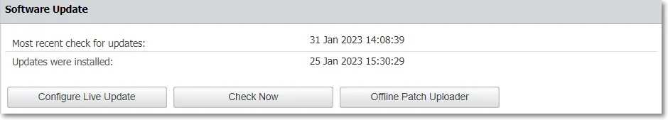
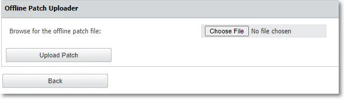
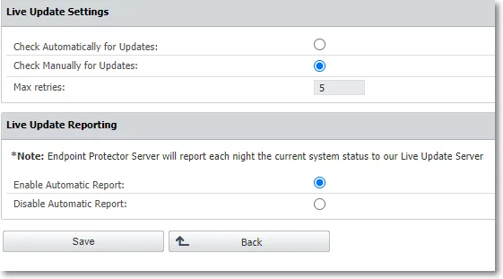
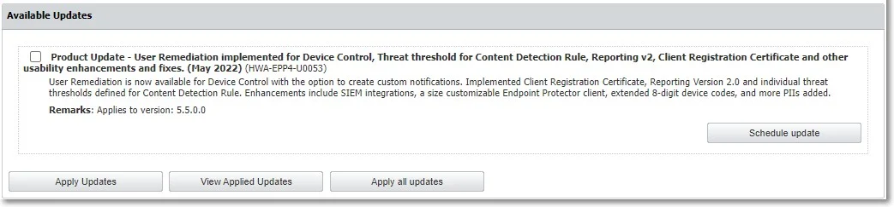
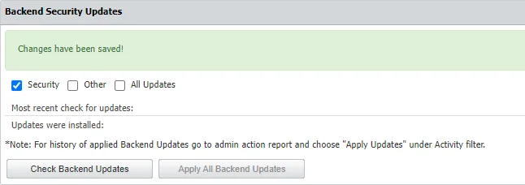
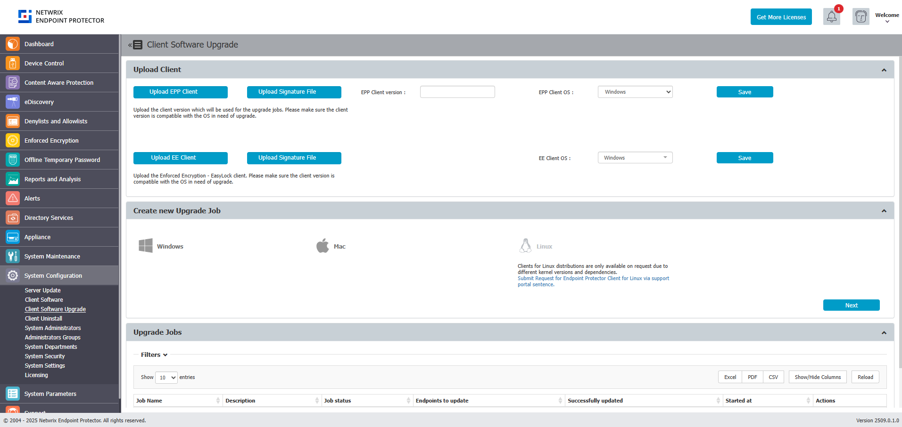
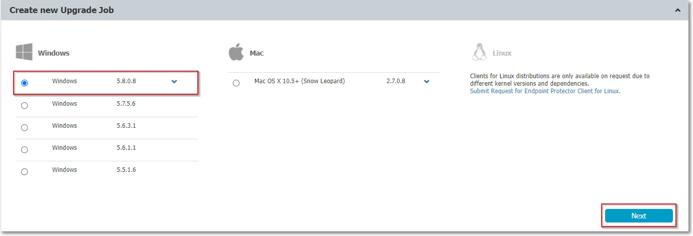
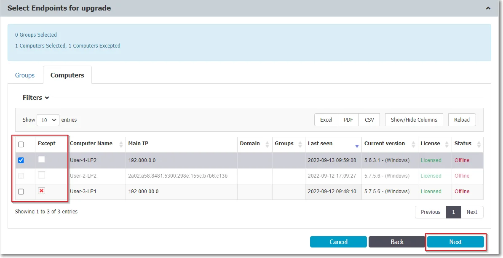
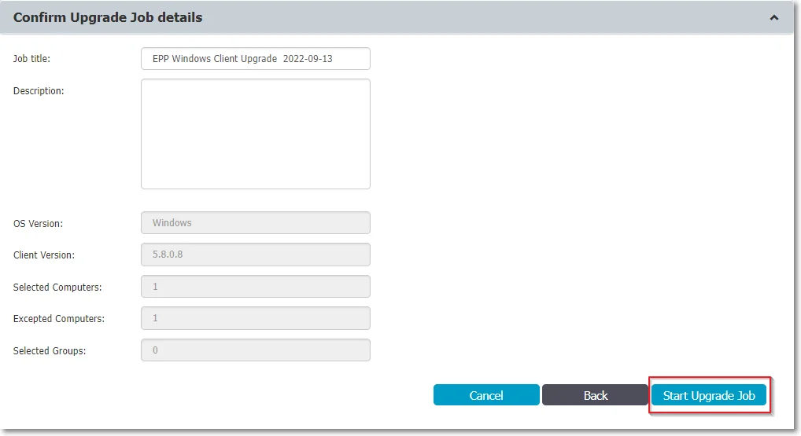
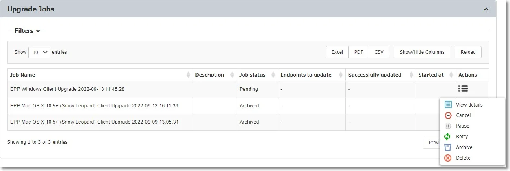

# System Configuration

This section includes essential elements such as Endpoint Protector Clients, Licensing, and
advanced configurations. These settings are critical for maintaining the system's performance,
stability, and compliance, as they directly influence both the operational efficiency and
reliability of the Endpoint Protector solution.

## Server Update

From this section, you can check and apply the latest security and Endpoint Protector Server
updates.

### Software Update

Starting with the EPP 5.9.4.2 release, EPP server patches are offered only as Offline Patch files. Use the Offline Patch upload option to select the patch files from your computer and install them to update Endpoint Protector to the latest version.

Beginning with EPP Server version 2509, all patches are delivered as cumulative updates, bringing your server directly to the latest version regardless of your current patch level.

:::note
Download the latest offline patches from the Netwrix My Products portal:
[Netwrix Customer Portal](https://www.netwrix.com/sign_in.html?rf=my_products.html).
:::
Click on the "Offline Patch Upload" button to begin the EPP Server patching procedure, and select the downloaded patch file.

:::note
Customers using environments with version 5.9.4.2 or older should familiarize themselves with the [EPP Server 2509 release announcement](https://community.netwrix.com/t/major-version-announcement-endpoint-protector-server-version-2509/114025) and the associated [migration procedure for self hosted (on premises) customers](https://community.netwrix.com/t/on-premises-migration-procedures-for-endpoint-protector-server-v2509/114021).
:::

>**This functionality and section have been removed starting with EPP Server version 2509. It is retained in the User Manual solely as guidance for customers using older server versions, until limited supportability expires.**  
>Click **Configure Live Update** to select manual or automatic live updates check, the number of
>retries, and manage the Automatic Reporting to the LiveUpdate Server.
>
>
>Click **Check Now** to search for the Endpoint Protector Server updates displayed in the Available
>Updates section. You can select and install an update with **Apply Updates**, or all updates with
>**Apply all updates**. To view the latest installed updates, click **View Applied Updates**.
>
>You can also schedule an update. Select an entry from the available updates, click **Schedule
>update** and then use the calendar to select the date and confirm your selection.
>
>
>
>Use the Offline Patch upload option to select the offline patches from your computer and successively
>install them to the latest Endpoint Protector version.
>
>:::note
>To request the Offline Patch, submit a support ticket through the
>[Netwrix Customer Portal](https://www.netwrix.com/sign_in.html?rf=my_products.html).
>:::
>
>
>
>
>:::warning
>Before upgrading your Endpoint Protector server to the 5.7.0.0 server version from a
>pre-5206 version and adjacent OS image, you need to enable database partitions. For assistance,
>submit a support ticket through the
>[Netwrix Customer Portal](https://www.netwrix.com/sign_in.html?rf=my_products.html).
>:::

### Security Updates

You can use this section to check and apply different types of security updates, view information on
recent updates checked or installed, and a list of updates available.

:::note
The security update options will only be available for customer-hosted instances (e.g.
AWS, Goggle, etc.) with the exception for Operating System and Kernel upgrades.
:::

:::warning
Netwrix does not allow on-premise (self-hosted) customers to perform backend security updates by any method other than the web UI. Any violation of this rule is outside of Netwrix support and may cause EPP Server malfunction.
:::

:::note
Updates are not tested beforehand but are pulled from the official Linux repository.
:::

To ensure the updates will not harm the system, follow these actions:

- test the updates in a test environment first
- make a VM snapshot
- make a system backup from the System Maintenance, the System Backup v2 section

Select one of the security updates type available and then click **Check Updates**:

- Security – this will update all security-related updates of installed packages (Critical and High)
- Other – this will download and apply any update available to 3rd party libraries, kernel, OS
  packages and MySQL database
- All Updates – this will download and apply Informational and Optional/Unclassified updates

If there are updates available, click **Apply Updates**.

:::note
For history of applied Backend Updates go to admin action report and choose **Apply
Updates** under Activity filter.
:::

:::note
Due to patching nature, some updates may automatically restart the Endpoint Protector
server or other sub-services in the background
:::

## Client Software

From this section, you can download the Endpoint Protector and Enforced Encryption Clients corresponding to
your operating system.

When using a custom WebUI port, please contact
[Netwrix Support](https://www.netwrix.com/support.html) to assist in configuring the Nginx
configuration file.

:::warning
Only the latest Endpoint Protector and Enforced Encryption Clients are available for download.
:::

When installing, you can simply click Generate to download a client with the configuration in the UI or
copy the following details from this screen using the Copy button:

- Endpoint Protector Server IP
- Endpoint Protector Server port
- Deprtment Code

:::note
Starting with the current release - 2509.0.1.0 - Endpoint Protector Client versions are displayed in the format XXXX.X.X.X on endpoints.
:::

For more client install options, please refer to the dedicated article on [Agent Installation Options](/docs/endpointprotector/admin/agent.md)

## Client Software Upgrade

From this section, you can upload the latest clients previously downloaded from the **Client Software** section in order to upgrade
the Endpoint Protector & Enforced Encryption Client and manage the upgraded jobs. The Client Software Upgrade feature is only available
for Windows and macOS Clients.To upgrade your Linux Clients, submit a request using the [online form](https://www.endpointprotector.com/linux).

:::note
When updating your operating system to the latest macOS Ventura, eppclient.log and
eppsslsplit.log will be deleted from private/var/log.
:::

:::warning
The feature is not compatible for Endpoint Protector instances that are running on
32-bit versions of Windows.
:::

:::note
Starting with release 2509.0.1.0 - Endpoint Protector Client versions are displayed in the format XXXX.X.X.X on endpoints.
:::

### Create New Upgrade Job

To upgrade your Endpoint Protector Client, you need to create a new upgrade job, following these
steps:

**Step 1 –** Select the OS version from the drop-down list and then click **Next**.

**Step 2 –** Select the groups and/or computers to perform or exclude from the upgrade and then
click **Next**. You will view a summary of your selection above the table with endpoints.

:::note
Only computers that use the operating system you previously selected will be upgraded. If
you selected a group that has an endpoint using a different operating system, it will not be
upgraded. If you selected a mixed group, with both computers and users, only the computers will be
upgraded.
:::

**Step 3 –** Edit the default job title, add a description and confirm the upgrade job details by
clicking **Start Upgrade job**. You will view the upgrade as an entry on the Upgrade jobs section.

:::note
The upgrade process for the Endpoint Protector Client is impacted by a dedicated cron.
Running every 5 minutes, the cron sets the upgrade process status to Pending and every 15 minutes
checks and updates process status to Completed or Completed with failures.
:::

### Manage Upgrade Jobs

From this section you can view the upgraded jobs and use the Actions column to view job details,
cancel, pause, retry, archive or delete an entry on the list.

To continue upgrading canceled Client Upgrade jobs, use the **Retry** option from the Actions
column.

:::note
If you deleted or archived a Client Upgrade job, then the endpoints become available for
selection in other jobs.
:::

## Client Uninstall

From this section, you can perform a remote uninstall of the Endpoint Protector Client. The
computers will receive the uninstall command at the same time they receive the next set of commands
from the server.

If the computer is offline, it will receive the uninstall command the first time it will come online.
When the uninstall button is pressed the computer(s) will be grayed out until the action will be
performed.

The uninstall command can be canceled if it was not already executed.

:::note
If the server and Endpoint Protector client can't communicate due to missing server
certification validation (when the certification validation setting is enabled), uninstall commands
can't be executed from the Endpoint Protector Server. In such cases, if you're unable to manually
install the certificate on the Endpoint Protector Client computer, you can temporarily disable the
certification validation setting on the Endpoint Protector Server and synchronize the Endpoint
Protector Client to retrieve an uninstall command.

:::
