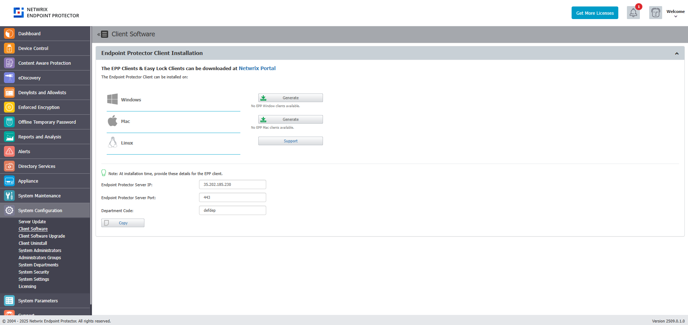

# System Configuration

This section includes essential elements such as Endpoint Protector Clients, Licensing, and
advanced configurations. These settings are critical for maintaining the system's performance,
stability, and compliance, as they directly influence both the operational efficiency and
reliability of the Endpoint Protector solution.

## Client Software

From this section, you can download the Endpoint Protector and Enforced Encryption Clients corresponding to
your operating system.

When using a custom WebUI port, please contact
[Netwrix Support](https://www.netwrix.com/support.html) to assist in configuring the Nginx
configuration file.

:::warning
Only the latest Endpoint Protector and Enforced Encryption Clients are available for download.
:::

To improve the Endpoint Protector installation process, use the Endpoint Protector tool that allows
you to run installation-related actions, identify your current Linux distribution, and view Endpoint
Protector Release Notes.

Use the following commands:

- i - install
- u - uninstall
- rn - release notes
- l - distribution list

When installing, you can simply click Generate to download a client with the configuration in the UI or
copy the following details from this screen using the Copy button:

- Endpoint Protector Server IP
- Endpoint Protector Server port
- Deprtment Code

:::note
Contact Customer Support to provide the tool as well as assistance.
:::

:::note
Starting with the current release - 2509.0.1.0 - Endpoint Protector Client versions are displayed in the format XXXX.X.X.X on endpoints.
:::

### Bypass Proxy Settings

You have the ability to bypass proxy settings for all operating systems.

#### Windows and macOS

**Endpoint Protector Wizard Installer**

Select the option to **Use Manual Proxy Settings** from the Endpoint Protector Wizard installer and
then provide the following information:

- Proxy IP – IP of the proxy server
- Proxy Port – Port of the proxy
- Select the Use authentication checkbox
- Username – add proxy server username
- Password – add proxy server password

**CLI commands**

You can also apply manual proxy settings using CLI commands:

Example:

msiexec.exe /i "C:\Work\Tools\EPPClientSetup.5.7.1.5_x86_64.msi" /q REBOOT=ReallySuppress
RUNNOTIFIER=0 /log "C:\Windows\TEMP\epp-upgrade.log" WSIP="192.168.18.125"  WSPORT="8080" 
DEPT_CODE="defdep"  PROXYIP="127.0.0.1" PROXYPORT="80" AUTHUSR="user_name" AUTHPASS="password"

Where:

- PROXY_IP – IP of the proxy
- PROXY_PORT – Port of the proxy
- AUTHUSR – Username (if authentication for proxy is needed)
- AUTHPASS – Password (if authentication for proxy is needed)

You can also use CLI Commands below to install Endpoint Protector Client in specific mode of working.

- WSIP – server address
- WSPORT – server port number
- DEPT_CODE – department code
- IPV6MAPPING – IPV6 Mapping IPv4 addresses
- SUPPRESSRD – suppress FileRead/FileDelete events for NS and Removable devices
- DISABLECAP – disabling loading of CAP drivers (CAP will not work)

:::note
For macOS, please contact the Netwrix Support team to obtain the latest version of the
installer script, which allows customization of installation parameters.
:::

#### Linux

For Linux, you can only use CLI arguments in the options to bypass proxy settings.sh file. To do so,
follow these steps:

**Step 1 –** Access the installation folder, open a Terminal, and run the following command:

`cd pathToLinuxClientFolder`

**Step 2 –** To run commands as root, run the following command and type your password.

`sudo su`

**Step 3 –** Open the options.sh configuration file with the following command:

`gedit options.sh`

**Step 4 –** In the configuration file, you will view the following fields for the proxy setup:

#EPPCLIENT_HTTPS_PROXY=

#export EPPCLIENT_HTTPS_PROXY

**Step 5 –** Remove the # before each entry to apply the proxy setups.

**Step 6 –** For the first proxy setup, EPPCLIENT_HTTPS_PROXY, add the proxy server information in
the address:port:user:password format.

**Example: EPPCLIENT_HTTPS_PROXY=address:port:user:password**

**Step 7 –** Save the changes, and then run the installation without having a VPN connection:

`bash install.sh`

Additional CLI commands for Linux in specific mode:

- #EPPCLIENT_SUPRESSRW - suppress FileRead/FileDelete events for NS and Removable devices
- #EPPCLIENT_DISABLECAP - disabling loading of CAP drivers (CAP will not work)

## Client Software Upgrade

From this section, you can upload the latest clients previously downloaded from the **Client Software** section in order to upgrade
the Endpoint Protector Client and manage the upgraded jobs. The Client Software Upgrade feature is only available
for Windows and macOS Clients.To upgrade your Linux Clients, submit a request using the[online form](https://www.endpointprotector.com/linux).

:::note
When updating your operating system to the latest macOS Ventura, eppclient.log and
eppsslsplit.log will be deleted from private/var/log.
:::

:::warning
The feature is not compatible for Endpoint Protector instances that are running on
32-bit versions of Windows.
:::

:::note
Starting with the current release - 2509.0.1.0 - Endpoint Protector Client versions are displayed in the format XXXX.X.X.X on endpoints.
:::

### Create New Upgrade Job

To upgrade your Endpoint Protector Client, you need to create a new upgrade job, following these
steps:

**Step 1 –** Select the OS version from the drop-down list and then click **Next**.

**Step 2 –** Select the groups and/or computers to perform or exclude from the upgrade and then
click **Next**. You will view a summary of your selection above the table with endpoints.

:::note
Only computers that use the operating system you previously selected will be upgraded. If
you selected a group that has an endpoint using a different operating system, it will not be
upgraded. If you selected a mixed group, with both computers and users, only the computers will be
upgraded.
:::

**Step 3 –** Edit the default job title, add a description and confirm the upgrade job details by
clicking **Start Upgrade job**. You will view the upgrade as an entry on the Upgrade jobs section.

:::note
The upgrade process for the Endpoint Protector Client is impacted by a dedicated cron.
Running every 5 minutes, the cron sets the upgrade process status to Pending and every 15 minutes
checks and updates process status to Completed or Completed with failures.
:::

### Manage Upgrade Jobs

From this section you can view the upgraded jobs and use the Actions column to view job details,
cancel, pause, retry, archive or delete an entry on the list.

To continue upgrading canceled Client Upgrade jobs, use the **Retry** option from the Actions
column.

:::note
If you deleted or archived a Client Upgrade job, then the endpoints become available for
selection in other jobs.
:::

## Client Uninstall

From this section, you can perform a remote uninstall of the Endpoint Protector Client. The
computers will receive the uninstall command at the same time they receive the next set of commands
from the server.

If the computer is offline, it will receive the uninstall command the first time it will come online.
When the uninstall button is pressed the computer(s) will be grayed out until the action will be
performed.

The uninstall command can be canceled if it was not already executed.

:::note
If the server and Endpoint Protector client can't communicate due to missing server
certification validation (when the certification validation setting is enabled), uninstall commands
can't be executed from the Endpoint Protector Server. In such cases, if you're unable to manually
install the certificate on the Endpoint Protector Client computer, you can temporarily disable the
certification validation setting on the Endpoint Protector Server and synchronize the Endpoint
Protector Client to retrieve an uninstall command.

:::
