# System Configuration

This section includes essential elements such as Endpoint Protector Clients, Licensing, and
advanced configurations. These settings maintain the system's performance, stability, and
compliance, and they directly influence the operational efficiency and reliability of Endpoint
Protector.

## Server Update

From this section, you can check and apply the latest security and Endpoint Protector Server
updates.

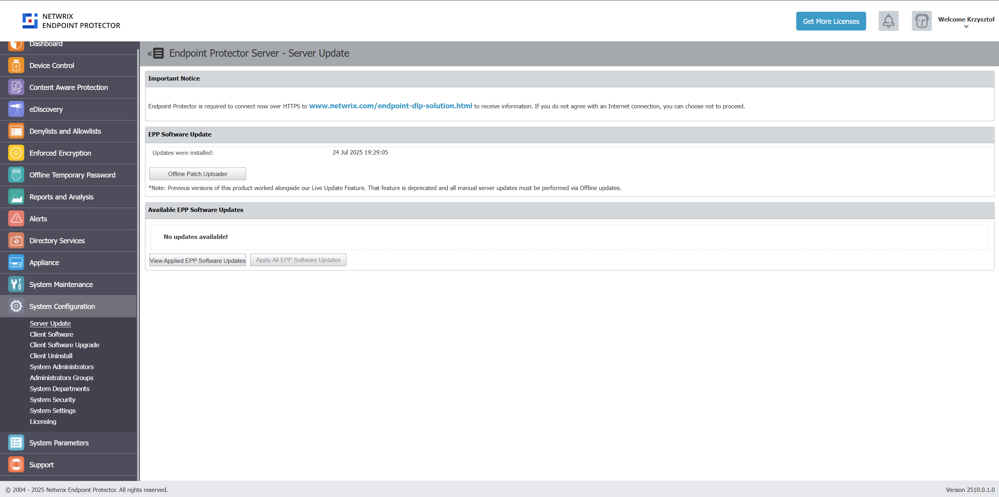

### Software Update

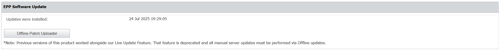

Starting with the EPP 5.9.4.2 release, Netwrix offers EPP server patches only as Offline Patch files. Use the Offline Patch upload option to select the patch files from your computer and install them to update Endpoint Protector to the latest version.

Beginning with EPP Server version 2509, all patches are cumulative updates that bring your server directly to the latest version regardless of your current patch level.

:::note
Download the latest offline patches from the Netwrix My Products portal:
[Netwrix Customer Portal](https://www.netwrix.com/sign_in.html?rf=my_products.html).
:::
Click the "Offline Patch Upload" button to begin the EPP Server patching procedure, and select the downloaded patch file.
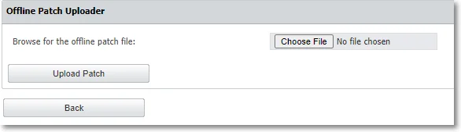

:::note
Customers running EPP Server version 5.9.4.2 or older should review the [EPP Server Migration & Upgrade Guide](/docs/endpointprotector/install/migrationprocedure/migrationguide) for the current migration path to 2608, and follow [Migrating from a Legacy 5.x Server to 2608](/docs/endpointprotector/install/migrationprocedure/migration-legacy-5x) for the on-premises migration procedure.
:::

:::note
Starting with EPP Server version 2509, EPP Server no longer offers the Live Update feature. Apply patches only through the Offline Patch upload option in the Software Update section. Customers still running a 5.x legacy appliance can find the legacy Live Update procedure in [Using the Live Update Feature on 5.x Legacy Appliances](/docs/kb/endpointprotector/deployment-and-installation/using-the-live-update-feature-on-5x-legacy-appliances).
:::

### Security Updates

Use this section to check and apply different types of security updates, view information on
recent updates checked or installed, and view a list of available updates.

:::note
The security update options are available only for customer-hosted instances (for example,
AWS, or Google), except for Operating System and Kernel upgrades.
:::

:::warning
Netwrix doesn't allow on-premise (self-hosted) customers to perform backend security updates by any method other than the web UI. Any violation of this rule is outside of Netwrix support and may cause EPP Server malfunction.
:::

:::note
Netwrix doesn't test updates beforehand. Endpoint Protector pulls them from the official Linux repository.
:::

To ensure the updates don't harm the system, take these steps:

- test the updates in a test environment first
- make a VM snapshot
- make a system backup from the System Maintenance, the System Backup v2 section

Select one of the available security update types and then click **Check Updates**:

- Security – applies all security-related updates for installed packages (Critical and High)
- Other – downloads and applies any available update for third-party libraries, the kernel, OS
  packages, and the MySQL database
- All Updates – downloads and applies Informational and Optional/Unclassified updates

If there are updates available, click **Apply Updates**.

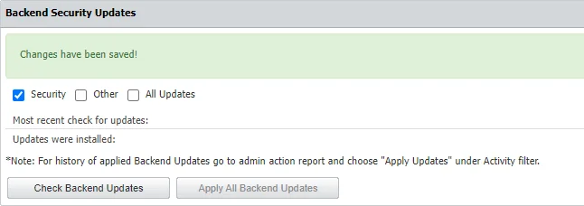

:::note
For history of applied Backend Updates go to admin action report and choose **Apply
Updates** under Activity filter.
:::

:::note
Due to patching nature, some updates may automatically restart the Endpoint Protector
server or other sub-services in the background
:::

## Client Software

From this section, you can download the Endpoint Protector and Enforced Encryption Clients corresponding to
your operating system.

If you use a custom WebUI port, contact
[Netwrix Support](https://www.netwrix.com/support.html) for help configuring the Nginx
configuration file.

:::warning
Only the latest Endpoint Protector and Enforced Encryption Clients are available for download.
:::

When installing, you can click **Generate** to download a client with the configuration in the UI or
copy the following details from this screen using the Copy button:

- Endpoint Protector Server IP
- Endpoint Protector Server port
- Department Code

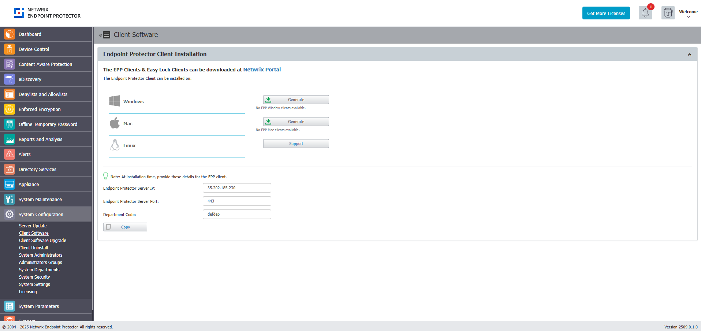

:::note
Starting with release 2509.0.1.0, endpoints display Endpoint Protector Client versions in the format XXXX.X.X.X.
:::

For more client install options, refer to the dedicated article on [Agent Installation Options](/docs/endpointprotector/admin/agent.md)

## Client Software Upgrade

From this section, you can upload the latest clients you downloaded from the **Client Software** section to upgrade
the Endpoint Protector and Enforced Encryption Client and manage the upgrade jobs. The Client Software Upgrade feature is only available
for Windows and macOS Clients. To upgrade your Linux Clients, submit a request using the [online form](https://www.endpointprotector.com/linux).

:::note
When you update your operating system to the latest macOS Ventura, macOS deletes the eppclient.log
and eppsslsplit.log files from private/var/log.
:::

:::note
The Client Software Upgrade mechanism supports Windows ARM client packages. When you upload a
combined package containing both x64 and ARM installers, the server automatically selects the
correct installer for each client's architecture during upgrade.
:::

:::warning
The feature isn't compatible with Endpoint Protector instances running on
32-bit versions of Windows.
:::

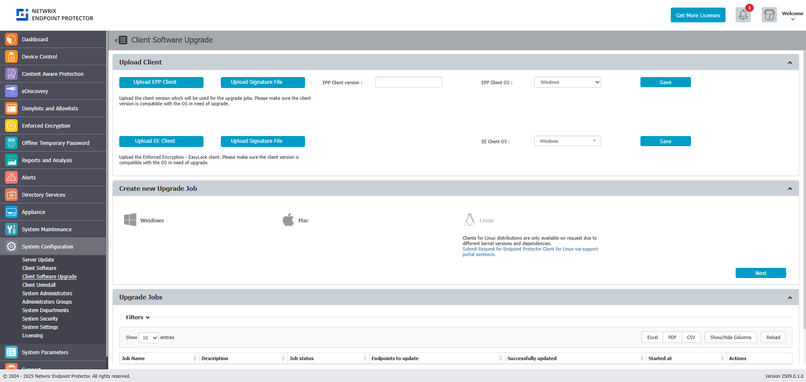

:::note
Starting with release 2509.0.1.0, endpoints display Endpoint Protector Client versions in the format XXXX.X.X.X.
:::

### Create New Upgrade Job

To upgrade your Endpoint Protector Client, create a new upgrade job by following these
steps:

**Step 1 –** Select the OS version from the dropdown list and then click **Next**.

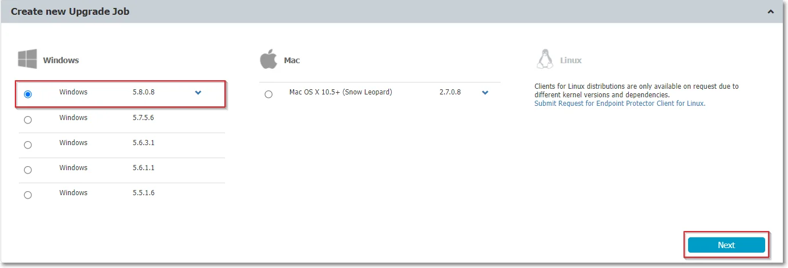

**Step 2 –** Select the groups and/or computers to perform or exclude from the upgrade and then
click **Next**. A summary of your selection appears at the top of the table.

:::note
Endpoint Protector upgrades only computers that use the operating system you selected. If
you selected a group that has an endpoint using a different operating system, Endpoint Protector
doesn't upgrade that endpoint. If you selected a mixed group, with both computers and users,
Endpoint Protector upgrades only the computers.
:::

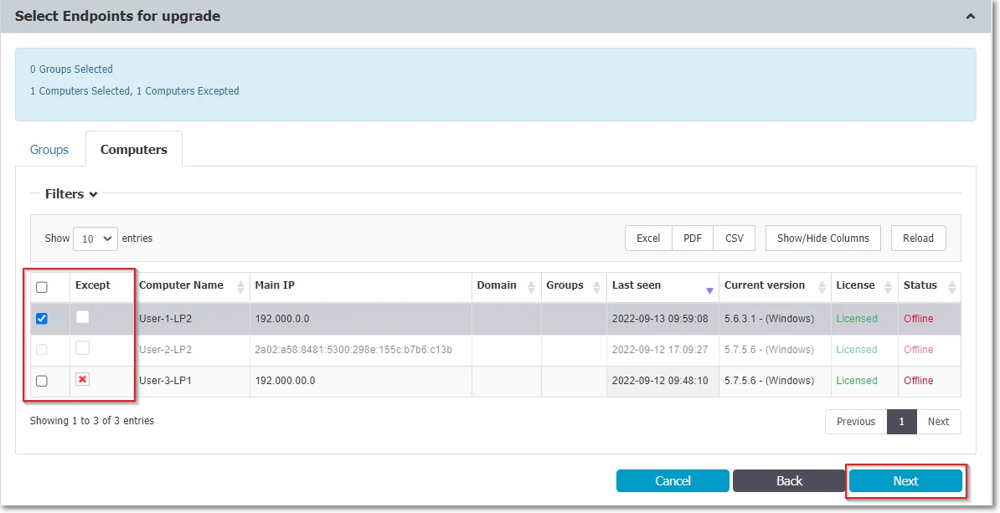

**Step 3 –** Edit the default job title, add a description and confirm the upgrade job details by
clicking **Start Upgrade job**. The upgrade appears as an entry in the Upgrade jobs section.

:::note
A dedicated cron drives the upgrade process for the Endpoint Protector Client.
Running every 5 minutes, the cron sets the upgrade process status to Pending and every 15 minutes
checks and updates process status to Completed or Completed with failures.
:::

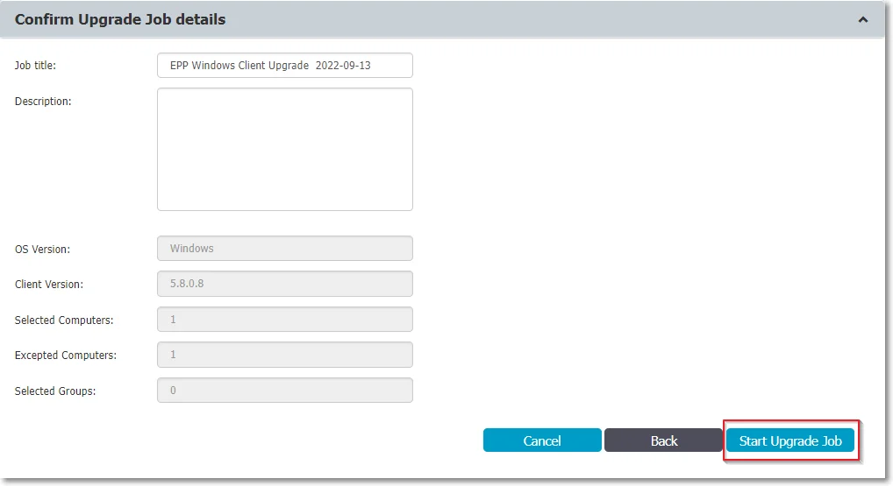

### Manage Upgrade Jobs

From this section you can view the upgrade jobs and use the Actions column to view job details,
cancel, pause, retry, archive, or delete an entry on the list.

To continue upgrading canceled Client Upgrade jobs, use the **Retry** option from the Actions
column.

:::note
If you deleted or archived a Client Upgrade job, then the endpoints become available for
selection in other jobs.
:::

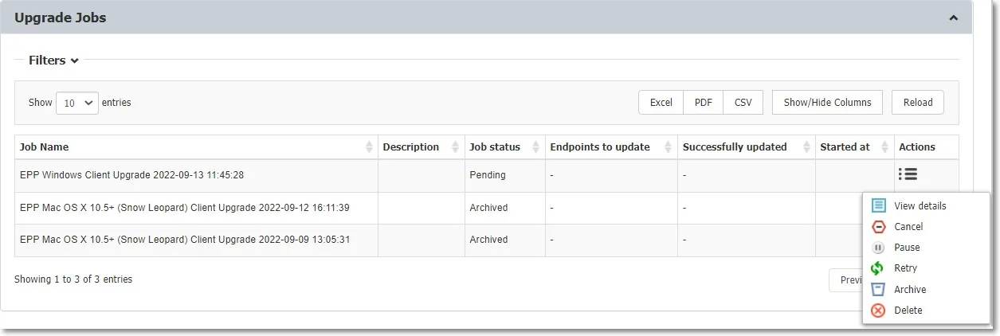

## Client Uninstall

From this section, you can perform a remote uninstall of the Endpoint Protector Client. The
computers receive the uninstall command with the next set of commands from the server.

If the computer is offline, it receives the uninstall command the first time it comes online.
When you press the uninstall button, the computers appear grayed out until the action completes.

You can cancel the uninstall command if it hasn't already run.

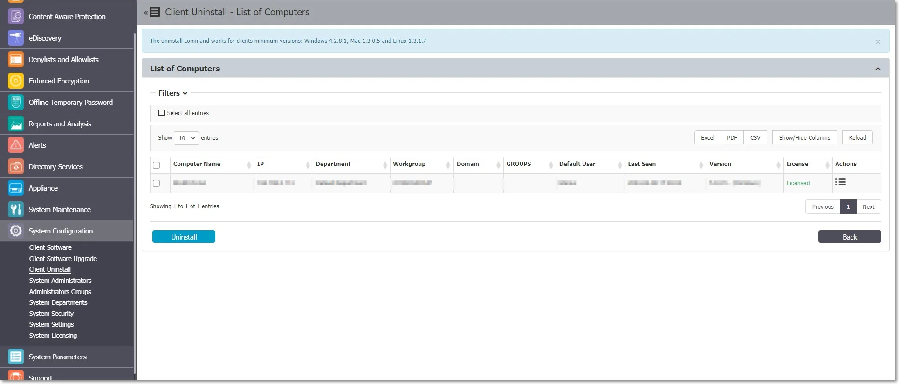

:::note
If the server and Endpoint Protector client can't communicate due to missing server
certification validation (when you enable the certification validation setting), you can't run
uninstall commands from the Endpoint Protector Server. In such cases, if you can't manually
install the certificate on the Endpoint Protector Client computer, you can temporarily disable the
certification validation setting on the Endpoint Protector Server and synchronize the Endpoint
Protector Client to retrieve an uninstall command.

:::
