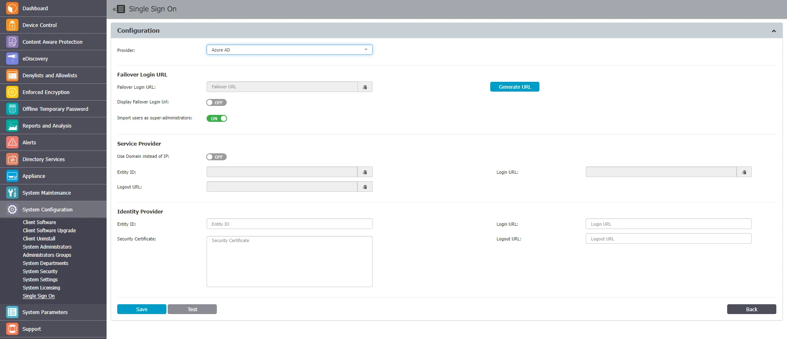

# Single Sign On

Single Sign On (SSO) allows you to log in the Endpoint Protector Server with Azure AD and OKTA. This
integration simplifies authentication, enhancing security and user convenience by enabling access
with existing organizational credentials.

The Single Sign On section includes the following:

- Provider – Select a provider to start the configuration
- Failover Login URL – Enter or generate a link to a page where login locally with Endpoint
  Protector Super Administrator is allowed. This will bypass Azure Single Sign On login in the
  situation when it stops working. To view the URL, enable the Display Failover Login URL setting.

:::note
You can provide Super Administrator status to all imported users by enabling the Import
users as super administrators setting.
:::

- Service Provider represents the identity of the Endpoint Protector Server. The information is
  required when configuring the Endpoint Protector application in Azure. Select if the login is based
  on IP or Domain, provide an Entity ID as well as Login and Logout URL.
- Identity Provider represents Azure side. It includes the fields where data generated from Azure
  should be filed so you will be able to login to Endpoint Protector Server.
