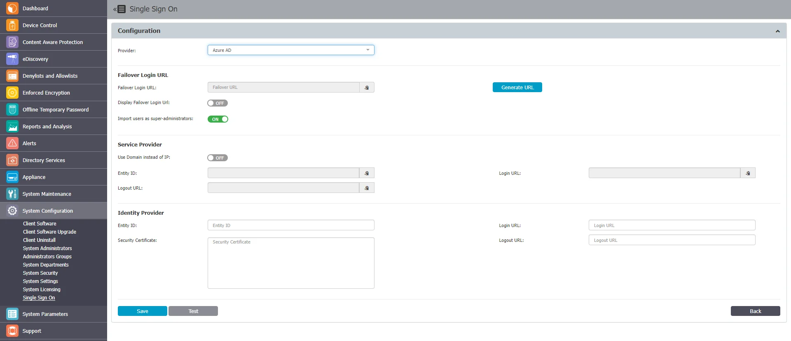

# Single Sign On

Single Sign On (SSO) simplifies authentication, enhancing security and user convenience by enabling access to the Endpoint Protector Server with Azure AD and OKTA using existing organizational credentials.

The Single Sign On section includes the following:

- Provider – Select a provider to start the configuration
- Failover Login URL – Enter or generate a link to a page where the Super Administrator can log in
  locally. This bypasses Azure Single Sign On login if it stops working. To view the URL, enable the
  Display Failover Login URL setting.

:::note
You can provide Super Administrator status to all imported users by enabling the Import
users as super administrators setting.
:::

- Service Provider represents the identity of the Endpoint Protector Server. The information is
  required when configuring the Endpoint Protector application in Azure. Select if the login is based
  on IP or Domain, provide an Entity ID as well as Login and Logout URL.
- Identity Provider represents Azure side. It includes the fields where you paste the data that Azure
  generates so you can log in to the Endpoint Protector Server.
