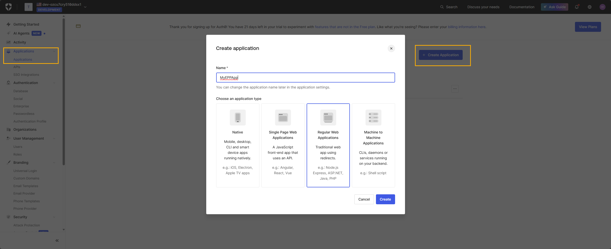
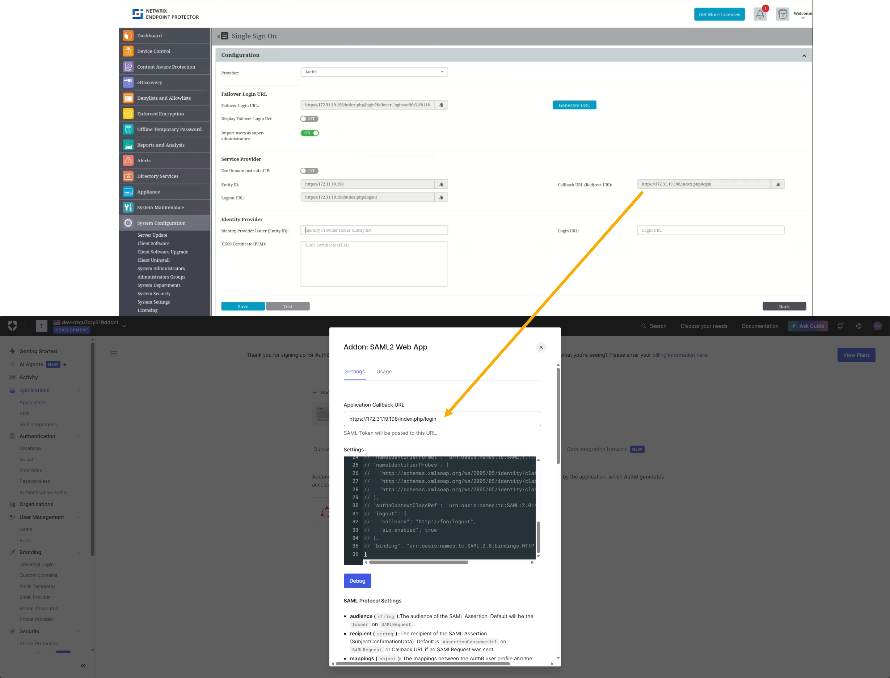
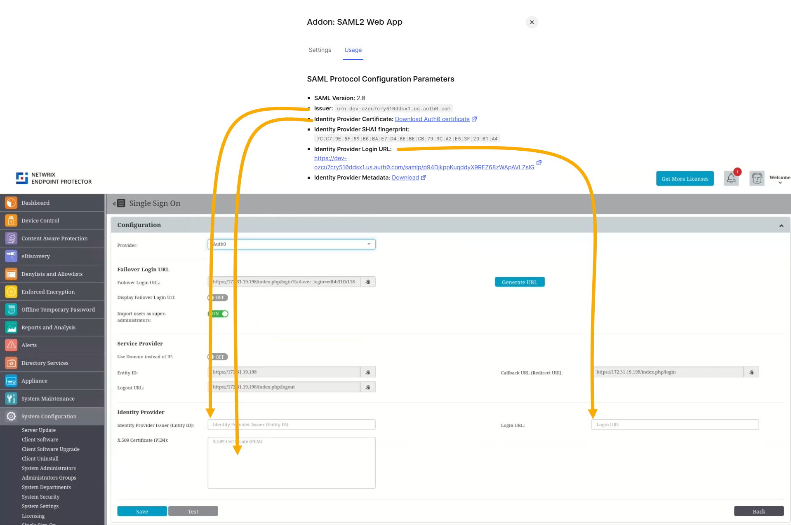
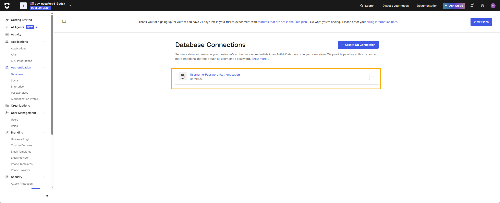
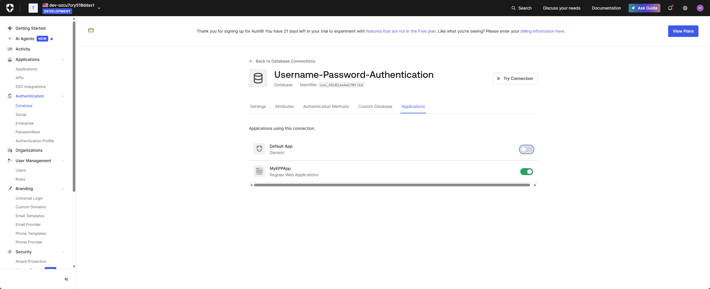
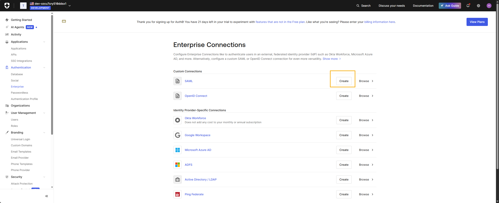
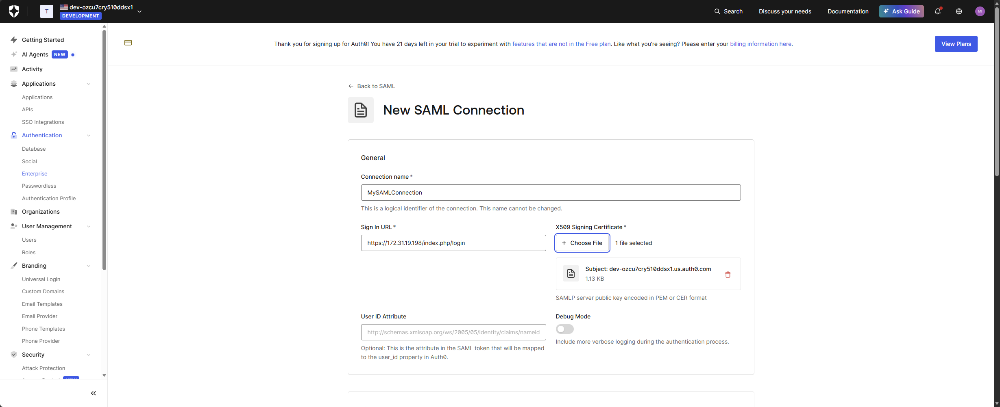
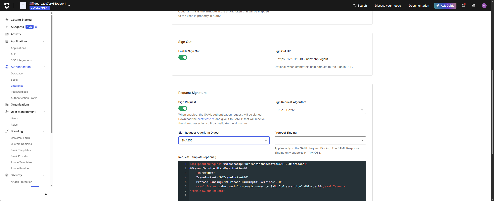
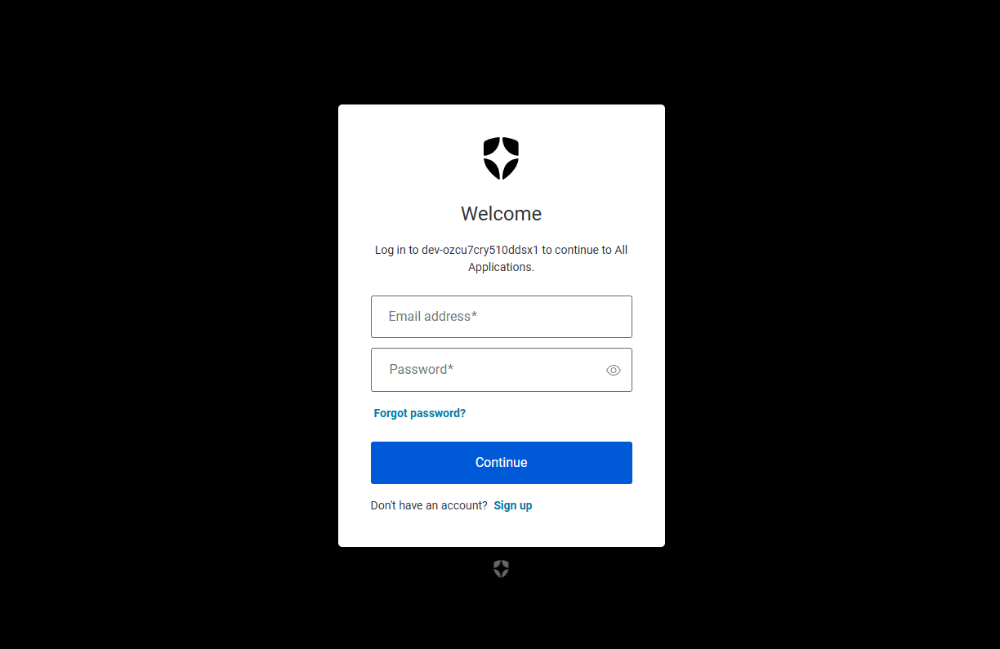

# Single Sign On (SSO) Configuration with Auth0

Single Sign On (SSO) is a powerful authentication process that enhances security and improves user
experience by allowing users to access multiple applications with a single set of login credentials.
In this guide, we focus on configuring SSO using Auth0, a leading identity management service, to
streamline user access and secure your system effectively.

## Configuring SSO with Auth0

Configuring Single Sign-On with Auth0 involves several key steps that integrate your server with
Auth0’s authentication framework. Begin by activating SSO within your system’s configuration
settings, selecting a failover user, and preparing for provider selection. This section will guide
you through the precise steps required to establish a secure and efficient SSO connection, including
application integration in Auth0, SAML settings configuration, and the necessary data synchronization
between your server and Auth0. Follow the steps below to ensure a successful setup.

**Step 1 –** To activate Single Sign-On, navigate to **System Configuration** > **System
Settings** > **Single Sign-On**. Once activated, select a Failover Login User from the drop-down
menu. The Root user is selected by default.

After completing the above steps, a Single Sign-On subsection will appear in the System
Configuration section.

**Step 2 –** Select the **Provider** in order for Single Sign On subsection to be displayed.

**Step 3 –** Create an Application in Auth0

1.  Log in to the Auth0 Dashboard.
2.  Navigate to **Applications → Applications.**
3.  Click **Create Application.**
4.  Enter a name such as EndpointProtector or MyEPPApp.
5.  Select **Regular Web Application**.
6.  Click **Create**.
7.  Go to **Login Experience** tab and make sure that for the Types of Users, there is Business Users checked, with either “prompt for Credentials” or “Prompt for Organization” as options.

Note: “Prompt for Organization” will require you to have an organization created with your connections enabled for it.

This application will represent Endpoint Protector on the Auth0 side.

**Step 4 –** Enable the **SAML2 Web App** add-on

1.  Open the application you created for Endpoint Protector.
2.  Go to the Add-ons tab.
3.  Enable the **SAML2 Web App** add-on.
4.  Click **Settings** on the SAML2 Web App tile.
5.  Add **the Callback URL** displayed in Endpoint Protector at Step 2 when opening the Auth0 provider settings.
6.  Scroll down and click **Enable** to activate the add-on for the application.

**Step 5 –** Obtain SAML Values from Auth0

You now need three pieces of information from Auth0 to complete the configuration in Endpoint Protector:

•Issuer (Identity Provider Issuer)

•Identity Provider Login URL (SAML 2.0 Endpoint / Login URL)

•X.509 certificate

To obtain them, after enabling the add-on go to the Usage tab to copy these details and paste them to EPP.

1.  **Issuer** matches the Entity ID from Endpoint Protector.
2.  **Identity Provider Login URL** matches the Login URL from Endpoint Protector.
3.  **Identity Provider Certificate** matches the X.509 Certificate from Endpoint Protector. Click to download the certificate file then open it in a text editor and copy its contents.

Click **Save** in Endpoint Protector at the end to save the configuration.

**Step 6 –** Enable the Connection for the Endpoint Protector Application

Go back to Auth0. Auth0 controls which applications may use a given Connection. To allow users to log in to Endpoint Protector through Auth0:

1.  In the Auth0 Dashboard, navigate to **Authentication → Database**
2.  Select the connection you want to use (for example, **Username-Password-Authentication**).
3.  Open the **Applications** tab.
4.  Enable the toggle for your Endpoint Protector application.

All users who authenticate via this connection and have matching accounts in Endpoint Protector will be able to use SSO.

Note
For further restriction, use Endpoint Protector’s own user and role management or Auth0 features such as Roles and Organizations. This guide covers only the basic SAML configuration.

**Step 7 –** (Optional) Create a SAML Connection under Authentication → Enterprise

If you want Auth0 to act as a broker IdP and authenticate users through an external SAML Identity Provider (for example, Azure AD, Okta, ADFS, Ping, Shibboleth, etc.), you must create an Enterprise SAML Connection.

This step is only needed if Auth0 is not the original IdP, and instead you want EPP → Auth0 → external IdP.

To create a SAML Enterprise connection:

1.  Go to **Authentication → Enterprise** in the Auth0 Dashboard.
2.  Click **+ Create** Connection.

3.  Select **SAML** from the list of enterprise providers.
4.  Enter a **Connection Name** (for example, company-saml-idp).
5.  Enter the **Sign In URL**. You can use the CallBack URL from Step 4
6.  Upload the **Signing Certificate** downloaded from the application creation at Step 5

7.  Configure additional fields as required:
    -   **Sign Request** – SHA 256
    -   **Sign Out URL** – taken from the Logout URL in Endpoint Protector

8.  Click **Create**.
9.  After saving, go to the **Applications** tab inside this connection.
10. Enable the toggle for the Endpoint Protector application to allow users to authenticate through this SAML connection.

This step allows Auth0 to accept SAML assertions from another IdP and pass them to Endpoint Protector.

**Step 9 –** Test the Configuration

1.  In Endpoint Protector, click Test to validate the configuration.
2.  You should be redirected to Auth0 for authentication.
3.  After entering valid credentials, you should be redirected back to Endpoint Protector and logged in as the corresponding user or redirected to the respective IdP if an enterprise connection is active on Auth0.

**Disclaimer**

The integration steps described in this document are based on the Auth0 platform and user interface as available at the time of writing. Auth0 is a third-party service that is fully independent from Netwrix. Because Auth0 may update or modify its features, user interface, configuration flow, roadmap, service ownership, or platform behavior at any time, Netwrix cannot guarantee that these instructions will remain accurate in future versions of Auth0.

Netwrix is not responsible for any changes made by Auth0 to its portal, APIs, configuration settings, authentication methods, or service availability. If discrepancies arise between this document and the current Auth0 platform, please refer to Auth0’s official documentation or contact Auth0 Support for the most up-to-date guidance.

Netwrix continues to ensure that Endpoint Protector adheres to SAML 2.0 standards and remains compatible with identity providers that follow these protocols.
