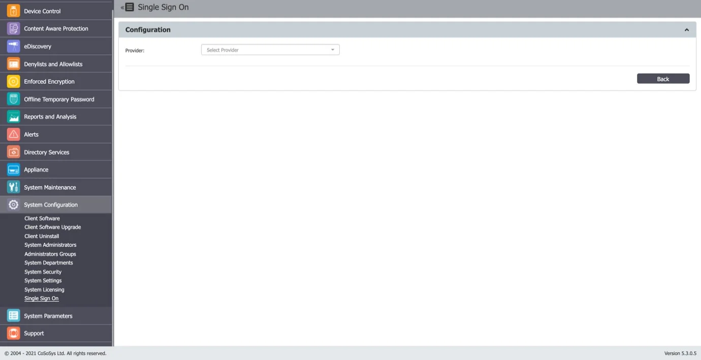

# Single Sign On (SSO) Configuration with Okta

Single Sign On (SSO) is a powerful authentication process that enhances security and improves user
experience by allowing users to access multiple applications with a single set of login credentials.
In this guide, we focus on configuring SSO using Okta, a leading identity management service, to
streamline user access and secure your system effectively.

## Configuring SSO with Okta

Configuring Single Sign-On with Okta involves several key steps that integrate your server with
Okta’s authentication framework. Begin by activating SSO within your system’s configuration
settings, selecting a failover user, and preparing for provider selection. This section will guide
you through the precise steps required to establish a secure and efficient SSO connection, including
application integration in Okta, SAML settings configuration, and the necessary data synchronization
between your server and Okta. Follow the steps below to ensure a successful setup.

**Step 1 –** To activate Single Sign-On, navigate to **System Configuration** > **System
Settings** > **Single Sign-On**. Once activated, select a Failover Login User from the drop-down
menu. The Root user is selected by default.

After completing the above steps, a Single Sign-On subsection will appear in the System
Configuration section.

**Step 2 –** Select the **Provider** in order for Single Sign On subsection to be displayed.

**Step 3 –** Go to yourcompany.okta.com, select **Applications**, and then click **Create App
Integration**.

**Step 4 –** On the next screen, select **SAML 2.0** and click **Next**.

**Step 5 –** Set a **Name** for the Application and click **Next**.

**Step 6 –** Open the **Configure SAML** tab.

**Step 7 –** Go to your Endpoint Protector **Server**, **System Configuration**, Single Sign On.

**Step 8 –** Copy the information from:

- Audience URI (SP Entity ID) and paste it on the field with the same name from OKTA, Configure SAML.
- Login URL OKTA and paste it on the field Single sign on URL from OKTA page, Configure SAML.

**Step 9 –** On the OKTA page, click **Show Advanced Settings**.

**Step 10 –** Edit the following fields:

- Signature Algorithm, select **RSA-SHA256**
- Digest Algorithm, select **SHA256**

**Step 11 –** Hide Advanced Settings and click **Next**.

**Step 12 –** At step 3, select an answer for each question and click **Finish**.

**Step 13 –** Navigate to **Applications**, select the Endpoint Protector application, go to
Assignments, and assign people to the application.

**Step 14 –** After assigning the accounts, click **Done**.

**Step 15 –** Navigate to Applications, open the created app and click **Sign On**, **View Setup
Instructions**.

**Step 16 –** From the new opened section, copy the needed information and paste it on your Endpoint
Protector Server:

- Identity Provider Single Sign-On URL to Endpoint Protector Server, System configuration, Single
  Sign On, Identity Provider Single Sign-on URL
- Identity Provider Issuer to Endpoint Protector Server, System configuration, Single Sign On,
  Identity Provider Issuer
- X.509 Certificate to Endpoint Protector Server, System configuration, Single Sign On, X.509
  Certificate

**Step 17 –** **Save** the settings on your Endpoint Protector Server and click **Test** to confirm
configuration settings are correct.
