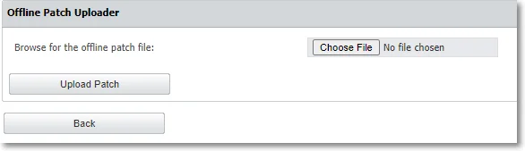

# Server Functionality

Once the Endpoint Protector Hardware or Virtual Appliance setup is complete, access the User
Interface from the assigned IP address. For more information, please refer to the dedicated chapter [Configuring EPP Server IP](/docs/endpointprotector/admin/appliance.md#ip-configuration).

:::note
Always use the IP address with HTTPS (Hypertext Transfer Protocol Secure).
:::

Use the default login credentials for the root account. To obtain the password, submit a support
ticket through the
[Netwrix Customer Portal](https://www.netwrix.com/sign_in.html?rf=my_products.html).

For detailed information on settings change or creating additional administrators, refer to the
[System Configuration](/docs/endpointprotector/admin/systemconfiguration/overview.md) topic.

## Configuration Wizard

The Configuration Wizard provides you with several steps to define basic settings. These include
setting up the Server Time Zone, importing Licenses, Server Update or uploading Offline Patches,
Global device rights, E-mail Server settings, Main Administrator details, etc. You can change these
settings at any time.

The Configuration Wizard is available only if the basic settings for the Endpoint Protector have
never been configured.

As an additional security measure, a session timeout is implemented for 300 seconds (5 minutes) of
inactivity. If you are not active for this amount of time, you are notified the session will expire
and logged out unless you select to continue the session.

:::note
You can customize the session timeout and timeout counter from the
[System Configuration](/docs/endpointprotector/admin/systemconfiguration/overview.md) topic.
:::

## General Dashboard

In this section, you can view general information as graphics and charts related to the most
important activities logged by Endpoint Protector.

You will view more specific dashboards on the Device Control, Content Aware Protection and eDiscovery
sections.

## System Status

In this section you can view general information of the system’s functionality, alerts, and backup
status.

From the System Functionality section, you can enable Endpoint Protector, as well as just specific
modules (Device Control, Content Aware Protection, or eDiscovery).

From the System Status subsection, you can enable the HDD Disk Space and Log Rotation.

:::note
If this setting is enabled, when the Server’s disk space reaches a certain percentage
(starting from 50% up to 90%), old logs will be automatically overwritten by the new ones.
:::

From the System Alerts subsection, you can enable important alerts notifying the expiration of the
APNS Certificate, Updates, and Support or Passwords.

From the System Backup subsection, you can enable the System Backup.

## Server Update

From this section, you can apply the latest security and Endpoint Protector Server offline
updates. Starting with version 2509, the Live Update feature has been deprecated.

:::note
This feature communicates through port 80. Whitelist the liveupdate.endpointprotector.com
(IP: 178.63.3.86) domain.
:::

### Software Update

Use the Offline Patch upload option to select the offline patches from your computer and successively
install them to the latest Endpoint Protector version.

:::note
To request the Offline Patch, submit a support ticket through the
[Netwrix Customer Portal](https://www.netwrix.com/sign_in.html?rf=my_products.html).
:::

:::warning
Before upgrading your Endpoint Protector server to the 5.7.0.0 server version from a
pre-5206 version and adjacent OS image, you need to enable database partitions. For assistance,
submit a support ticket through the
[Netwrix Customer Portal](https://www.netwrix.com/sign_in.html?rf=my_products.html).
:::

### Security Updates

You can use this section to check and apply different types of security updates, view information on
recent updates checked or installed, and a list of updates available.

:::note
The security update options will only be available for customer-hosted instances (e.g.
AWS, Goggle, etc.) with the exception for Operating System and Kernel upgrades.
:::

:::note
Updates are not tested beforehand but are pulled from the official Linux repository.
:::

To ensure the updates will not harm the system, follow these actions:

- test the updates in a test environment first
- make a VM snapshot
- make a system backup from the System Maintenance, the System Backup v2 section

Select one of the security updates type available and then click **Check Updates**:

- Security – this will update all security-related updates of installed packages (Critical and High)
- Other – this will download and apply any update available to 3rd party libraries, kernel, OS
  packages and MySQL database
- All Updates – this will download and apply Informational and Optional/Unclassified updates

If there are updates available, click **Apply Updates**.

:::note
For history of applied Backend Updates go to admin action report and choose **Apply
Updates** under Activity filter.
:::

:::note
Due to patching nature, some updates may automatically restart the Endpoint Protector
server or other sub-services in the background
:::

## Effective Rights

In this section you can view currently applied Device Control or Content Aware Protection policies.
Based on the options you select from the Effective Rights Criteria form, you can view information
based on rights, users, computers, device types, specific devices, report type (PDF or XLS),
including Outside Hours and Outside Network Policies, and more.

Once the report is generated, from the Actions column, you can download or delete it.
