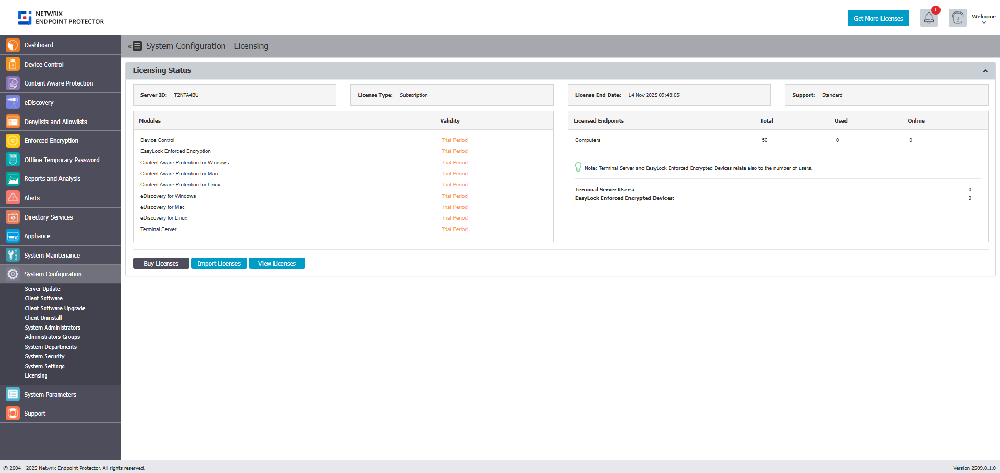
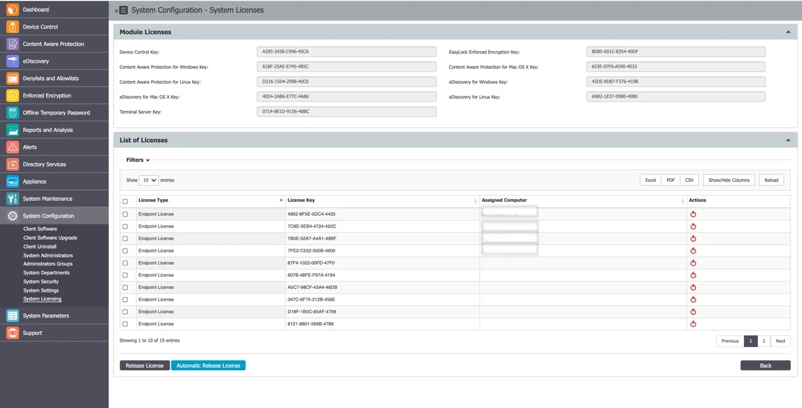
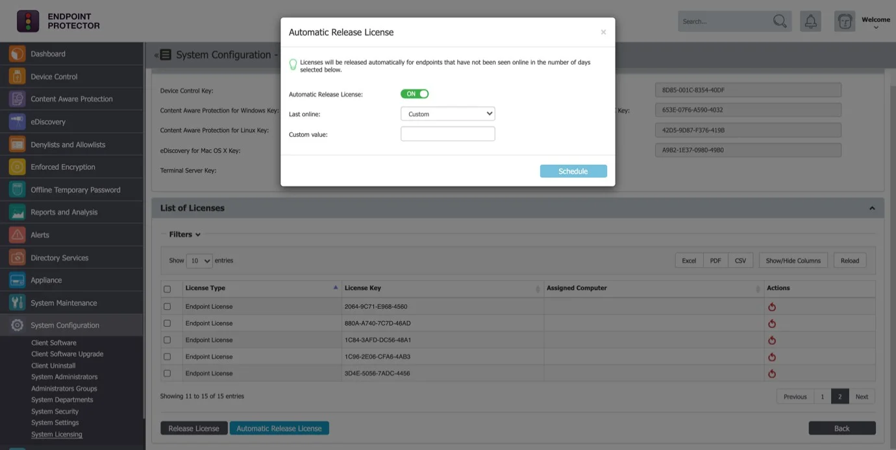
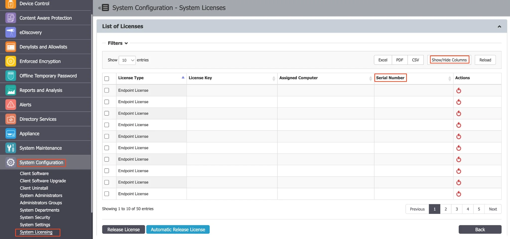

# Licensing

This section provides a complete overview of your licensing status. Use it to manage licenses
for Modules, such as Content Aware Protection and eDiscovery, as well as Endpoints, the computers
you protect. You can import licenses, view details, and handle free trials, ensuring efficient and
flexible license management.

:::note
As of Endpoint Protector Version 5.9.0.0, a new subscription-based licensing system has
been introduced. This change removes the licensing restrictions on Premium features, granting
unrestricted access to features like Contextual Detection for all customers. This adjustment aligns
with the revised licensing model, categorizing all features as standard and accessible to all users.
:::

Endpoint Protector Licensing is based on two main aspects:

- Modules – all modules are licensed separately (Content Aware Protection, eDiscovery, etc.) and require the Device Control module
- Workstations - A Workstation is defined as any single physical or virtual computing environment (including but not limited to laptops, desktops, or virtual desktop instances) on which the Endpoint Protector client software is installed or through which the software is accessed. Each Workstation must be uniquely identifiable (e.g., via hostname, serial number, UUID, or a similar mechanism) and is considered a distinct endpoint for licensing purposes, regardless of its persistence or lifecycle.

Based on the selected Modules and Workstations, a licensing file will be provided by your Endpoint
Protector Representative.

The Endpoint Protector **Server ID** uniquely identifies each server and is linked to the license
file. This needs to be provided to the Endpoint Protector representative before purchasing the
licenses.

The **License End Date** displays the validity of the licenses in the system, and **Support**
represents the level of purchased Support (Standard or Premium)

## Free Trial

Endpoint Protector provides a one-time free, 30-day trial period, and by enabling the Free Trial
option, you will automatically enable all modules for 50 computers. The endpoint licenses will be
assigned on a first-in-first-served basis.

If one or more licensed Workstations have been permanently decommissioned - its license can be released and reassigned. Released licenses will automatically be reassigned to other active Workstations

## Import and Manage Licenses

Click **Import Licenses** to allow browsing for the license file. It contains all the relevant
information in a single file (modules, number of endpoints, expiry date, type of Support, etc.).
Click **View Licenses** to allow the management of the endpoint licenses.

If one or more licensed Workstations have been permanently decommissioned - its license can be released and reassigned. Released licenses will automatically be reassigned to other active Workstations.

By using the automatic release license functionality, licenses can be released from decommissioned Workstations, that have not been seen online for over a certain number of days (15, 30, 90 days, etc.).
It isn't intended for frequent repeated reassignment of licenses among ephemeral or non-persistent virtual desktops, pooled sessions, or other temporary compute instances.
If you operate a non-persistent VDI environment, contact Netwrix to ensure your deployment and licensing model align with product use requirements. 

To streamline license management within System Configuration, navigate to **Licensing** and
discover the Serial Number field under the **View Licenses** section. In the licensing table, you
will find a Serial Number column. To customize your view, use the **Show/Hide Columns** button,
including a checkbox for "Serial Number" (defaulted to 'show'). This resolves issues with identical
computer names and facilitates more effective management via Serial Number integration, reinforced
by MachineUUIDs.

:::note
If a computer's Serial Number is absent, it will be substituted with MachineUUID to ensure
endpoint machine reliability, now featuring in the license page column across all OS platforms.
:::

