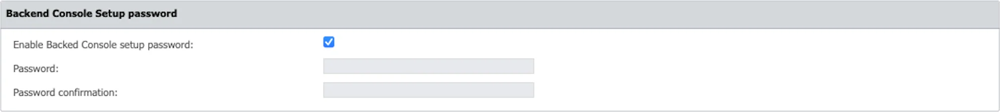

# System Security

This section enables you to configure various security settings, including client uninstall
passwords, restricted access to sensitive information (limited to super administrators), data
protection, and enforcement of password security for all administrators at the next login.
Additionally, you can set password expiration policies.

## Security Password for Uninstall Protection

From this section, you can set a password that will be required when the user performs an Endpoint
Protector Client uninstall action.

:::note
At the top of the page, you will view a message informing you if a password is set for
this action.
:::

Define the security password for uninstall protection in the Password box.

## Data Security Privileges

From this section, you can allow access to sensitive data only to super administrators by selecting
the **Restrict Sensitive Data Access only to super administrators** checkbox.

## Additional Security Password for Sensitive Data Protection

From this section, you can set a password for sensitive data to provide additional security.

:::note
At the top of the page, you will view a message informing you if a password is set for
this action.
:::

Reset the security password for sensitive data protection password by filling in the current
password and then the new password.

## Backend Console Setup Password

This feature enhances security by allowing only authorized users to configure critical settings in
the Backend Console. To activate this safeguard, navigate to Security Configuration, select System
Security, and enable Backend Console Setup Password under the Backend Console Setup section. Save
your changes to add an extra layer of security, for a more secure and controlled environment.

If a backend console password is configured, you will need to enter the password when accessing the backend console view.

:::note
On Ubuntu 22 base image, pressing 'Exit' prompts for the password again.
:::

:::note
To enforce password protection, a reboot of the Endpoint Protector Server appliance is
required. Please be aware of this when changing passwords.
:::

:::note
ASCII character set is supported for passwords.
:::

## Security Password for System Administrator

From this section, you can require all administrators to use their security password at the next
login session.

:::note
Once you have enabled the “Enforce all administrator password security at next login”
setting, the feature cannot be disabled.
:::

If enabled, only complex passwords can be defined, complying with the below rules:

- the minimum length is 9 characters
- must contain small and capital letters, numbers and special characters
- consecutive characters and numbers in ascending order cannot be used

:::warning
The Enforce all administrator password security at next login setting will have
priority over Advanced User Password Settings as this setting also applies to non-admin, such as
Reporter, Read-only users, etc.
:::

## Advanced User Password Settings

From this section, you can set advanced user password settings for all users. Enable the Complex
Password setting and then provide the following information:

- Minimum password length: 8
- Minimum password uppercase characters: 1
- Minimum password lowercase characters: 1
- Minimum password numbers: 1
- Minimum password special characters: 1
- Select if consecutive and ascending characters can be used

If you enforce a password that expires, provide the following information:

- Set **password validity** up to 30 day(s)
- Select if the new **password must be different** from the previous 4 entries

These are mandatory requirements when creating a new Administrator from the System Administrators
section.

:::warning
After you provide all information for the Advanced User Password Settings section, all
users are required to change their passwords at the next login, not only admins.
:::

