# System Settings

From this section, you can manage general settings that apply to the entire Endpoint Protector
system. Some of these settings were pre-configured during the initial setup through the Endpoint
Protector Configuration Wizard. You can adjust these settings to customize system behavior, security
protocols, user access, and integrations to meet your organization’s needs.

## Department Usage

Select an option to grant access for clients based on the Department Code. You can also view the
Default Department code - defdep.

:::note
See the System Settings topic for additional information.
:::

## Session Settings

You can modify the following session timeout settings:

- Session Timeout – set the amount of time the user is inactive until the session expires between 5
  and 60 minutes
- Timeout counter – set the amount of time for the session timeout countdown between 5 seconds and
  Session Timeout minus one minute

Example: If you define the Session Timeout to 5 minutes and the Timeout counter to 60 seconds, then
after 4 minutes of inactivity you will be notified by the pop-up window that in 60 seconds you will
be logged out.

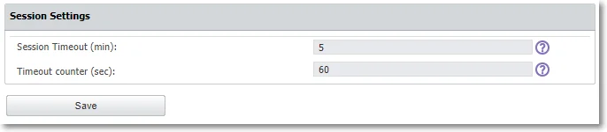

If you remain idle for the defined amount of time, then Endpoint Protector stops responding and
displays a message that indicates the session will expire in the predefined countdown.

You can choose to log out or continue your session, resetting the session timeout interval.

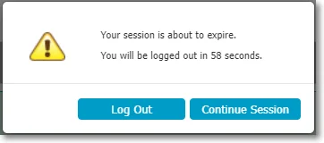

## Endpoint Protector Rights Functionality

Set functionality rights for computer, user, or both, in which case you can prioritize user rights
or computer rights.

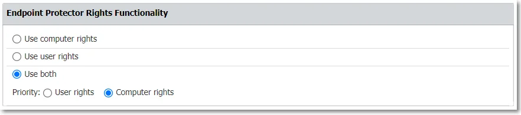

## Smart Groups

Manage settings related to Smart Groups, Default Groups for Computers or Users.

:::note
Smart Groups are dynamic groups for which membership can be defined based on element name
pattern.
:::

- Enable Smart Groups – when this setting is disabled, it will convert Smart Groups to regular
  groups with no entities assigned and will remove the Default Group for Computers and the Default
  Group for Users.
- Enable Default Group for Computers – this will create a default group for computers containing all
  computers that are not part of a Smart Group.

:::note
By disabling this setting, you will delete the Default Group for Computers.
:::

- Enable Default Group for Users – this will create a default group for users containing all users
  that are not part of a Smart Group.

:::note
By disabling this setting, you will delete the Default Group for Users.
:::

:::note
Smart Group sync job interval: the default configured time is 60 min. There is a possible configuration time between that goes from 15 min up to 1440 minutes.
:::

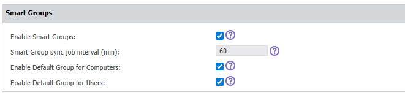

## Client Update Mechanism

Configure the client update settings to optimize update performance by specifying a custom hostname
and port.

- Use custom hostname: Enter a custom hostname to tailor the client update URL as needed.
- Use custom port: Specify a custom port for generating the client update download link, instead of
  using the default port 443.

:::note
Note: Ensure that your specified hostname and port settings comply with your network
policies and any security requirements.
:::

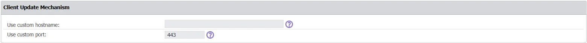

## Custom Settings

To display more information in Endpoint Protector, enable the following:

- Show VID, PID and Serial Number for Offline Temporary Password
- Show MAC Address for Offline Temporary Password
- Show User Domain
- MAC Address Priority
- Show Universal Offline Temporary Password only to Super Admins

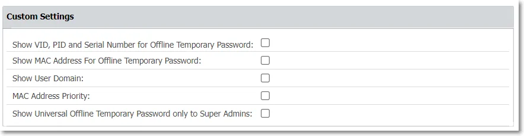

## Log Settings

Manage the following log settings:

- Set the Maximum number of rows in millions to export the Logs Report in .csv format.

:::note
By setting the maximum number of rows to 1.0, you will export 1 million logs in the Logs
Report .csv export as one row corresponds with one log.
:::

When having partitions for logs on the server, make sure the dates are also selected when making the
export.

- Reporting V2 – enabled by default, use this setting to modify the Content Aware Report log
  structure and display information in Destination details, Email sender, and Email subject columns.

:::note
For Endpoint Protector Server versions older than 5.7.0.0, the Reporting V2 setting is not
enabled by default.
:::

The structure enabled by this setting will also be reflected in SIEM.

- **NOTE:** Set the Maximum number of reported threats per event that will be displayed in the
  Content Aware Report log structure, the expanded Log Details section, on the Count column.

:::note
You can set a number of reported threats between 100 and 1000.
:::

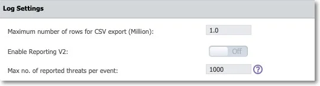

### Log Settings Use Case and Terminology

- Log request - sent by the Endpoint Protector Client
- Event - scan result of a scanned document
- Threat - matched item (e.g. US SSN)

Log request:

- event1.0 (scan result of a scanned document) => 1000 threats before splitting events
- event1.1 => 500 threats
- event2.0 => 200 threats
- up to 100 events

Example: Value set to 500. 3 documents containing 1,500; 600; and 200 threats are subject to Content
Aware Protection policies.

The Endpoint Protector Client will send a single log request.

Log request:

- event1.0 (scan result of a scanned document) => 500 threats => splitting event
- event1.1 (scan result of a scanned document) => 500 threats => splitting event (second log entry
  in the reports)
- event1.2 (scan result of a scanned document) => 500 threats (third log entry in the reports)
- event2.0 (scan result of a scanned document) => 500 threats => splitting event
- event2.1 (scan result of a scanned document) => 100 threats (second log entry in the reports)
- event3.0 (scan result of a scanned document) => 200 threats
- up to 100 events

## Content Aware Protection – Ignore Thresholds

Enable the Ignore Thresholds setting to allow Endpoint Protector to log all sensitive information
from scanned files from 1 to 100 000 threats limit set in the Maximum number of reported threats
field, for the Content Aware Protection Block policies applied.

:::note
This will increase the amount of logging and potentially affect client and server
performance.
:::

:::warning
The Limit Reporting Content Aware Protection setting has priority over Ignore
Thresholds setting. If Limit Reporting Content Aware Protection is enabled, the reporting will stop
when the threshold is reached.
:::

The maximum number of reported threats will be automatically modified as follows:

| User Input | Input Updated |
| ---------- | ------------- |
| 0          | 1             |
|            |               |
|            |               |

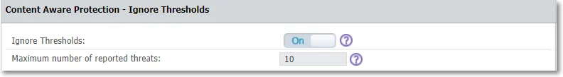

Limit Reporting Content Aware Protection refers to Report Only policies.

- If enabled, the Endpoint Protector client will stop reporting threats for a Report Only policy
  once it finds enough threats to conclude it is satisfied.

The "Content Aware Protection - Ignore Thresholds" toggle refers to Block & Report policies.

- When this toggle is On, scanning will not stop when a block verdict is determined, but will
  continue to report further threats found in a transfer.
- To limit the number of reported threats in this case, the value of the "Maximum number of reported
  threats" setting can be set to a value greater than zero. The set value is only indicative for the
  number of reported threats, the actual number reported can be slightly larger.

The ‘Global/Threat Threshold’ values in Content Aware Protection policies will be ignored/overridden
by the setting ‘Ignore Thresholds’ when the Boolean logic of the Content Aware Protection policy
contains at least one “AND” operator. A policy will be satisfied when the Boolean logic (example: see
below) is met with one or more matches per identifier.

Eg. ( E-mail AND SSN US) OR CC Visa

**Example - Scenario 1**

- Content Aware Protection Policy:

    - Block & Report
    - Threat Threshold: 4
    - Content Detection Rule: (E-mail AND SSN US) OR CC Visa

- Ignore Thresholds: ON

    - Maximum number of reported threats: 10

- Limit Reporting: OFF
- Test File contains

    - E-mail: 2
    - SSN US: 3
    - CC Visa: 6
    - IBAN: 22

In our example, the policy will trigger when the policy is satisfied (Boolean logic), no matter if
the ‘Threat Threshold’ is met or not due to the ‘AND’ operator in the policy. Depending on the data
structure in our test file, Endpoint Protector Client may report different 10 threats to Endpoint
Protector Server

- 2 E-mails + 2 SSN US + 6 CC Visa
- or 1 E-mail + 3 SSN US + 6 CC Visa
- Etc.

:::note
Identifiers which are not part of the Boolean logic in a Content Aware Protection policy
will not be reported!
:::

Generally, a Content Aware Protection policy (Block & Report) will trigger when the Boolean logic of
the policy is satisfied. However, with ‘Ignore Thresholds’ enabled and with 1+ ‘AND’ operator(s) in
the policy, the scan engine will ignore the ‘Threat Threshold’ setting and continue the scan until
the total threat of 10 is reached, no matter if “Limit Reporting” (under DEVICE CONTROL - Global
Settings) is being enabled or disabled.

Generally, a Content Aware Protection policy (Report only) will trigger when the Boolean logic of
the policy is satisfied. However, with ‘Ignore Thresholds’ enabled and with 1+ ‘AND’ operator(s) in
the policy, the scan engine will ignore the ‘Threat Threshold’ setting. If “Limit Reporting” (under
DEVICE CONTROL - Global Settings) is enabled, the scan continues until the total threat of 10 from
setting ‘Maximum number of reported threats’ under ‘Ignore Thresholds’ is reached.

Generally, a Content Aware Protection policy (Report only) will trigger when the Boolean logic of
the policy is satisfied. However, with ‘Ignore Thresholds’ enabled and with 1+ ‘AND’ operator(s) in
the policy, the scan engine will ignore the ‘Threat Threshold’ setting. If “Limit Reporting” (under
DEVICE CONTROL - Global Settings) is disabled, the scan engine will continue the scan until the
entire file is scanned, but will only report 10 threats, set with ‘Maximum number of reported
threats’ under ‘Ignore Thresholds’.

**Example - Scenario 2**

- Content Aware Protection Policy:

    - Block & Report
    - Threat Threshold: 4
    - Content Detection Rule: (E-mail AND SSN US) OR CC Visa

- Ignore Thresholds: ON

    - Maximum number of reported threats: 4

- Limit Reporting: OFF
- Test File contains

    - E-mail: 2
    - SSN US: 3
    - CC Visa: 6
    - IBAN: 22

In our example, the policy will trigger when the policy is satisfied (Boolean logic), no matter if
the ‘Threat Threshold’ is met or not due to the ‘AND’ operator in the policy. Depending on the data
structure in our test file, Endpoint Protector Client may report different 4 threats to Endpoint
Protector Server

- 1 E-mail + 1 SSN US + 2 CC Visa
- or 2 E-mails + 1 SSN US + 1 CC Visa
- Or 1 E-mail + 2 SSN US + 1 CC Visa

Generally, a Content Aware Protection policy (Block & Report) will trigger when the Boolean logic of
the policy is satisfied. However, with ‘Ignore Thresholds’ enabled and with 1+ ‘AND’ operator(s) in
the policy, the scan engine will ignore the ‘Threat Threshold’ setting and continue the scan until
the total threat of 4 from setting ‘Maximum number of reported threats’ is reached, no matter if
“Limit Reporting” (under DEVICE CONTROL - Global Settings) is being enabled or disabled.

Generally, a Content Aware Protection policy (Report only) will trigger when the Boolean logic of
the policy is satisfied. However, with ‘Ignore Thresholds’ enabled and with 1+ ‘AND’ operator(s) in
the policy, the scan engine will ignore the ‘Threat Threshold’ setting. If “Limit Reporting” (under
DEVICE CONTROL - Global Settings) is enabled, the scan continues until the total threat of 4 from
setting ‘Maximum number of reported threats’ under ‘Ignore Thresholds’ is reached.

Generally, a Content Aware Protection policy (Report only) will trigger when the Boolean logic of
the policy is satisfied. However, with ‘Ignore Thresholds’ enabled and with 1+ ‘AND’ operator(s) in
the policy, the scan engine will ignore the ‘Threat Threshold’ setting. If “Limit Reporting” (under
DEVICE CONTROL - Global Settings) is disabled, the scan engine will continue the scan until the
entire file is scanned, but will only report 4 threats, set with ‘Maximum number of reported threats’
under ‘Ignore Thresholds’.

**Example - Scenario 3**

- Content Aware Protection Policy:

    - Report Only
    - Threat Threshold: 4
    - Content Detection Rule: (E-mail AND SSN US) OR CC Visa

- Ignore Thresholds: ON

    - Maximum number of reported threats: 10

- Limit Reporting: ON
- Test File contains

    - E-mail: 2
    - SSN US: 3
    - CC Visa: 6
    - IBAN: 22

In our example, the policy will trigger when the policy is satisfied (Boolean logic), meaning that
all identifiers reach a ‘Threat Threshold’ of at least 1, ignoring setting ‘Maximum number of
reported threats’ under ‘Ignore Thresholds’. Depending on the data structure in our test file,
Endpoint Protector Client may report the single threats to Endpoint Protector Server differently

- 1 E-mails + 1 SSN US
- or 1 CC Visa

Generally, a Content Aware Protection policy (Report only) will trigger when the Boolean logic of
the policy is satisfied, meaning that all identifiers reach a ‘Threat Threshold’ of at least 1. The
scan engine will ignore the ‘Maximum number of reported threats’ under ‘Ignore Thresholds’, when
“Limit Reporting” (under DEVICE CONTROL - Global Settings) is enabled. Reporting stops as soon as
the policy is satisfied.

Generally, a Content Aware Protection policy (Report only) will trigger when the Boolean logic of
the policy is satisfied, meaning that all identifiers reach a ‘Threat Threshold’ of at least 1. The
scan engine will consider the ‘Maximum number of reported threats’ under ‘Ignore Thresholds’, when
“Limit Reporting” (under DEVICE CONTROL - Global Settings) is disabled. Reporting stops when 10
threats are found.

**Example - Scenario 4**

- Content Aware Protection Policy:

    - Block & Report
    - Threat Threshold: 4
    - Content Detection Rule: E-mail OR SSN US OR CC Visa

- Ignore Thresholds: ON

    - Maximum number of reported threats: 10

- Limit Reporting: OFF
- Test File contains

    - E-mail: 2
    - SSN US: 3
    - CC Visa: 6
    - IBAN: 22

In our example, the policy will trigger when the policy is satisfied (Boolean logic), meaning when at
least one identifier (eg. E-mail) reaches a ‘Threat Threshold’ of 4, but the scan engine will
continue to scan until the total threat of 10 from setting ‘Maximum number of reported threats’
under ‘Ignore Thresholds’ is reached. Depending on the data structure in our test file, Endpoint
Protector Client may report different 10 threats to Endpoint Protector Server

- 2 E-mails + 2 SSN US + 6 CC Visa
- or 1 E-mail + 3 SSN US + 6 CC Visa
- Etc.

Generally, a Content Aware Protection policy (Block & Report) will trigger when the Boolean logic of
the policy is satisfied. However, with ‘Ignore Thresholds’ enabled and no ‘AND’ operator(s) in the
policy, the scan engine will search until the total threat of 10 from setting ‘Maximum number of
reported threats’ under ‘Ignore Thresholds’ is reached.

## Virtual Desktop Clones

Enable the Virtual Desktop Clones Support setting to allow the Endpoint Protector server to identify
the virtual desktop clone and interact accordingly with the Endpoint Protector client.

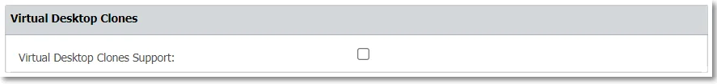

## Deep Packet Inspection Certificate

Disable the Deep Packet Inspection certificate download to require the Endpoint Protector clients to
use the legacy certificate. You can also download the **Client CA Certificate**.

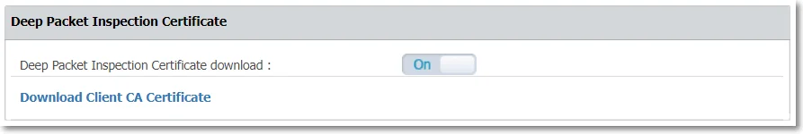

## Server Certificate Stack

Use this section to regenerate a custom server certificate. Enable the option and then provide the
following information:

- FQDN (Fully Qualified Domain Name) – used in certificates and Regenerate Server Certificate Stack and
  CA Certificate used for Deep Packet Inspection on macOS
- Country name – add the first two letters of the country
- State or Province name – add the state or province name
- Locality Name – add locality name

Once you’ve set all the mandatory information, scroll to the bottom of the settings page, click
**Save** and then return to the Server Certificate Stack section and click **Regenerate Server
Certificate Stack**.

The Server certificate will be regenerated in a couple of minutes, and the user will be logged out.

:::note
Please download the Deep Packet Inspection certificate again on both macOS and Linux, and
ensure that it is trusted in the respective keychain on each system.
:::

:::note
Regenerating the CA certificate requires manually adding it to the macOS keychain, as well
as to Linux systems.
:::

:::warning
Do not use this setting if no instance of macOS 12.0 (or higher) is registered on the
Endpoint Protector server.
:::

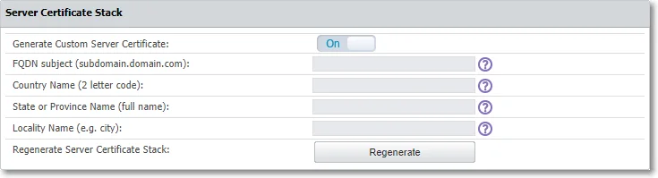

## Single Sign On

Enable the Single Sign On Login setting to log into Endpoint Protector and then select a **Failover
Login User** to use when single sign on is not functional.

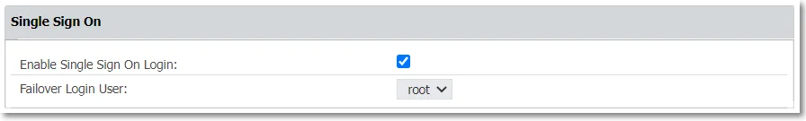

:::note
See the [Single Sign On](/docs/endpointprotector/admin/systemconfiguration/singlesignon/singlesignon.md) topic for additional information.
:::

## Active Directory Authentication

Enable the **Active Directory Authentication** setting to import an Active Directory group of
administrators into Endpoint Protector as Super Administrators.

:::note
By enabling the Active Directory Authentication, you allow the administrators to use their
Active Directory credentials to log into Endpoint Protector.
:::

To import an Active Directory group of administrators, follow these steps:

**Step 1 –** Fill in the fields with the required information, considering:

1. In some cases, you need to add the domain in front of the username (domain\username)
2. Active Directory Administrators Group can be synchronized with any other groups of users except
   for "primary groups" which is limited from this action by Microsoft

**Step 2 –** Scroll to the bottom of the page and save the changes. You will view a successful
message at the top of the page.

**Step 3 –** Return to the Active Directory Authentication section and click **Test Connection** to
confirm the process was successful.

**Step 4 –** Click **Sync AD Administrators**.

:::warning
Once the Active Directory Administrators Group has been defined, only users that are
part of this AD group will be synced and imported as Super Administrators for Endpoint Protector.
Any additional administrators (with different access control levels) can be created manually from
the System Administrators section.
:::

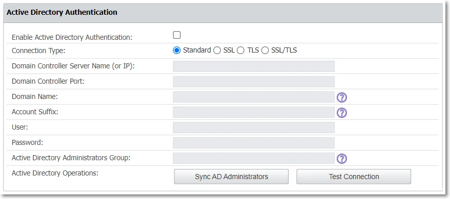

## E-mail Server Settings

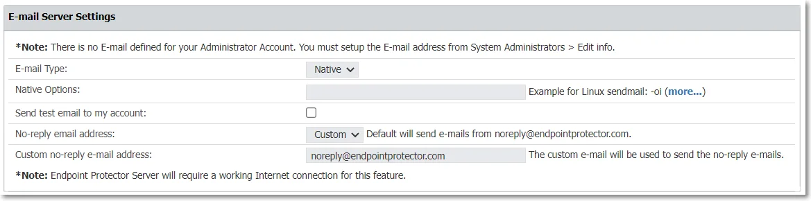

Manage Email server settings based on the email type you use - native or SMTP.

:::note
To enable this feature, you need an Internet connection.
:::

Manage email server settings based on your email type—native or SMTP, with support for TLS 1.3.

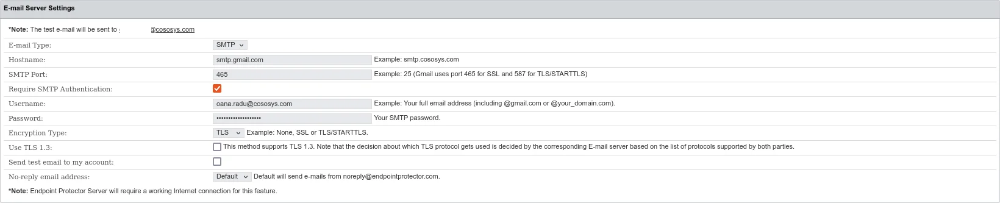

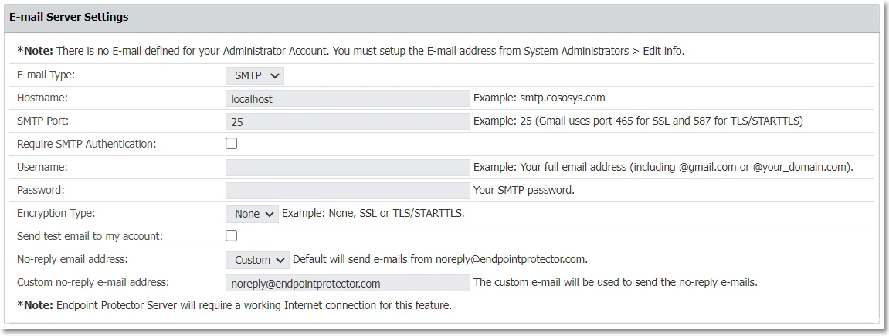

### Proxy Server Settings

Configure Proxy server settings by managing the following:

- Proxy Type
- Authentication Type
- IP and Port
- Proxy access credentials (username/password)

Once you provide all the information, click Test to confirm the settings are working successfully.

:::note
If a Proxy Server is not configured, Endpoint Protector will connect directly to
liveupdate.endpointprotector.com.
:::

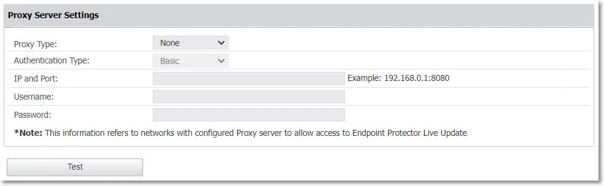

## Main Administrator Contact Details

Edit contact details for the main administrator and then click Save to keep all modifications.

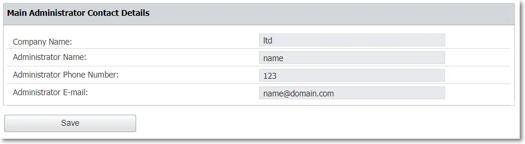

### Server Display Name

Endpoint Protector users can easily visually differentiate environments within the Endpoint Protector console, ensuring precise identification and preventing unintended actions in the wrong environment. This customization feature allows users to add custom text above the Endpoint Protector logo on the login page and alongside the logo in the console header. Moreover, users have the capability to upload a custom logo for further personalization.

To assist customers in distinguishing between multiple EPP Server consoles, Netwrix has introduced options for configuring custom text, icon markings, and extended legal banners for compliance purposes. Organizations managing multiple consoles, such as those for production and testing environments, can implement distinct visual cues. These elements, including custom login text, background colors, and legal banner specifications, help administrators easily identify the environment they are working in, ensuring the appropriate usage of each console.

Refer to the image above for guidance on customizing these elements. You can enable custom login and header displays, Enter your desired text and choose colors that will best highlight your environment’s uniqueness. Additionally, you can upload a custom logo and configure legal banners for added clarity and compliance. By strategically using these visual indicators, administrators can effortlessly distinguish between different operational contexts, enhancing both security and workflow efficienc

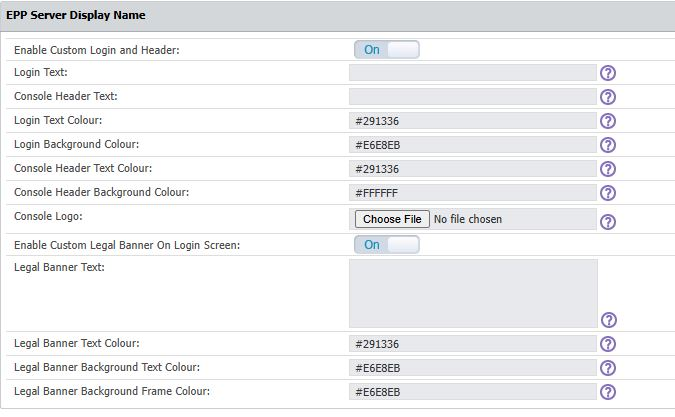

:::note
The legal banner placeholder can accommodate up to 5,000 characters.
:::
