# System Settings

From this section, you can manage general settings that apply to the entire Endpoint Protector
system. The Endpoint Protector Configuration Wizard pre-configures some of these settings during initial setup. You can adjust these settings to customize system behavior, security
protocols, user access, and integrations to meet your organization’s needs.

## Department Usage

Select an option to grant access for clients based on the Department Code. You can also view the
Default Department code - defdep.

:::note
For more information, see the System Settings topic.
:::

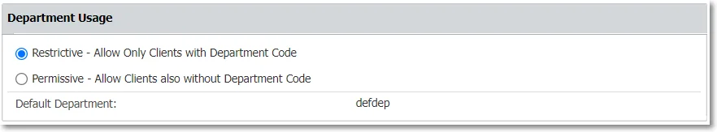

## Session Settings

You can modify the following session timeout settings:

- Session Timeout – set the amount of time the user is inactive until the session expires between 5
  and 60 minutes
- Timeout counter – set the amount of time for the session timeout countdown between 5 seconds and
  Session Timeout minus one minute

Example: If you set the Session Timeout to 5 minutes and the Timeout counter to 60 seconds, a pop-up window will notify you after 4 minutes of inactivity that Endpoint Protector will log you out in 60 seconds.

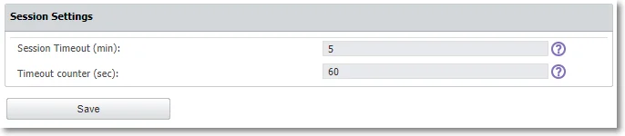

After you remain idle for the defined amount of time, Endpoint Protector stops responding and
displays a message that indicates the session will expire in the predefined countdown.

You can choose to log out or continue your session, resetting the session timeout interval.

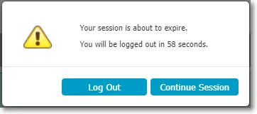

## Endpoint Protector Rights Functionality

Set functionality rights for computer, user, or both, in which case you can prioritize user rights
or computer rights.

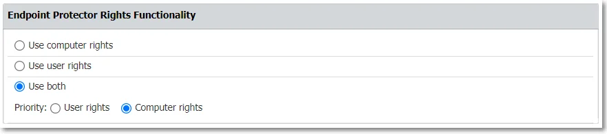

## Smart Groups

Manage settings related to Smart Groups, Default Groups for Computers or Users.

:::note
Smart Groups are dynamic groups whose membership you can define based on an element name
pattern.
:::

- Enable Smart Groups – when you disable this setting, Endpoint Protector converts Smart Groups to
  regular groups with no entities assigned and removes the Default Group for Computers and the
  Default Group for Users.
- Enable Default Group for Computers – creates a default group for computers containing all
  computers that aren't part of a Smart Group.

:::note
Disabling this setting deletes the Default Group for Computers.
:::

- Enable Default Group for Users – creates a default group for users containing all users
  that aren't part of a Smart Group.

:::note
Disabling this setting deletes the Default Group for Users.
:::

:::note
Smart Group sync job interval: the default configured time is 60 min. You can configure an interval between 15 and 1440 minutes.
:::

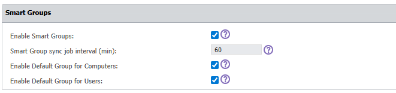

## Client Update Mechanism

Configure the client update settings to optimize update performance by specifying a custom hostname
and port.

- Use custom hostname: Enter a custom hostname to tailor the client update URL as needed.
- Use custom port: Specify a custom port for generating the client update download link, instead of
  using the default port 443.

:::note
Ensure that your specified hostname and port settings comply with your network
policies and any security requirements.
:::

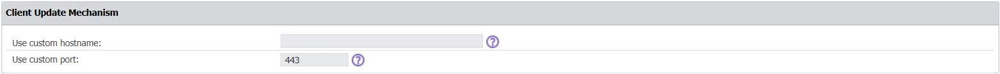

## Custom Settings

To display more information in Endpoint Protector, enable the following:

- Show VID, PID, and Serial Number for Offline Temporary Password
- Show MAC Address for Offline Temporary Password
- Show User Domain
- MAC Address Priority
- Show Universal Offline Temporary Password only to Super Admins

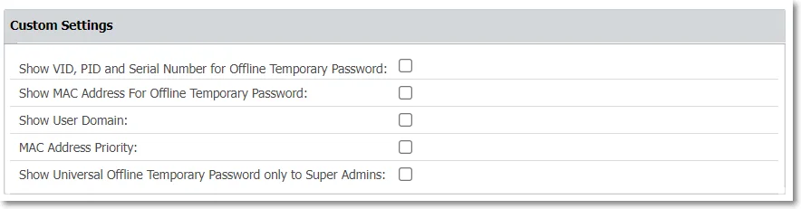

## Log Settings

Manage the following log settings:

- Set the Maximum number of rows in millions to export the Logs Report in .csv format.

:::note
Setting the maximum number of rows to 1.0 exports 1 million logs in the Logs
Report .csv export, since one row corresponds with one log.
:::

If the server has partitions for logs, also select the dates when making the
export.

- Reporting V2 – enabled by default, use this setting to modify the Content Aware Report log
  structure and display information in Destination details, Email sender, and Email subject columns.

:::note
For Endpoint Protector Server versions older than 5.7.0.0, Endpoint Protector doesn't enable
the Reporting V2 setting by default.
:::

SIEM also reflects the structure that this setting enables.

- Set the Maximum number of reported threats per event to display in the
  Content Aware Report log structure, expanded Log Details section, in the Count column.

:::note
You can set a number of reported threats between 100 and 1000.
:::

- Enable Log Rotate After – sets how long Endpoint Protector keeps logs on the server, in months.
  The default is three months. Log rotation runs every five minutes and deletes Device Control, Content Aware
  Protection, and eDiscovery logs older than the retention period, together with their associated
  file shadows. For example, setting this option to 6 keeps six months of logs and removes anything
  older. Set the value to 0 to disable log rotation.

:::warning
This setting is new starting with Endpoint Protector 2608. Earlier server versions didn't
automatically delete Device Control, Content Aware Protection, or eDiscovery logs based on age —
Endpoint Protector kept logs indefinitely unless an administrator removed them manually or through
Audit Log Backup. After you migrate or upgrade to 2608, Endpoint Protector enables this setting by
default at three months and automatically deletes logs older than three months going forward.
Review this value as soon as you migrate and configure it to match your organization's retention
needs. If you must retain log data for compliance beyond the configured period, export it regularly
through **Reports and Analysis** > **Export Logs** and store the exports separately — don't rely on
server-side log storage for long-term compliance evidence.
:::

:::warning
Disabling log rotation means Endpoint Protector never removes logs automatically, and the server
continues to consume storage until you intervene.
:::

- Show old logs structure – displays logs collected before the migration to the 2608 database
  structure. Enabling this option adds an **Export Audit Logs** tab and makes the legacy Audit Log
  Backup sections visible. Leave it disabled if the server holds no pre-migration logs.

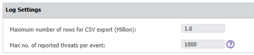

### Log Settings Use Case and Terminology

- Log request - sent by the Endpoint Protector Client
- Event - scan result of a scanned document
- Threat - matched item (e.g. US SSN)

Log request:

- event1.0 (scan result of a scanned document) => 1000 threats before splitting events
- event1.1 => 500 threats
- event2.0 => 200 threats
- up to 100 events

Example: Value set to 500. 3 documents containing 1,500; 600; and 200 threats are subject to Content
Aware Protection policies.

The Endpoint Protector Client will send a single log request.

Log request:

- event1.0 (scan result of a scanned document) => 500 threats => splitting event
- event1.1 (scan result of a scanned document) => 500 threats => splitting event (second log entry
  in the reports)
- event1.2 (scan result of a scanned document) => 500 threats (third log entry in the reports)
- event2.0 (scan result of a scanned document) => 500 threats => splitting event
- event2.1 (scan result of a scanned document) => 100 threats (second log entry in the reports)
- event3.0 (scan result of a scanned document) => 200 threats
- up to 100 events

## Content Aware Protection – Ignore Thresholds

Enable the Ignore Thresholds setting to log all sensitive information from scanned files with a threat count from 1 to 100,000, as limited in the Maximum number of reported threats field for Content Aware Protection Block policies.

:::note
This will increase the amount of logging and potentially affect client and server
performance.
:::

:::warning
The Limit Reporting Content Aware Protection setting has priority over Ignore
Thresholds setting. If you enable Limit Reporting Content Aware Protection, reporting stops
when the threat count reaches the threshold.
:::

Endpoint Protector automatically modifies the maximum number of reported threats as follows:

| User Input | Input Updated |
| ---------- | ------------- |
| 0          | 1             |
|            |               |
|            |               |

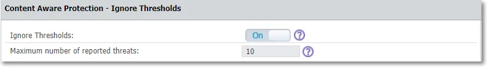

Limit Reporting Content Aware Protection refers to Report Only policies.

- When you enable this setting, the Endpoint Protector client stops reporting threats for a Report
  Only policy after it finds enough threats to satisfy the policy.

The "Content Aware Protection - Ignore Thresholds" toggle refers to Block & Report policies.

- When this toggle is On, scanning continues past a block verdict and reports further
  threats found in a transfer.
- To limit the number of reported threats in this case, set the "Maximum number of reported threats"
  setting to a value greater than zero. The value you set only indicates the number of
  reported threats; the actual number reported can be slightly larger.

The ‘Ignore Thresholds’ setting ignores and overrides the ‘Global/Threat Threshold’ values in
Content Aware Protection policies when the Boolean logic of the Content Aware Protection policy
contains at least one “AND” operator. A policy will be satisfied when the Boolean logic (see the
following example) is met with one or more matches per identifier.

Eg. ( E-mail AND SSN US) OR CC Visa

**Example - Scenario 1**

- Content Aware Protection Policy:

    - Block & Report
    - Threat Threshold: 4
    - Content Detection Rule: (E-mail AND SSN US) OR CC Visa

- Ignore Thresholds: ON

    - Maximum number of reported threats: 10

- Limit Reporting: OFF
- Test File contains

    - E-mail: 2
    - SSN US: 3
    - CC Visa: 6
    - IBAN: 22

In this example, the policy will trigger when the policy is satisfied (Boolean logic), no matter if
the ‘Threat Threshold’ is met or not due to the ‘AND’ operator in the policy. Depending on the data
structure in the test file, Endpoint Protector Client may report different 10 threats to Endpoint
Protector Server

- 2 E-mails + 2 SSN US + 6 CC Visa
- or 1 E-mail + 3 SSN US + 6 CC Visa
- Etc.

:::note
Endpoint Protector doesn't report identifiers that aren't part of the Boolean logic in a Content
Aware Protection policy.
:::

Generally, a Content Aware Protection policy (Block & Report) will trigger when the Boolean logic of
the policy is satisfied. However, with ‘Ignore Thresholds’ enabled and with 1+ ‘AND’ operators in
the policy, the scan engine will ignore the ‘Threat Threshold’ setting and continue the scan until
the total threat of 10 is reached, regardless of whether “Limit Reporting” (under DEVICE CONTROL -
Global Settings) is enabled.

Generally, a Content Aware Protection policy (Report only) will trigger when the Boolean logic of
the policy is satisfied. However, with ‘Ignore Thresholds’ enabled and with 1+ ‘AND’ operators in
the policy, the scan engine will ignore the ‘Threat Threshold’ setting. If “Limit Reporting” (under
DEVICE CONTROL - Global Settings) is enabled, the scan continues until the total threat of 10 from
setting ‘Maximum number of reported threats’ under ‘Ignore Thresholds’ is reached.

Generally, a Content Aware Protection policy (Report only) will trigger when the Boolean logic of
the policy is satisfied. However, with ‘Ignore Thresholds’ enabled and with 1+ ‘AND’ operators in
the policy, the scan engine will ignore the ‘Threat Threshold’ setting. If “Limit Reporting” (under
DEVICE CONTROL - Global Settings) is disabled, the scan engine will continue the scan until the
entire file is scanned, but will only report 10 threats, set with ‘Maximum number of reported
threats’ under ‘Ignore Thresholds’.

**Example - Scenario 2**

- Content Aware Protection Policy:

    - Block & Report
    - Threat Threshold: 4
    - Content Detection Rule: (E-mail AND SSN US) OR CC Visa

- Ignore Thresholds: ON

    - Maximum number of reported threats: 4

- Limit Reporting: OFF
- Test File contains

    - E-mail: 2
    - SSN US: 3
    - CC Visa: 6
    - IBAN: 22

In this example, the policy will trigger when the policy is satisfied (Boolean logic), no matter if
the ‘Threat Threshold’ is met or not due to the ‘AND’ operator in the policy. Depending on the data
structure in the test file, Endpoint Protector Client may report different 4 threats to Endpoint
Protector Server

- 1 E-mail + 1 SSN US + 2 CC Visa
- or 2 E-mails + 1 SSN US + 1 CC Visa
- Or 1 E-mail + 2 SSN US + 1 CC Visa

Generally, a Content Aware Protection policy (Block & Report) will trigger when the Boolean logic of
the policy is satisfied. However, with ‘Ignore Thresholds’ enabled and with 1+ ‘AND’ operators in
the policy, the scan engine will ignore the ‘Threat Threshold’ setting and continue the scan until
the total threat of 4 from setting ‘Maximum number of reported threats’ is reached, regardless of
whether “Limit Reporting” (under DEVICE CONTROL - Global Settings) is enabled.

Generally, a Content Aware Protection policy (Report only) will trigger when the Boolean logic of
the policy is satisfied. However, with ‘Ignore Thresholds’ enabled and with 1+ ‘AND’ operators in
the policy, the scan engine will ignore the ‘Threat Threshold’ setting. If “Limit Reporting” (under
DEVICE CONTROL - Global Settings) is enabled, the scan continues until the total threat of 4 from
setting ‘Maximum number of reported threats’ under ‘Ignore Thresholds’ is reached.

Generally, a Content Aware Protection policy (Report only) will trigger when the Boolean logic of
the policy is satisfied. However, with ‘Ignore Thresholds’ enabled and with 1+ ‘AND’ operators in
the policy, the scan engine will ignore the ‘Threat Threshold’ setting. If “Limit Reporting” (under
DEVICE CONTROL - Global Settings) is disabled, the scan engine will continue the scan until the
entire file is scanned, but will only report 4 threats, set with ‘Maximum number of reported threats’
under ‘Ignore Thresholds’.

**Example - Scenario 3**

- Content Aware Protection Policy:

    - Report Only
    - Threat Threshold: 4
    - Content Detection Rule: (E-mail AND SSN US) OR CC Visa

- Ignore Thresholds: ON

    - Maximum number of reported threats: 10

- Limit Reporting: ON
- Test File contains

    - E-mail: 2
    - SSN US: 3
    - CC Visa: 6
    - IBAN: 22

In this example, the policy will trigger when the policy is satisfied (Boolean logic), meaning that
all identifiers reach a ‘Threat Threshold’ of at least 1, ignoring setting ‘Maximum number of
reported threats’ under ‘Ignore Thresholds’. Depending on the data structure in the test file,
Endpoint Protector Client may report the single threats to Endpoint Protector Server differently

- 1 E-mails + 1 SSN US
- or 1 CC Visa

Generally, a Content Aware Protection policy (Report only) will trigger when the Boolean logic of
the policy is satisfied, meaning that all identifiers reach a ‘Threat Threshold’ of at least 1. The
scan engine will ignore the ‘Maximum number of reported threats’ under ‘Ignore Thresholds’, when
“Limit Reporting” (under DEVICE CONTROL - Global Settings) is enabled. Reporting stops as soon as
the policy is satisfied.

Generally, a Content Aware Protection policy (Report only) will trigger when the Boolean logic of
the policy is satisfied, meaning that all identifiers reach a ‘Threat Threshold’ of at least 1. The
scan engine will consider the ‘Maximum number of reported threats’ under ‘Ignore Thresholds’, when
“Limit Reporting” (under DEVICE CONTROL - Global Settings) is disabled. Reporting stops when 10
threats are found.

**Example - Scenario 4**

- Content Aware Protection Policy:

    - Block & Report
    - Threat Threshold: 4
    - Content Detection Rule: E-mail OR SSN US OR CC Visa

- Ignore Thresholds: ON

    - Maximum number of reported threats: 10

- Limit Reporting: OFF
- Test File contains

    - E-mail: 2
    - SSN US: 3
    - CC Visa: 6
    - IBAN: 22

In this example, the policy will trigger when the policy is satisfied (Boolean logic), meaning when at
least one identifier (eg. E-mail) reaches a ‘Threat Threshold’ of 4, but the scan engine will
continue to scan until the total threat of 10 from setting ‘Maximum number of reported threats’
under ‘Ignore Thresholds’ is reached. Depending on the data structure in the test file, Endpoint
Protector Client may report different 10 threats to Endpoint Protector Server

- 2 E-mails + 2 SSN US + 6 CC Visa
- or 1 E-mail + 3 SSN US + 6 CC Visa
- Etc.

Generally, a Content Aware Protection policy (Block & Report) will trigger when the Boolean logic of
the policy is satisfied. However, with ‘Ignore Thresholds’ enabled and no ‘AND’ operators in the
policy, the scan engine will search until the total threat of 10 from setting ‘Maximum number of
reported threats’ under ‘Ignore Thresholds’ is reached.

## Virtual Desktop Clones

Enable the Virtual Desktop Clones Support setting to allow the Endpoint Protector server to identify
the virtual desktop clone and interact accordingly with the Endpoint Protector client.

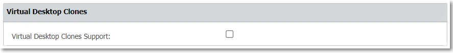

## Deep Packet Inspection Certificate

Disable the Deep Packet Inspection certificate download to require the Endpoint Protector clients to
use the legacy certificate. You can also download the **Client CA Certificate**.

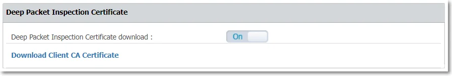

## Server Certificate Stack

Use this section to regenerate a custom server certificate. Enable the option and then provide the
following information:

- FQDN (Fully Qualified Domain Name) – used in certificates and Regenerate Server Certificate Stack and
  CA Certificate used for Deep Packet Inspection on macOS
- Country name – add the first two letters of the country
- State or Province name – add the state or province name
- Locality Name – add locality name

After you’ve set all the mandatory information, scroll to the bottom of the settings page, click
**Save** and then return to the Server Certificate Stack section and click **Regenerate Server
Certificate Stack**.

Endpoint Protector regenerates the server certificate in a couple of minutes and logs the user out.

:::note
Download the Deep Packet Inspection certificate again on both macOS and Linux, and
ensure that each system's keychain trusts it.
:::

:::note
Regenerating the CA certificate requires manually adding it to the macOS keychain and to Linux
systems.
:::

:::warning
Don't use this setting if no instance of macOS 12.0 (or higher) is registered on the
Endpoint Protector server.
:::

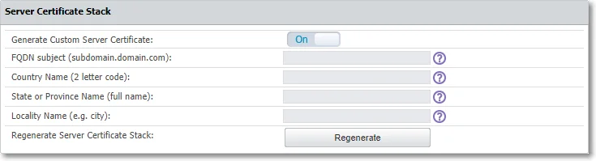

## Single Sign On

Enable the Single Sign On Login setting to log into Endpoint Protector and then select a **Failover
Login User** to use when single sign on isn't functional.

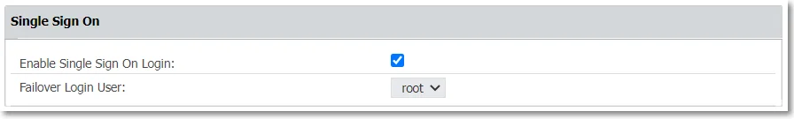

:::note
For more information, see [Single Sign On](/docs/endpointprotector/admin/systemconfiguration/singlesignon/singlesignon.md).
:::

## Active Directory Authentication

Enable the **Active Directory Authentication** setting to import an Active Directory group of
administrators into Endpoint Protector as Super Administrators.

:::note
Enabling Active Directory Authentication lets administrators use their
Active Directory credentials to log into Endpoint Protector.
:::

To import an Active Directory group of administrators, follow these steps:

**Step 1 –** Fill in the fields with the required information, considering:

1. In some cases, you need to add the domain in front of the username (domain\username)
2. You can synchronize the Active Directory Administrators Group with any other groups of users
   except for "primary groups", which Microsoft limits from this action

**Step 2 –** Scroll to the bottom of the page and save the changes. A success message appears at the
top of the page.

**Step 3 –** Return to the Active Directory Authentication section and click **Test Connection** to
confirm the process was successful.

**Step 4 –** Click **Sync AD Administrators**.

:::warning
After you define the Active Directory Administrators Group, Endpoint Protector syncs and imports
only users that are part of this AD group as Super Administrators. You can create any additional
administrators (with different access control levels) manually from the System Administrators
section.
:::

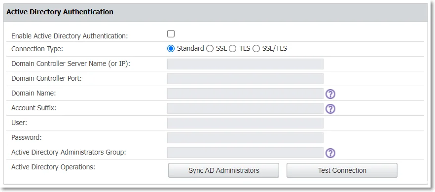

## E-mail Server Settings

:::warning
The E-mail Server Settings moved to a new section. Go to **System Configuration** > **[Mail Settings](/docs/endpointprotector/admin/systemconfiguration/mailsettings.md)** to configure email server settings and authentication.
:::

## Proxy Server Settings

Configure Proxy server settings by managing the following:

- Proxy Type
- Authentication Type
- IP and Port
- Proxy access credentials (username/password)

After you provide all the information, click **Test** to confirm the settings work.

:::note
If you don't configure a Proxy Server, Endpoint Protector will connect directly to
liveupdate.endpointprotector.com.
:::

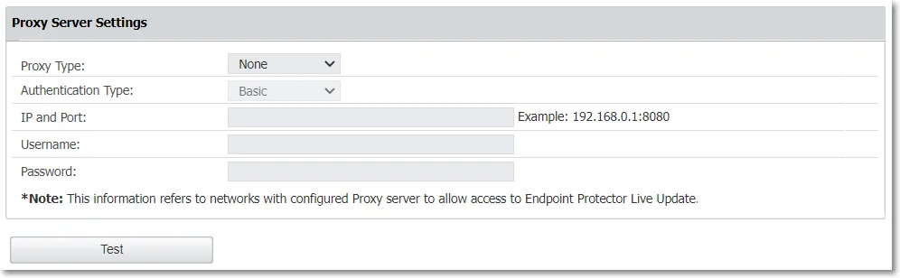

## Main Administrator Contact Details

Edit contact details for the main administrator and then click Save to keep all modifications.

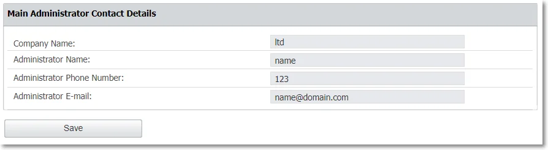

### Server Display Name

Endpoint Protector users can visually differentiate environments within the Endpoint Protector console, ensuring precise identification and preventing unintended actions in the wrong environment. This customization feature lets users add custom text at the Endpoint Protector logo on the login page and alongside the logo in the console header. Users can also upload a custom logo.

Organizations managing multiple Endpoint Protector Server consoles (such as production and testing environments) can use distinct visual cues—custom text, icon markings, and extended legal banners—to differentiate between them. These elements help administrators identify the environment they are working in and ensure appropriate console usage.

To customize these elements, refer to the image in the Server Display Name section. You can enable custom login and header displays, enter your desired text, and choose colors to highlight your environment’s uniqueness. You can also upload a custom logo and configure legal banners for clarity and compliance. Using these visual indicators helps administrators distinguish between different operational contexts and enhance both security and workflow efficiency.

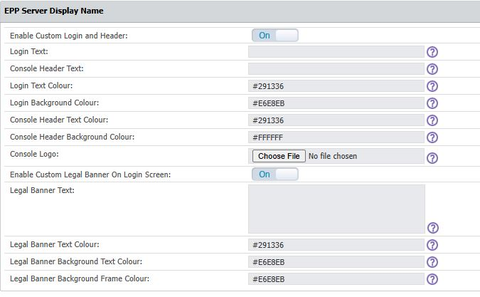

:::note
The legal banner placeholder can accommodate up to 5,000 characters.
:::
