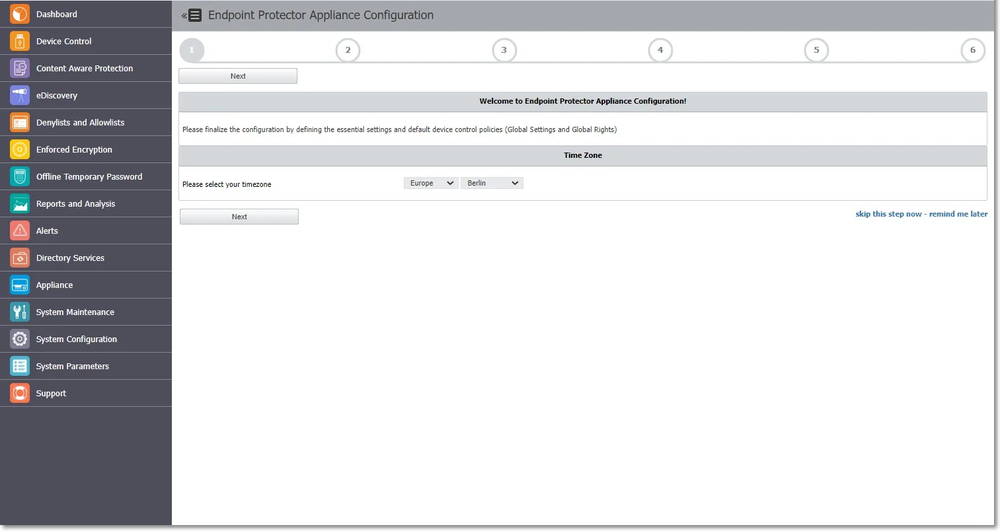
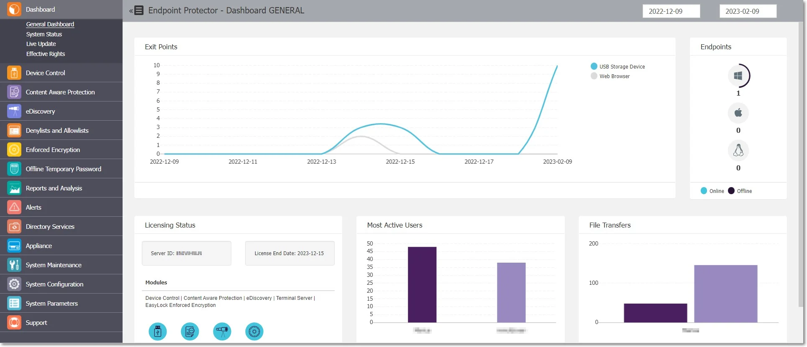
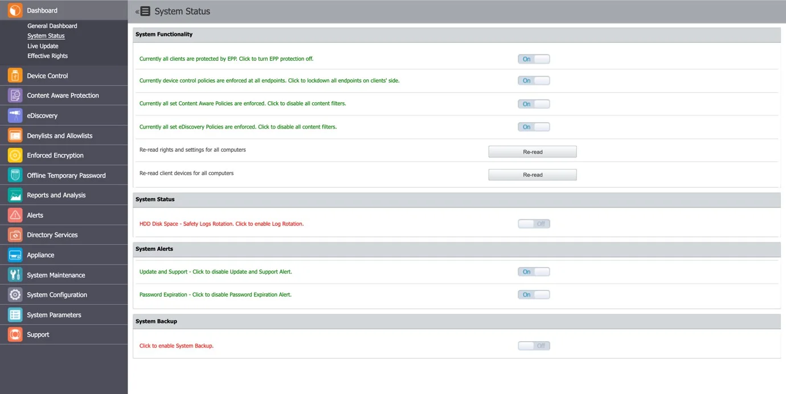
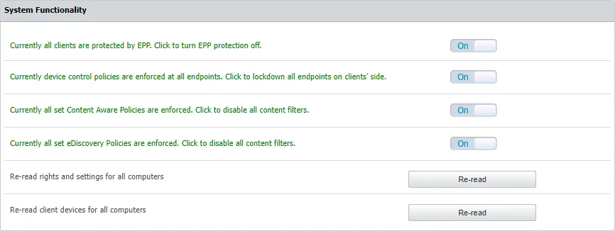
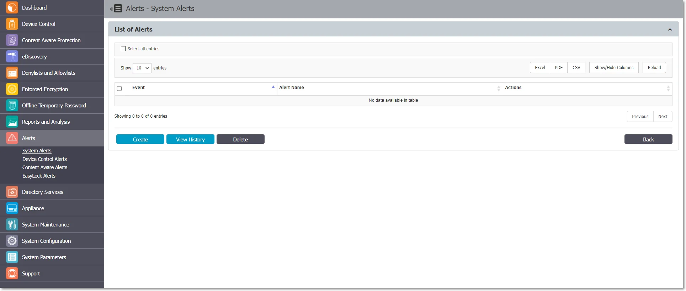
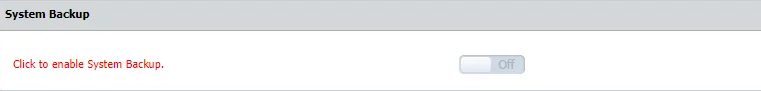

# Server Functionality

Once the Endpoint Protector Hardware or Virtual Appliance setup is complete, access the User
Interface from the assigned IP address.

The default Endpoint Protector Appliance IP address is https://192.168.0.201

:::note
Always use the IP address with HTTPS (Hypertext Transfer Protocol Secure).
:::

Use the default login credentials for the root account. To obtain the password, submit a support
ticket through the
[Netwrix Customer Portal](https://www.netwrix.com/sign_in.html?rf=my_products.html).

For detailed information on settings change or creating additional administrators, refer to the
[System Configuration](/docs/endpointprotector/admin/systemconfiguration/overview.md) topic.

## Configuration Wizard

The Configuration Wizard provides you with several steps to define basic settings. These include
setting up the Server Time Zone, importing Licenses, Server Update or uploading Offline Patches,
Global device rights, E-mail Server settings, Main Administrator details, etc. You can change these
settings at any time.

The Configuration Wizard is available only if the basic settings for the Endpoint Protector have
never been configured.

As an additional security measure, a session timeout is implemented for 300 seconds (5 minutes) of
inactivity. If you are not active for this amount of time, you are notified the session will expire
and logged out unless you select to continue the session.

:::note
You can customize the session timeout and timeout counter from the
[System Configuration](/docs/endpointprotector/admin/systemconfiguration/overview.md) topic.
:::

## General Dashboard

In this section, you can view general information as graphics and charts related to the most
important activities logged by Endpoint Protector.

You will view more specific dashboards on the Device Control, Content Aware Protection and eDiscovery
sections.

## System Status

In this section you can view general information of the system’s functionality, alerts, and backup
status.

From the System Functionality section, you can enable Endpoint Protector, as well as just specific
modules (Device Control, Content Aware Protection, or eDiscovery).

From the System Status subsection, you can enable the HDD Disk Space and Log Rotation.

:::note
If this setting is enabled, when the Server’s disk space reaches a certain percentage
(starting from 50% up to 90%), old logs will be automatically overwritten by the new ones.
:::

From the System Alerts subsection, you can enable important alerts notifying the expiration of the
APNS Certificate, Updates, and Support or Passwords.

From the System Backup subsection, you can enable the System Backup.

## Effective Rights

In this section you can view currently applied Device Control or Content Aware Protection policies.
Based on the options you select from the Effective Rights Criteria form, you can view information
based on rights, users, computers, device types, specific devices, report type (PDF or XLS),
including Outside Hours and Outside Network Policies, and more.

Once the report is generated, from the Actions column, you can download or delete it.
