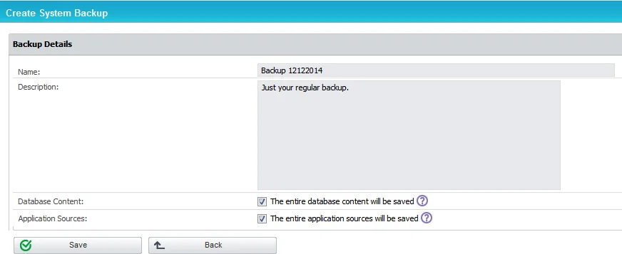
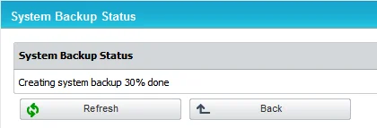
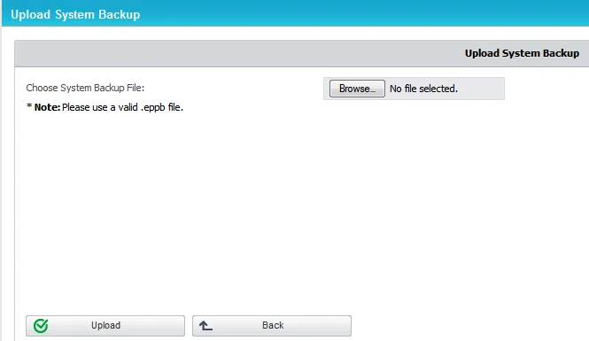
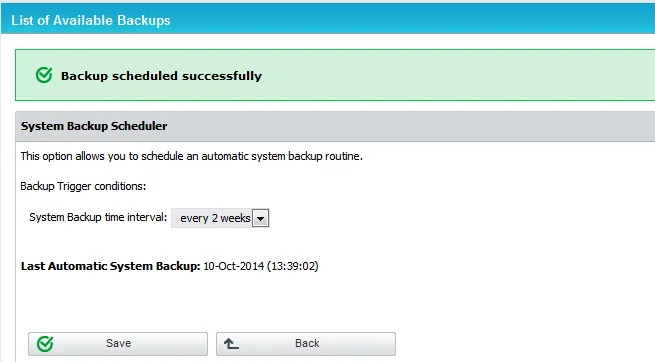
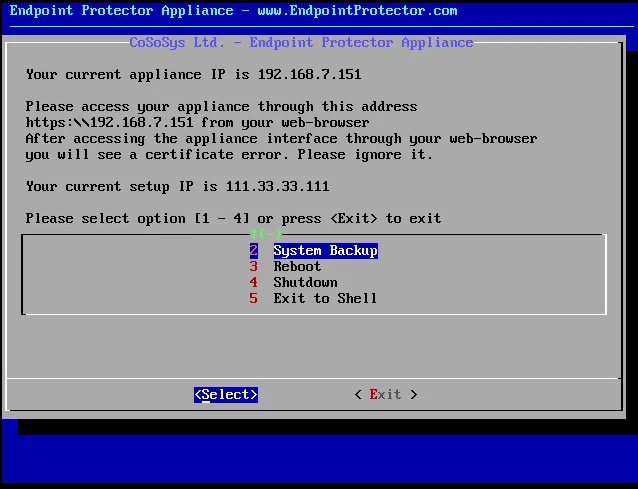
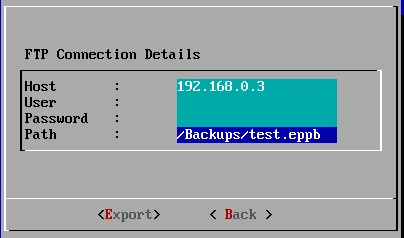

# Backup and Recovery Solutions

Implementing effective backup and recovery solutions is essential for safeguarding your system data
and ensuring operational continuity. This section covers the key methods for performing system
backups, restoring data, and managing migrations.

## System Backup

The System Backup feature allows you to create and manage comprehensive backups of your system.
Using the web interface or administrative console, you can perform backups, restore previous
versions, and set up automatic routines to ensure your data is consistently protected.

### From the Web Interface

This module allows you to make complete system backups.

To view the list of current backups, go to **System Maintenance** > **System Backup v2**.

To restore the system to an earlier state, click **Restore** next to the entry and then confirm your
action.

:::warning
Once deleted, a backup cannot be recovered.
:::

The Download button will prompt you to save the **.eppb backup file** on the local drive. It is
recommended to keep a good record of where these files are saved.

:::warning
When using the Restore Backup feature, we recommend requesting assistance from customer
support.
:::

On the Make Backup section, you have the following options:

- Save the Database content – the backup file will contain all the devices, rights, logs, settings
  and policies present on the Endpoint Protector server at the making of the backup
- Save the Application sources – the backup will contain files such as the Endpoint Protector clients
  and others related to the proper functioning of the server

:::note
The System Backup will not contain nor preserve the IP Address, File Shadowing copies or
the Temporary Logs Files.
:::

The second section, Status, returns the state of the system. If a backup creation is in progress, it
will be reported as seen below.

If the system is idle, the button will return the last known status, which by default is set at 100%
done.

The next menu, Upload, allows you to populate the backup list with .eppb files from the local
filesystem. This functionality is useful in cases of server migration or crash recovery.

:::info
Endpoint Protector Backup Files (.eppb) larger than 200 MB can only be uploaded
from the console of the appliance. We recommend that you contact Customer Support when a created
.eppb file exceeds this 200 MB limit.
:::

From this section, you can schedule an automatic backup routine by setting a trigger condition, the
System Backup time interval. The routine can be set to run daily, weekly, monthly and so forth. The
Scheduler will also prompt the administrator with the Last Automatic System Backup reminder.

:::info
A scheduled routine is recommended in order to prevent unwanted loss.
:::

### From the Console

Endpoint Protector offers the option to revert the system to a previous state from the
administrative console on which the initial configuration occurs.

The Number 2 (System Backup) menu presents you with the following options:

- System Restore – can be performed if a system backup has been performed prior to the event, using
  the web interface
- Import – can be performed if a .eppb file has been downloaded and saved on an FTP server
- Export – can be performed in order to save existing backups on an existent FTP server

To either import or export the .eppb files, an administrator will need to provide the system a valid
FTP IP address and the path inside its filesystem to the .eppb file.

An example is shown below:

## System Backup v2

From this section, you can migrate the database (entities, rights, settings, policies,
configurations, etc.) from an older Endpoint Protector Server to a newer one.

:::note
This feature is not intended as a replacement for the System Backup functionality but
rather as a migration tool from older Endpoint Protector images to the ones starting with version
5.2.0.6.
:::

The version of the old Server and the new Server will have to be the same. Before starting the
migration process, make sure both Servers have the same version (e.g.: update the old server to
5206, aligning it with the new server that is about to be deployed).

System Backup v2 does not include logs, Audits or System Backups. If needed, these should be
downloaded before proceeding.

**Example**

The initial Endpoint Protector deployed was version 4.4.0.7. Over time, updates were applied though
the Live Update section (deprecated starting with the 2509 version), bringing the appliance to Endpoint Protector version 5.2.0.6.
While these constantly included patches and security updates, they did not include a full roll-out of a new core
OS version (e.g.: the appliance is still running on Ubuntu 14.04 LTS).

As Ubuntu 14.04 no longer receives security patches since 2019, those that want to migrate to a
Server running on the latest Ubuntu LTS version should take advantage of this functionality.

### Creating a System Backup v2 (Migration)

You can create a new migration backup from the System Maintenance, System Backup v2 section.

:::note
For security purposes, the System Backup Key will not be stored by the Endpoint Protector.
Before proceeding, make sure it is properly saved.
:::

### Importing and Restore (Migrate)

A backup can be restored on the same Endpoint Protector Server. However, the main use case would be
to import and restore the backup on a newer Endpoint Protector Server (e.g.: version higher than
5.2.0.6).

The migration process of a System Backup requires the backup file and System Backup Key.

:::note
If needed, previous System Backups or Audit Log Backups should be downloaded prior to this
step, as they will not be kept in process.
:::

After the Import and Restore (Migration) has been made to the new Appliance, the old Appliance
should be turned off. Its IP would then have to be reassigned to the new Appliance in order for the
deployed Endpoint Protector Clients to start communicating with the new Appliance.

