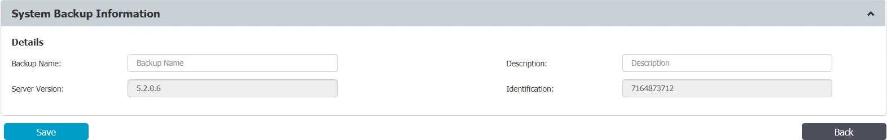
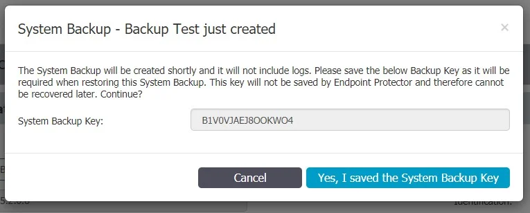
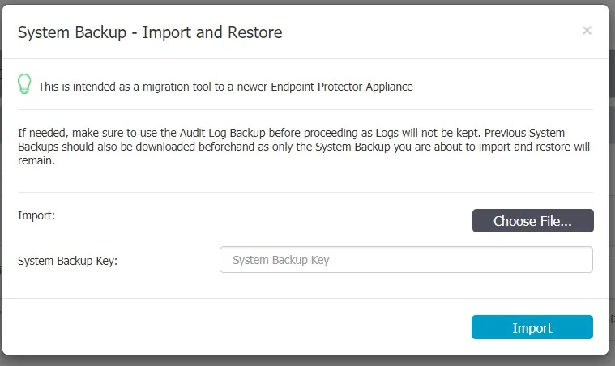

# Backup and Recovery Solutions

Implementing effective backup and recovery solutions is essential for safeguarding your system data
and ensuring operational continuity. This section covers the key methods for performing system
backups, restoring data, and managing migrations.

## System Backup

The System Backup feature allows you to create and manage comprehensive backups of your system.
Using the web interface or administrative console, you can perform backups, restore previous
versions, and set up automatic routines to ensure your data is consistently protected.

### Creating a System Backup v2 (Migration)

You can create a new migration backup from the System Maintenance, System Backup v2 section.

:::note
For security purposes, the System Backup Key will not be stored by the Endpoint Protector.
Before proceeding, make sure it is properly saved.
:::

### Importing and Restore (Migrate)

A backup can be restored on the same Endpoint Protector Server. However, the main use case would be
to import and restore the backup on a newer Endpoint Protector Server (e.g.: version higher than
5.2.0.6).

The migration process of a System Backup requires the backup file and System Backup Key.

:::note
If needed, previous System Backups or Audit Log Backups should be downloaded prior to this
step, as they will not be kept in process.
:::

After the Import and Restore (Migration) has been made to the new Appliance, the old Appliance
should be turned off. Its IP would then have to be reassigned to the new Appliance in order for the
deployed Endpoint Protector Clients to start communicating with the new Appliance.

:::warning
Once deleted, a backup cannot be recovered.
:::

:::info
The Endpoint Protector Server cannot process backup files larger than 200 MB. If a created backup file exceeds this limit, we recommend that you contact Customer Support for assistance.
:::
