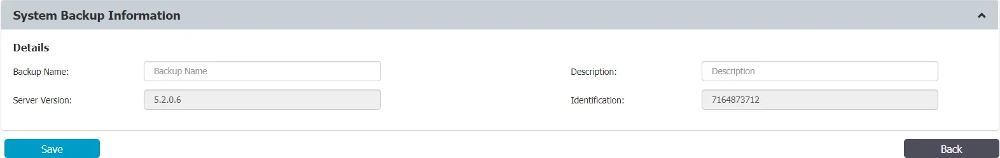
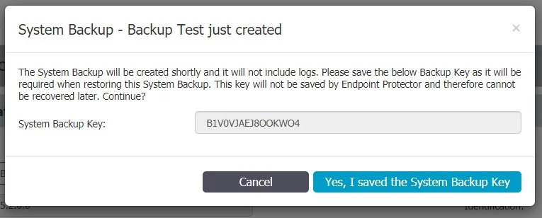
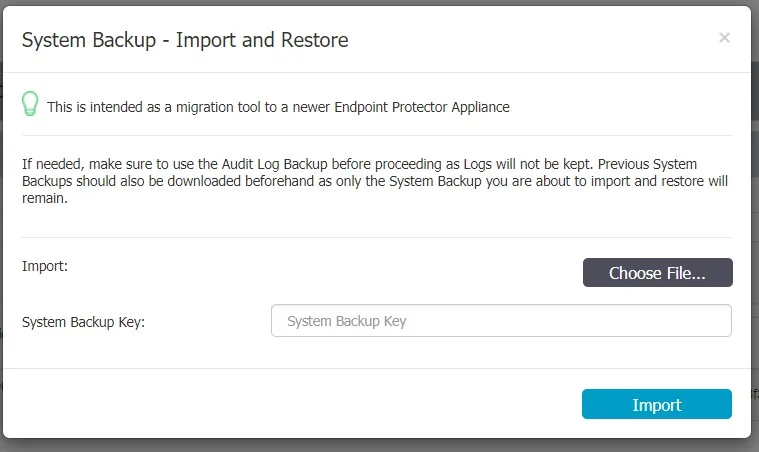

# Backup and Recovery Solutions

Implementing effective backup and recovery solutions is essential for safeguarding your system data
and ensuring operational continuity. This section covers the key methods for performing system
backups, restoring data, and managing migrations.

## System Backup

The System Backup feature lets you create and manage comprehensive backups of your system.
You can perform backups, restore previous versions, and set up automatic routines using the web interface or administrative console to ensure your data stays protected.

### Migration readiness checklist (preflight validation)

Before creating a migration backup and restoring it on a new Endpoint Protector Server, validate the
following items to avoid failed imports/restores:

#### Source appliance (current server)
- Ensure you can successfully create a **System Backup (Migration)** and that you securely save
  the **System Backup Key** (required for restore).
- Download any **previous System Backups** or **Audit Log Backups** you want to keep (these aren't
  preserved through the migration process).
- Confirm the resulting backup file is within the supported size limits (see the note in the following section). If it isn't,
  contact Customer Support before proceeding.

#### Target appliance (new server)
- Deploy the new Endpoint Protector Server on a **newer version** than the source (migration restore
  is intended for a newer server version).
- Ensure the new appliance has enough free disk space for the restore operation (backup file + temporary restore data).
- Plan the cutover: after restore, **power off the old appliance** and **reassign its IP** to the new one so
  existing clients reconnect.

:::warning
If your migration involves upgrading the server from a pre-5206 version to 5.7.0.0, database partitions
must be enabled before the upgrade. Contact Customer Support for assistance.
:::

### Creating a System Backup (Migration)

You can create a new migration backup from the System Maintenance, System Backup section.

:::note
For security purposes, the System Backup Key will not be stored by the Endpoint Protector.
Before proceeding, ensure it is properly saved.
:::

### Importing and Restore (Migrate)

You can restore a backup on the same Endpoint Protector Server. However, the primary use case is
to import and restore the backup on a newer Endpoint Protector Server (e.g., version higher than
5.2.0.6).

The migration process of a System Backup requires the backup file and System Backup Key.

:::note
If needed, download previous System Backups or Audit Log Backups before this step, as they
will not be kept in process.
:::

After the Import and Restore (Migration) has been made to the new Appliance, the old Appliance
should be turned off. Its IP would then have to be reassigned to the new Appliance in order for the
deployed Endpoint Protector Clients to start communicating with the new Appliance.

### Backup Scheduler

The Backup Scheduler lets you configure automatic, recurring backups without manual
intervention. You can access it from **System Maintenance** > **System Backup**,
next to the **Import and Restore (Migrate)** option.

To configure the Backup Scheduler:

1. Go to **System Maintenance** > **System Backup** > **Backup Scheduler**.
2. Enable the scheduler.
3. Configure the backup frequency and retention settings.
4. Enter a **Backup Key**. This key is used for all scheduled backups.

   :::note
   A single backup key is used for all scheduled backups. Store this key securely — you'll need
   it to restore any backup created by the scheduler.
   :::

5. Click **Save** to apply the schedule.

Scheduled backups run automatically based on the configured frequency. You can view the status
and history of scheduled backups in the **List of Backups** table.

:::warning
Once deleted, a backup can't be recovered.
:::

:::info
The Endpoint Protector Server can't process backup files larger than 200 MB. If a created backup file exceeds this limit, contact Customer Support for assistance.
:::

:::note
eDiscovery logs aren't included in the Audit Log Backup. eDiscovery scan results are
exported through the **Reports and Analysis** > **Export Logs** section. When a scan action
is set to "Stop and Clear Logs", eDiscovery logs are automatically exported to the Export Log
List before deletion.
:::
