# System Maintenance

System Maintenance is crucial for ensuring the optimal performance and reliability of your server.
This section covers essential maintenance tasks including file management, system snapshots, audit
log backups, and external storage configurations. By effectively managing these components, you can
maintain a well-organized system, facilitate recovery, and ensure data integrity.

## File Maintenance

This module lets you retrieve, organize, and clean up files used by the Endpoint Protector Server.

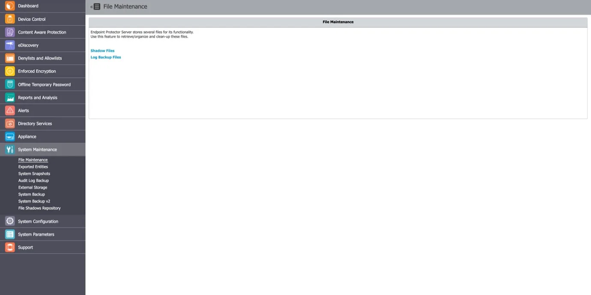

You have the following options:

- Shadow Files – allows archiving and deleting shadowed files from a selected client computer
- Log Backup Files – allows archiving and deleting previously backed up log files

To archive a previously selected set of files, click **Save as Zip**, and to permanently remove a set
of files from the Endpoint Protector Server, click **Delete**.

## Exported Entities

From this section, you can view the list of exported entities, download or delete them, and view the
scheduled export in the system and reschedule them accordingly.

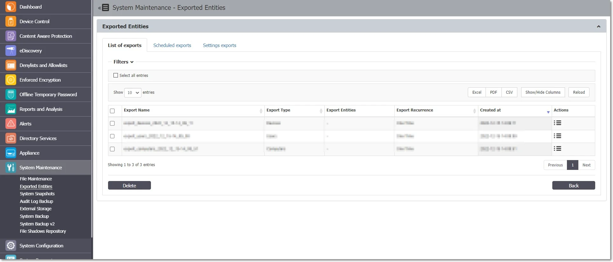

You can initiate the manual generation of the scheduled export from the Device Control, List of
Devices / List of Computers / List of Users / List of Groups sections.

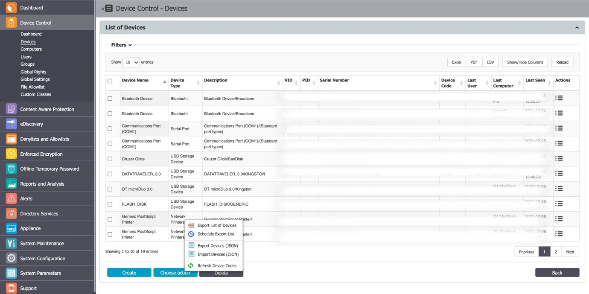

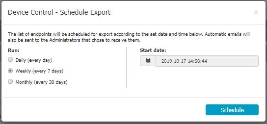

The scheduled exports can be sent automatically via e-mail to all the Administrators that have the
**Scheduled Export Alert** setting enabled.

The Scheduled Exports are reoccurring (Daily / Weekly or Monthly), and, as such, will continuously
take up more and more storage on the Endpoint Protector Server.

To maintain performance—and since scheduled exports can also be sent automatically via email to
specific administrators—scheduled exports already generated are automatically deleted from the
server after 14 days.

The Disable Logging option lets you keep logs on the Endpoint Protector Server or only in the SIEM Server.

## System Snapshots

The System Snapshots module lets you save all device control rights and settings and restore them later if needed.

:::info
After installing the Endpoint Protector Server, create a System Snapshot before modifying anything. This way, you can revert back to the original settings if you configure the server incorrectly.
:::

**Step 1 –** Go to **System Configuration** and click **Make Snapshot**.

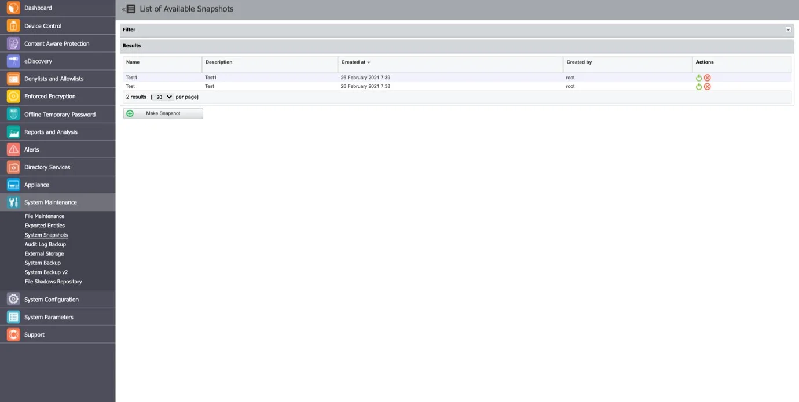

**Step 2 –** Enter a name for the snapshot and a description. Select the items to store in the
snapshot, **Only Rights**, **Only Settings**, or **Both** and then click **Save**.

The snapshot will appear in the list of System Snapshots.

**Step 3 –** To restore a previously created snapshot, click **Restore** next to the snapshot, and
then confirm your action.

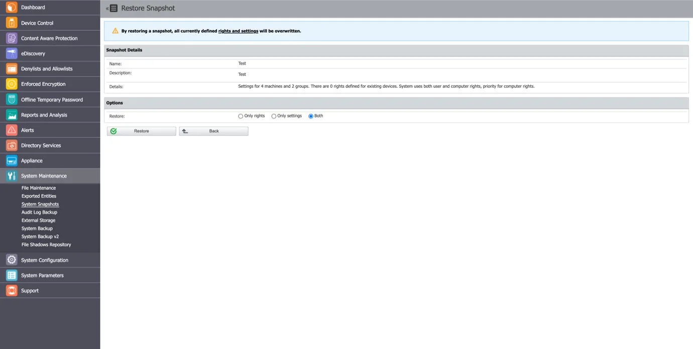

## Audit Log Backup

Like the Log Backup and Content Aware Log Backup sections, this area lets you save and export old logs. You can select the number of logs to export, specify the period, and set the file size.
Additionally, options are available to view a Backup List or set a Backup Scheduler.

Both the Audit Log Backup and Audit Backup Scheduler offer several options like what type of logs to
backup, how old should the included logs be, to keep or delete them from the server, to include file
shadows or not, etc.

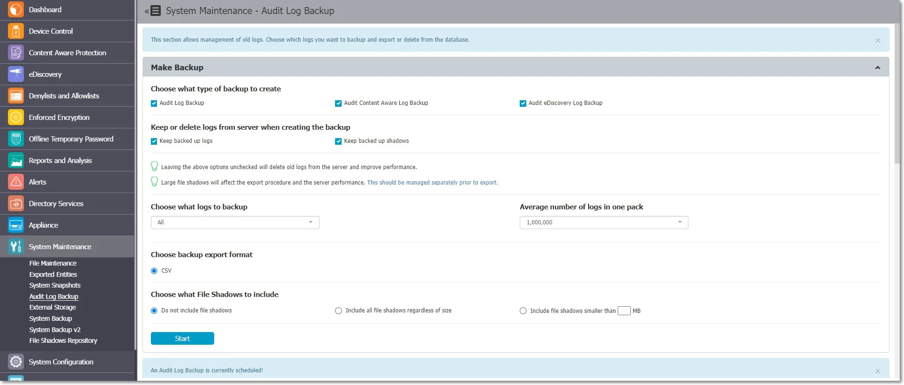

However, exported logs use an improved visual format that makes auditing simpler and report generation easier for executives.

The Backup export CSV file will differ based on the Endpoint Protector Server version used:

- For Endpoint Protector 5.6.0.0 or older, the CSV file reports a file for each threat discovered
- For Endpoint Protector 5.7.0.0, reports, only one file containing all threats discovered, separated
  by an underscore

When backing up Content Aware logs, the export includes the **Date/Time(Client UTC)** field.

:::warning
The audit log backups feature lets you create copies and/or exports of logs and file shadows, either manually or on a scheduled basis. The initial storage location for export files isn't suitable for long-term storage. Download and store these files in secure locations. In SaaS environments, upgrades may delete export files, so download them regularly and store them securely.
:::

### Audit Log Backup Scheduler

The Audit Log Backup starts the backup immediately, while the Audit Log Backup Scheduler lets you set
the time and frequency (daily, weekly, monthly, yearly, etc.).

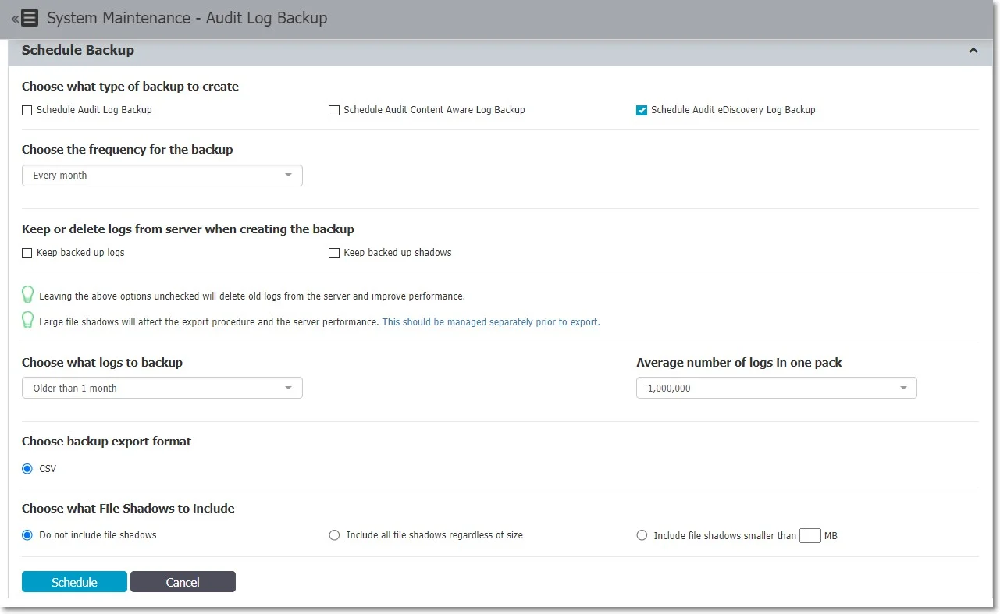

## External Storage

From this section, you can externalize files generated by Endpoint Protector to network storage. You can save Shadows, Audit Log Backups, and System Backups to
FTP, SFTP, Samba, or Network Share servers.

You can enable the option to keep a copy of the files on the Endpoint Protector Server for all
External Storage Types.

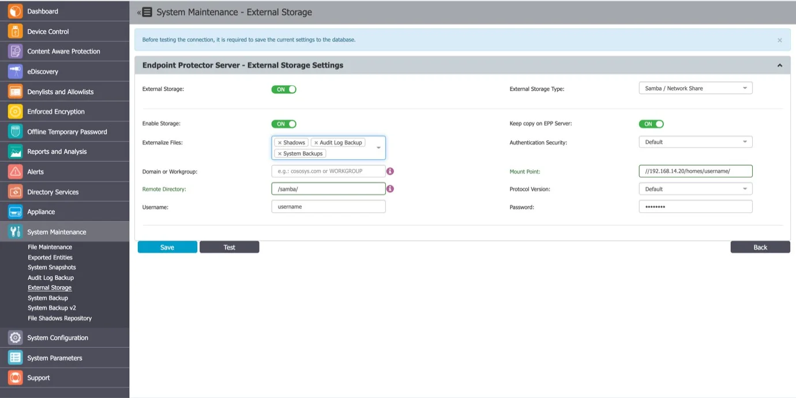

### FTP Server

To configure an FTP Server, provide the following information:

- Externalize Files – the Endpoint Protector files: Shadows, Audit Log Backup or System Backups
- Server IP Address – the IP of the external server
- Remote Directory – a specific location on the external directory
- Username – the username of the external server
- Password – the associated password
- Enable Storage
- Server Port
- Passive Connection
- Anonymous Login

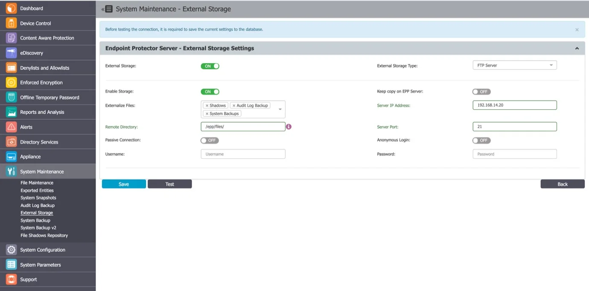

### SFTP Server

To configure an SFTP Server, provide the following information:

- Externalize Files – the Endpoint Protector files: Shadows, Audit Log Backups or System Backups
- Server IP Address – the IP of the external server
- Remote Directory – a specific location on the external directory
- Server Port – the port of the external storage server
- Username – the username of the external server
- Password – the associated password
- Enable storage

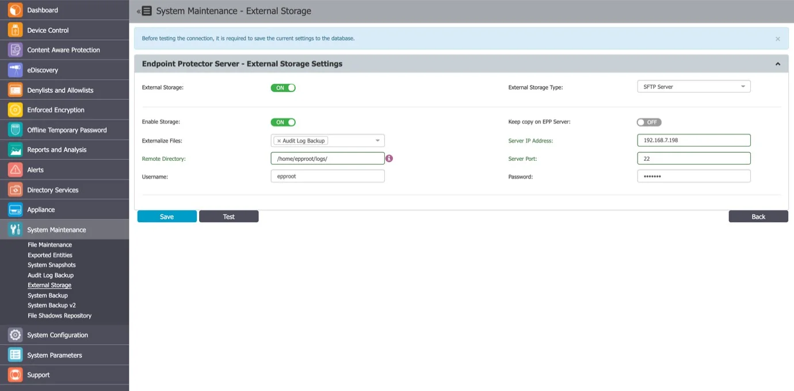

### Samba / Network Share Server

To configure a Samba / Network Share Server, provide the following information:

- Enable Storage
- Keep copy on Endpoint Protector Server – enable this setting to create a backup of the storage on
  the Endpoint Protector Server
- Externalize Files – select the Endpoint Protector files: Shadows, Audit Log
  Backup or System Backups
- Authentication Security – select the security protocol: Default, NTLM, NTLMv2, NTLMSSP
- Domain or Workgroup – only where applicable
- Mount Point
- Remote Directory – a specific location on the external directory
- Protocol Version
- Username – the username of the external server
- Password – the associated password

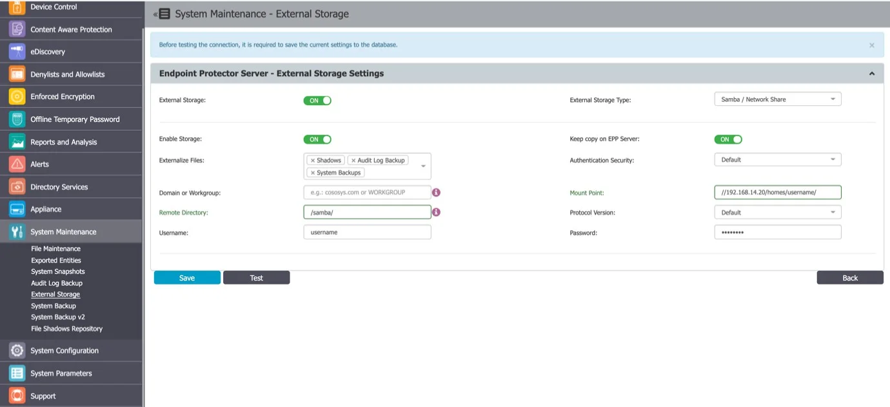
