# System Maintenance

System Maintenance is crucial for ensuring the optimal performance and reliability of your server.
This section covers essential maintenance tasks including file management, system snapshots, audit
log backups, and external storage configurations. By effectively managing these components, you can
maintain a well-organized system, facilitate recovery, and ensure data integrity.

## File Maintenance

This module allows you to retrieve, organize and clean-up files used by the Endpoint Protector
Server.

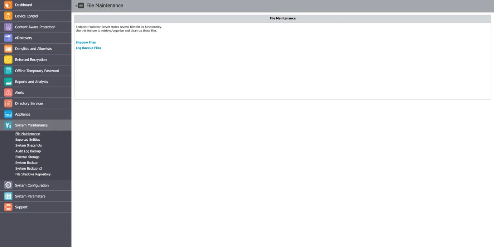

You have the following options:

- Shadow Files – allows archiving and deleting shadowed files from a selected client computer
- Log Backup Files – allows archiving and deleting previously backed up log files

To archive a previously selected set of files click **Save as Zip** and to permanently remove a set
of files from theEndpoint Protector Server click **Delete**.

## Exported Entities

From this section, you can view the list of exported entities, download or delete them, and view the
scheduled export in the system and reschedule them accordingly.

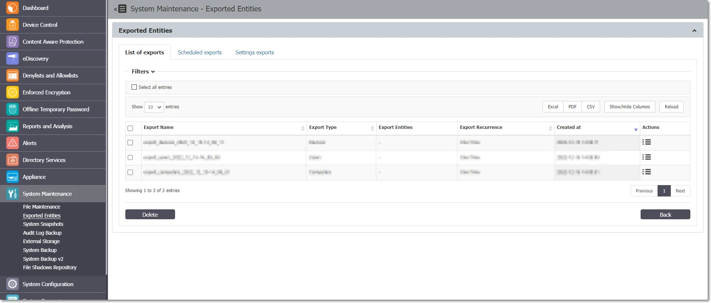

You can initiate the manual generation of the scheduled export from the Device Control, List of
Devices / List of Computers / List of Users / List of Groups sections.

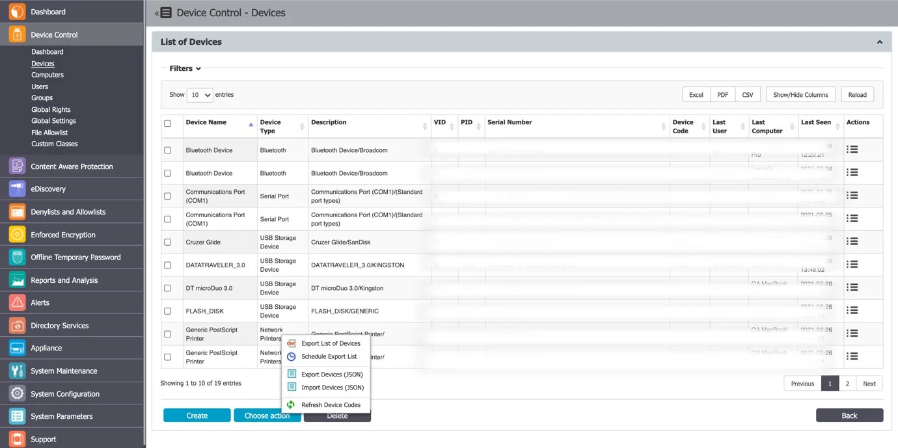

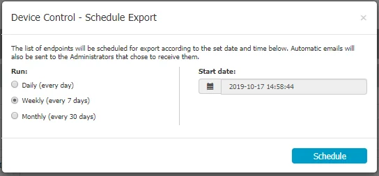

The scheduled exports can be sent automatically via e-mail to all the Administrators that have the
**Scheduled Export Alert** setting enabled.

The Scheduled Exports are reoccurring (Daily / Weekly or Monthly), and, as such, will continuously
take up more and more storage on the Endpoint Protector Server.

To maintain performance and, since these exports can also be sent automatically via e-mail to
specific Administrators, the Scheduled Exports already generated are automatically deleted from the
Server after 14 days.

For performance reasons, the Scheduled Exports and Disable Logging option allows you to also keep
the logs on the Endpoint Protector Server or only have them in the SIEM Server.

## System Snapshots

The System Snapshots module allows you to save all device control rights and settings in the system
and restore them later if needed.

:::info
After installing the Endpoint Protector Server, we strongly recommend that you
create a System Snapshot before modifying anything. In this case, you can revert back to the
original settings if you configure the server incorrectly.
:::

Follow the steps to create a system snapshot.

**Step 1 –** Go to System Configuration and click **Make Snapshot**.

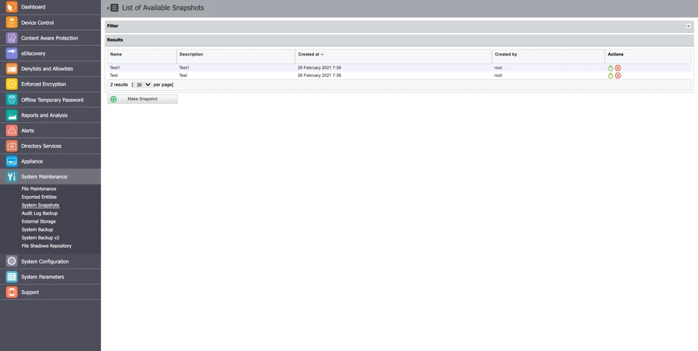

**Step 2 –** Enter a name for the snapshot and a description. Select the items to store in the
snapshot, **Only Rights**, **Only Settings**, or **Both** and then click **Save**.

The snapshot will appear in the list of System Snapshots.

**Step 3 –** To restore a previously created snapshot, click **Restore** next to the snapshot, and
then confirm your action.

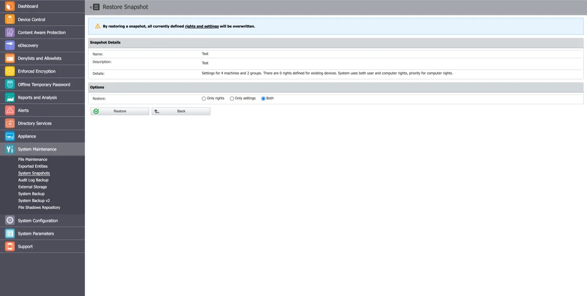

## Audit Log Backup

Similar to the Log Backup and Content Aware Log Backup, this section allows old logs to be saved and
exported. You can select the number of logs to export, specify the period, and set the file size.
Additionally, options are available to view a Backup List or set a Backup Scheduler.

Both the Audit Log Backup and Audit Backup Scheduler offer several options like what type of logs to
backup, how old should the included logs be, to keep or delete them from the server, to include file
shadows or not, etc.

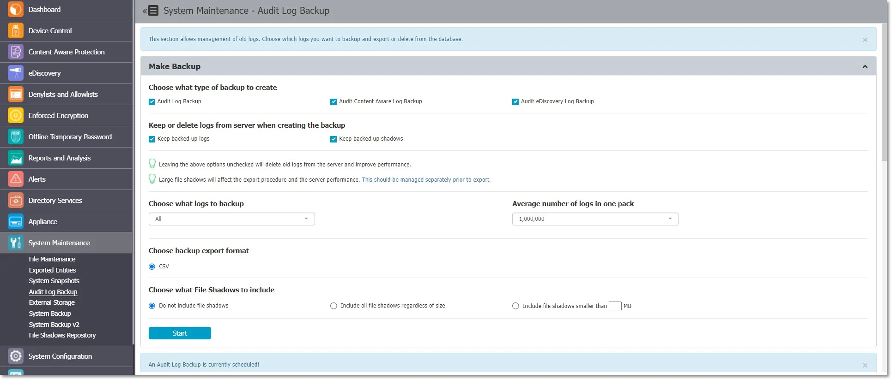

However, the main difference comes from the fact that the exported logs come in an improved visual
model, making things easier to audit or to create reports for executives.

The Backup export CSV file will differ based on the Endpoint Protector Server version used:

- For Endpoint Protector 5.6.0.0 or older, the CSV file reports a file for each threat discovered
- For Endpoint Protector 5.7.0.0, reports, only one file containing all threats discovered, separated
  by an underscore

:::warning
The audit log backups feature allows you to create copies and/or dumps of logs and file shadows into an export file, either manually or on a scheduled basis. Please note that the initial storage location for these export files is not suitable for long-term storage. It is essential that administrators download and store these files in secure locations to ensure their safety. In SaaS environments, be aware that export files may be lost during the upgrade process, so regular downloading and secure storage are crucial.
:::

### Audit Log Backup Scheduler

While the Audit Log Backup starts the backup instantly, the Audit Log Backup Scheduler provides the
option to set the procedure for a specific time and the frequency of the backup (every day, every
week, every month, every year, etc.).

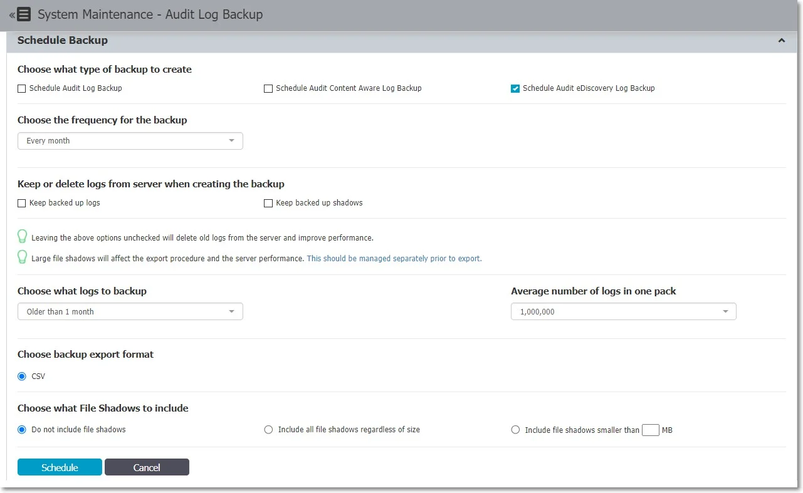

## External Storage

From this section, you can externalize files generated by Endpoint Protector to a particular storage
disk from the network. Files such as Shadows, Audit Log Backups and System Backups can be saved to
an FTP, SFTP or Samba / Network Share server.

You can enable the option to keep a copy of the files on the Endpoint Protector Server for all
External Storage Types.

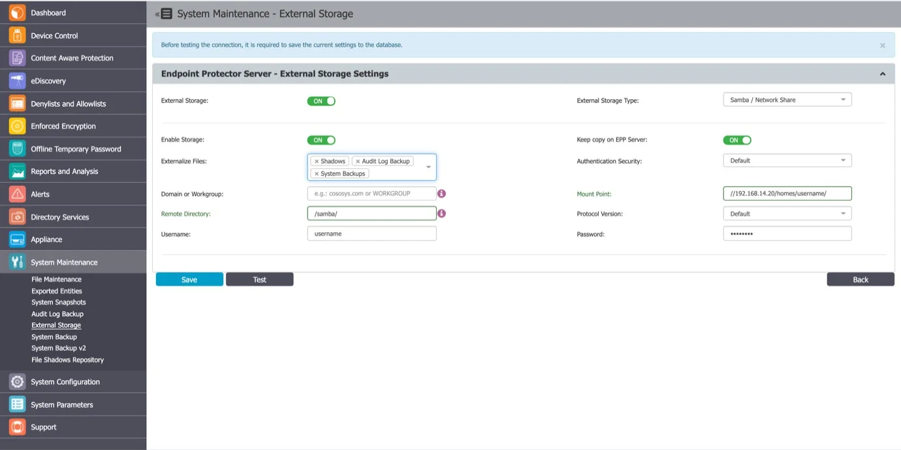

### FTP Server

To configure an FTP Server, provide the following information:

- Externalize Files – the Endpoint Protector files: Shadows, Audit Log Backup or System Backups
- Server IP Address – the IP of the external server
- Remote Directory – a specific location on the external directory
- Username – the username of the external server
- Password – the associated password
- Enable Storage
- Server Port
- Passive Connection
- Anonymous Login

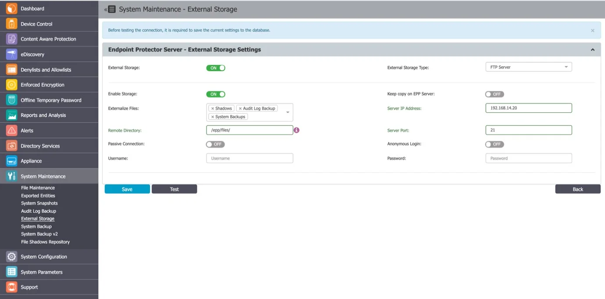

### SFTP Server

To configure an SFTP Server, provide the following information:

- Externalize Files – the Endpoint Protector files: Shadows, Audit Log Backups or System Backups
- Server IP Address – the IP of the external server
- Remote Directory – a specific location on the external directory
- Server Port – the port of the external storage server
- Username – the username of the external server
- Password – the associated password
- Enable storage

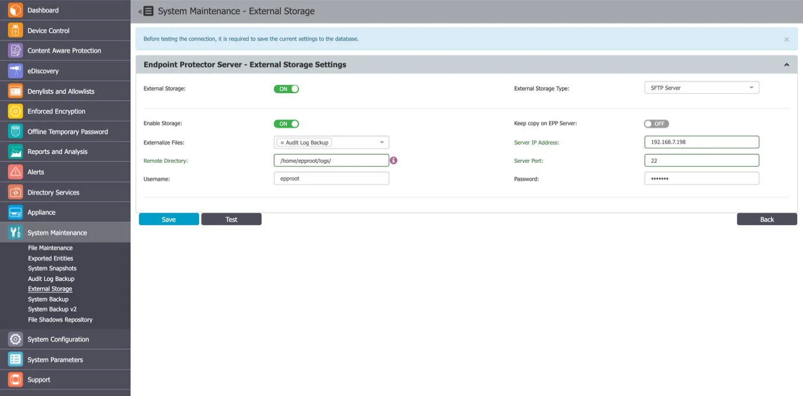

### Samba / Network Share Server

To configure a Samba / Network Share Server, provide the following information:

- Enable Storage
- Keep copy on Endpoint Protector Server – enable this setting to create; a backup of the storage on
  theEndpoint Protector Server
- Externalize Files – select the Endpoint ProtectorEndpoint Protector files: Shadows, Audit Log
  Backup or System Backups
- Authentication Security – select the security protocol: Default, NTLM, NTLMv2, NTLMSSP
- Domain or Workgroup – only where applicable
- Mount Point
- Remote Directory – a specific location on the external directory
- Protocol Version
- Username – the username of the external server
- Password – the associated password

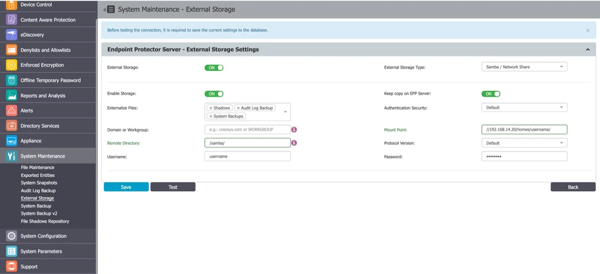
