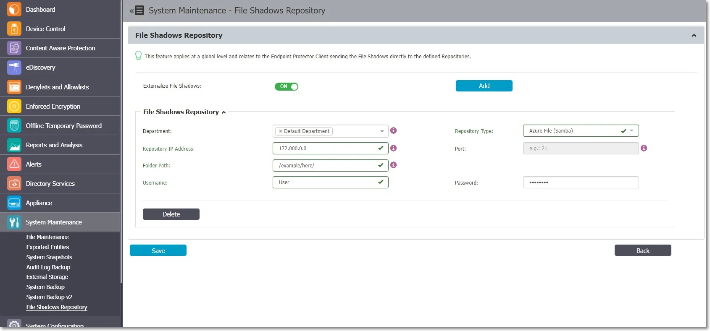
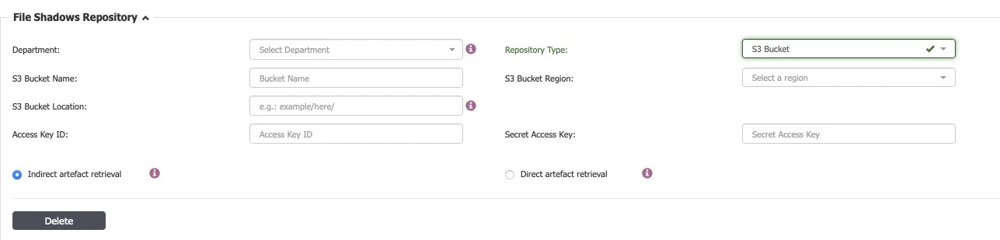
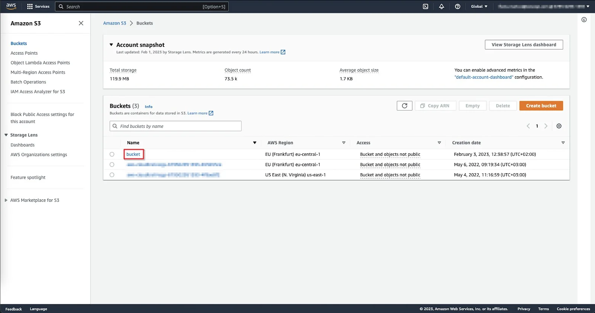
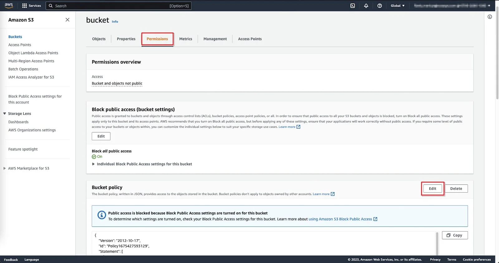
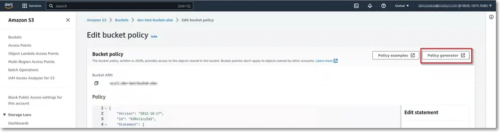
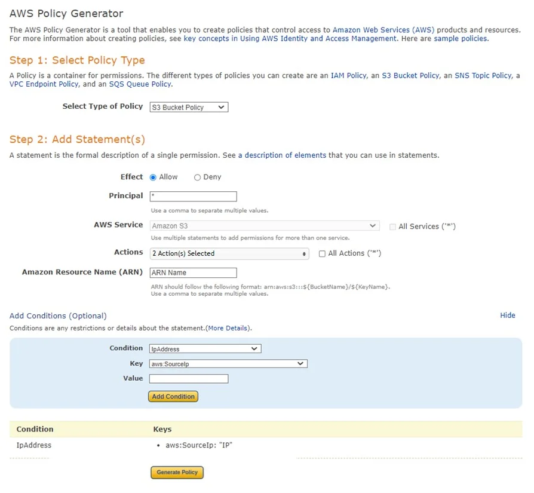

# File Shadow Repository

From this section, you can enable the Endpoint Protector Client to send File Shadows directly and at
a global level to an externalized location, the File Shadows Repositories.

You can create multiple File Shadow Repositories and define how each endpoint manages the File
Shadows based on department and repository type.

:::note
In Endpoint Protector, the Department defines a collection of entities with the same
attributes. It should not be confused with the department from an organizational chart.
:::


Starting with Endpoint Protector Server version 5.8.0.0, file shadowing was made more reliable on
macOS and Linux by first relying on OS features to transfer the files.

On Mac/Linux:

- primary: LDAP (as-is)
- fallback: curl (as-is)

On Windows:

- primary: LDAP
- fallback: curl

To create a File Shadow Repository, click **Add** and then provide the following information:

- Department – assign one or more departments to the File Shadow Repository
- Repository Type – select the type of repository, FTP, Samba (smbv1), Azure File Storage and Samba
  (smbv2) or S3 Bucket

:::note
If you select S3 Bucket type, the information required to create a File Shadow Repository
will differ. Read more on S3 Buckets File Shadow Repository in the following section.
:::


:::note
The minimum permissions required for Samba shares is 750 (case owner has full access and
the Group has only Read and Execute).
:::


- Repository IP Address – add the File Shadow Repository IP address
- Port – add the port used by the File Shadow Repository

:::note
You are not required to define the port for Samba (smbv1) or Azure File Storage and Samba
(smbv2) repositories.
:::


- Folder Path – add the folder path where File Shadows will be saved
- Username and Password – add the repository credentials

:::note
If you are using the Samba V1 protocol for File Shadows on Mac, make sure that NTLMv1
authorization is set on the Samba server.
:::




## Test Connection

The "Test" button facilitates the verification process for FTP and S3 bucket repositories (Indirect
artifact retrieval). This functionality enables you to authenticate and execute a dummy file upload
using the provided credentials.

- FTP Repository – The "Test" button verifies authentication and file upload.
- S3 Bucket Repository (Indirect Artefact Retrieval) – The "Test" button checks key, secret_key, and
  validates bucket region and name if authentication response was successful.

:::note
The Test Connection for S3 Bucket (Direct Artefact Retrieval), Samba v1, Samba v2, and
Azure File Storage Repository is not supported due to additional 3rd Party requirements, such as IP
Whitelisting, smbclient, etc.
:::


This enhancement aims to make the testing process more transparent and efficient for FTP and S3 bucket
repositories while considering the specific requirements of each repository type.

## S3 Bucket File Shadow Repository

The Amazon S3 bucket is a public cloud object storage resource available from Amazon Web Services
(AWS) Simple Storage Service (S3).

S3 Bucket type File Shadow Repository supports large files up to 5TB (AWS specification).

To create an S3 Bucket type File Shadow Repository on Endpoint Protector, provide the following
information:

- Repository Type – select S3 Bucket as the type of repository
- Department – assign one or more departments to the File Shadow Repository
- S3 Bucket Region – depending on the artifacts retrieval method, select one of the options from the
  drop-down list or add a bucket region corresponding with the AWS S3 Bucket settings
- S3 Bucket Name – add a name for the bucket repository corresponding with the AWS S3 Bucket
  settings
- S3 Location – add a specific sub-folder location in the AWS S3 Bucket
- Access Key ID – add the Key for S3 Bucket corresponding with the AWS S3 Bucket settings
- Secret Access Key – add the Token Key generated for a user corresponding with the AWS S3 Bucket
  settings

Select the artifacts retrieval method:

**Indirect Artefact Retrieval**

This is the recommended and most secure option to retrieve artifacts via the Endpoint Protector
Server.

In this approach, when the download button is pressed, a request is sent to AWS to verify the file's
presence in the bucket. If the file is not found, the Endpoint Protector server responds with a
message: "The object object_name does not exist in the S3 Bucket Repository." In the case of the
file's existence, a subsequent request to AWS is made to obtain a pre-assigned URL for the shadow,
which is then used to initiate the shadow download.

:::note
The Endpoint Protector server does not acquire a copy of the shadow at any point during
this transaction. It only receives confirmation that the shadow exists in the S3 Bucket repository.
Users then download the shadows directly from the S3 bucket using a preassigned URL provided by AWS.
:::


You can download or delete an object using SDK, which limits the regions available to the following:

- us-west1 - Northern California
- us-west2 - Oregon
- eu-west1 - EU (Ireland)
- ap-southeast-1 - Asia Pacific (Singapore)
- ap-southeast-2 - Asia Pacific (Sydney)
- ap-northeast-1 - Asia Pacific (Japan)
- sa-east-1 - South America (São Paulo)
- us-gov1-west-1 - United States GovCloud
- fips-us-gov-west-1 - United States GovCloud FIPS 140-2

**Direct Artifact Retrieval**

This option is dedicated to globally distributed Endpoint Protector deployment. This method will
establish a direct connection from the system administrator’s computer to the S3 Bucket Repository
and initiate direct artifact download.

:::note
To set up the S3 bucket repository using both the Direct and Indirect methods,
administrators are required to specify the 'Bucket Name' and generate the 'Access Key ID' and
'Secret Access Key' through AWS administration.
:::


To use the direct artifact retrieval method, add the Endpoint Protector Server IP in the S3 Bucket
whitelist as detailed below.

You can download or delete file shadows from the Reports and Analysis section, the Logs Report page,
and the Content Aware Report page using the Actions column.

When a file is uploaded, an External Repository Upload log will be displayed.

:::warning
File shadows contained in the S3 Bucket (File Shadow Repository) will not be included
in the Audit.
:::




:::note
In the scenario where there may be an unreliable network, the Client will attempt to
upload the artifact 10 times before the guard-rail will stop upload attempts. This will delete the
File Shadow from the queue to ensure endpoint performance, disk space utilization, and mobile
transfer limits are not affected.
:::


### Domain Whitelisting

To add the Endpoint Protector Server IP to the S3 Bucket whitelist, follow these steps:

**Step 1 –** Log in to **AWS**.

**Step 2 –** Click on an entry from the **S3 Bucket list**.



**Step 3 –** On the S3 Bucket, select the **Permission** tab, scroll down to the Bucket policy
section, and then click **Edit**.



**Step 4 –** On the Bucket Policy, add the following IPs:

- Static IP address of the Administrator endpoint for download
- Endpoint Protector External Server IP address to delete

**Step 5 –** Use the Policy generator from the top-right corner to help you edit or create a new
Bucket policy. This will open a new page with the AWS Policy Generator.



On the AWS Policy Generator, provide the following information:

- Select Type of Policy – S3 Bucket Policy
- Effect – select to Allow
- Principal – add \*
- Actions – select DeleteObject and GetObject
- Amazon Resource Name (ARN) – add the ARN name

Click **Add Conditions** and then select from the drop-down lists **IpAddress** as the Condition,
**aws:SourceIp** as the Key and add the **two IPs** separated by a comma to the Value field.

Add the Statement, click **Generate Policy**, and then use the **Bucket Policy**.

For more information on this procedure, read the
[AWS documentation](https://docs.aws.amazon.com/AmazonS3/latest/userguide/example-bucket-policies.html).



```
Example: S3 Bucket Policy (JSON)
{
"Version": "2012-10-17",
"Id": "S3PolicyId1",
"Statement": [
 {
  "Effect": "Allow",
  "Principal": "*",
  "Action": [
     "s3:GetObject", 
      "s3:DeleteObject"
   ],
   "Resource": "arn:aws:s3:::your-bucket-name/*",
   "Condition": {
    "IpAddress": {
     "aws:SourceIp": [
     “IP1”, //the external IP of the server; it’s need it for Delete action
     “IP2”, //public IP address; It’s needed for the download method
     ]
    }
   }
  }
 ]
}
```

Explanation:

- "Effect" – "Allow" signifies permission granted.
- "Principal" – "\*" extends access to anyone (you can substitute \* with an AWS account ID for
  limiting access to a specific account).
- "Action" – [“s3:DeleteObject”, “s3:DeleteObject”]" permits both the "GetObject" action and the
  "DeleteObject" action (Download and Delete methods).
- "Resource" – arn:aws:s3:::your-bucket-name/"" designates the ARN (Amazon Resource Name) of objects
  in your bucket. Replace "your-bucket-name" with your actual bucket name.

    :::warning
    It is crucial to append / at the end of the bucket ARN, as the AWS generator does
    not include it by default.
    :::


- "Condition" is where you specify the IP address condition.
- For the “GetObject” method (Download action from Endpoint Protector) – this method requires the
  public IP address. To download the shadow, a proper AWS URL is constructed based on the Bucket
  Name, Bucket location, region, and shadow name.
- For the “DeleteObject” method (Delete action from Endpoint Protector) – this method requires the
  server's external IP.

In this approach, a cURL request is employed to dispatch the DELETE request to AWS S3, facilitating
the removal of the object from the bucket. This request is initiated from the Endpoint Protector
server, necessitating the whitelisting of its external IP in the Bucket Policy.

## Internet Connectivity Requirements

When using S3 Bucket as the File Shadows Repository type, you will need a direct internet connection
in the following situations:

- For the Endpoint Protector Client to deliver File Shadows to the AWS S3 Bucket repository
- For the Endpoint Protector Server to retrieve File Shadows from the AWS S3 Bucket repository using
  the indirect artifact retrieval method
- For the Administrator endpoint to retrieve File Shadows from the AWS S3 Bucket repository using
  the direct artifact retrieval method

### File naming and structure

**File name convention**

The file names will be uploaded to the S3 Bucket with URLs encoded to avoid issues with special
characters. The Endpoint Protector Server will then decode to display the original name.

Example:

**File name**

```
canada_&$@=;/+ ,?{^}%`]>[~<#|_山人é口ŏ刀ā木ù日ì月è女ǚ子ĭ馬/马鳥/鸟niǎ目ù水 .txt
```

**File name displayed in AWS S3 Bucket**

ln4w7yuqax-dev-client-bucket/2022-11-23/ComputerName/canada*%26%24%40%3D%3B%3
A%2B%20%2C%3F%5C%7B%5E%7D%25%60%5D%3E%5B~%3C%23%7C*%E5%B1%B1%E4%B
A%BAe%CC%81%E5%8F%A3o%CC%86%E5%88%80a%CC%84%E6%9C%A8u%CC%80%E6%9
7%A5i%CC%80%E6%9C%88e%CC%80%E5%A5%B3u%CC%88%CC%8C%E5%AD%90i%CC%86

**%E9%A6%AC%3A%E9%A9%AC%E9%B3%A5%3A%E9%B8%9Fnia%CC%8C%E7%9B%AEu%CC**

%80%E6%B0%B4%20.txt

File name and special characters from the computer name and location will also be encoded.

**File name structure**

Default file name structure:

**bucketName/CurrentDate/ComputerName**

- bucket name (ln4w7yuqax-dev-client-bucket)
- current date in YYYY-MM-DD format (2022-11-23)
- computer name URL encoded

File name structure with S3 Bucket location field specified:

**bucketName/location/CurrentDate/ComputerName**
