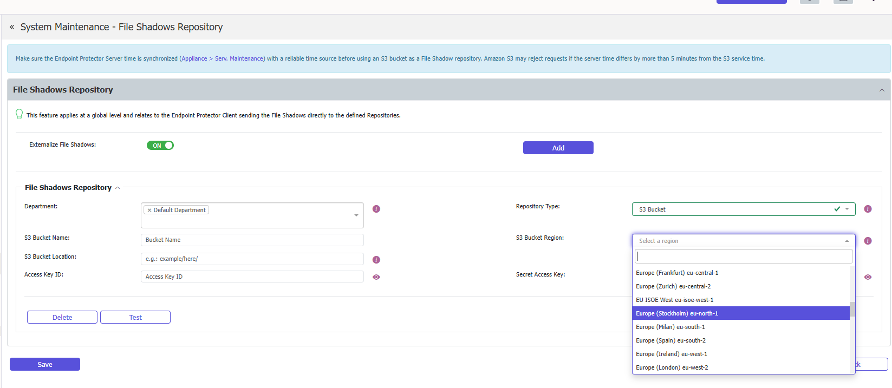
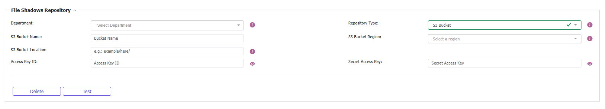

# File Shadow Repository

From this section, you can enable the Endpoint Protector Client to send File Shadows directly and at
a global level to an externalized location, the File Shadows Repositories.

You can create multiple File Shadow Repositories and define how each endpoint manages the File
Shadows based on department and repository type.

:::note
In Endpoint Protector, the Department defines a collection of entities with the same
attributes. It should not be confused with the department from an organizational chart.
:::

Starting with Endpoint Protector Server version 5.8.0.0, file shadowing was made more reliable on
macOS and Linux by first relying on OS features to transfer the files.

On Mac/Linux:

- primary: LDAP (as-is)
- fallback: curl (as-is)

On Windows:

- primary: LDAP
- fallback: curl

To create a File Shadow Repository, click **Add** and then provide the following information:

- Department – assign one or more departments to the File Shadow Repository
- Repository Type – select the type of repository, FTP, Samba (smbv1), Azure File Storage and Samba
  (smbv2) or S3 Bucket

:::note
If you select S3 Bucket type, the information required to create a File Shadow Repository
will differ. Read more on S3 Buckets File Shadow Repository in the following section.
:::

:::note
The minimum permissions required for Samba shares is 750 (the owner has full access and
the Group has only Read and Execute).
:::

- Repository IP Address – add the File Shadow Repository IP address
- Port – add the port used by the File Shadow Repository

:::note
You are not required to define the port for Samba (smbv1) or Azure File Storage and Samba
(smbv2) repositories.
:::

- Folder Path – add the folder path where File Shadows will be saved
- Username and Password – add the repository credentials

:::note
If you are using the Samba V1 protocol for File Shadows on Mac, make sure that NTLMv1
authorization is set on the Samba server.
:::



## Test Connection

The **Test** button verifies FTP and S3 Bucket repositories. This functionality authenticates and
executes a dummy file upload using the provided credentials.

- FTP Repository – the **Test** button verifies authentication and file upload.
- S3 Bucket Repository – the **Test** button checks the access key and secret access key, and
  validates the bucket region and name if the authentication response was successful.

:::note
The Test Connection for Samba v1, Samba v2, and Azure File Storage repositories is not
supported due to additional third-party requirements, such as IP whitelisting and smbclient.
:::

## S3 Bucket File Shadow Repository

The Amazon S3 bucket is a public cloud object storage resource available from Amazon Web Services
(AWS) Simple Storage Service (S3).

S3 Bucket type File Shadow Repository supports large files up to 5TB (AWS specification).

:::note
Starting with Endpoint Protector Server version 5.9.6.0, the AWS SDK was upgraded. As a
result, all AWS S3 regions are now supported when configuring an S3 Bucket repository, and the
separate Direct and Indirect artifact retrieval methods are no longer required. Shadows are
retrieved through the Endpoint Protector Server using the SDK, and no S3 bucket IP whitelisting or
bucket policy configuration is needed.
:::

To create an S3 Bucket type File Shadow Repository on Endpoint Protector, provide the following
information:

- Repository Type – select S3 Bucket as the type of repository
- Department – assign one or more departments to the File Shadow Repository
- S3 Bucket Region – select the region that corresponds with the AWS S3 Bucket settings. All AWS S3
  regions are supported, including eu-central-1.
- S3 Bucket Name – add a name for the bucket repository corresponding with the AWS S3 Bucket
  settings
- S3 Location – add a specific sub-folder location in the AWS S3 Bucket
- Access Key ID – add the key for the S3 Bucket corresponding with the AWS S3 Bucket settings
- Secret Access Key – add the token key generated for a user corresponding with the AWS S3 Bucket
  settings

:::note
Make sure the Endpoint Protector Server time is synchronized (Appliance > Server
Maintenance) with a reliable time source before using an S3 bucket as a File Shadow repository.
Amazon S3 may reject requests if the server time differs by more than 5 minutes from the S3 service
time.
:::

When a shadow is downloaded, Endpoint Protector sends a request to AWS to verify that the file is
present in the bucket. If the file is not found, the server responds with the message "The object
object_name does not exist in the S3 Bucket Repository." If the file exists, the shadow is retrieved
through the Endpoint Protector Server using the SDK.

You can download or delete file shadows from the Reports and Analysis section, the Logs Report page,
and the Content Aware Report page using the Actions column. When a file is uploaded, an External
Repository Upload log is displayed, which also provides the Download and Delete actions for the
associated shadow.

For Content Aware Protection Remediation Session events, the shadow is downloaded from the first
block event associated with the remediated file.

:::note
When a file is copied to a USB device, both a File Copy and a File Write event are generated,
and each may display the Download action. The shadow is stored once and is retrieved from the File
Copy event; the Download action on the File Write event does not return a shadow.
:::

:::note
To set up the S3 bucket repository, administrators are required to specify the bucket name
and generate the Access Key ID and Secret Access Key through AWS administration.
:::

:::warning
File shadows contained in the S3 Bucket (File Shadow Repository) will not be included
in the Audit.
:::



:::note
In the scenario where there may be an unreliable network, the Client will attempt to
upload the artifact 10 times before the guard-rail will stop upload attempts. This will delete the
File Shadow from the queue to ensure endpoint performance, disk space utilization, and mobile
transfer limits are not affected.
:::

## Internet Connectivity Requirements

When using S3 Bucket as the File Shadows Repository type, you will need a direct internet connection
in the following situations:

- For the Endpoint Protector Client to deliver File Shadows to the AWS S3 Bucket repository
- For the Endpoint Protector Server to retrieve File Shadows from the AWS S3 Bucket repository

### File naming and structure

**File name convention**

The file names will be uploaded to the S3 Bucket with URLs encoded to avoid issues with special
characters. The Endpoint Protector Server will then decode them to display the original name.

Example:

**File name**

```
canada_&$@=;/+ ,?{^}%`]>[~<#|_山人é口ŏ刀ā木ù日ì月è女ǚ子ĭ馬/马鳥/鸟niǎ目ù水 .txt
```

**File name displayed in AWS S3 Bucket**

```
ln4w7yuqax-dev-client-bucket/2022-11-23/ComputerName/canada_%26%24%40%3D%3B%3A%2B%20%2C%3F%5C%7B%5E%7D%25%60%5D%3E%5B~%3C%23%7C_%E5%B1%B1%E4%BA%BA...%20.txt
```

File name and special characters from the computer name and location will also be encoded.

**File name structure**

Default file name structure:

**bucketName/CurrentDate/ComputerName**

- bucket name (ln4w7yuqax-dev-client-bucket)
- current date in YYYY-MM-DD format (2022-11-23)
- computer name URL encoded

File name structure with S3 Bucket location field specified:

**bucketName/location/CurrentDate/ComputerName**
