# System Parameters

## Device Types and Notifications

From this section you can view and manage device types and notifications, view and enable default
notifications and their translations, and define custom notifications for Content Aware Protection
policies and Device Control User Remediation.

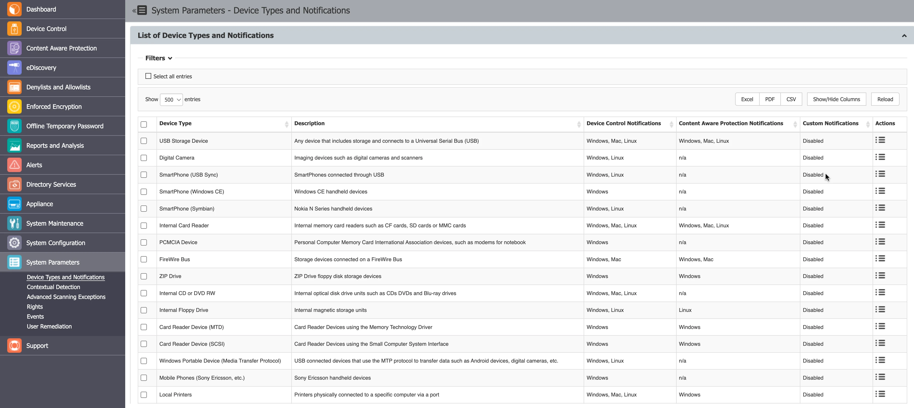

### List of Device Types and Notifications

On the List of Device Types and Notifications, you can view the Device Types available in the system
along with their availability for each operating system and whether the Content Aware Protection
module can inspect those devices.

You can enable and edit the notification messages that appear on the Endpoint Protector Client from
the Actions column.

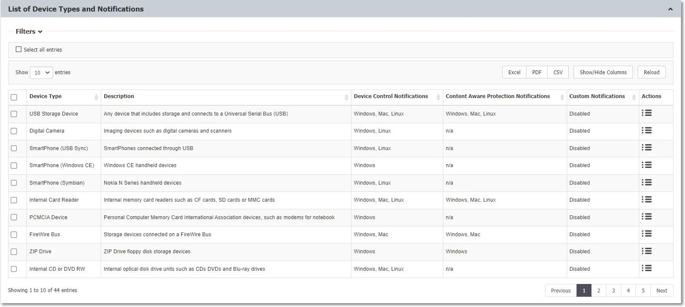

You can enable or disable messages from the Default Notifications list and edit custom notification
translations.

:::note
You can enable Custom Client Notifications globally from Device Control, Global Settings or
individually for computers or groups, from their specific Settings sections.
:::

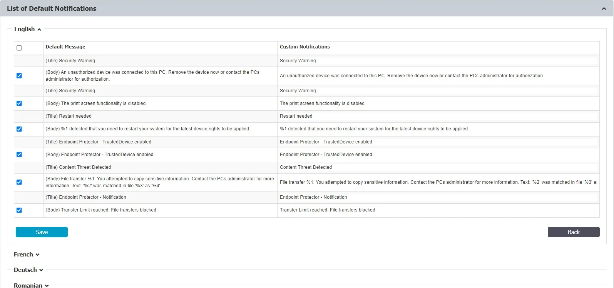

### Custom Content Aware Protection Notifications

With Endpoint Protector, you can create informative notifications that users see when a Content
Aware Policy blocks or reports a file. These notifications provide context about the triggered
policy and the affected file.

Traditionally, Endpoint Protector delivered Content Aware Protection Notifications in plain text. Starting from
Agent version 6.2.3.1 (Windows), 3.0.3.1 (Mac), and 2.4.3.1 (Linux), users can use HTML code to
format notifications. By using HTML, administrators can highlight key information such as threat
names or affected files with bold, italics, or underlining, making it easier for users to
understand. In addition, you can employ colors to differentiate sections or emphasize critical
details within the notification. This results in visually engaging notifications that capture user
attention and ensure users don't miss important information.

To create a notification:

**Step 1 –** Click the **Create** button.

**Step 2 –** Assign a descriptive **Template Name** for easy identification later.

**Step 3 –** Craft a clear and informative **Title** for the notification.

**Step 4 –** Within the **Body** text editor, compose your message using the provided placeholders:

- \{fileName\}: The actual blocked or reported file name.
- \{type\}: Either "blocked" or "reported", based on the policy type.
- \{threatName\}: The identified threat name (if applicable).
- \{threatMatch\}: The specific text that triggered the policy (if applicable).

**Step 5 –** Click **Save** to finalize your custom notification.

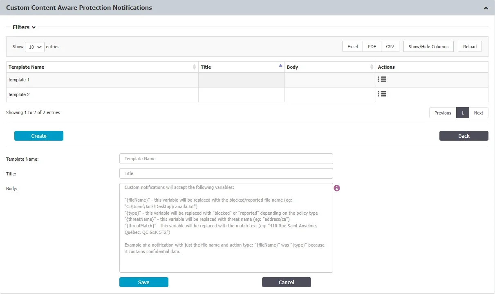

For example, a Content Aware Policy classified the file named 'financial_report.xlsx'
(`\{fileName\}`) as 'Confidential' (`\{type\}`) because it contains confidential data.

After you create the notification, you can associate it with a specific Content Aware Policy using
the Notification Template dropdown menu.

To ensure notifications display correctly and securely, Endpoint Protector supports a limited set of
HTML elements. The following list shows the supported elements you can use in your notifications.

- Basic Formatting:

    - `<b></b>` (bold)
    - `<i></i>` (italic)
    - `<u><u>` (underline)
    - ` ` (line break)

- Text Styling:

    - `Text` (color) - Replace `#rrggbb` with a hexadecimal
      color code (e.g., `style="color: red;"` for red text)
    - `Text` (font size) - Replace `xxpx` with the font
      size you want, in pixels (e.g., `style="font-size: 16px;"` for 16px font)

- Links:

    - `<a href="URL">Text</a>` - Replace `URL` with the actual website address and `Text` with the
      clickable link text (e.g., `<a href="https://www.netwrix.com">Netwrix Website</a>`)

To create notifications using HTML code:

**Step 1 –** As described in the previous steps, create a new notification by clicking **Create**
and entering a name, title, and body text.

**Step 2 –** Within the body text editor, directly enter the HTML code you want to use to format
your message.

### Custom Device Control User Remediation Notifications

This section is available only if you enable the Device Control User Remediation setting in the
[User Remediation](#user-remediation) section. In this section you can add, edit, and delete custom
notifications for Device Control User Remediation.

You can add a maximum of 100 custom notifications but you can't delete the default entry.

To add a new custom notification:

**Step 1 –** Click **Create**.

**Step 2 –** Use these parameters to create your custom message:

- \{deviceName\}
- \{action\}

**Step 3 –** Click **Save**.

**Example: USB Driver(deviceName) is blocked(action)**

After you create the notification, you can select the custom notification from the User Remediation
Notification Template dropdown located in the Device Control section, Global Setting, Users,
Computers, and Groups.

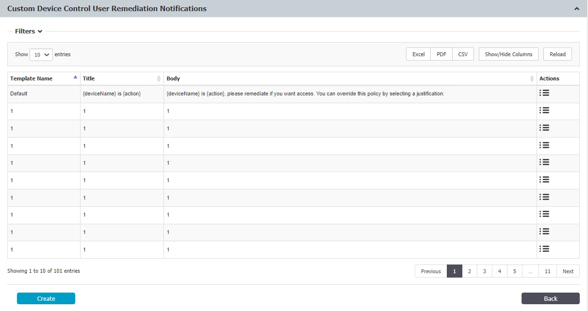

## Contextual Detection

:::note
Version 5.9.6.0 removes Global Contextual Detection. You now configure contextual detection rules
at the policy level only. Each policy can have its own set of up to 15 contextual
detection rules with independent AND/OR logic.

To configure contextual detection for a Content Aware Protection policy, go to
**Content Aware Protection** > **Content Aware Policy** > edit a policy > **Contextual Detection**
tab. For eDiscovery policies, see [eDiscovery policies and scans](ed_module/edpolicies.md).
:::

## Advanced Scanning Detection

The Windows environment is subject to constant OS and security updates, and the installed
applications are under continuous development. To avoid eventual changes that
interfere with the Endpoint Protector Client, you can allow specific applications and processes.

The Advanced Scanning Exceptions feature lets you exclude applications from scanning on endpoints
with the Advanced Printing and MTP Scanning feature enabled.

This feature maintains a list of applications into which Endpoint Protector will not inject its DLL
when you enable “Advanced Printer and MTP Scanning”. For instance, many applications that can't
print or copy files to MTP devices don't require the injection of the Endpoint Protector DLL.
Adding such applications to the exceptions list improves performance and avoids unexpected
interactions with Endpoint Protector.

:::note
This feature applies at a global level for all Windows endpoints with the Advanced
Printing and MTP Scanning features enabled.
:::

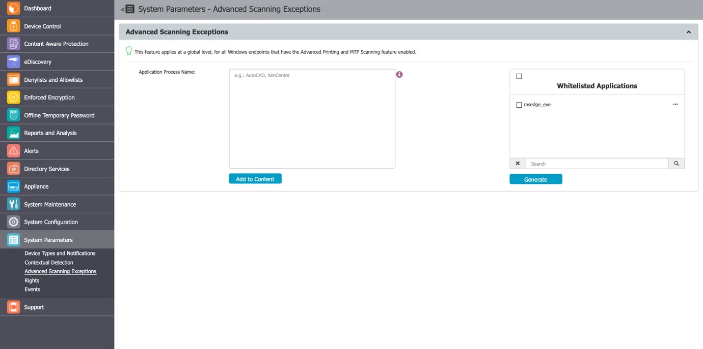

## Rights

This subsection displays a list of all access rights you can assign to devices.

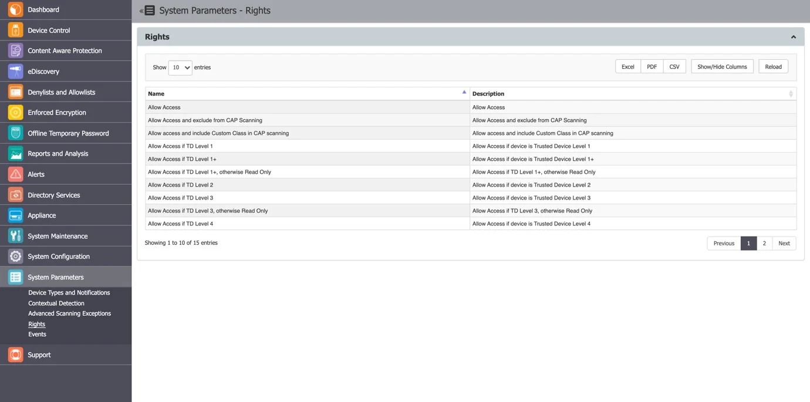

## Events

In this section you can view, manage, and export the events list logged by Endpoint Protector. You
can also edit event names and descriptions or enable/disable logging for specific events from the
Actions column.

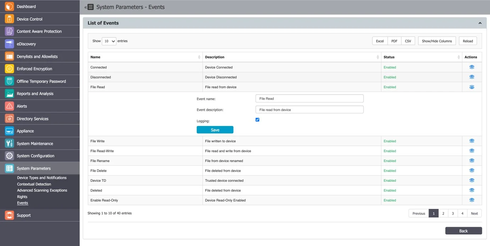

### Events Types and Descriptions

This subsection displays a comprehensive list of events so administrators can
manage and monitor their data protection policies. Additionally, there are more specific
events, such as those related to EasyLock deployment, printer activity, user information updates,
transfer limits, external repository uploads, content remediation, forced uninstall attempts, device
remediation sessions, certificate management, unplanned client terminations, artifact receipts, and
deep packet inspection (DPI) bypassed traffic. These events provide granular insight into various system activities, ensuring
that organizations can maintain robust security and compliance measures.

For a detailed view of all events and their descriptions, see the following table.

| Event Name                                   | Description                                                                                                                     | Additional Explanations |
| -------------------------------------------- | ------------------------------------------------------------------------------------------------------------------------------- | ----------------------- |
| Connected                                    | Device Connected                                                                                                                |                         |
| Disconnected                                 | Device Disconnected                                                                                                             |                         |
| File Read                                    | File read from device                                                                                                           |                         |
| File Write                                   | File written to device                                                                                                          |                         |
| File Read-Write                              | File read and write from device                                                                                                 |                         |
| File Rename                                  | File from device renamed                                                                                                        |                         |
| File Delete                                  | File deleted from device                                                                                                        |                         |
| Device TD                                    | Trusted Device™ connected                                                                                                       |                         |
| Deleted                                      | File deleted from device                                                                                                        |                         |
| Enable Read-Only                             | Device Read-Only Enabled                                                                                                        |                         |
| Enable if TD Level 1                         | Allows access when a Trusted Device™ is connected (e.g., a USB stick with EasyLock installed, which is automatically launched)  |                         |
| Enable if TD Level 2                         | Allows access when Trust Level 2 device is connected                                                                            |                         |
| Enable if TD Level 3                         | Allows access when Trust Level 3 device is connected                                                                            |                         |
| Enable if TD Level 4                         | Allows access when Trust Level 4 device is connected                                                                            |                         |
| AD Synchronization                           | AD Synchronization                                                                                                              |                         |
| Blocked                                      | Device or port blocked                                                                                                          |                         |
| Unblocked                                    | Device or port unblocked                                                                                                        |                         |
| Offline Temporary Password Used                | Offline Temporary Password Used                                                                                                   |                         |
| User Login                                   | User Login                                                                                                                      |                         |
| File Encrypt                                 | File encrypted using EasyLock                                                                                                   |                         |
| File Decrypt                                 | File decrypted using EasyLock                                                                                                   |                         |
| File Encrypt (offline)                         | File encrypted using EasyLock when not communicating with the Endpoint Protector Server                                         |                         |
| File Decrypt (offline)                         | File decrypted using EasyLock when not communicating with the Endpoint Protector Server                                         |                         |
| Content Threat Detected                      | Content Aware Protection <ul><li>Threat Detected</li></ul>                                                                      |                         |
| Content Threat Blocked                       | Content Aware Protection <ul><li>Threat Blocked</li></ul>                                                                       |                         |
| File Copy                                    | A file was copied to or from a removable device                                                                                  |                         |
| Content Threat Discovered                    | eDiscovery <ul><li>Threat Discovered</li></ul>                                                                                  |                         |
| eDiscovery Client Action                     | eDiscovery <ul><li>Action received successfully</li></ul>                                                                       |                         |
| User Logout                                  | User Logout                                                                                                                     |                         |
| Client Integrity OK                          | Endpoint Protector Client Integrity ok   | Logged when the EPP Client starts and all component files and their signatures pass verification. Signature validation applies to Windows only. |
| Client Integrity Fail                        | Endpoint Protector Client Integrity failed | Logged when the EPP Client starts and one or more component files are missing or their signatures fail verification. Signature validation applies to Windows only. |
| Policies Received | Endpoint Protector Client received policy successfully   | Logged when the EPP Client downloads updated settings from the server. Any change to Computer or User settings — such as configuration items, rights, or policies — updates the configuration XML and its hash. When the EPP Client connects to the EPP Server, it presents its current XML hash. If the hash differs from what the server holds, the server sends the updated configuration for the client to download automatically. |
| Uninstall Attempt                            | Endpoint Protector Client uninstall attempt  | Logged when a deliberate uninstall of the EPP Client is initiated — either directly on the endpoint (for example, via Add/Remove Programs) or from the EPP Server using the Uninstall Client action. |
| EasyLock – successfully deployed             | EasyLock <ul><li>successfully deployed</li></ul>                                                                                |                         |
| EasyLock <ul><li>deployment failed</li></ul> | EasyLock <ul><li>deployment failed</li></ul>                                                                                    |                         |
| File Printed                                 | File sent to printer successfully                                                                                               |                         |
| User Information Updated                     | User information updated successfully                                                                                           |                         |
| Transfer Limit Reached                       | Transfer Limit Reached                                                                                                          |                         |
| External Repository Upload                   | File Shadow uploaded to Repository successfully                                                                                 |                         |
| External Repository Upload Fail              | File Shadow uploaded to Repository failed                                                                                       |                         |
| Content Remediation Session Active           | Content Aware Protection <ul><li>Threat Remediated</li></ul>                                                                    |                         |
| Content Remediation Request Canceled by User | Content Aware Protection <ul><li>User Remediation dialog was closed by the user</li></ul>                                       |                         |
| Forced Uninstall Attempt                     | Endpoint Protector Client forced uninstall attempt | Logged when the EPP Client service is stopped or terminated and one or more component files, registry keys, or drivers are found in an unexpected state. |
| Device Remediation Request Canceled by User  | Device Control - Remediation dialog was closed by the user |                         |
| Device Remediation Session Canceled          | Device Temporarily Unlock with User Remediation canceled                                                                        |                         |
| Device Remediation Session Active            | Device Temporarily Unlocked with User Remediation                                                                               |                         |
| Device Remediation Session Ended             | Device Temporarily Unlock with User Remediation ended                                                                           |                         |
| Certificate added to Keychain/store           | Certificate added to Keychain/store successfully                                                                                 |                         |
| Unplanned Client Termination                 | Unplanned Client Termination | Logged when the EPP Client service stops or is terminated unexpectedly, but all component files, registry keys, and drivers are intact. |
| Artifact Received                            | Artifact Received  |   |
| DPI Bypassed Traffic                           | DPI Bypassed Traffic                                                                                                              |                         |

## User Remediation

User remediation lets end-users apply a justification and self-remediate a policy violation or a
restricted-access device.

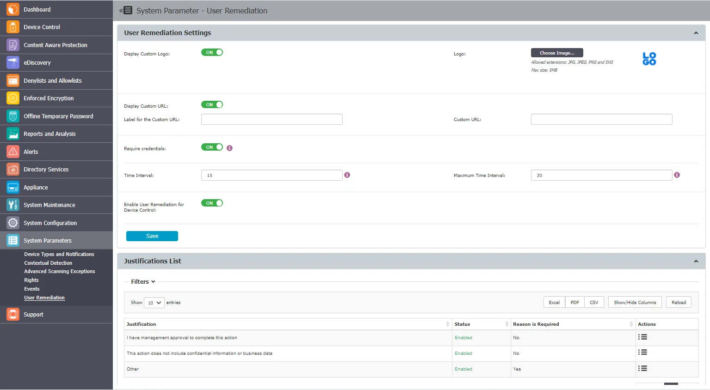

### User Remediation Settings

In this section, you can customize the User Remediation notification, manage settings and enable User
Remediation for Device Control.

- Display Custom Logo – select a 200x200 pixels image to display on the pop-up notification
- Display Custom URL – add a URL to direct the end-user to a specific web page, and then add a label
  for the URL

    :::note
    Endpoint Protector accepts the following URL formats:
    :::

    - http://endpointprotector.com
    - https://endpointprotector.com
    - http://www.endpointprotector.com
    - https://www.endpointprotector.com

- Require Credentials – request the end-user to use their local account or Active Directory
  credentials

    :::note
    Endpoint Protector accepts the following credential formats for login:
    :::

    - Local user - computer_name\username (John-PC\John)
    - LDAP/AD user
    - domain_name\username (epp.com\John)
    - ip\username (192.168.14.140\John)

- Time Interval – enter the time interval in which the end-user can remediate a Block and Remediated
  threat or a restricted-access device
- Maximum Time Interval – enter the maximum time interval in which the end-user can remediate a
  Block and Remediated threat or restricted-access device

    :::note
    The maximum time interval you can enter is 1440 minutes (24 hours).
    :::

- Enable User Remediation for Device Control – enable the setting to use the user remediation
  feature for the Device Control module.

    :::note
    Endpoint Protector disables the Enable User Remediation for Device Control setting by default. When you
    enable this feature, Endpoint Protector applies all the User Remediation settings to both
    the Content Aware Protection and Device Control modules.
    :::

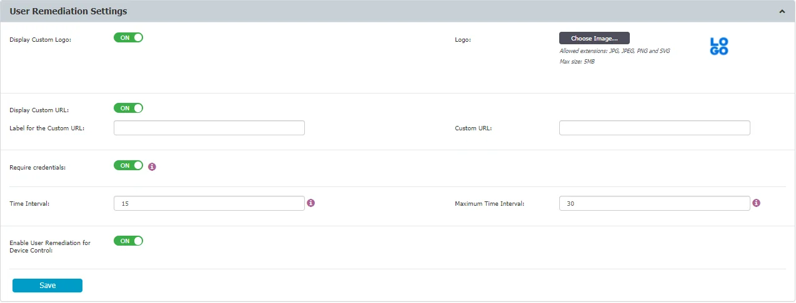

### Justifications List

In this section, you can view, add, edit, export, and remove justifications. The justification
represents the reason the end-user selects to justify the threat or device remediation.

To add a new justification, click **Add**, fill in the mandatory fields and then click **Save**. You
can add a maximum of 10 justifications. By default, Endpoint Protector already includes several
justifications, but ensure that at least one justification stays enabled at all times.

To enable and enforce the end-user to view User Remediation pop-up notifications, manage the option
from Device Control, Global Settings, [Device Control](/docs/endpointprotector/admin/dc_module/dcmodule.md).

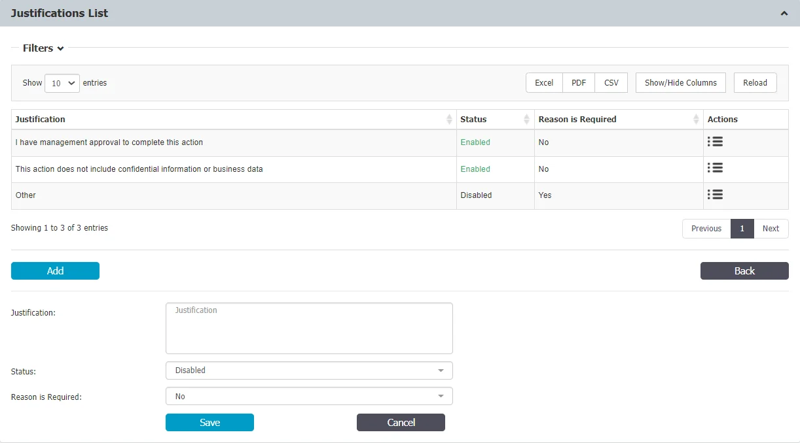

### Enabling User Remediation

To use User Remediation for Device Control:

**Step 1 –** Enable the User Remediation for Device Control feature from
[User Remediation Settings](#user-remediation-settings)

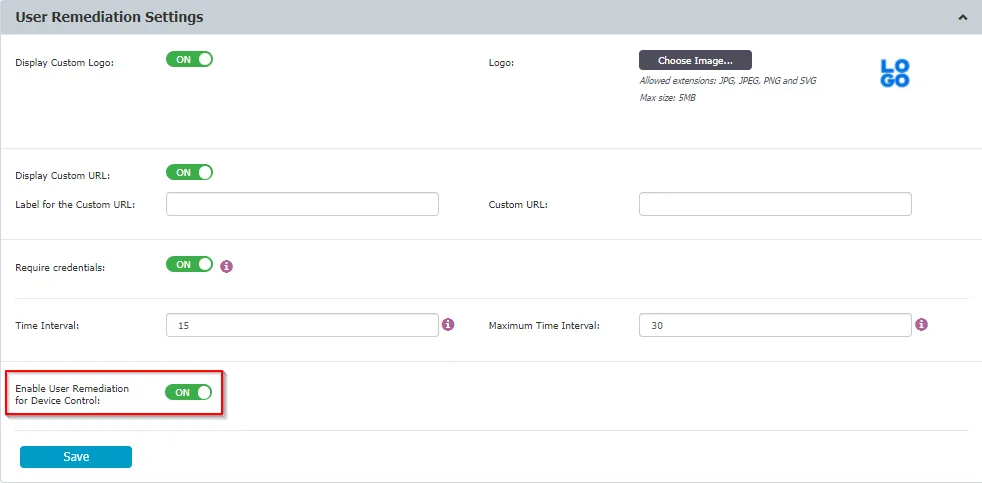

**Step 2 –** Customize the User Remediation notifications for Device Control.

To do so, go to the Devices Types and Notifications,
[Custom Device Control User Remediation Notifications](#custom-device-control-user-remediation-notifications)
section, click **Create**, fill in the mandatory fields and **Save**.

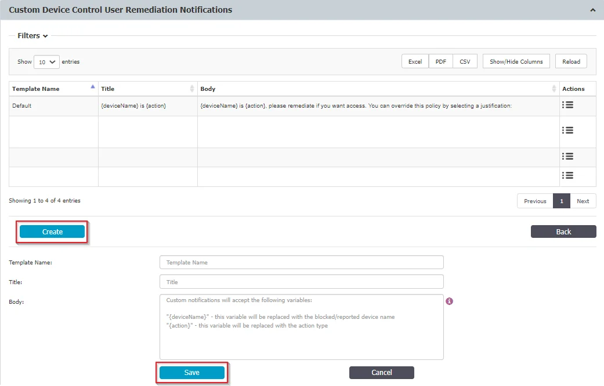

**Step 3 –** Enable the **User Remediation Pop-up** setting from the
[Device Control](/docs/endpointprotector/admin/dc_module/dcmodule.md) topic and then select the **customized notification**
from the User Remediation Notification Template dropdown list;

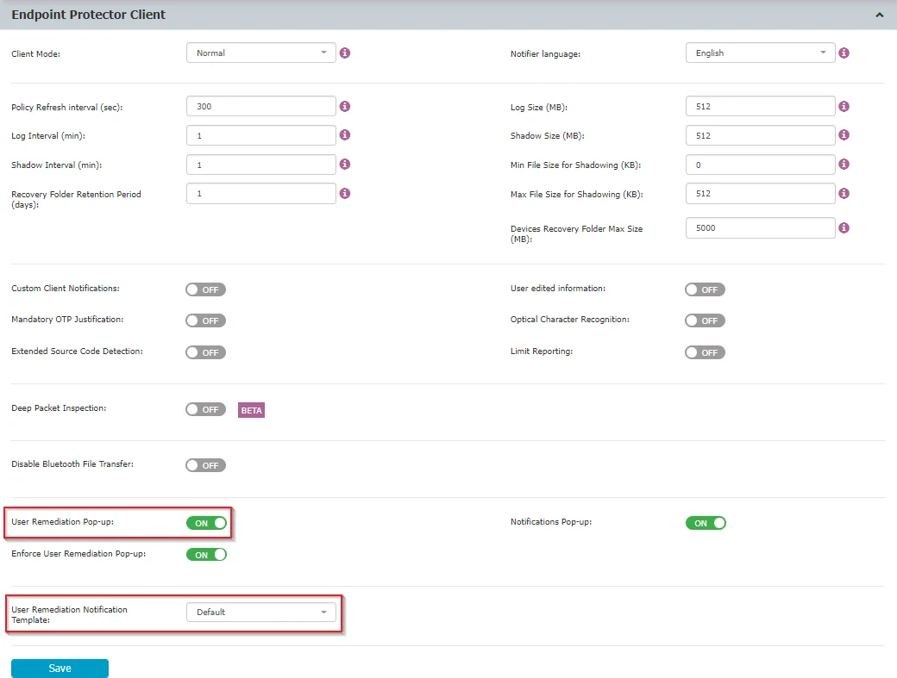

**Step 4 –** Navigate to [Device Control](/docs/endpointprotector/admin/dc_module/dcmodule.md), Device Types section and
enable **User Remediation** for devices with limited access – devices that have full access
permission can't benefit from the User Remediation feature.

:::note
For built-in devices, such as Webcam and Network share, the User Remediation feature is
not available.
:::

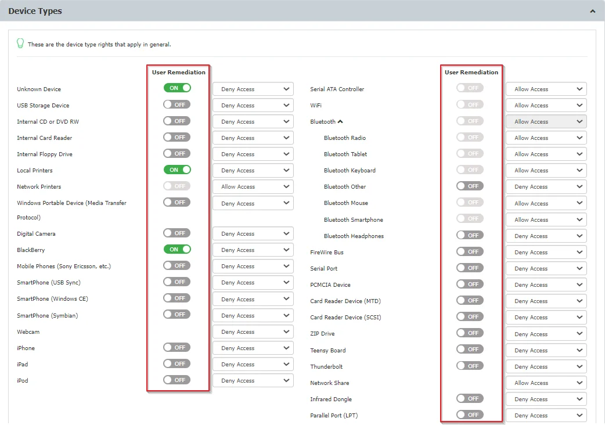

### User Remediation Usage

To remediate the device:

**Step 1 –** Open the Endpoint Protector notifier and go to the Device Control tab.

**Step 2 –** Select the device for remediation and click Self Remediate.

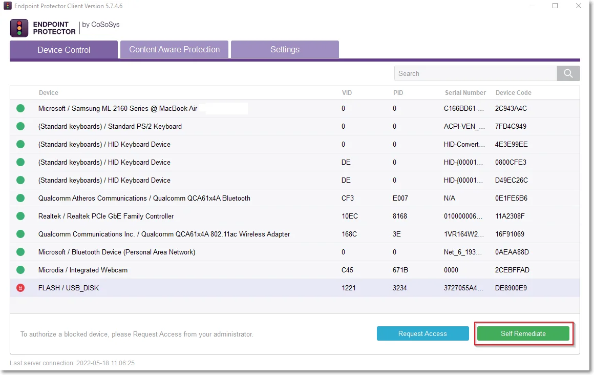

**Step 3 –** On the Self Remediate section:

1. Select a **justification** from the dropdown list.
2. Add a **reason** for the justification (if required).
3. Navigate to the **custom URL** situated under the logo.
4. Add your credentials if you enabled the **Require Credentials** setting (click the username icon
   to refresh your current username).

    1. When you reopen the dialog, if you authenticated with a different username, EPP Notifier
 will automatically switch back to the username of the logged-in user.
    2. Usernames aren't case sensitive.

5. Add the **number of minutes** needed to remediate the device (you can hover over the default
   number to view the maximum time interval)
6. Click **Authorize**.

:::note
You can manage more settings for the Self Remediate feature from System Preferences and
User Remediation sections.
:::

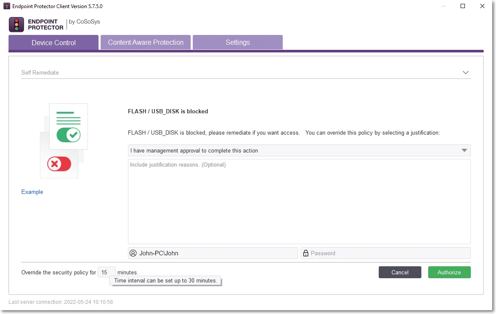

To stop the device remediation session at any time during the time interval, select the device from
the Device Control tab in the Endpoint Protector notifier and then click **Revoke Remediation**.

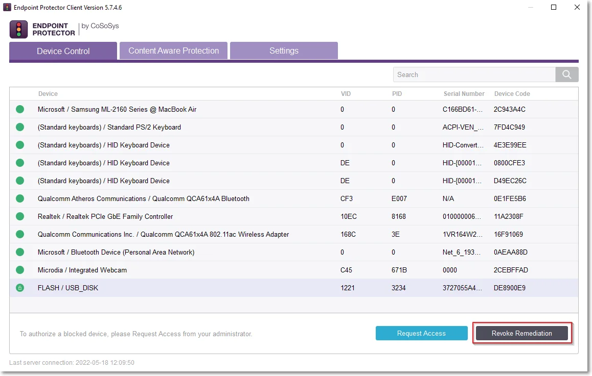
