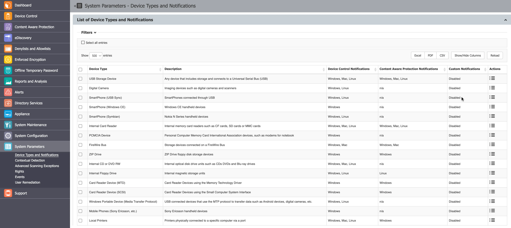

# System Parameters

## Device Types and Notifications

From this section you can view and manage device types and notifications, view and enable default
notifications and their translations and define custom notifications for Content Aware Protection
policies and Device Control User Remediation.



### List of Device Types and Notifications

On the List of Device Types and Notifications, you can view the Device Types available in the system
along with their availability for each operating system and if those devices can be inspected by the
Content Aware Protection module.

You can enable and edit the notification messages that appear on the Endpoint Protector Client from
the Actions column.


You can enable or disable messages from the Default Notifications list and edit custom notification
translations.

:::note
You can enable Custom Client Notifications globally from Device Control, Global Settings or
individually for computers or groups, from their specific Settings sections.
:::


### Custom Content Aware Protection Notifications

Endpoint Protector allows you to create informative notifications that users see when a Content
Aware Policy blocks or reports a file. These notifications provide context about the triggered
policy and the affected file.

Traditionally, Content Aware Protection Notifications were delivered in plain text. Starting from
Agent version 6.2.3.1 (Windows), 3.0.3.1 (Mac), and 2.4.3.1 (Linux), users can use HTML code to
format notifications. By utilizing HTML, administrators can highlight key information such as threat
names or affected files with bold, italics, or underlining, making it easier for users to
understand. In addition, you can employ colors to differentiate sections or emphasize critical
details within the notification. This results in visually engaging notifications that capture user
attention and ensure important information is not missed.

Follow the steps to create notifications.

**Step 1 –** Click the **Create** button.

**Step 2 –** Assign a descriptive **Template Name** for easy identification later.

**Step 3 –** Craft a clear and informative **Title** for the notification.

**Step 4 –** Within the **Body** text editor, compose your message using the provided placeholders:

- \{fileName\}: Replaced with the actual blocked/reported file name.
- \{type\}: Replaced with "blocked" or "reported" based on the policy type.
- \{threatName\}: Replaced with the identified threat name (if applicable).
- \{threatMatch\}: Replaced with the specific text that triggered the policy (if applicable).

**Step 5 –** Click **Save** to finalize your custom notification.


For example, the file named 'financial_report.xlsx' (`\{fileName\}`) was classified as
'Confidential' (`\{type\}`) because it contains confidential data.

Once created, you can associate the custom notification with a specific Content Aware Policy using
the Notification Template drop-down menu.

To ensure notifications display correctly and securely, Endpoint Protector supports a limited set of
HTML elements. The following list shows the supported elements you can use in your notifications.

- Basic Formatting:

    - `<b></b>` (bold)
    - `<i></i>` (italic)
    - `<u><u>` (underline)
    - `</br>` (line break)

- Text Styling:

    - `<span style="color: #rrggbb;">Text</span>` (color) - Replace `#rrggbb` with a hexadecimal
      color code (e.g., `style="color: red;"` for red text)
    - `<span style="font-size: xxpx;">Text<span>` (font size) - Replace `xxpx` with the desired font
      size in pixels (e.g., `style="font-size: 16px;"` for 16px font)

- Links:

    - `<a href="URL">Text</a>` - Replace `URL` with the actual website address and `Text` with the
      clickable link text (e.g., `<a href="https://www.netwrix.com">Netwrix Website</a>`)

Follow the steps to create notifications using HTML code.

**Step 1 –** As described in the previous steps, create a new notification by clicking **Create**
and entering a name, title, and body text.

**Step 2 –** Within the body text editor, directly enter the desired HTML code to format your
message.

### Custom Device Control User Remediation Notifications

This section is available only if the Device Control User Remediation setting is enabled from the
[User Remediation](#user-remediation) section. In this section you can add, edit and delete custom
notifications for Device Control User Remediation.

You can add a maximum of 100 custom notifications but you cannot delete the default entry.

Follow the steps to add a new custom notification.

**Step 1 –** Click **Create**.

**Step 2 –** Use these parameters to create your custom message:

- \{deviceName\}
- \{action\}

**Step 3 –** Click **Save**.

**Example: USB Driver(deviceName) is blocked(action)**

Once the notification was created, you can select the custom notification from the User Remediation
Notification Template drop-down located in the Device Control section, Global Setting, Users,
Computers and Groups.


## Contextual Detection

From this section, you can manage the contextual detection for the entire system. If enabled, the
confidential information detected by Endpoint Protector will be inspected for both content and
context.

In addition to the function that detects sensitive information (e.g.: Credit Cards, IDs, Passports,
Driving Licenses, etc.), the context will also be taken into consideration (e.g.: proximity to other
relevant keywords, other related functions, regular expressions, etc.).

In addition to providing context to the detected sensitive information, this functionality also
helps decrease false positives.

:::note
This feature applies at a global level, for both Content Aware Protection and eDiscovery
Policies. If enabled, the context detection will supersede the content only detection through the
system. Please ensure the accuracy of the rules and the relevance for your scenarios before enabling
this functionality.
:::


Once the Contextual Detection feature is enabled, it will apply at a global level, based on the
rules defined in the Contextual XML (but also linked to the configured Content Aware Protection and
eDiscovery policies).

There are two options to create the Contextual rules:

- creating it directly from the Endpoint Protector Server
- manually editing the Contextual XML and then uploading it to the Endpoint Protector Server

:::note
To address conflicts between Global and per-policy Contextual Rules, Endpoint Protector
Clients no longer receive Global Contextual Rules if at least one policy has its individual
Contextual Rule set. This marks the deprecation of Global Contextual Rules, emphasizing the
prioritization of individual policy configurations.
:::


### Creating the XML

This method is recommended for general use as it is the easiest method and it can cover most use
cases.


For each category of Predefined Content (e.g.: Credit Cards, IDs, Passports, Driving Licenses, etc.),
contextual detection can be configured by clicking on the **Add** button and selecting options such
as:

- Category and Type – the content aware detection function.
- Surrounding text – the number of characters of the search interval to determine the context.
- Related Dictionary – a set of keywords related to the PII.
- Related Regular Expression – an additional way of adding a related rule that is not among the
  content aware detection functions.
- Related File Type – the related file type.
- Related File Size (MB) – the related file size, in megabytes.
- Minimum Matches – the minimum number of items to match to validate the detection rule.
- Unrelated Dictionary – a set of keywords not related to the PII.
- Unrelated Regular Expression – an additional way of adding a non-related rule that is not among
  the content aware detection functions.
- Unrelated File Type – the unrelated file type.
- Unrelated File Size (MB) – the unrelated file size, in megabytes.
- Maximum Matches – the value above which the rule will not be validated (recommended value is 0).

:::warning
Do not forget to Generate the Contextual XML after creating or making changes to
contextual rules!
:::


### Uploading the XML

This method is recommended for advanced Administrators as it offers extended functionalities but it
also requires a deeper understanding of the XML syntax.

Advanced contextual functionalities are also available. For this method, the Contextual XML file has
to be edited manually by the Administrator and then uploaded to the Endpoint Protector Server.

Proximity, Dictionaries, Regex, etc. have to be defined within the XML document. In addition to the
functionalities described in the previous chapter, there are more complex options available like:
Confidence Level, additional Functions to consider when determining the Main Function, etc.

Study the examples provided within Endpoint Protector Server to understand the syntax needed in the
Contextual XML.

**Example**

```
<Rules>
 <!-- SSN / Canada this is an example with multiple patterns -->
 <Entity id="ssn/canada" patternsProximity="300" recommendedConfidence="75">
  <Pattern confidenceLevel="75">
   <Any minMatches="2">
   <Match idRef="keywords_Canada_SSN_1" />
     <Match idRef="keywords_Canada_SSN_2" />
   <Match idRef="validate_date_fct" />
     <Match idRef="regex_email_id" /> <!-- This is just an example -->
   </Any>
      <Any maxMatches="0">
   <Match idRef="keywords_exclude_Canada_SSN" />
     </Any>
  </Pattern>
</Entity>
  <Function id="validate_date_fct" name="SEARCH_DATE_INTRL" /> <!-- name should be the
same with the one on the client -->
  <Function id="func_dlp_is_valid_ssn" name="SEARCH_SSN_Canada" /> <!-- name
should be the same with the one on the client -->
```

**Example**

```
<Keyword id="keywords_Canada_SSN_1">
  <Group matchStyle="word">
    <Term>sin</Term>
    <Term>social insurance</Term>
    <Term>numero d'assurance sociale</Term>
    <Term>sins</Term>
    <Term>ssn</Term>
    <Term>ssns</Term>
    <Term>social security</Term>
    <Term>numero d'assurance sociale</Term>
    <Term>national identification number</Term>
    <Term>national id</Term>
    <Term>sin#</Term>
 </Group>
</Keyword>
<Keyword id="keywords_Canada_SSN_2">
  <Group matchStyle="word">
    <Term>driver's license</Term>
    <Term>drivers license</Term>
    <Term>driver's license</Term>
    <Term>drivers license</Term>
    <Term>DOB</Term>
    <Term>Birthdate</Term>
 </Group>
</Keyword>
<Keyword id="keywords_exclude_Canada_SSN">
  <Group matchStyle="word">
     <Term>random word</Term>
 </Group>
</Keyword>
<Regex id="regex_email_id">[-0-9a-zA-Z.+_]+@[-0-9a-zA-Z.+_]+\.[a-zA-Z]{2,4}</Regex>
</Rules>
</RulePackage>
```

## Advanced Scanning Detection

The Windows environment is subject to constant OS and security updates and the installed
applications are in a constant loop of continuous development. To avoid eventual changes that
interfere with the Endpoint Protector Client, the ability to allow applications and processes is
available.

The Advanced Scanning Exceptions feature allows applications to be excluded from scanning for
endpoints with the Advanced Printing and MTP Scanning feature enabled.

This feature maintains a list of applications into which Endpoint Protector will not inject its DLL
when the “Advanced Printer and MTP Scanning” is enabled. For instance, many applications that cannot
print or copy files to MTP devices do not require the injection of the Endpoint Protector DLL.
Adding such applications to the exceptions list improves performance and avoids unexpected
interactions with Endpoint Protector.

:::note
This feature applies at a global level for all Windows endpoints with the Advanced
Printing and MTP Scanning features enabled.
:::


## Rights

This subsection displays a list with all access rights that can be assigned to devices.


## Events

In this section you can view, manage and export the events list logged by Endpoint Protector. You
can also edit event names and descriptions or enable/disable logging for specific events from the
Actions column.


### Events Types and Descriptions

This subsection displays a comprehensive list of events, and ensures that administrators can
effectively manage and monitor their data protection policies. Additionally, there are more specific
events, such as those related to EasyLock deployment, printer activity, user information updates,
transfer limits, external repository uploads, content remediation, forced uninstall attempts, device
remediation sessions, certificate management, unplanned client terminations, artifact receipts, and
DPI bypassed traffic. These events provide granular insight into various system activities, ensuring
that organizations can maintain robust security and compliance measures.

For a detailed view of all events and their descriptions, please see the table below.

| Event Name                                   | Description                                                                                                                     |
| -------------------------------------------- | ------------------------------------------------------------------------------------------------------------------------------- |
| Connected                                    | Device Connected                                                                                                                |
| Disconnected                                 | Device Disconnected                                                                                                             |
| File Read                                    | File read from device                                                                                                           |
| File Write                                   | File written to device                                                                                                          |
| File Read-Write                              | File read and write from device                                                                                                 |
| File Rename                                  | File from device renamed                                                                                                        |
| File Delete                                  | File deleted from device                                                                                                        |
| Device TD                                    | Trusted Device™ connected                                                                                                       |
| Deleted                                      | File deleted from device                                                                                                        |
| Enable Read-Only                             | Device Read-Only Enabled                                                                                                        |
| Enable if TD Level 1                         | Allows access when a Trusted Device™ is connected (e.g., a USB stick with EasyLock installed, which is automatically launched)  |
| Enable if TD Level 2                         | Allows access when Trust Level 2 device is connected                                                                            |
| Enable if TD Level 3                         | Allows access when Trust Level 3 device is connected                                                                            |
| Enable if TD Level 4                         | Allows access when Trust Level 4 device is connected                                                                            |
| AD Synchronization                           | AD Synchronization                                                                                                              |
| Blocked                                      | Device or port blocked                                                                                                          |
| Unblocked                                    | Device or port unblocked                                                                                                        |
| Offline Temporary Password Used                | Offline Temporary Password Used                                                                                                   |
| User Login                                   | User Login                                                                                                                      |
| File Encrypt                                 | File encrypted using EasyLock                                                                                                   |
| File Decrypt                                 | File decrypted using EasyLock                                                                                                   |
| File Encrypt (offline)                         | File encrypted using EasyLock when not communicating with the Endpoint Protector Server                                         |
| File Decrypt (offline)                         | File decrypted using EasyLock when not communicating with the Endpoint Protector Server                                         |
| Content Threat Detected                      | Content Aware Protection <ul><li>Threat Detected</li></ul>                                                                      |
| Content Threat Blocked                       | Content Aware Protection <ul><li>Threat Blocked</li></ul>                                                                       |
| File Copy                                    | A file was copied to or from a removable device                                                                                  |
| Content Threat Discovered                    | eDiscovery <ul><li>Threat Discovered</li></ul>                                                                                  |
| eDiscovery Client Action                     | eDiscovery <ul><li>Action received successfully</li></ul>                                                                       |
| User Logout                                  | User Logout                                                                                                                     |
| Client Integrity OK                          | Endpoint Protector Client Integrity ok                                                                                          |
| Client Integrity Fail                        | Endpoint Protector Client Integrity failed                                                                                      |
| Policies Received                            | Endpoint Protector Client received policy successfully                                                                          |
| Uninstall Attempt                            | Endpoint Protector Client uninstall attempt                                                                                     |
| EasyLock – successfully deployed             | EasyLock <ul><li>successfully deployed</li></ul>                                                                                |
| EasyLock <ul><li>deployment failed</li></ul> | EasyLock <ul><li>deployment failed</li></ul>                                                                                    |
| File Printed                                 | File sent to printer successfully                                                                                               |
| User Information Updated                     | User information updated successfully                                                                                           |
| Transfer Limit Reached                       | Transfer Limit Reached                                                                                                          |
| External Repository Upload                   | File Shadow uploaded to Repository successfully                                                                                 |
| External Repository Upload Fail              | File Shadow uploaded to Repository failed                                                                                       |
| Content Remediation Session Active           | Content Aware Protection <ul><li>Threat Remediated</li></ul>                                                                    |
| Content Remediation Request Canceled by User | Content Aware Protection <ul><li>User Remediation dialog was closed by the user</li></ul>                                       |
| Forced Uninstall Attempt                     | Endpoint Protector Client forced uninstall attempt                                                                              |
| Device Remediation Request Canceled by User  | Device Control <ul><li>User Remediation dialog was closed by the user</li></ul>                                                 |
| Device Remediation Session Canceled          | Device Temporarily Unlock with User Remediation canceled                                                                        |
| Device Remediation Session Active            | Device Temporarily Unlocked with User Remediation                                                                               |
| Device Remediation Session Ended             | Device Temporarily Unlock with User Remediation ended                                                                           |
| Certificate added to Keychain/store           | Certificate added to Keychain/store successfully                                                                                 |
| Unplanned Client Termination                 | Unplanned Client Termination                                                                                                    |
| Artifact Received                            | Artifact Received                                                                                                               |
| DPI Bypassed Traffic                           | DPI Bypassed Traffic                                                                                                              |


## User Remediation

User remediation is a feature that allows the end-users to apply a justification and self-remediate a
policy violation or a restricted-access device.


### User Remediation Settings

In this section, you can customize the User Remediation notification, manage settings and enable User
Remediation for Device Control.

- Display Custom Logo – select a 200x200 pixels image to be displayed on the pop-up notification
- Display Custom URL – add a URL to direct the end-user to a specific web page, and then add a label
  for the URL

    :::note
    The following URL formats are accepted:
    :::


    - http://endpointprotector.com
    - https://endpointprotector.com
    - http://www.endpointprotector.com
    - https://www.endpointprotector.com

- Require Credentials – request the end-user to use their local account or Active Directory
  credentials

    :::note
    The following credential formats are accepted for login:
    :::


    - Local user - computer_name\username (John-PC\John)
    - LDAP/AD user
    - domain_name\username (epp.com\John)
    - ip\username (192.168.14.140\John)

- Time Interval – enter the time interval in which the end-user can remediate a Block and Remediated
  threat or a restricted-access device
- Maximum Time Interval – enter the maximum time interval in which the end-user can remediate a
  Block and Remediated threat or restricted-access device

    :::note
    The maximum time interval you can enter is 1440 minutes (24 hours).
    :::


- Enable User Remediation for Device Control – enable the setting to use the user remediation
  feature for the Device Control module.

    :::note
    The Enable User Remediation for Device Control setting is disabled by default. By
    enabling this feature, all the settings regarding User Remediation will be applied to both
    Content Aware Protection and Device Control modules.
    :::


### Justifications List

In this section, you can view, add, edit, export, and remove justifications. The justification
represents the reason selected by the end-user to justify the threat or device remediation.

To add a new justification, click **Add**, fill in the mandatory fields and then click **Save**. You
can add up to a maximum of 10 justifications. By default, several justifications are already added,
but make sure that at least one justification is enabled all the time.

To enable and enforce the end-user to view User Remediation pop-up notifications, manage the option
from Device Control, Global Settings, [Device Control](/docs/endpointprotector/admin/dc_module/dcmodule.md).


### Enabling User Remediation

Follow the steps to use User Remediation for Device Control.

**Step 1 –** Enable the User Remediation for Device Control feature from
[User Remediation Settings](#user-remediation-settings)


**Step 2 –** Customize the User Remediation notifications for Device Control.

To do so, go to the Devices Types and Notifications,
[Custom Device Control User Remediation Notifications](#custom-device-control-user-remediation-notifications)
section, click **Create**, fill in the mandatory fields and **Save**.


**Step 3 –** Enable the **User Remediation Pop-up** setting from the
[Device Control](/docs/endpointprotector/admin/dc_module/dcmodule.md) topic and then select the **customized notification**
from the User Remediation Notification Template drop-down list;


**Step 4 –** Navigate to [Device Control](/docs/endpointprotector/admin/dc_module/dcmodule.md), Device Types section and
enable **User Remediation** for devices with limited access – devices that have full access
permission cannot benefit from the User Remediation feature.

:::note
For built-in devices, such as Webcam and Network share, the User Remediation feature is
not available.
:::


### User Remediation Usage

Follow these steps to remediate the device.

**Step 1 –** Open the Endpoint Protector notifier and go to the Device Control tab.

**Step 2 –** Select the device for remediation and click Self Remediate.


**Step 3 –** On the Self Remediate section:

1. Select a **justification** from the drop-down list.
2. Add a **reason** for the justification (if required).
3. Navigate to the **custom URL** situated under the logo.
4. Add your credentials if the **Require Credentials** setting was enabled (click the username icon
   to refresh your current username).

    1. When reopening the dialog, if a different username was used for authentication, EPP Notifier
       will automatically switch back to the username of the currently logged-in user.
    2. Usernames are not case sensitive.

5. Add the **number of minutes** needed to remediate the device (you can hover over the default
   number to view the maximum time interval)
6. Click **Authorize**.

:::note
You can manage more settings for the Self Remediate feature from System Preferences and
User Remediation sections.
:::


To stop the device remediation session at any time during the time interval, select the device from
the Device Control tab in the Endpoint Protector notifier and then click **Revoke Remediation**.


