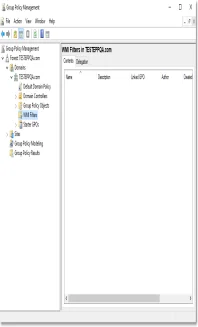
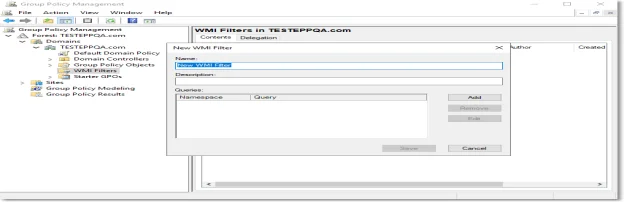
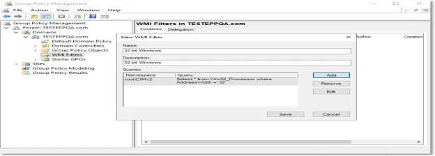
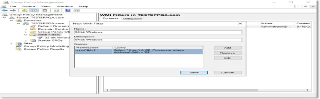

# Creating WMI Filters

To create the Windows Management Instrumentation (WMI) filters, follow these steps:

**Step 1 –** Open the Group Policy Management console, expand Domains and then the domain tree;

**Step 2 –** Right-click WMI Filters and select New – this will open the New WMI Filter window;

**Step 3 –** On the New WMI Filter window, add entries for 32-bit and 64-bit WMI filters by
providing the name, description, and queries;

32-bit WMI Filters:

64-bit WMI Filters:

**Step 4 –** The new filters will be displayed in the WMI Filters folder.

Selecting the 32-bit and 64-bit operating systems:

- 32-bit Operating System: Select \* from Win32_Processor where AddressWidth = '32'
- 64-bit Operating System: Select \* from Win32_Processor where AddressWidth = '64'

You can add the following queries to target certain oeprating systems and/or type of computers:

- Workstation: Select \* from WIN32_OperatingSystem where ProductType=1
- Domain Controller: Select \* from WIN32_OperatingSystem where ProductType=2
- Server: Select \* from WIN32_OperatingSystem where ProductType=3
- Windows XP: Select \* from WIN32_OperatingSystem where Version='5.1.2600' and ProductType=1
- Windows Vista: Select \* from WIN32_OperatingSystem where Version='6.0.6002' and ProductType=1
- Windows 7: Select \* from WIN32_OperatingSystem where Version='6.1.7600' and ProductType=1
- Windows 8: SELECT \* FROM Win32_OperatingSystem WHERE Version LIKE "6.2%" AND ProductType="1"
- Windows 8.1: SELECT \* FROM Win32_OperatingSystem WHERE Version LIKE "6.3%" AND ProductType="1"
- Windows 10: SELECT \* FROM Win32_OperatingSystem WHERE Version LIKE "10%" AND ProductType="1"
- Windows Server 2003: Select \* from WIN32_OperatingSystem where Version='5.2.3790' and
  ProductType>1
- Windows Server 2008: Select \* from WIN32_OperatingSystem where Version='6.0.6002' and
  ProductType>1
- Windows 2008 R2: Select \* from WIN32_OperatingSystem where Version='6.1.7600' and ProductType>1
- Window Server 2012: SELECT \* FROM Win32_OperatingSystem WHERE Version LIKE "6.2%" AND
  ProductType="2"
- Windows Server 2012R2: SELECT \* FROM Win32_OperatingSystem WHERE Version LIKE "6.3%" AND
  ProductType="2"
- Windows Server 2016: SELECT \* FROM Win32_OperatingSystem WHERE Version LIKE "10.0%" AND
  ProductType="2"
- Windows Server 2019: SELECT \* FROM Win32_OperatingSystem WHERE BuildNumber >= 17763 AND
  (ProductType="3" OR ProductType="2")
