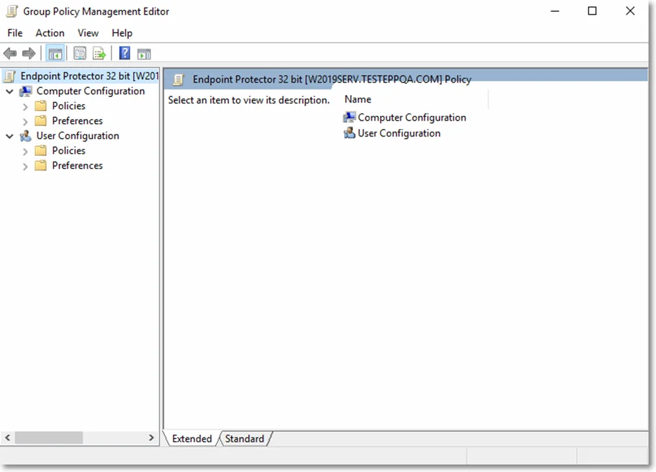
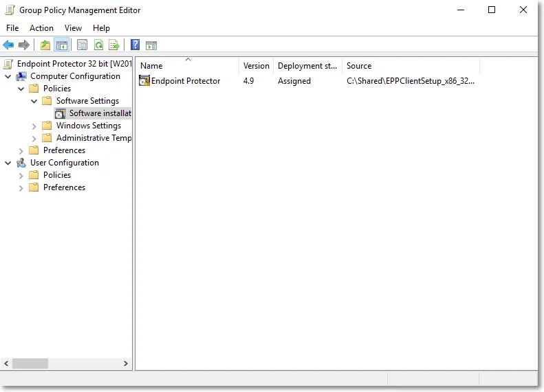

# Creating the Deployment GPO

To create the deployment Group Policy Objects (GPO), follow these steps:

**Step 1 –** Open the Group Policy Management console, right-click Group Policy Objects and click
New;

**Step 2 –** Add Endpoint Protector 32 bit as the GPO name;

**Step 3 –** Right-click the new GPO and click Edit;

**Step 4 –** Expand Computer Configuration / Software Settings and right-click Software
Installation, and then select New/Package;

:::note
When browsing the ‘msi’ file, ensure it is located in a folder shared over your network
and accessible by the computers on your Active Directory.
:::

**Step 5 –** Close the Group Policy Object Editor console and repeat this step for the Endpoint
Protector 64-bit GPO.
