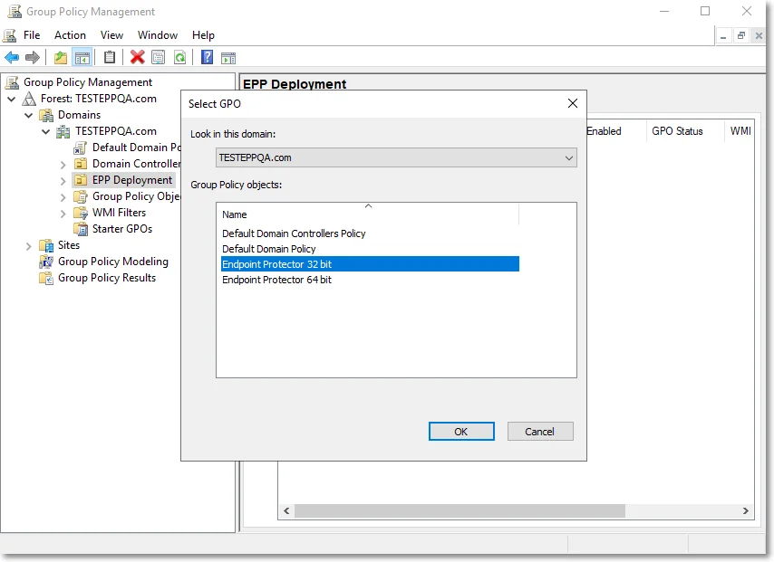

# Linking the GPO to OU

Once you have created the GPOs, link them to any of your Organization Units (OU). To do so, follow
these steps:

**Step 1 –** Right-click the OU and then select Link an Existing GPO;

**Step 2 –** From the Group Policy objects, select Endpoint Protector 32 bit and then click OK;

**Step 3 –** Repeat these steps and select the Endpoint Protector 64-bit.

:::note
The new policies will be applied only when the target computers are rebooted.
:::

