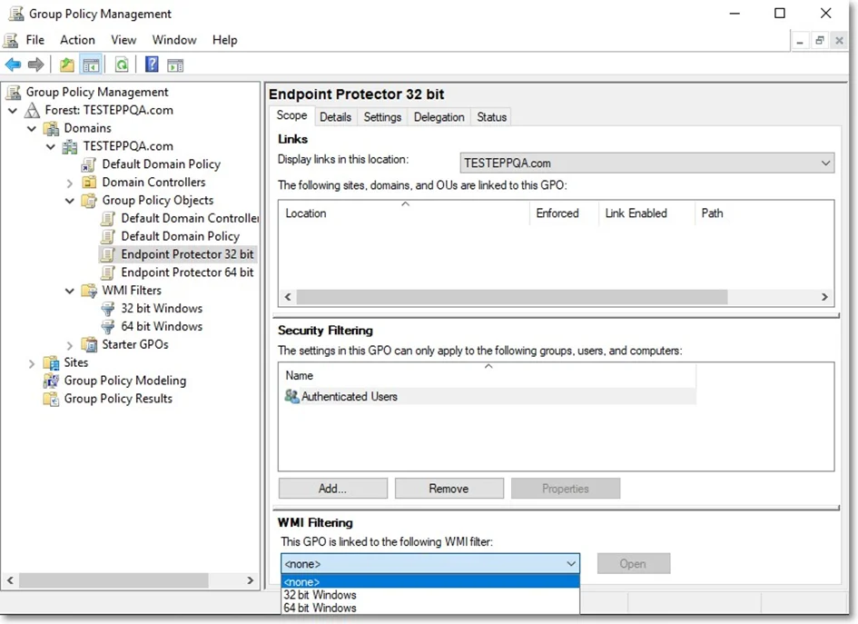

# Linking the WMI to GPO

To link the WMI filters to each GPO, follow these steps:

**Step 1 –** Open the Group Policy Management console, select the Endpoint Protector 32-bit policy,
and on the WMI Filtering section, select 32-bit Windows filter;

**Step 2 –** Repeat this step for Endpoint Protector 64-bit GPO.

