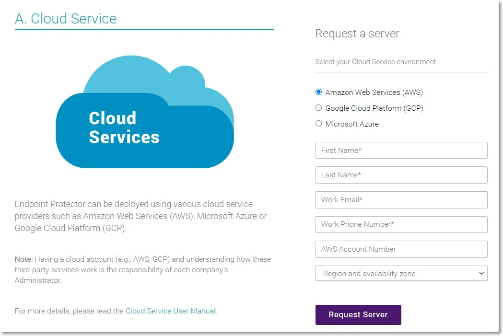

# Amazon Web Services

In this section of our user guide, you will find comprehensive instructions for leveraging Endpoint
Protector within your AWS environment. Whether you are seeking to safeguard sensitive data, enhance
compliance measures, or ensure secure communication channels, Endpoint Protector offers robust
protection. Below, you will find step-by-step guidance on obtaining the Endpoint Protector AMI,
launching your EC2 instance, configuring network settings, requesting an Elastic IP, and
implementing additional security measures to fortify your instance.

## Obtaining the AMI

Endpoint Protector is not generally available in the AWS Marketplace. To access the Amazon Machine
Image (AMI), you need to contact your Endpoint Protector sales representative directly or submit a
request to your Customer Management lead. Please provide information such as your AWS account
number, region, and availability zone. You will receive a reply from an Endpoint Protector
representative, notifying you when the Endpoint Protector Amazon Machine Image has been shared with
your account.

