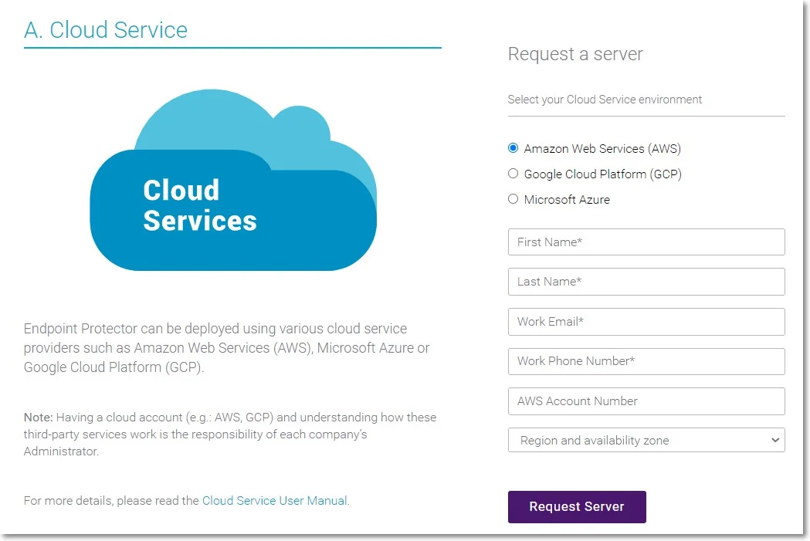

# Amazon Web Services

This section provides comprehensive instructions for using Endpoint Protector within your AWS environment. Whether you are seeking to safeguard sensitive data, enhance
compliance measures, or ensure secure communication channels, Endpoint Protector offers robust
protection. The following sections provide step-by-step guidance on obtaining the Endpoint Protector AMI,
launching your EC2 instance, configuring network settings, requesting an Elastic IP, and
implementing additional security measures to strengthen your instance.

## Obtaining the AMI

Endpoint Protector isn't generally available in the AWS Marketplace. To access the Amazon Machine
Image (AMI), contact your Endpoint Protector sales representative or Customer Management lead with your AWS account
number, region, and availability zone. An Endpoint Protector representative will notify you when the
AMI has been shared with your account.

