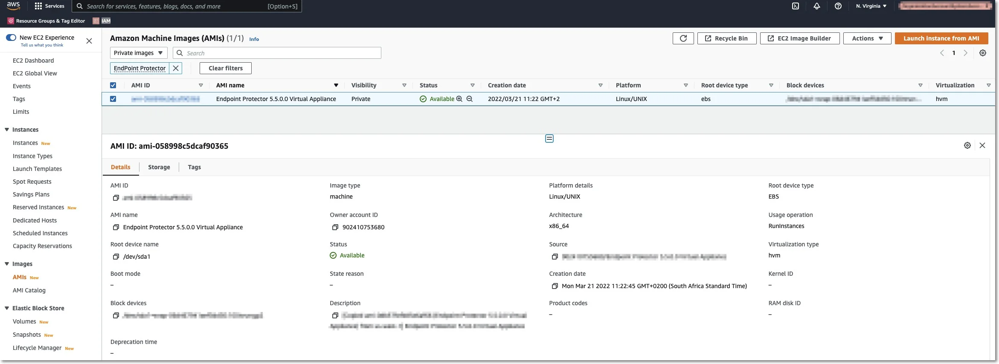
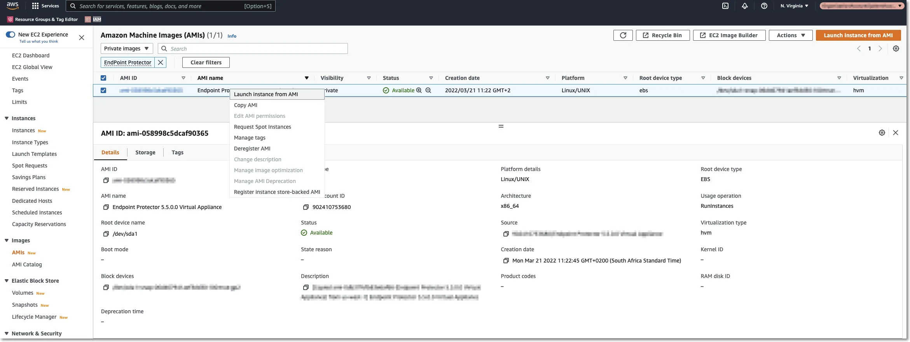
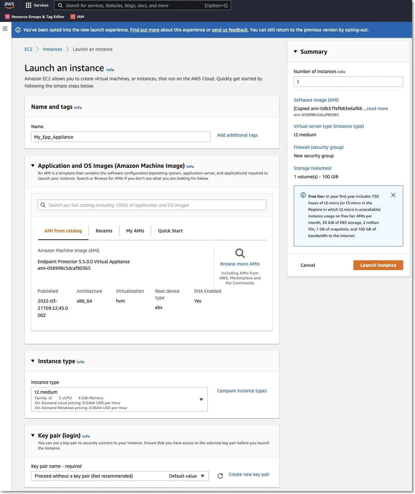
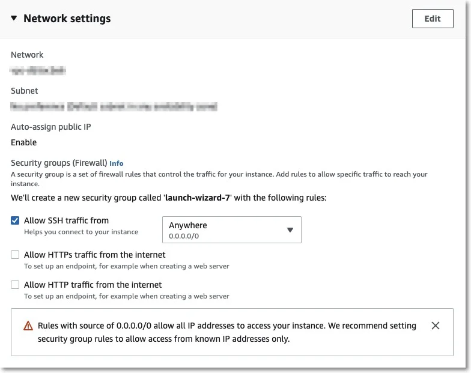
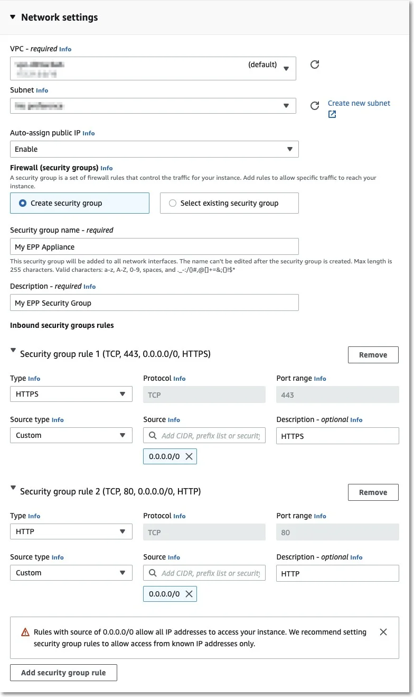
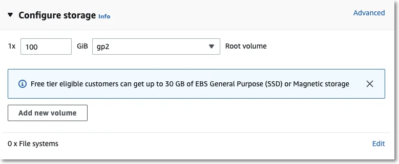
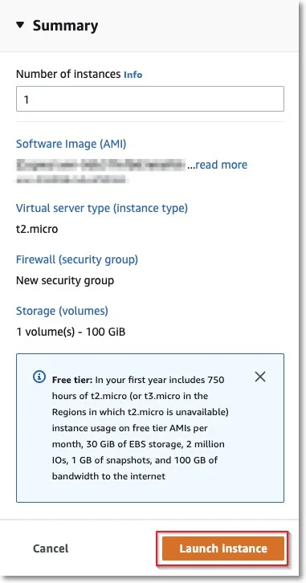
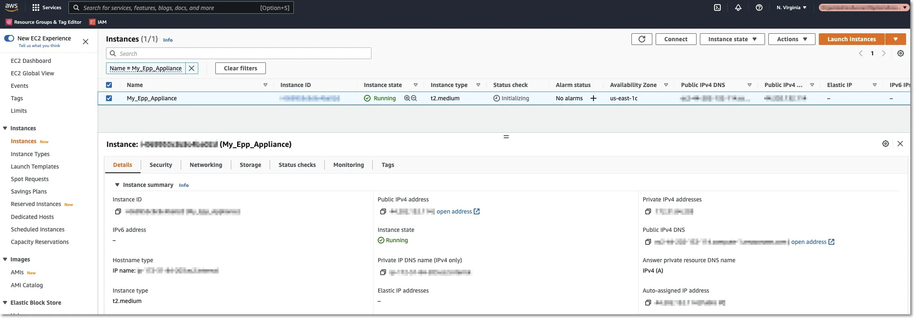

# Launching the EC2 Image

As the Endpoint Protector image has already been shared with you, this process is similar to any
other EC2 launch.

Follow the steps to launch the EC2 image.

**Step 1 –** Go to Services: EC2 and select your region.

**Step 2 –** Go to Images: AMIs and select the type of the Private image and search for Endpoint
Protector.

**Step 3 –** Right-click and select **Launch Instance from AMI**.

**Step 4 –** Enter the Name and Create tags as per your policies.

**Step 5 –** Select an Instance Type.

:::note
For assistance in selecting the instance type that best suits your needs, customers should
submit a support ticket through the
[Netwrix Customer Portal](https://www.netwrix.com/sign_in.html?rf=my_products.html).
:::

**Step 6 –** Select an available key pair or create a new key pair.

If you choose to use a key pair, you may need to share it with our Support Team for certain support
requests. Ensure that the key pair is used exclusively for this instance to maintain security. We
recommend selecting **Proceed without a Key Pair** and then clicking **Launch Instances**.

**Step 7 –** Configure the Network section.

**Step 8 –** Edit Network Section and provide the following information:

- Select a VPC and a Subnet
- Enable the Auto-assign public IP
- Select Create security group and then provide a name and description
- Remove the existing Inbound rules
- Add two new Inbound security group rules:

    - Type HTTPS, Protocol TCP, Port range 443, Source type Custom, Source 0.0.0.0/0 (mandatory)
    - Type HTTP, Protocol TCP, Port range 80, Source type Custom, Source 0.0.0.0/0 (optional)

**Step 9 –** The Storage section does not require any changes.

**Step 10 –** On the Summary section click **Launch Instance**.

**Step 11 –** Wait for the instance to start; this might take a few minutes while the Status Checks
appear as Initializing.

