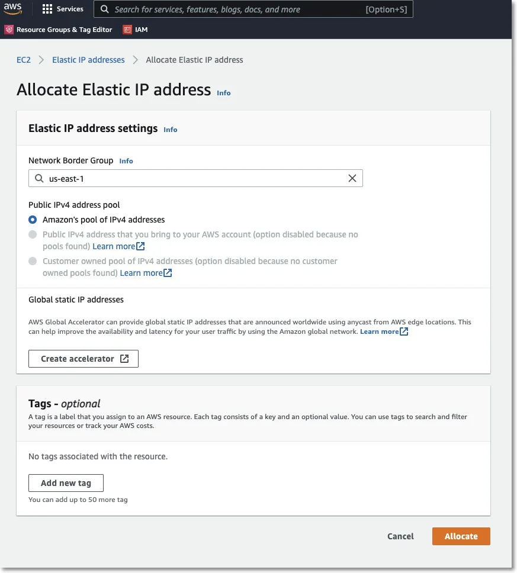
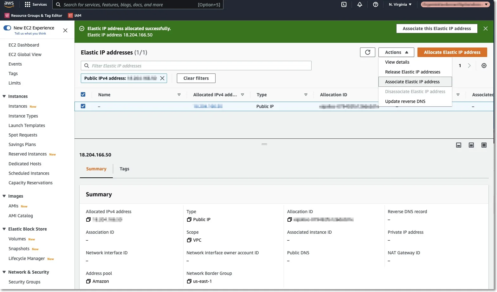
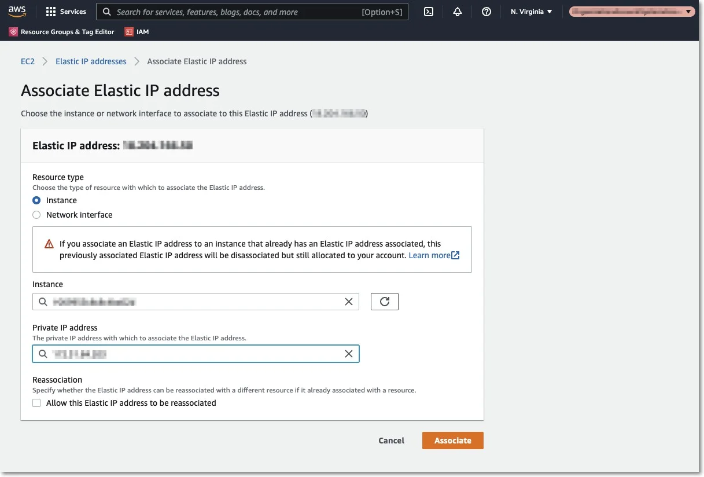

# Requesting an Elastic IP

This step is required so the Endpoint Protector Clients can communicate with the same IP Address in
case of an instance restart. Without an Elastic IP (Static IP) the instance will assign a new IP
address every time it is restarted and the Endpoint Protector Clients have to be reinstalled.

To request an Elastic IP, go in the AWS Management Console to the option Network & Security, Elastic
IPs, and click Allocate New Address.

**Step 1 –** Associate the Elastic IP with your Endpoint Protector Instance.

**Step 2 –** Select the Endpoint Protector Instance from the dropdown list, the Private IP address,
and then click Associate;

The Elastic IP is now associated with your Endpoint Protector Instance. After a few minutes, the
Endpoint Protector Instance will be running associated with the Elastic IP.

:::note
We recommend further securing your Instance by making all possible settings in the AWS
Interface under the option Security Groups.

:::
