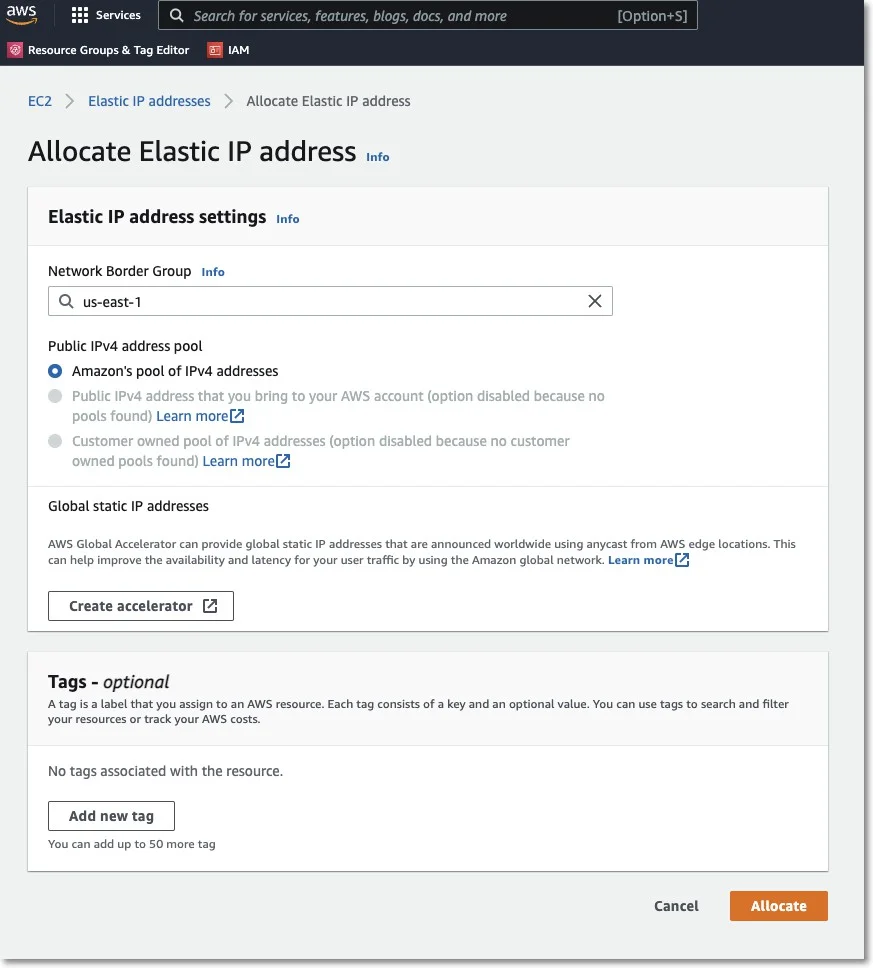
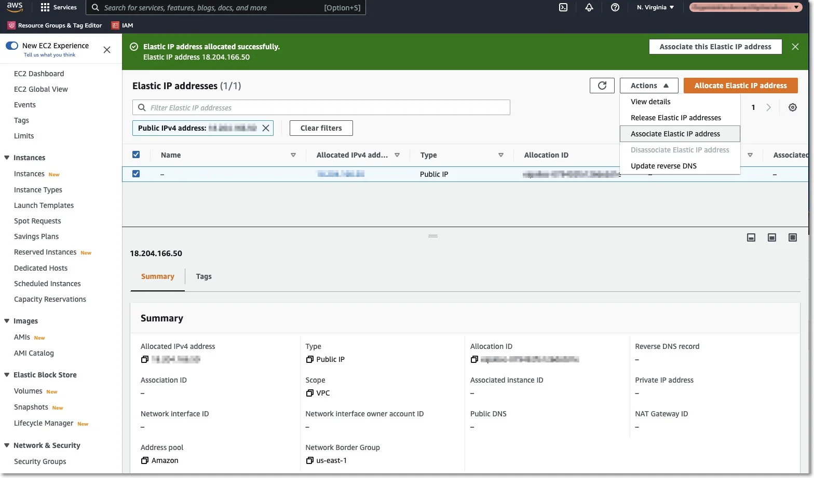
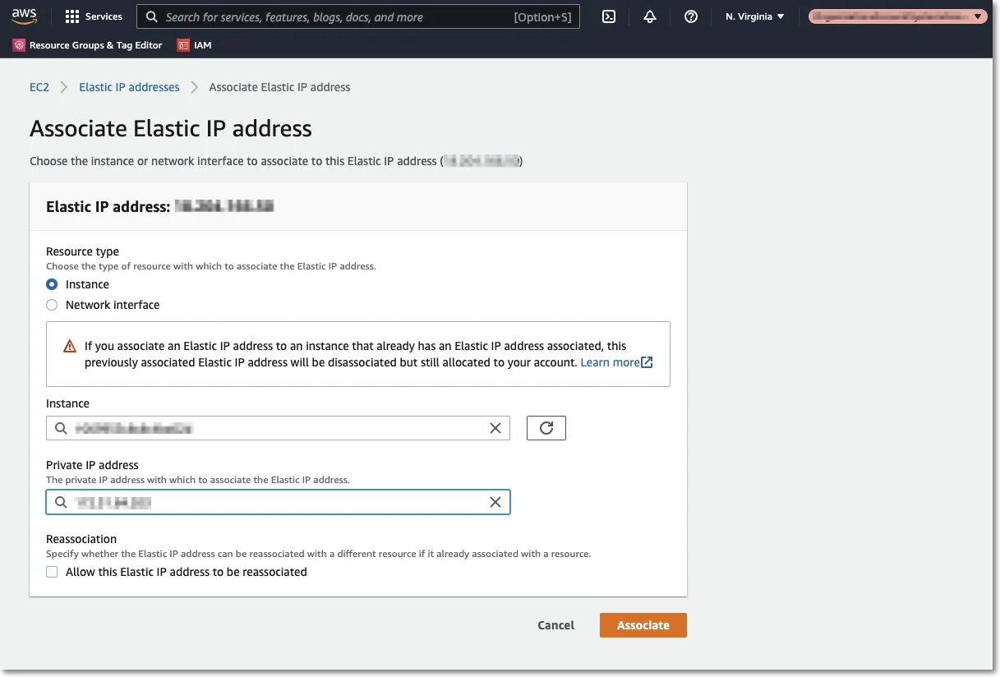

# Requesting an Elastic IP

Complete this step so the Endpoint Protector Clients can communicate with the same IP Address in
case of an instance restart. Without an Elastic IP (Static IP), the instance will assign a new IP
address every time it restarts, and you must reinstall the Endpoint Protector Clients.

To request an Elastic IP, go in the AWS Management Console to the option Network & Security, Elastic
IPs, and click Allocate New Address.

**Step 1 –** Associate the Elastic IP with your Endpoint Protector Instance.

**Step 2 –** Select the Endpoint Protector Instance from the dropdown list, the Private IP address,
and then click Associate;

You now have the Elastic IP associated with your Endpoint Protector Instance. After a few minutes, the
Endpoint Protector Instance will run with the Elastic IP.

:::note
Further secure your Instance by making all possible settings in the AWS Interface under Security Groups.
:::
