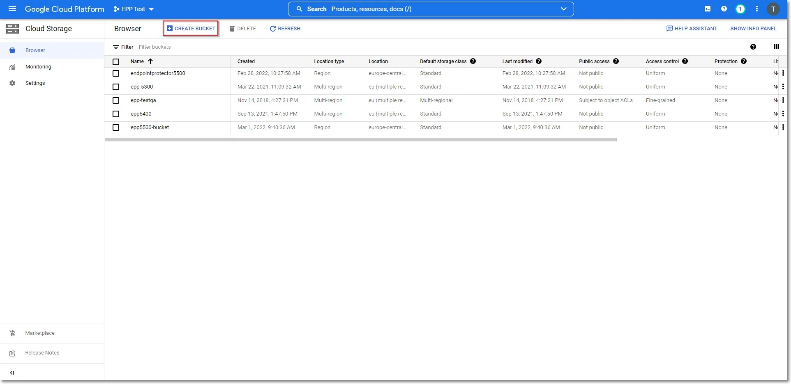
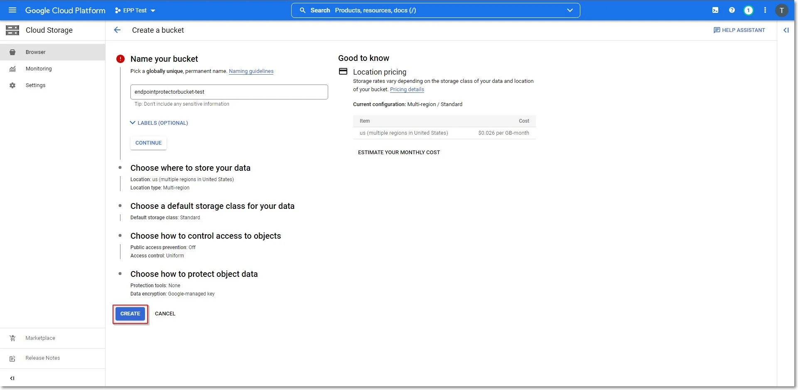
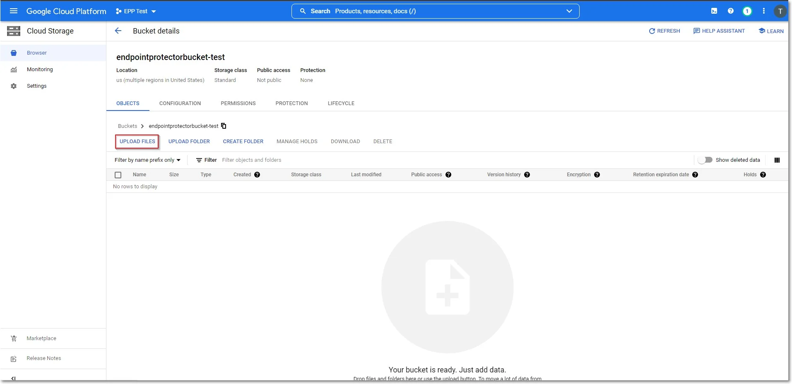
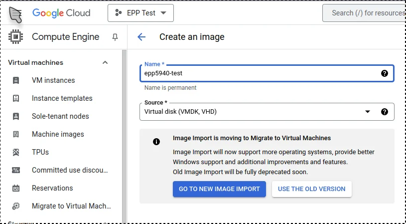
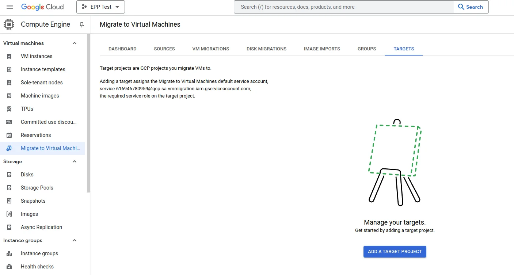
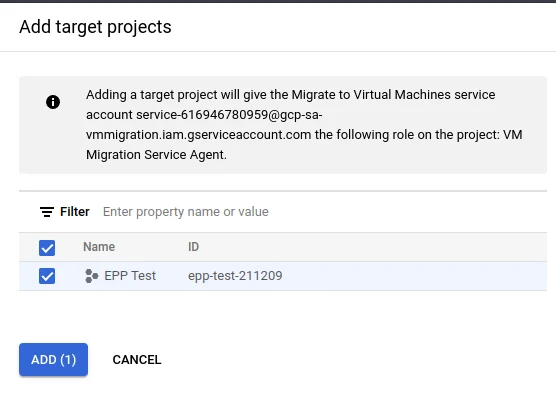
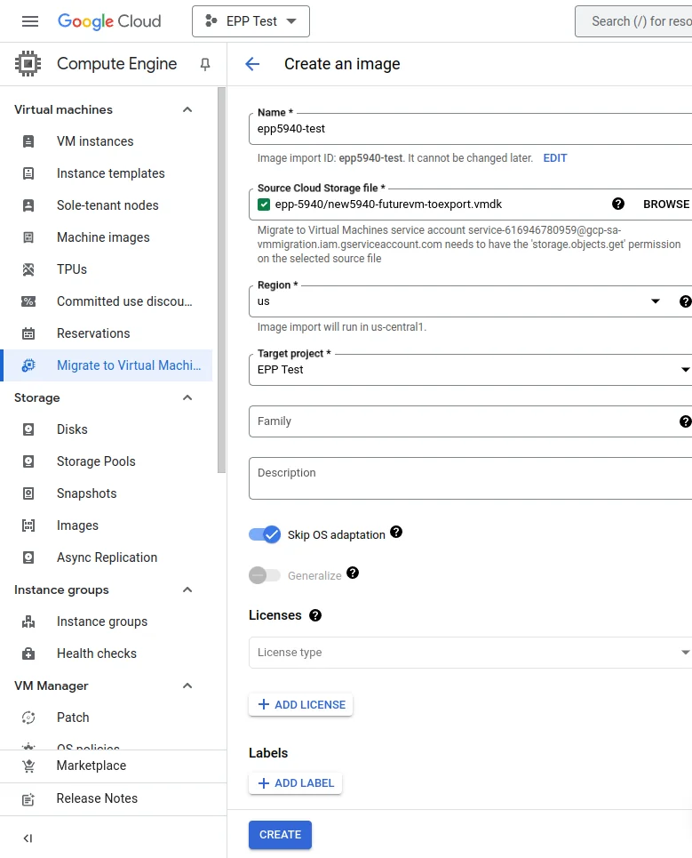
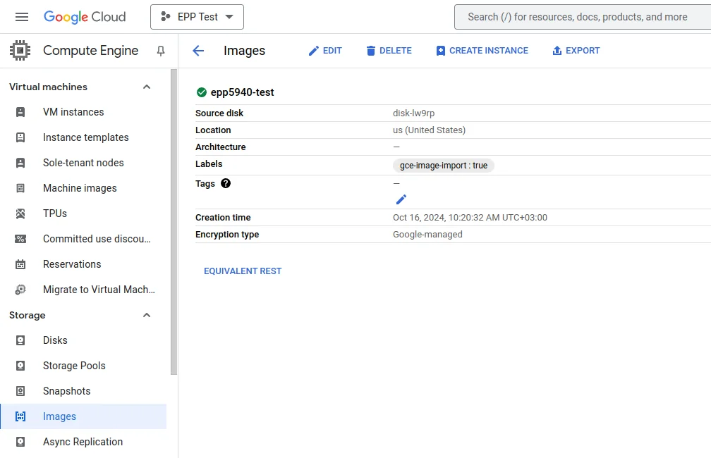

# Google Cloud Platform

In this section, we outline the integration of Endpoint Protector into your Google Cloud Platform
(GCP) environment. While Endpoint Protector is not available among default images, this guide
provides a straightforward process for obtaining and deploying it. You will upload a custom image,
create a Virtual Machine Instance, and configure the necessary settings to enable Endpoint
Protector. Follow the steps below to successfully deploy Endpoint Protector within your Google Cloud
infrastructure.

## Obtaining and Downloading the GCP Image

Endpoint Protector is not available from the default images on the Google Cloud Platform. To obtain
it, follow the process described below:

**Step 1 –** Download the Endpoint Protector image from the link provided by your Endpoint Protector
Representative. If this image has already been obtained, you can skip this step.

**Step 2 –** To upload the Endpoint Protector image to the Google Cloud Platform, navigate to the
[Cloud Storage Browser page](https://console.cloud.google.com/projectselector2/storage/browser?pli=1&supportedpurview=project)
on the Google Cloud Platform Console and create a bucket.

**Step 3 –** Provide the necessary information (i.e., Name, Storage Class, Location), then click
**Create**.

**Step 4 –** Once the bucket is created, upload the Endpoint Protector image file received from
Endpoint Protector.

:::note
The upload can take several hours, depending on the size of the compressed image and the
speed of the network connection.
:::

**Step 5 –** After the Endpoint Protector image has been uploaded to Google Cloud Storage, navigate
to the Images page on the Google Cloud Platform Console.

**Step 6 –** Set the Source to **Virtual disk (VMDK, VHD)** and select **Go to new image import**.

**Step 7 –** When prompted, enable the required API.

**Step 8 –** In the GCP search bar, type **Migrate to Virtual Machines** and select it.

**Step 9 –** Go to the Targets tab and click **Add a target project**.

**Step 10 –** Select the project and Click **Add**.

**Step 11 –** Navigate to the **Image Imports** tab and click **Create image**.

- Provide a name for the image.
- Set **Source Cloud Storage file** (.vmdk).
- Select the **Region**.
- Enable **Skip OS adaptation**.
- Click **Create**.

**Step 12 –** Once the process is complete, navigate to the **Images** page and locate the newly
created disk image. Click on it to view its details.

**Step 13 –** Click **Create Instance** and select the newly created disk image as the boot disk.

**Step 14 –** Configure the instance settings based on your environment’s requirements, such as
machine type, network settings, and storage.

**Step 15 –** Complete the setup process and verify that the instance is functioning as expected.
