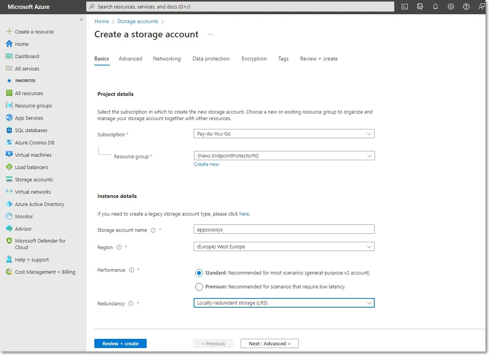
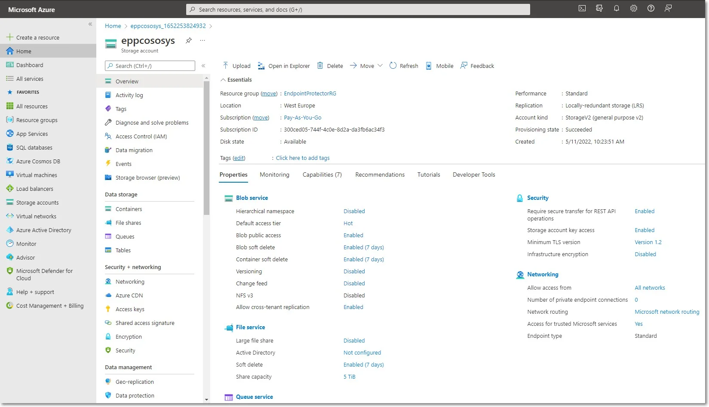
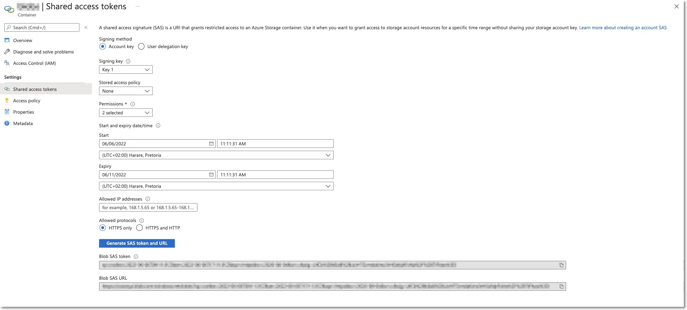

# Launching VM for Azure Deployment

To have access to the Virtual Machine, contact your Endpoint Protector Representative and provide
information such as the access keys to a Container specifically created for the Endpoint Protector
Virtual Machine.

:::note
We will upload the Endpoint Protector Virtual Machine to your Container as soon as
possible. Once this step is done, we advise regenerating the access key.
:::

## Creating the Storage Account and Container

This part of the process is similar to creating any other Storage Account and Container on Azure. If
you are already familiar with it or have created a dedicated Container already, proceed to the next
steps.

To obtain the Azure Endpoint Protector Virtual Machine, you need to create a dedicated Storage
account / Container, following these steps:

**Step 1 –** Open the [Azure portal](https://portal.azure.com/#azure-portal);

**Step 2 –** Go to Storage accounts and click +Create;

**Step 3 –** To create a storage account, provide the following information:

- Subscription – select Pay-As-You-Go
- Resource group – select a group from the available list or create a new one
- Storage account name – add a name for the storage account
- Region – select the nearest the location of the computers that will be protected by Endpoint
  Protector
- Performance – select Standard performance
- Redundancy – select Locally-redundant storage (LRS)

**Step 4 –** Click Review + create;

**Step 5 –** Go to Storage accounts and click the newly created account;

**Step 6 –** Go to Containers and click +Container;

**Step 7 –** Give the container the same name as you did to the storage account and for the Public
access level select Container (anonymous read access for containers and blobs);

**Step 8 –** Select the container you created, and then click Shared access tokens.

:::warning
Make sure you are creating a token on the container level, not the storage account!
:::

**Step 9 –** Configure the SAS token with Create, Write and Add Permissions with a 5-day window to
allow the Netwrix team to copy the image;

**Step 10 –** Copy the Blob SAS URL and send it to Netwrix.

:::note
Netwrix will copy the Endpoint Protector Virtual Machine to your storage account and notify you when the process is over.
:::
