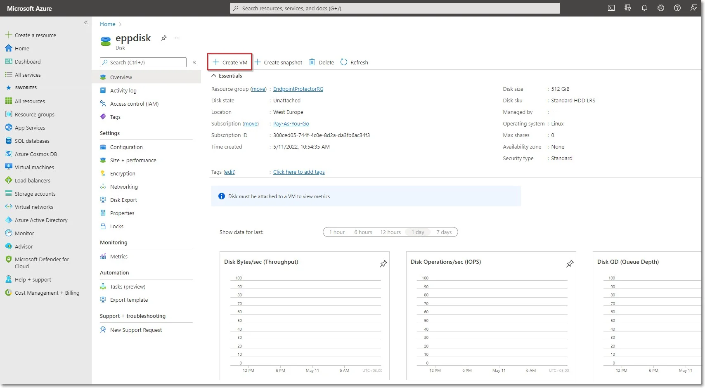
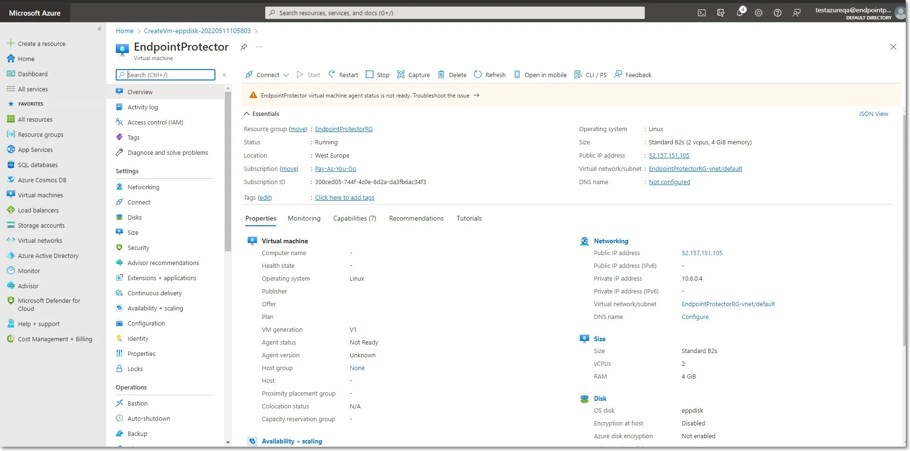

# Creating the Disk

Before starting the Endpoint Protector Virtual Machine, you have to prepare a disk and a Virtual
Machine. To create a disk, follow these steps.

**Step 1 –** From the top right side of the page, go to All resources and click +Create;

**Step 2 –** Search the marketplace for Managed Disks;

**Step 3 –** Go to Managed Disks and select Create;

**Step 4 –** To create a managed disk, provide the following information

- Subscription - select Pay-As-You-Go
- Resource group – select the previously created one
- Disk name – add a name for the storage account
- Region – select the nearest the location of the computers that will be protected by Endpoint
  Protector
- Availability Zone
- Source type - select Storage Blob
- Source subscription - select Pay-As-You-Go
- Source blob – enter the URL received from Netwrix after providing the key and URL mentioned above.
- OS type - select Linux
- Security type – select Standard
- VM generation – select Generation 1
- Size - select 128 GB

**Step 5 –** Click Review + Create and wait for the Successfully created disk message to be
displayed.

## Creating the Virtual Machine

To start the Endpoint Protector Virtual Machine in Azure, follow these steps:

**Step 6 –** Go to the All resources page, select the newly created disks and then click Create VM

**Step 7 –** To create the Virtual Machine, provide the following information:

- On the Basics tab, fill in the following:

    - Subscription – select Pay-As-You-Go
    - Resource group – select the group used when creating the disk
    - Virtual Machine Name – enter a name for the Virtual Machine
    - Size - select a virtual machine profile based closest to the recommended requirements for the
      disk file used

- On the Networking tab, fill in the following:

    - Public IP - click Create new and select Basic SKU and Static Assignment.
    - Select inbound ports – add HTTP (80) and HTTPS (443)

**Step 8 –** Click Review + create and then Create.

:::note
For Additional Features, we recommend selecting HDD instead of SSD to avoid unnecessary
payments for an unused SSD attached to the Virtual Machine.
:::

**Step 9 –** Once the deployment has finished, go to Virtual Machines on the right side and select
the Endpoint Protector image.

**Step 10 –** Open a web browser and connect to the Public IP address assigned to the Endpoint
Protector image.
