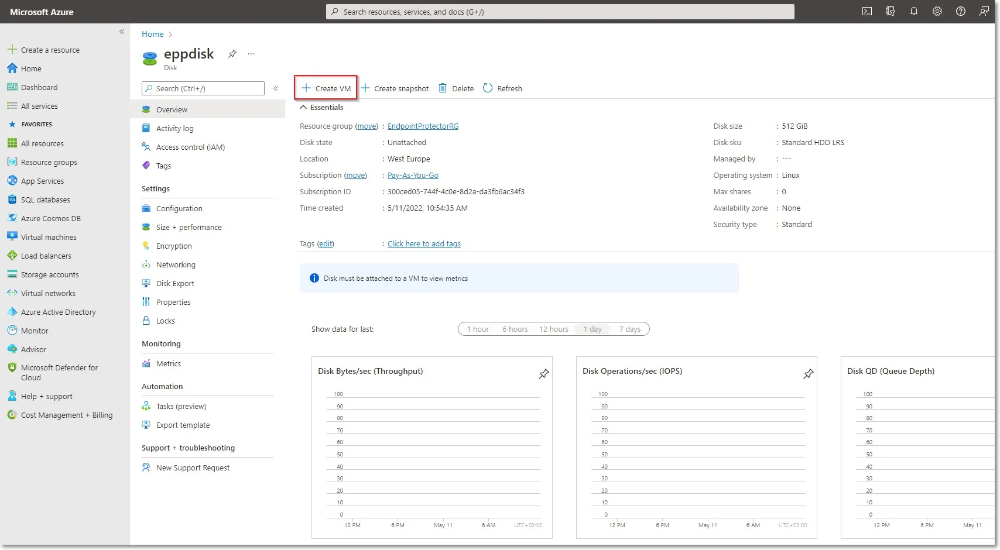
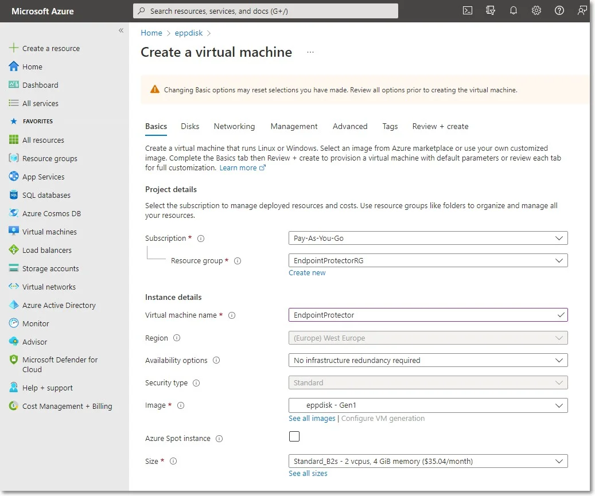
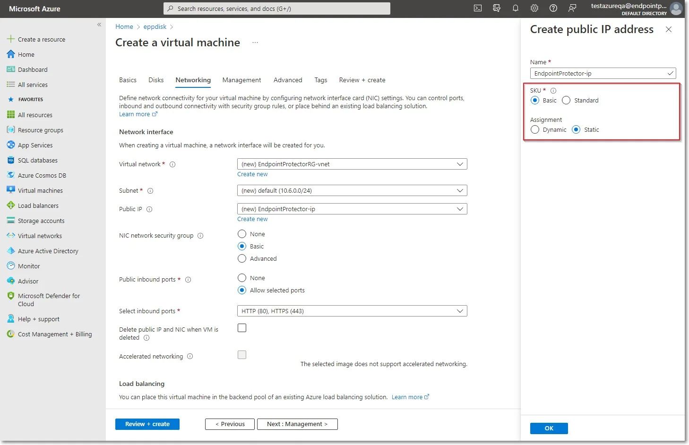
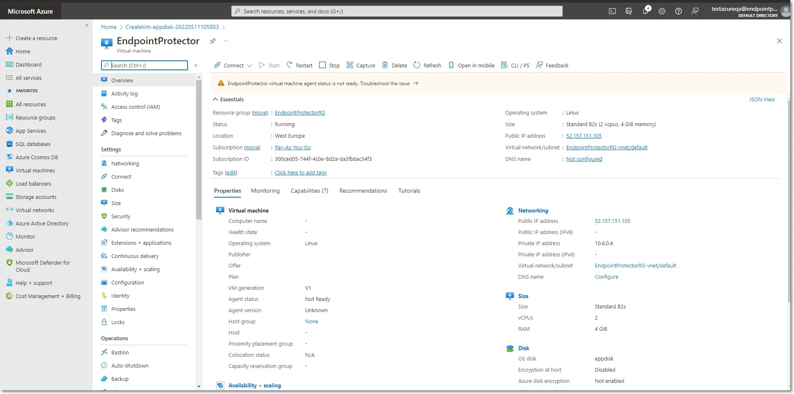

# Creating the Virtual Machine

To start the Endpoint Protector Virtual Machine in Azure, follow these steps:

**Step 1 –** Go to the All resources page, select the newly created disks and then click Create VM

**Step 2 –** To create the Virtual Machine, provide the following information:

- On the Basics tab, fill in the following:

    - Subscription – select Pay-As-You-Go
    - Resource group – select the group used when creating the disk
    - Virtual Machine Name – enter a name for the Virtual Machine
    - Size - select a virtual machine profile based closest to the recommended requirements for the
      disk file used

- On the Networking tab, fill in the following:

    - Public IP - click Create new and select Basic SKU and Static Assignment.
    - Select inbound ports – add HTTP (80) and HTTPS (443)

**Step 3 –** Click Review + create and then Create.

:::note
For Additional Features, we recommend selecting HDD instead of SSD to avoid unnecessary
payments for an unused SSD attached to the Virtual Machine.
:::

**Step 4 –** Once the deployment has finished, go to Virtual Machines on the right side and select
the Endpoint Protector image.

**Step 5 –** Open a web browser and connect to the Public IP address assigned to the Endpoint
Protector image.
