# macOS Deployment

To deploy the Endpoint Protector package for macOS using Intune, follow these steps:

**Step 1 –** Open and log in to Endpoint Protector.

**Step 2 –** Go to the System Configuration, Client Software and download the macOS Endpoint
Protector package.

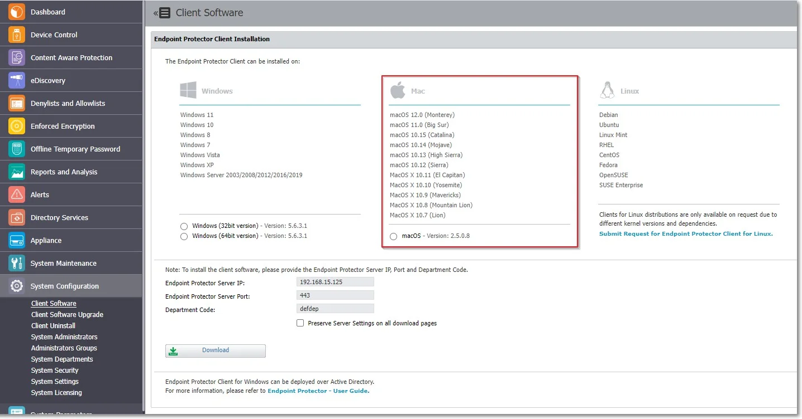

**Step 3 –** Convert the Endpoint Protector client to an .intunemac file – for more information and
procedure, visit the Microsoft Docs portal;

**Step 4 –** Go to the Microsoft Endpoint Manager admin center and sign in

**Step 5 –** Go to Apps from the left-hand side menu, and on the Apps Overview page, select the
macOS platform;

**Step 6 –** On the macOS apps page, click Add, select the Line of business app type, and then click
**Select**.

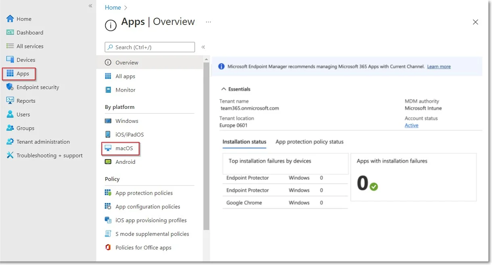

**Step 7 –** Click Select app package file and from the right-hand side, select the Endpoint
Protector intunemac file, Upload and click **OK.**

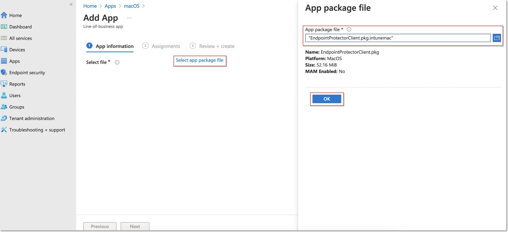

**Step 8 –** On the App information page, fill in the mandatory fields and then click **Next**.

- Name – add Endpoint Protector Client
- Description – add Endpoint Protector Client
- Publisher – add Netwrix Ltd.

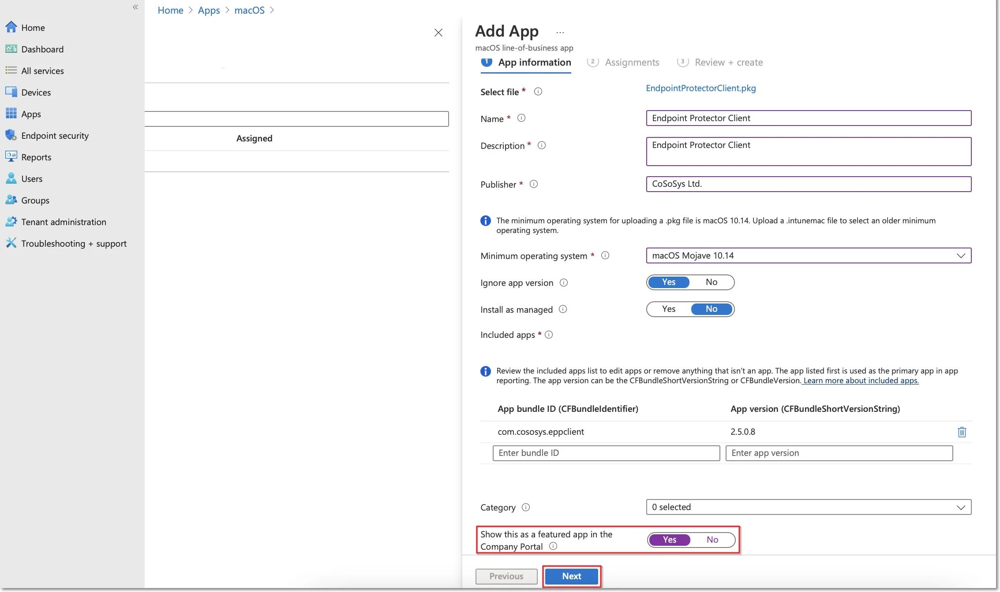

**Step 9 –** On the Assignments page, in the Required section, select the group for which you want
to deploy the Endpoint Protector client and then click **Next**.

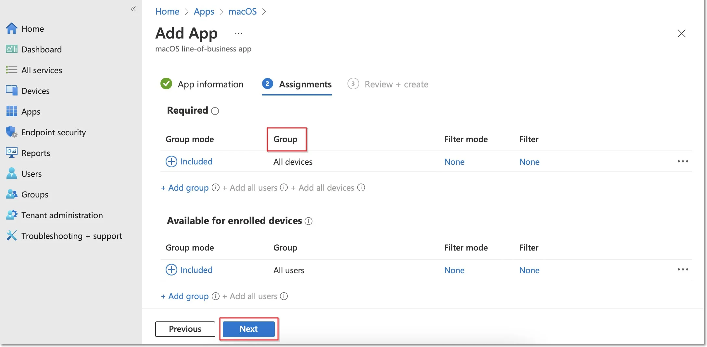

**Step 10 –** On the Review + create page, click Create - this will start the Endpoint Protector
package upload.

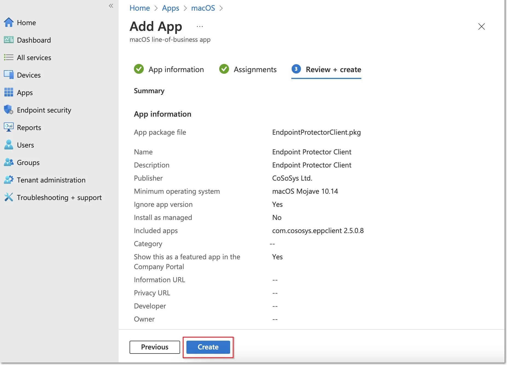

**Step 11 –** Go to Devices from the left-hand menu, select macOS, Shell scripts and then click
**Add**.

:::note
Please contact the Customer Support department to provide the script.
:::

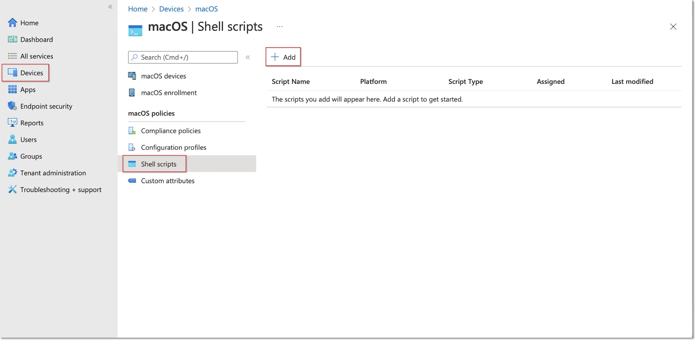

**Step 12 –** On the Add script page, fill in the mandatory information and then click **Next**.

- Name (mandatory) – add a name for the script (Post install script)
- Description – add a description for the script

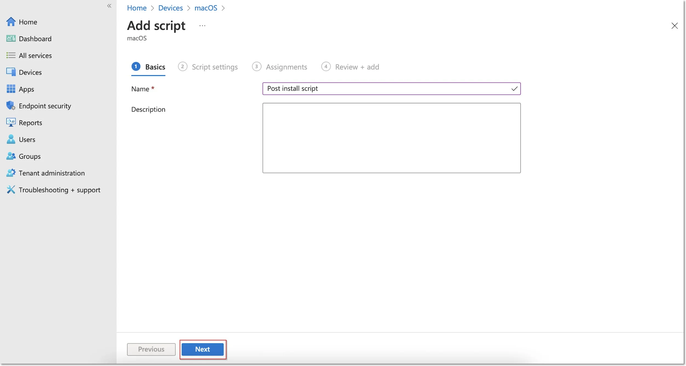

**Step 13 –** On the Script settings tab, add the following information and then click Next:

- Upload and select the New Jamf PostInstall script from your computer
- Set the Run script as sign-in user setting to No

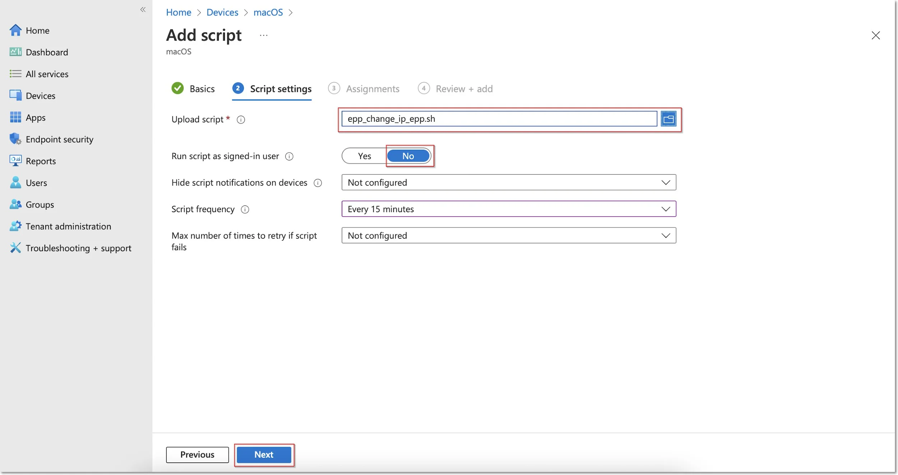

**Step 14 –** On the Assignments tab, include the groups you prefer (Add groups, all users, or all
devices) and then click **Next**.

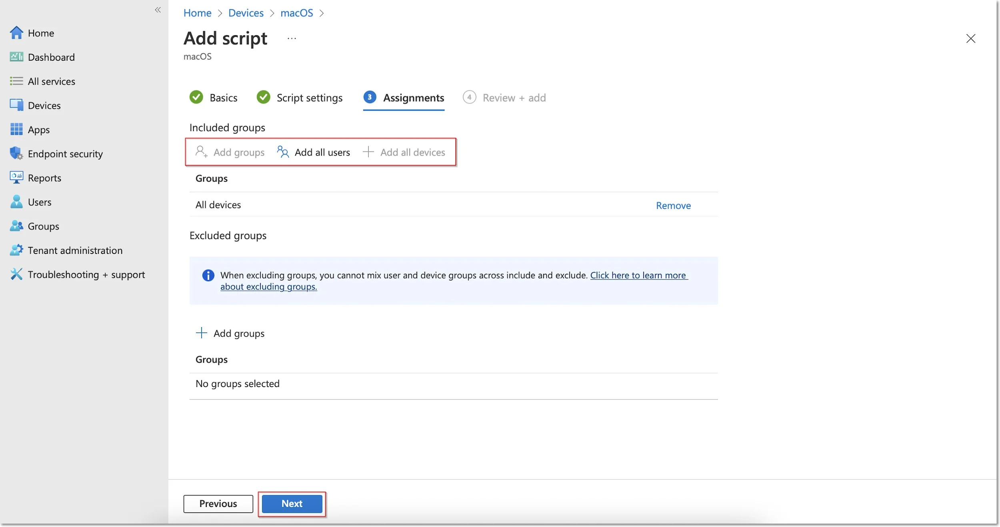

**Step 15 –** On the Review + add tab, you can view the script information and click **Add**.

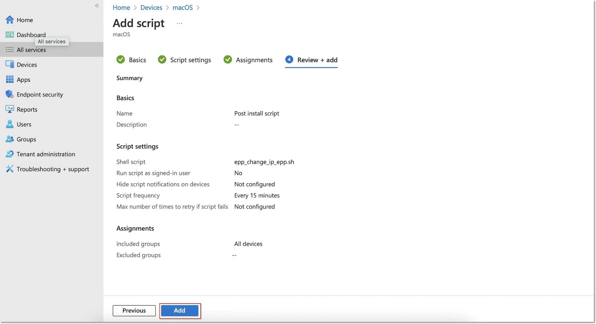
