# macOS Deployment

To deploy the Endpoint Protector package for macOS using Intune, follow these steps:

**Step 1 –** Open and log in to Endpoint Protector.

**Step 2 –** Go to **System Configuration** > **Client Software**, select the macOS client version
from the **EPP Mac Version** dropdown, and click **Generate** to download the macOS Endpoint
Protector package.

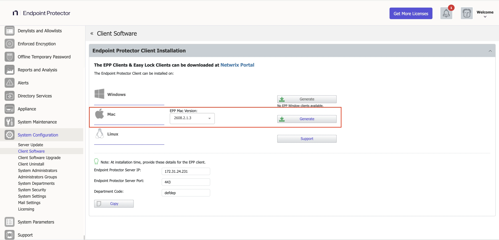

**Step 3 –** Go to the Microsoft Intune admin center (also known as Microsoft Endpoint Manager) and
sign in.

**Step 4 –** Go to **Apps** from the left-hand side menu, and on the **Apps | Overview** page,
select the **macOS** platform.

**Step 5 –** On the **macOS apps** page, click **Create**, select **Line-of-business app** as the
app type, and then click **Select**.

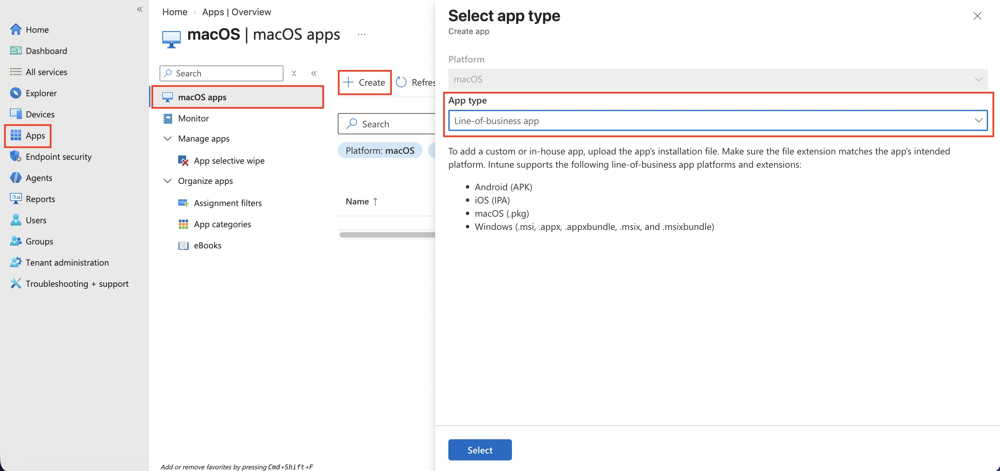

**Step 6 –** Click **Select app package file** and, from the right-hand side, select the Endpoint
Protector **.pkg** file (for example, `EndpointProtectorClient2608.2.1.3.pkg`), upload it, and click
**OK**.

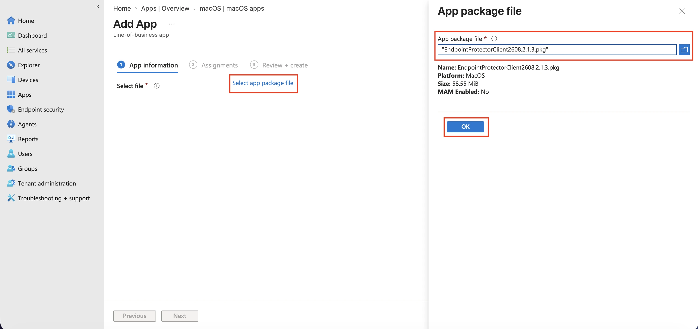

**Step 7 –** On the App information page, fill in the mandatory fields and then click **Next**:

- Name – add Endpoint Protector Client
- Description – add Endpoint Protector Client
- Publisher – add Netwrix Ltd.

The **App bundle ID** and **App version** fields populate automatically from the uploaded package.
Optionally, set **Show this as a featured app** to **Yes** to surface the app in the Company Portal,
and configure Category, Information URL, Privacy URL, Developer, Owner, Notes, and Logo as needed.

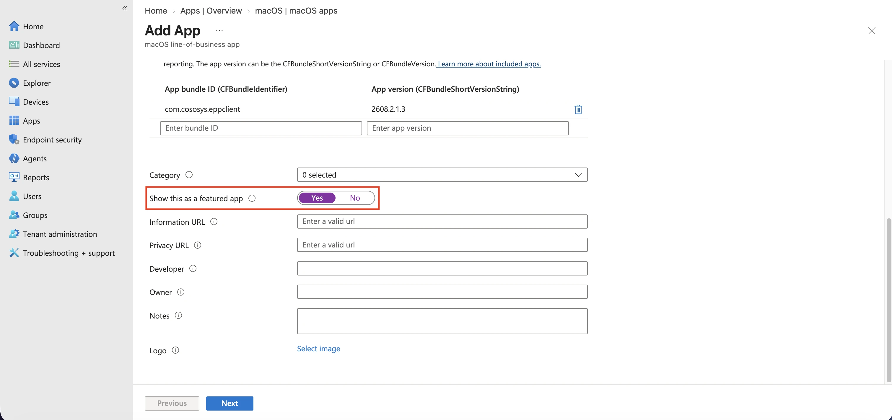

**Step 8 –** On the Assignments page, in the Required section, select the group to deploy the Endpoint
Protector client to, and then click **Next**.

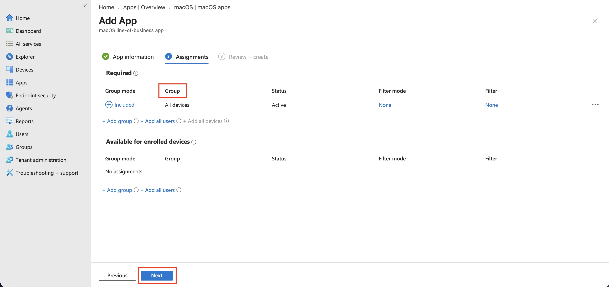

**Step 9 –** On the Review + create page, review the summary and click **Create** – this starts the
Endpoint Protector package upload.

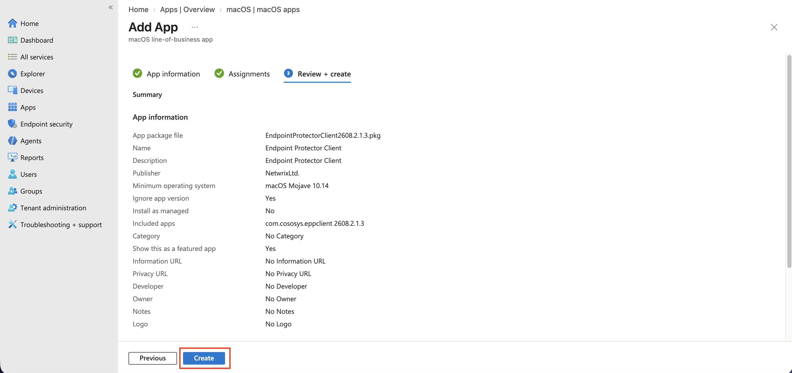

**Step 10 –** Go to Devices from the left-hand menu, select macOS, Shell scripts and then click
**Add**.

:::note
Contact Customer Support to get the script.
:::

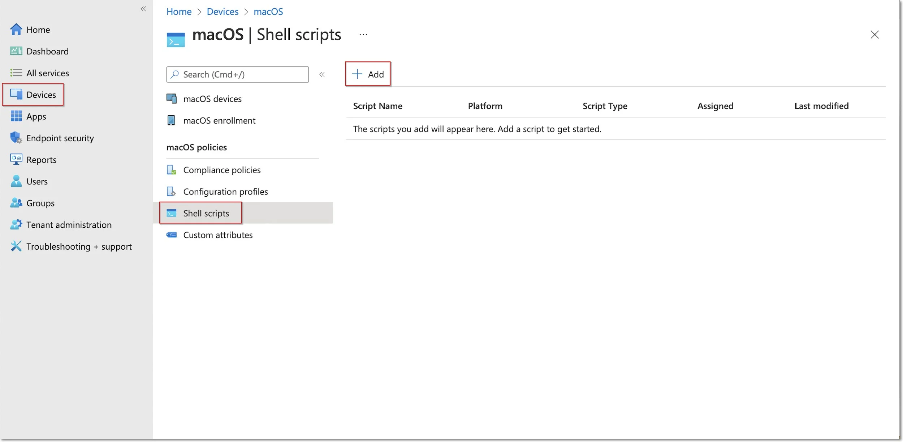

**Step 11 –** On the Add script page, fill in the mandatory information and then click **Next**.

- Name (mandatory) – add a name for the script (Post install script)
- Description – add a description for the script

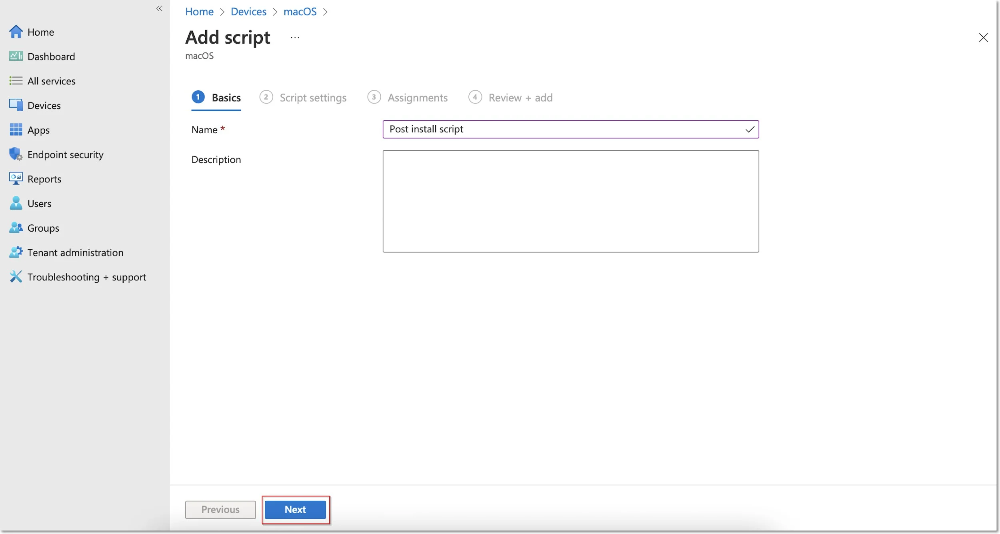

**Step 12 –** On the Script settings tab, add the following information and then click Next:

- Upload and select the New Jamf PostInstall script from your computer
- Set the Run script as sign-in user setting to No

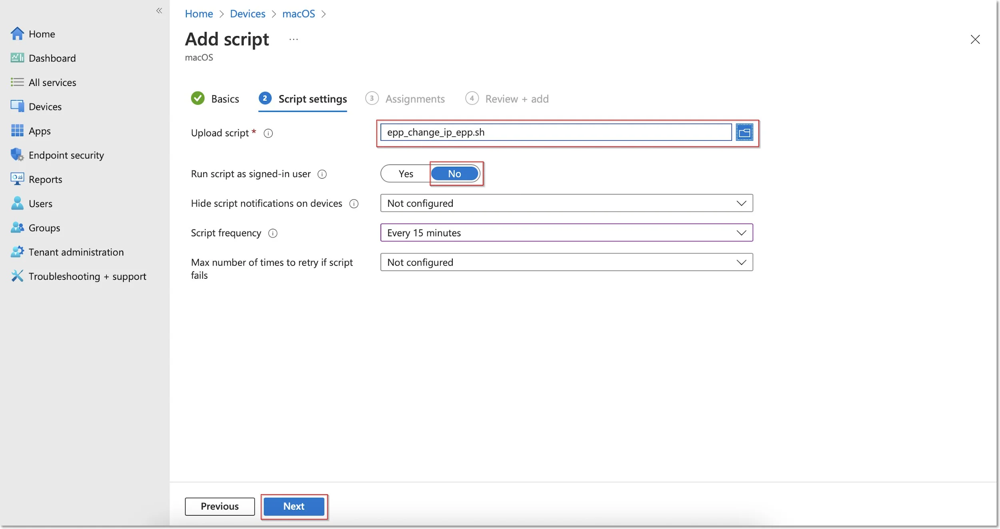

**Step 13 –** On the Assignments tab, include the groups you prefer (Add groups, all users, or all
devices) and then click **Next**.

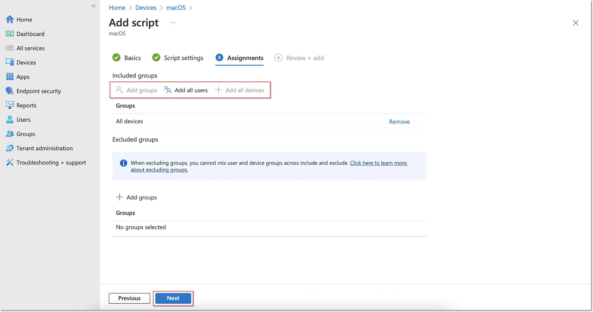

**Step 14 –** On the Review + add tab, review the script information and click **Add**.

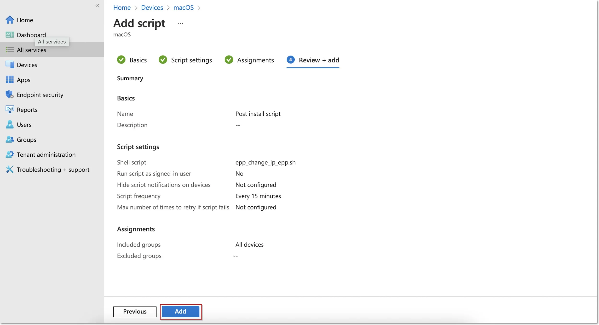
