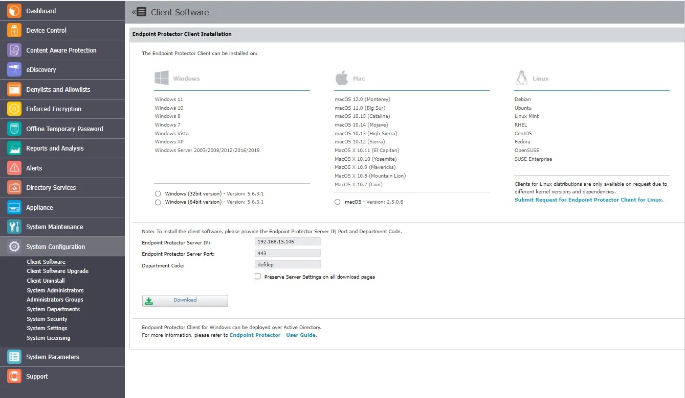
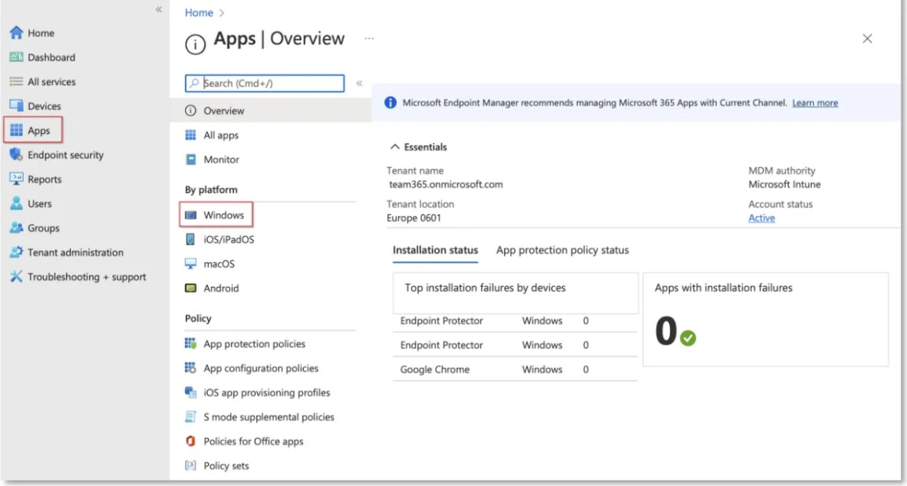
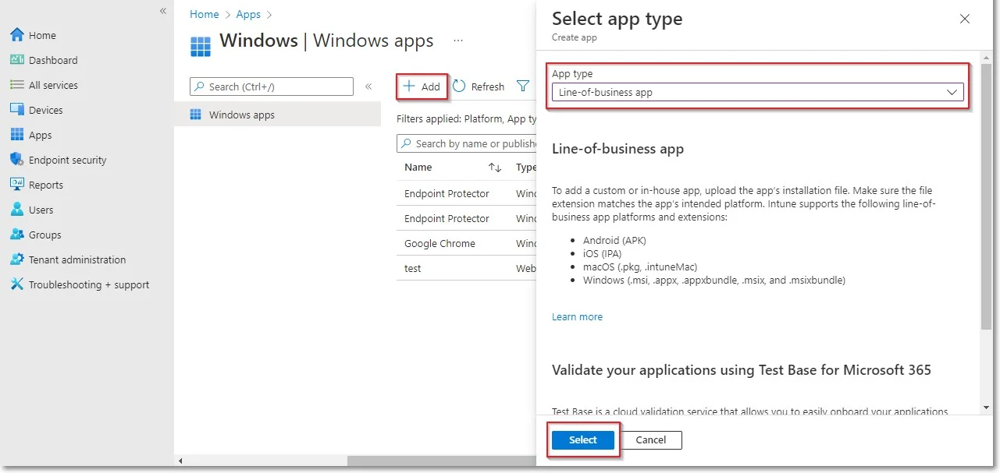
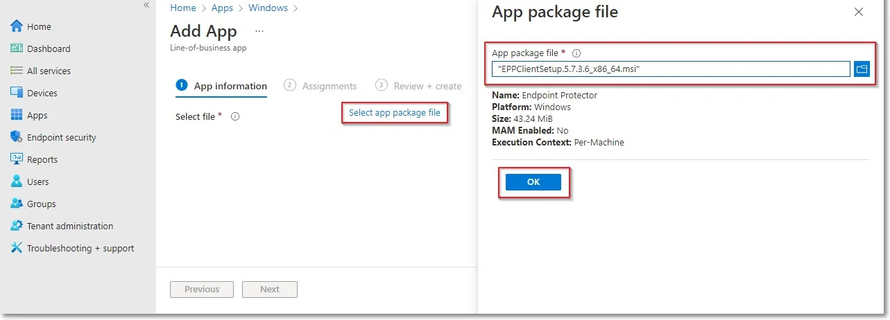
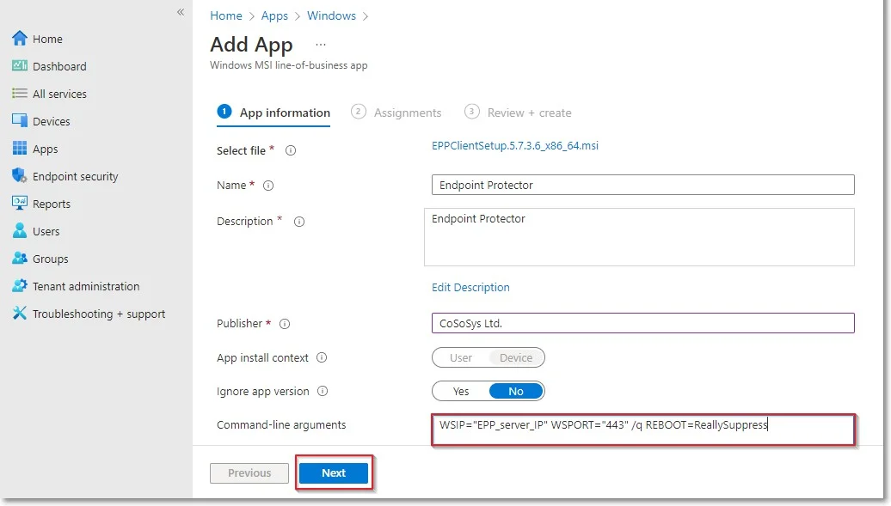
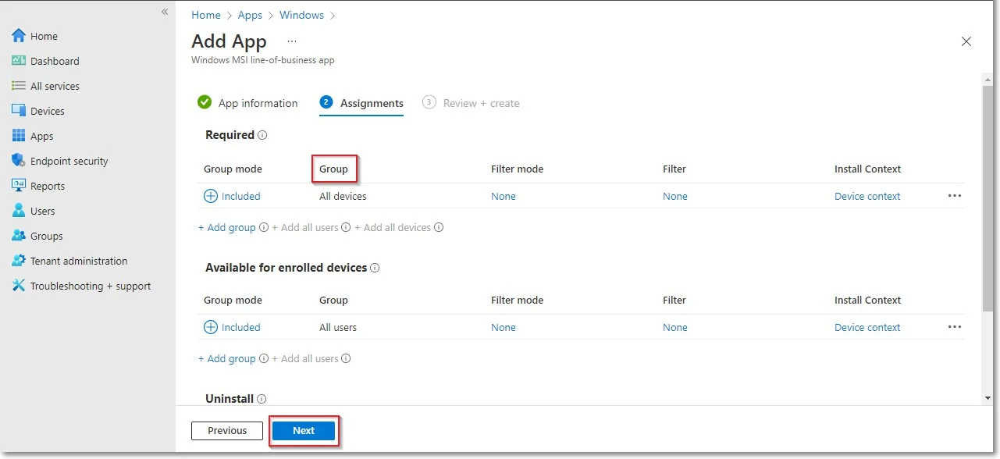
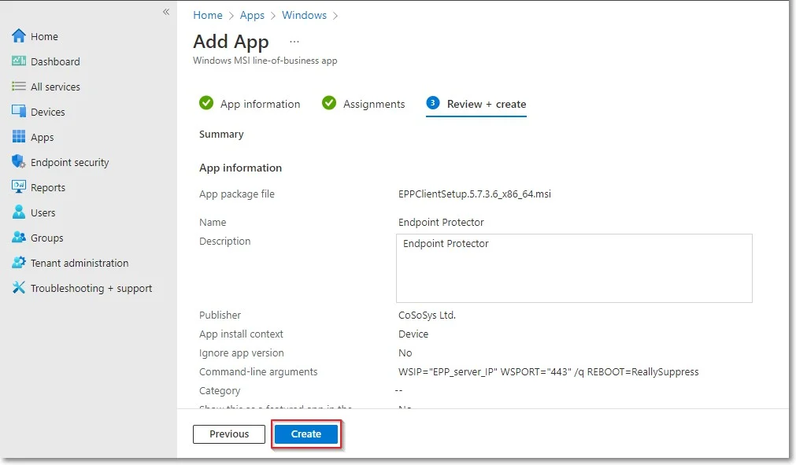

# Windows Deployment

To deploy the Endpoint Protector MSI package for Windows using Intune, follow these steps:

**Step 1 –** Open and log in to Endpoint Protector;

**Step 2 –** Go to the System Configuration, Client Software and download the Windows Endpoint
Protector MSI package;

:::warning
When deploying the .msi package, delete the information contained in the brackets as
well as the underscore that precedes it - EPPClientSetup.5.6.3.1_x86_64.msi
:::

**Step 3 –** Go to the Microsoft Endpoint Manager admin center and sign in;

**Step 4 –** Go to Apps from the left-hand side menu, and on the Apps Overview page, select the
Windows platform;

**Step 5 –** On the Windows App page, click Add, select the Line of business app type, and then
click Select;

**Step 6 –** Click Select app package file and from the right-hand side, select the Endpoint
Protector MSI file and click OK;

**Step 7 –** On the App information page, fill in the mandatory fields and then click Next:

- Name – add Endpoint Protector and optional, the package version (Endpoint Protector 5.7.3.6)
- Description – click Edit Description and add installation details
- Publisher – add NetwrixLtd.
- Command-line argument – add the following command line in the text box

    - WSIP="EPP_server_IP" WSPORT="443" /q REBOOT=ReallySuppress

**Step 8 –** On the Assignments page, in the Requirement section, select the group for which you
want to deploy the Endpoint Protector client and then click Next;

**Step 9 –** On the Review + create page, click Create - this will start the Endpoint Protector MSI
package upload.

