# Creating the Configuration Profile

In order to use Jamf, first, you need to create a new configuration profile. To do so, follow these
steps:

**Step 1 –** Open the Jamf Pro account and log in using your credentials.

**Step 2 –** In your Jamf account, from the main navigation bar click **Computer**, and then from
the left sidebar menu, select **Configuration Profiles**.

**Step 3 –** To create a new configuration profile, in the upper right, above the table with
available configuration profiles, click **+New**.

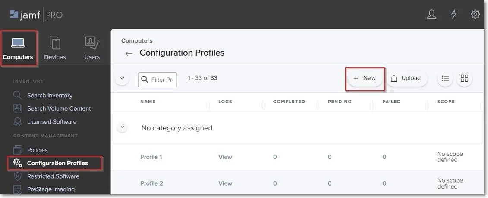

On the New macOS Configuration Profile section, you can manage profile settings and select the
devices and users to which you want to deploy the profile.

:::note
Click **Save** only once you have managed all settings and the profile scope.
:::

## General Settings

On the default General section, enter the following information:

- Name – enter a name to use for this configuration profile.
- Description (optional) – add a description that details the purpose of the configuration profile.

You can continue with the default settings for the category, level, and distribution method fields.

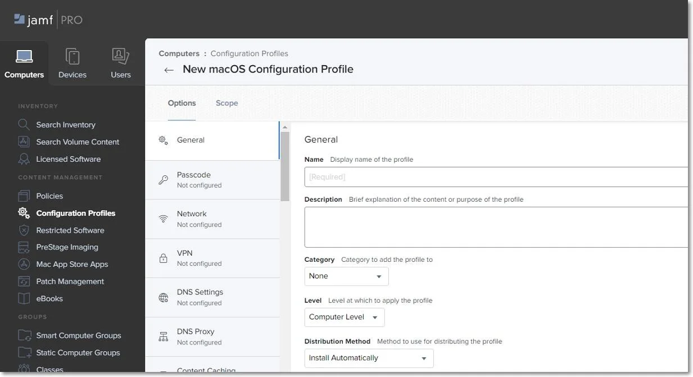

## Certificate Settings

You will add the Client CA Certificate in .cer format on the Certificate settings section.

:::note
This step is not required if you are not using Deep Package Inspection. To continue the
process, go to the Privacy Preferences Policy Control section.
:::

**Step 1 –** Log in to Endpoint Protector Server, go to the System Configuration section, and then
select **System Settings**.

**Step 2 –** On the Default System Settings section, enable Deep Packet Inspection Certificate and
then download Client CA Certificate – the downloaded .zip file contains the .cer and .crt client
certifications.

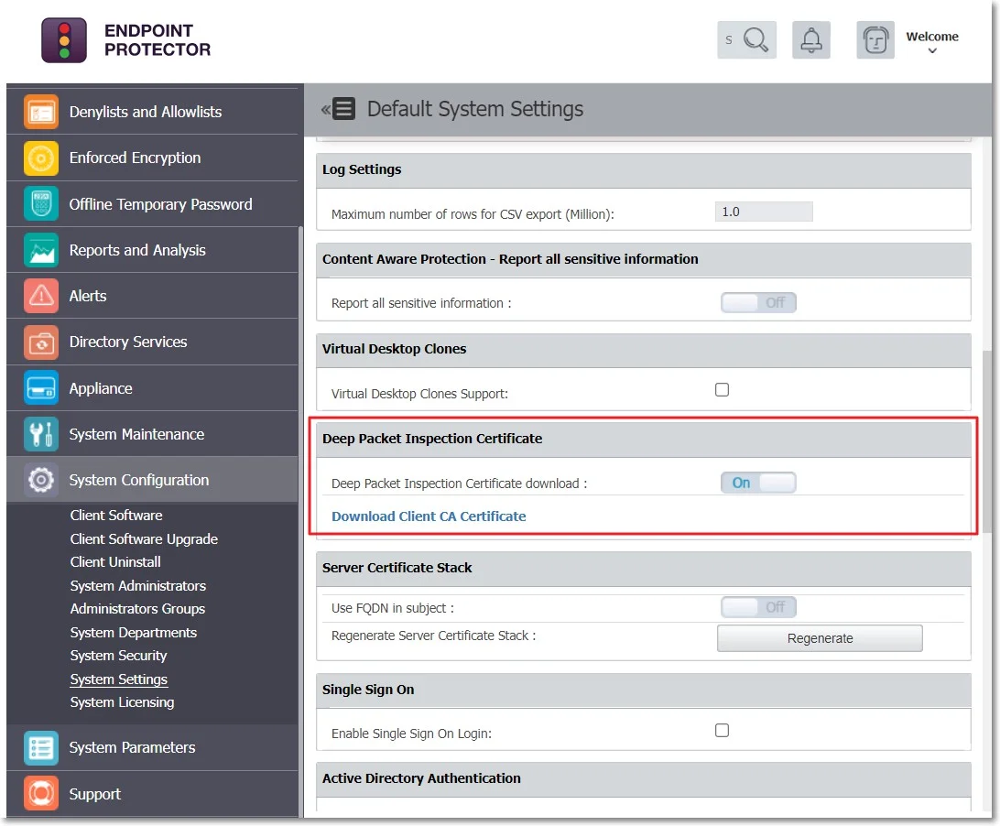

**Step 3 –** Go to Jamf, the Certificate section, and click **Configure**.

**Step 4 –** Enter a Certificate name and then select and upload the downloaded Client CA
Certificate in .cer format.

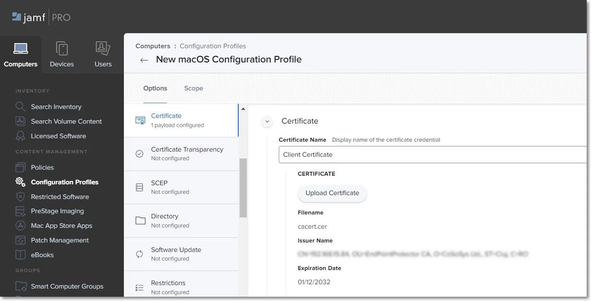

## Privacy Preferences Policy Control Settings

On the Privacy Preferences Policy Control section, click **Configure** and then enter the following
information:

- Identifier - `com.cososys.eppclient`.
- Identifier Type – go with the default Bundle ID type.
- Code Requirement

`anchor apple generic and certificate 1[field.1.2.840.113635.100.6.2.6] /* exists */ and certificate leaf[field.1.2.840.113635.100.6.1.13] /* exists */ and certificate leaf[subject.OU] = TV3T7A76P4`.

:::note
Use the Terminal Editor to verify there are no formatting alterations before executing
this command line.
:::

- Select the **Validate the Static Code Requirement** check-box.
- Click **Add** and **Save** to allow access to SystemPolicyAllFiles and Accessibility services.

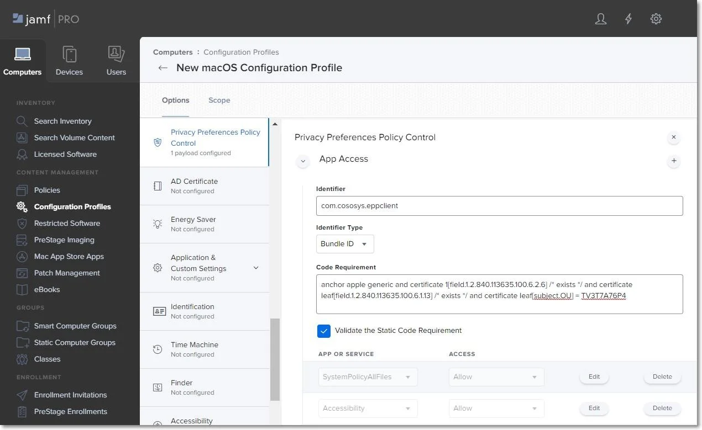

## Allow EppNotifier Settings

On the Privacy Preferences Policy Control section, click the **+ icon** to add a new policy and then
enter the following information:

Identifier - `com.cososys.eppclient.notifier`

Identifier Type – go with the default Bundle ID type.

**Code Requirement**

`anchor apple generic and certificate 1[field.1.2.840.113635.100.6.2.6] /* exists */ and certificate leaf[field.1.2.840.113635.100.6.1.13] /* exists */ and certificate leaf[subject.OU] = TV3T7A76P4`.

:::note
Use the Terminal Editor to verify there are no formatting alterations before executing
this command line.
:::

- Select the **Validate the Static Code Requirement** check-box.
- Click **Add** and then **Save** to allow access to Accessibility services.

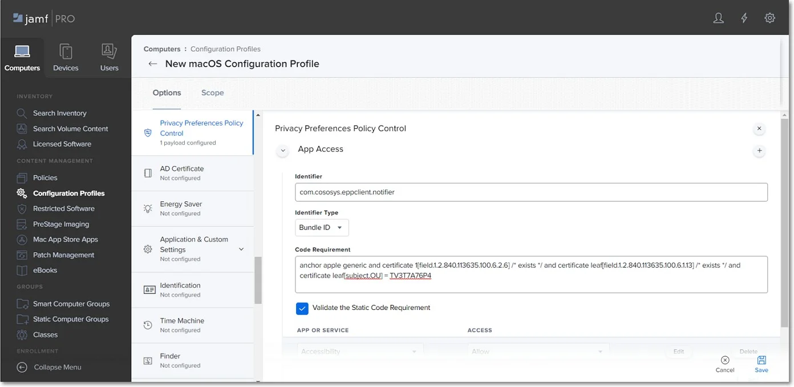

## Enforced Encryption Settings

On the Privacy Preferences Policy Control section, click the **+ icon** to add a new policy and then
enter the following information:

Identifier – `com.cososys.easylock`.

Identifier Type – go with the default Bundle ID type.

**Code Requirement**

`anchor apple generic and certificate 1[field.1.2.840.113635.100.6.2.6] /* exists */ and certificate leaf[field.1.2.840.113635.100.6.1.13] /* exists */ and certificate leaf[subject.OU] = TV3T7A76P4`.

:::note
Use the Terminal Editor to verify there are no formatting alterations before executing
this command line.
:::

- Select the **Validate the Static Code Requirement** check-box.
- Click **Add** and then **Save** to allow access to SystemPolicyAllFiles and Accessibility
  services.

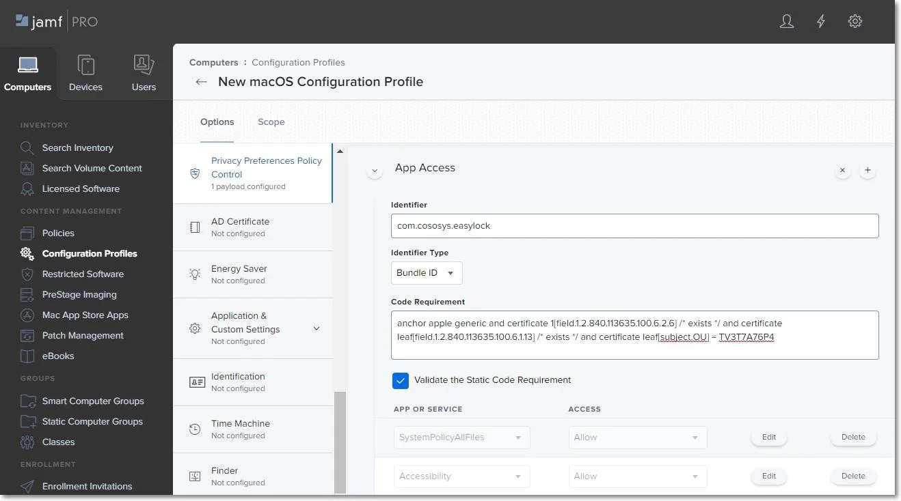

## System Extension Settings

### Allow System Extensions

On the System Extension section, click **Configure** and then enter the following information:

- Display Name (optional) - enter a name to use for this configuration.
- System Extension Type - select **Allow System Extension type**.
- Team Identifier - `TV3T7A76P4`.
- Allowed System Extensions – click **Add**, enter `com.cososys.eppclient`, and then **Save** the
  changes.

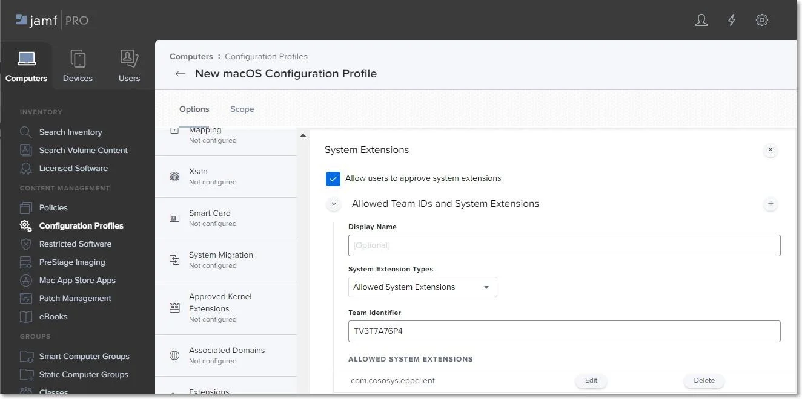

:::note
For operating systems lower than macOS 11 (Big Sur), manage settings from the Approved
Kernel Extensions section instead of System Extensions. Define the Team ID (enter TV3T7A76P4) and
proceed to the next step.
:::

### Removable System Extensions

On the System Extension section, click the **+ icon** to add a new policy that will allow removing
system extensions without a pop-up, and then enter the following information:

- Display Name (optional) - enter a name to use for this configuration.
- System Extension Type - select **Removable System Extensions** type.
- Team Identifier - `TV3T7A76P4`.
- Allowed System Extensions – click **Add**, enter `com.cososys.eppclient`, and then **Save** the
  changes.

:::note
This setting will be applied starting with MacOS 12 version (Monterey).
:::

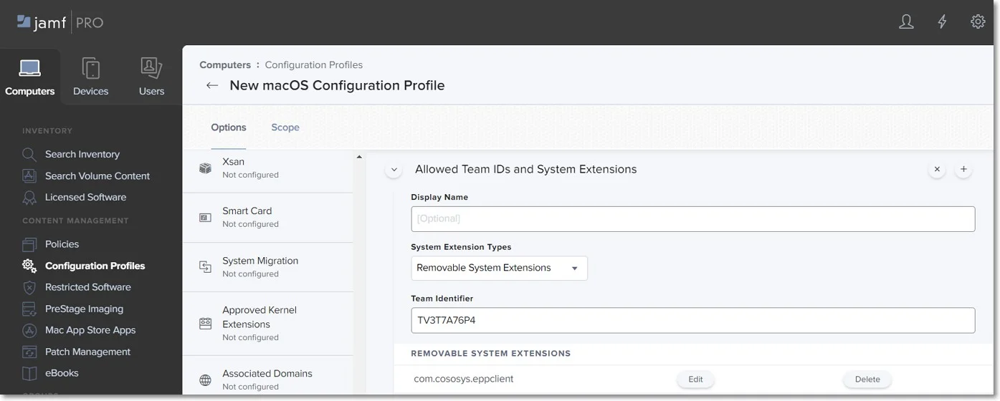

### Managed Login Items

Administrators can quickly disable Endpoint Protector Items in Jamf Configuration Profiles with
Ventura's (macOS 13) new capability. This can be accomplished by taking the following steps:

**Step 5 –** Log in to your Jamf account.

**Step 6 –** Click **Computer** from the main navigation bar.

**Step 7 –** Select **Configuration Profiles** from the sidebar menu on the left.

**Step 8 –** Click **New** in the upper right-hand corner.

**Step 9 –** On the left, under the Options box, select **Managed Logged In Items**.

Endpoint Protector Items can be simply disabled in your Jamf Configuration Profiles from here.
Simply uncheck the box next to the Endpoint ProtectorItem(s) you want to disable, and then click
**Save** to save your changes.

:::note
Disabling Endpoint Protector Items may have an impact on the security of your system. Only
disable these items if you are positive it is essential and you have taken every precaution
necessary to keep your system secure.
:::

## VPN Settings

:::note
This step is not required if you are not using VPN services. To continue the process, go
to the Scope section.
:::

On the VPN section, click **Configure** and then enter the following information:

- Connection Name – enter a connection name that will be displayed on the device.
- VPN Type – select **Per-App VPN** type.
- Per-App VPN Connection Type – select **Custom SSL connection** type.
- Identifier – com.cososys.eppclient.daemon.
- Server – localhost.
- Provider Bundle Identifier – com.cososys.eppclient.daemon.
- Provider Type – select **App-proxy** type.
- Select the **Include All Networks** check-box.
- Provider Designated Requirement

`anchor apple generic and certificate 1[field.1.2.840.113635.100.6.2.6] /* exists */ and certificate leaf[field.1.2.840.113635.100.6.1.13] /* exists */ and certificate leaf[subject.OU] = TV3T7A76P4`

:::note
Use the Terminal Editor to verify there are no formatting alterations before executing
this command line.
:::

- Select the **Prohibit users from disabling on-demand VPN settings** check-box.

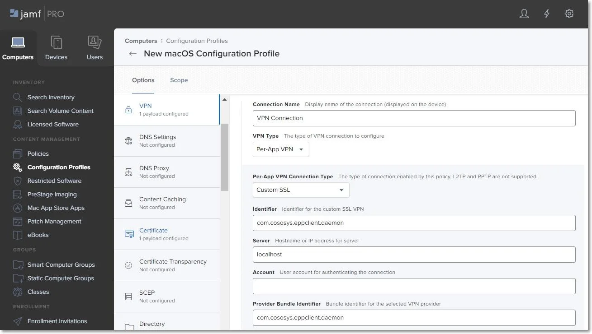

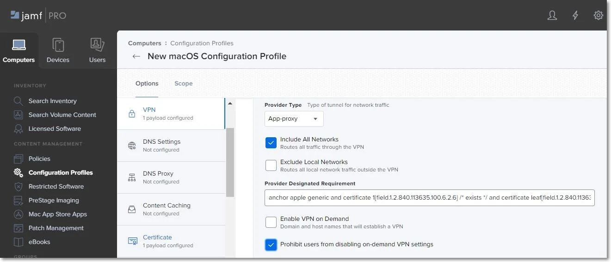

## Notifications Settings

:::note
This step is optional. To continue the process, go to the Scope section.
:::

On the Notifications section, click **Configure** and then enter the following information:

- App Name - `EppNotifier`.
- Bundle ID - `com.cososys.eppclient.notifier`.
- Toggle the switch to include the settings type and then disable/enable to manage each notification
  option.

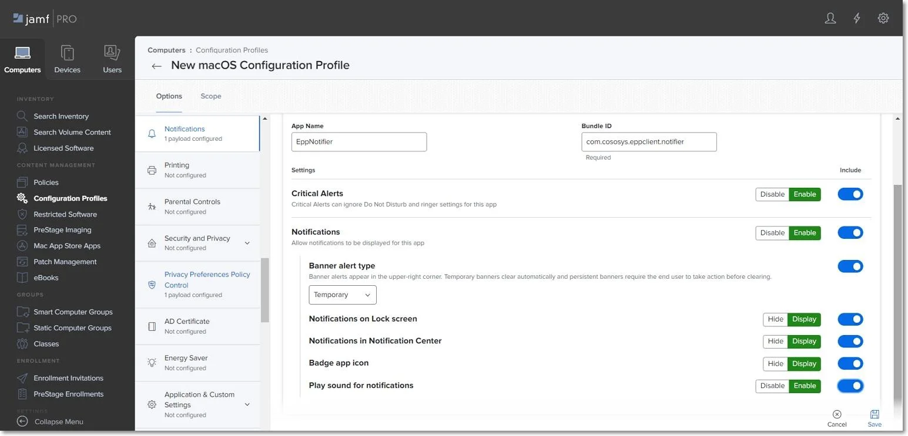

## Scope

Once you manage all settings, go to the Scope tab and select the devices and users to deploy the new
profile.

Click **Save** to apply all settings to the new configuration profile.

:::note
To confirm that the new configuration profile is saved successfully, reboot your computer
at this point.
:::

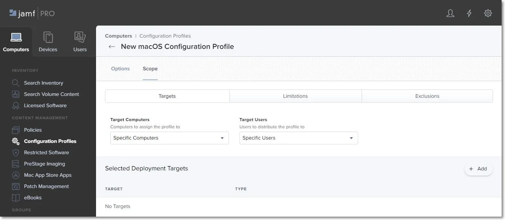
