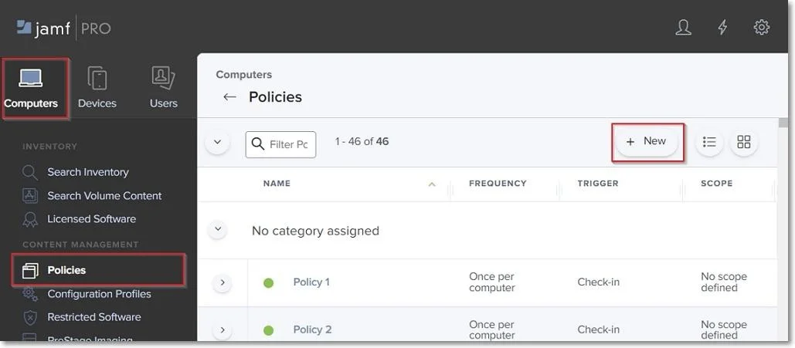
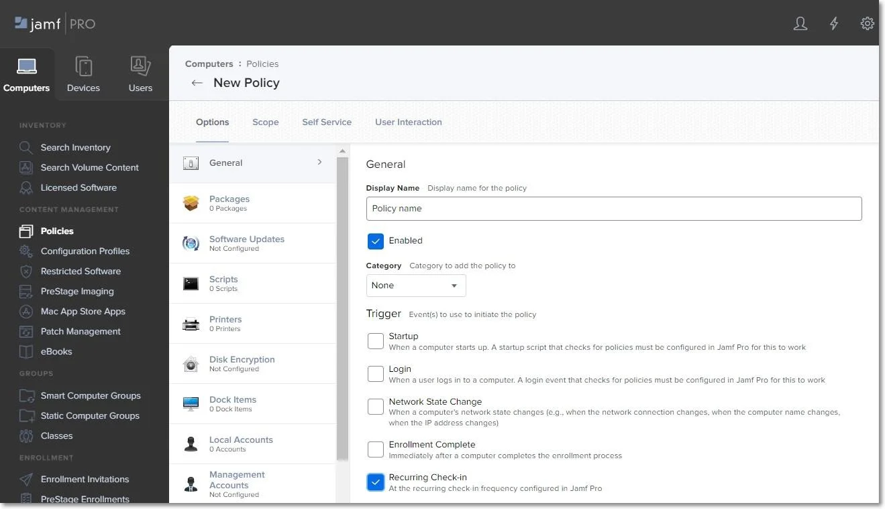
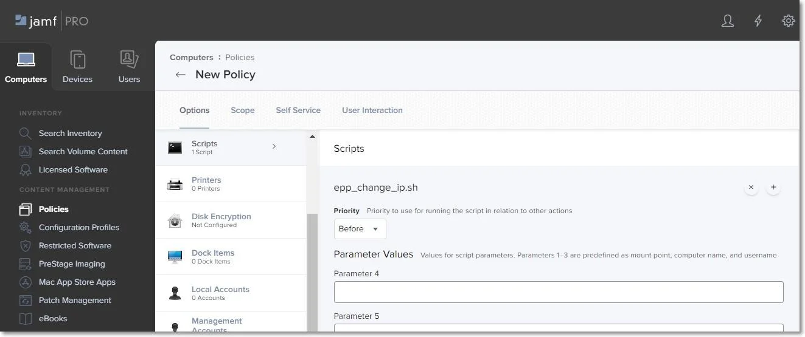
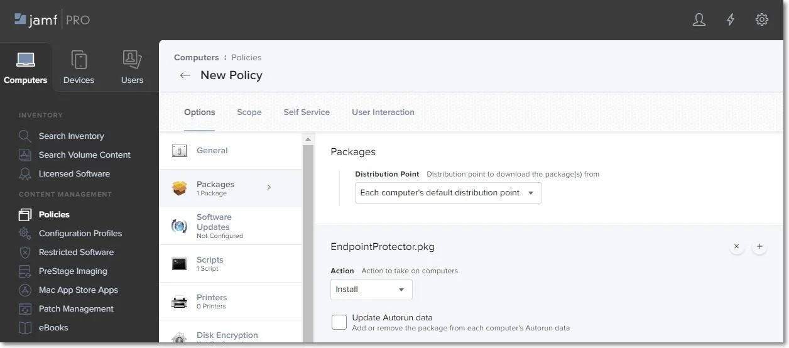
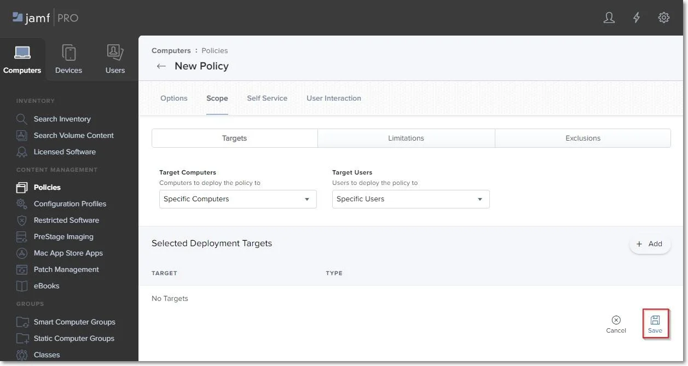

# Creating the Policy

Once the script and package are successfully uploaded, you need to create a new Jamf policy. To
create the new policy, follow these steps:

**Step 1 –** In your Jamf account, from the main navigation bar, click **Computer**, from the left
sidebar menu, select **Policies**, and then click **+ New**.

**Step 2 –** On the default General section, enter the following information:

- Display Name – enter the name to use for this policy.
- Select the **Recurring Check-in** check-box.

**Step 3 –** On the Scripts section, click **Configure** and then enter the following information:

- Add the epp_change_ip.sh script.
- Priority – set priority to Before, as the script needs to be installed before the next step.

**Step 4 –** On the Packages section, click **Configure** and then add the package
EndpointProtector.pkg.

**Step 5 –** Go to the Scope tab and add the devices and users to apply the new policy.

**Step 6 –** Click **Save** to apply all settings to the new policy.

To confirm that the Endpoint Protector Client has been successfully deployed and the Server- Client
communication and policies work as expected, you can view the endpoint in the List of Computers from
the Endpoint Protector UI, and the Endpoint Protector Client is displayed in the menu bar.
